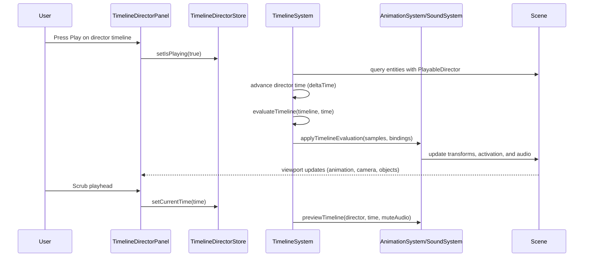

# Unity-Style Timeline & Playable Director PRD

## Overview

### Context & Goals

- Achieve **baseline feature parity with Unity’s Timeline system** for sequencing animations, audio, and activation events inside VibeCoder3D.
- Provide a **Timeline Asset + Playable Director** model so timelines are reusable, asset-backed, and can be attached to entities or scenes.
- Extend the existing **Animation Timeline Panel** into a **multi-track cinematic editor** (animation, activation, audio, groups) with scrubbing and cutscene composition.
- Ensure **deterministic runtime playback** integrated with the existing `AnimationSystem`, sound system, and ECS component model, with clean scene serialization.

### Current Pain Points

- The current timeline editor focuses on **per-entity animation clips** only; there is no concept of **global sequences** spanning multiple objects, audio, or camera cuts.
- There is no **timeline asset** or **director component**; authored timelines live implicitly in clips/components and cannot be reused across scenes/entities.
- Non-animation events (activation, camera switching, audio) are controlled via ad-hoc scripting instead of a unified timeline, making **cutscene authoring** cumbersome.
- Editor UX lacks **track grouping, multi-track types, post-extrapolation modes, and clip-based editing**, which are expected from Unity-like workflows.

## Proposed Solution

### High-level Summary

- Introduce a **Timeline Asset** schema (JSON/Zod) representing a reusable multi-track sequence with clips, extrapolation modes, and bindings to scene objects.
- Add a **PlayableDirectorComponent** and **TimelineSystem** that evaluate timelines over time, drive `AnimationSystem`, activation, and audio in sync with the engine loop.
- Extend the editor with a **Timeline Director Panel** (built on top of the existing `TimelinePanel`) to author **track groups**, **animation tracks**, **activation tracks**, and **audio tracks**.
- Integrate with the existing **asset pipeline** so timelines are stored as `*.timeline.tsx` assets, referenced from scenes via `assetReferences.timelines`.
- Provide **scrubbing, looping, units (seconds/frames), clip manipulation, and grouping** features to match the Unity Timeline mental model while keeping React/TS architecture lightweight.

### Architecture & Directory Structure

```text
/src/core/
  ├── components/
  │   └── timeline/
  │       ├── PlayableDirectorComponent.ts    # ECS component (timeline ref + playback state)
  │       └── bindings/
  │           └── TimelineBindings.ts         # Mapping from track bindings to entity IDs/components
  ├── lib/
  │   └── timeline/
  │       ├── TimelineTypes.ts                # Zod schemas & interfaces (timeline, tracks, clips)
  │       ├── TimelineAsset.ts                # Asset load/save, versioning
  │       ├── TimelineRuntime.ts              # Pure evaluation of tracks at time t
  │       ├── TimelineTrackEvaluators.ts      # Animation, activation, audio evaluators
  │       └── TimelineIntegration.ts          # Bridges to AnimationSystem, soundSystem, ECS
  └── systems/
      └── TimelineSystem.ts                   # ECS system driving playable directors (play/update/loop)

/src/editor/
  ├── store/
  │   └── timelineDirectorStore.ts            # Zustand store for director timelines & editor state
  └── components/
      └── panels/
          └── TimelineDirectorPanel/
              ├── TimelineDirectorPanel.tsx   # Main Unity-style timeline editor shell
              ├── TrackRow.tsx                # Extended track row (icons, bindings, mute/solo)
              ├── GroupRow.tsx                # Track groups (nesting, collapsing)
              ├── ClipItem.tsx                # Clip UI (move, trim, duplicate, extrapolation handles)
              ├── Ruler.tsx                   # Units toggle (seconds/frames), time grid
              ├── Playhead.tsx                # Scrubbing & playback position
              ├── Toolbar.tsx                 # Play/loop, add tracks, frame, unit toggle
              ├── AudioWaveform.tsx           # Audio waveform preview
              └── hooks/
                  ├── useTimelineDirectorKeyboard.ts  # Director-specific keyboard controls
                  └── useTimelineDirectorPlayback.ts  # Sync director playback with TimelineSystem

/src/core/animation/
  └── assets/
      └── defineTimelines.ts                  # `defineTimeline` / `defineTimelines` helpers

/src/game/assets/timelines/
  └── *.timeline.tsx                          # Timeline asset definitions
```

## Implementation Plan

### Phase 1: Data Model & Timeline Asset Schema (0.75 day)

1. Create `/src/core/lib/timeline/TimelineTypes.ts`:
   1. Define Zod schemas and interfaces for:
      - `ITimelineClip` (id, name, start, duration, extrapolation, payload).
      - `ITimelineTrack` (id, type, name, bindingId, clips[], muted/soloed).
      - `ITimelineGroup` (id, name, children: track/group IDs).
      - `ITimeline` (id, name, duration, tracks, groups, frameRate, version).
   2. Define track `type` enum: `'Animation' | 'Activation' | 'Audio' | 'Marker' | 'Custom'`.
   3. Capture **post-extrapolation modes** for clips: `'none' | 'hold' | 'loop' | 'pingPong'`.
2. Implement `/src/core/animation/assets/defineTimelines.ts`:
   1. `TimelineAssetSchema` wrapping `ITimeline` with metadata (tags, author, description).
   2. `defineTimeline` / `defineTimelines` helpers, mirroring `defineAnimationClip(s)`.
3. Add `/src/game/assets/timelines/` directory and a sample stub timeline asset.

### Phase 2: Playable Director Component & System (1.0 day)

1. Create `/src/core/components/timeline/PlayableDirectorComponent.ts`:
   1. Zod schema for `IPlayableDirectorComponent`:
      - `timelineAssetRef` (string, e.g. `'@/timelines/introCutscene'`).
      - `playOnStart`, `loop`, `playbackSpeed`, `time`, `isPlaying`, `isPaused`.
      - `bindings`: map of `bindingId -> { entityId: number; componentType?: string }`.
   2. Register `PLAYABLE_DIRECTOR` in `KnownComponentTypes`.
2. Implement `/src/core/lib/timeline/TimelineRuntime.ts`:
   1. Pure function `evaluateTimeline` that, given `ITimeline` and time `t`, computes:
      - Active clips per track and local clip time (respecting extrapolation modes).
      - Track-level events for animation, activation, and audio.
3. Implement `/src/core/lib/timeline/TimelineTrackEvaluators.ts`:
   1. `evaluateAnimationTrack` → emits animation clip IDs + local time for bound entities.
   2. `evaluateActivationTrack` → emits activation events (enable/disable, camera switch).
   3. `evaluateAudioTrack` → emits audio play/stop/seek events for bound audio sources.
4. Create `/src/core/systems/TimelineSystem.ts`:
   1. ECS query for entities with `PlayableDirectorComponent`.
   2. For each director:
      - Advance time if `isPlaying` using `deltaTime * playbackSpeed`.
      - Handle looping (director-level) and stop at end when not looping.
      - Pull the bound `ITimeline` asset via a `TimelineRegistry` or lazy loader.
      - Call `evaluateTimeline` and dispatch results through `TimelineIntegration`.

### Phase 3: Integration with Animation, Activation & Audio (1.0 day)

1. Implement `/src/core/lib/timeline/TimelineIntegration.ts`:
   1. For animation events:
      - Use `animationApi.play`, `animationApi.setTime`, `animationApi.stop` for bound entities.
      - Allow multiple animation tracks to target the same entity with independent clips.
   2. For activation events:
      - Update ECS components (e.g. `Visible`, `Active`, or custom) or use `Scene` helpers to toggle `object.visible` to simulate GameObject active state.
      - Provide camera override integration similar to existing camera system.
   3. For audio events:
      - Call `soundSystem` APIs or ECS components to play audio clips by ID with volume, seek, and loop settings.
2. Wire `TimelineSystem` into `runECSSystems` in `EngineLoop.tsx` after animation and before sound or scripts, ensuring deterministic ordering.
3. Ensure `TimelineSystem` runs both in **play mode** and **editor preview** when a director is active.

### Phase 4: Timeline Director Editor Panel (1.5 days)

1. Add `/src/editor/store/timelineDirectorStore.ts`:
   1. Hold UI state for the director-level timeline: `activeTimelineId`, `currentTime`, `isPlaying`, `loop`, `zoom`, `pan`, selection, snap settings.
   2. CRUD operations for tracks, groups, and clips (add/move/trim/duplicate).
   3. Separate state from existing `timelineStore` to avoid coupling with per-entity clip editing.
2. Create `/src/editor/components/panels/TimelineDirectorPanel/TimelineDirectorPanel.tsx`:
   1. Use layout and styling consistent with `TimelinePanel`, but:
      - Support multiple track types, groups, and bindings columns.
      - Add unit toggle (seconds/frames) and timeline duration field.
3. Implement track components:
   1. `TrackRow.tsx` showing track type, name, bound object, mute/solo.
   2. `GroupRow.tsx` for collapsible track groups, drag/drop to organize tracks.
   3. `ClipItem.tsx` component for clip rectangles with handles to trim, move, duplicate.
4. Extend `Ruler.tsx` and `Playhead.tsx` variants (or wrap existing ones) to:
   1. Render time axis based on seconds or frames (with configurable `frameRate`).
   2. Support scrubbing and frame snapping (F key to frame selected clip).
5. Implement `AudioWaveform.tsx`:
   1. Render approximate waveform using precomputed samples from audio asset metadata.

### Phase 5: Asset & Scene Integration (1.0 day)

1. Extend asset pipeline:
   1. Add `'timeline'` to `AssetType`, `ASSET_EXTENSIONS`, and asset API allowlist.
   2. Update `FsAssetStore` import map to include `defineTimelines` for `.timeline.tsx`.
   3. Implement `/api/assets/timeline/{load,save,list,delete}` routes mirroring animation/material.
2. Update scene serializer and loaders:
   1. Add `assetReferences.timelines` array to scenes.
   2. Ensure `PlayableDirectorComponent` stores only `timelineAssetRef` and binding IDs, not inlined timeline payloads.
3. Provide a minimal **Timeline Browser** modal (optional MVP) or reuse generic asset browser patterns.

### Phase 6: Usability & Parity Features (0.75 day)

1. Editor usability:
   1. F key to frame selected clip or track region.
   2. Keyboard shortcuts for moving, duplicating, trimming clips (Ctrl+C/V, Alt+drag, etc.).
   3. Scroll/zoom with mouse wheel + modifiers, consistent with existing timeline.
2. Timeline playback:
   1. Ensure scrubbing in the director timeline previews animation and activation visually while muting audio until play mode (audio only in play).
   2. Provide loop region support via a loop bar at the top of the timeline.
3. Track grouping and organization:
   1. Create default groups for common patterns: Cameras, Characters, Audio.
   2. Allow drag-and-drop of tracks into groups and rename groups.

### Phase 7: Testing, Diagnostics & Polish (0.5 day)

1. Add unit tests:
   1. `TimelineTypes` schema validation, extrapolation modes, and migration.
   2. `evaluateTimeline` correctness for clip boundaries, looping, and ping-pong.
   3. Track evaluators for animation, activation, and audio.
2. Add integration tests (where feasible):
   1. A simple cutscene that animates a door, toggles a light, switches camera, and plays audio on a timeline.
   2. Verification that scenes serialize `assetReferences.timelines` and rehydrate playable directors correctly.
3. Diagnostics:
   1. Log timeline events (play/stop/marker) via `Logger` and event bus for debugging.
   2. Optional overlay showing current director time and active clips in the viewport.

## File and Directory Structures

```text
/docs/PRDs/editor/
  unity-timeline-parity-prd.md

/src/core/lib/timeline/
  TimelineTypes.ts
  TimelineAsset.ts
  TimelineRuntime.ts
  TimelineTrackEvaluators.ts
  TimelineIntegration.ts

/src/core/components/timeline/
  PlayableDirectorComponent.ts
  bindings/
    TimelineBindings.ts

/src/core/systems/
  TimelineSystem.ts

/src/core/animation/assets/
  defineTimelines.ts

/src/editor/store/
  timelineDirectorStore.ts

/src/editor/components/panels/TimelineDirectorPanel/
  TimelineDirectorPanel.tsx
  TrackRow.tsx
  GroupRow.tsx
  ClipItem.tsx
  Ruler.tsx
  Playhead.tsx
  AudioWaveform.tsx
  hooks/
    useTimelineDirectorKeyboard.ts
    useTimelineDirectorPlayback.ts

/src/game/assets/timelines/
  introCutscene.timeline.tsx
```

## Technical Details

### Core Types & Schemas (`TimelineTypes.ts`)

```ts
import { z } from 'zod';

export const TimelineExtrapolationModeSchema = z.enum(['none', 'hold', 'loop', 'pingPong']);
export type ITimelineExtrapolationMode = z.infer<typeof TimelineExtrapolationModeSchema>;

export const TimelineTrackTypeSchema = z.enum([
  'Animation',
  'Activation',
  'Audio',
  'Marker',
  'Custom',
]);
export type ITimelineTrackType = z.infer<typeof TimelineTrackTypeSchema>;

export const TimelineClipSchema = z.object({
  id: z.string(),
  name: z.string(),
  start: z.number().nonnegative(), // seconds
  duration: z.number().positive(),
  extrapolation: TimelineExtrapolationModeSchema.default('none'),
  payload: z.record(z.string(), z.unknown()), // track-type-specific data
});
export type ITimelineClip = z.infer<typeof TimelineClipSchema>;

export const TimelineTrackSchema = z.object({
  id: z.string(),
  type: TimelineTrackTypeSchema,
  name: z.string(),
  bindingId: z.string().optional(), // maps to entity/component at runtime
  muted: z.boolean().default(false),
  solo: z.boolean().default(false),
  clips: z.array(TimelineClipSchema).default([]),
});
export type ITimelineTrack = z.infer<typeof TimelineTrackSchema>;

export const TimelineGroupSchema = z.object({
  id: z.string(),
  name: z.string(),
  children: z.array(z.string()).default([]), // track/group IDs
});
export type ITimelineGroup = z.infer<typeof TimelineGroupSchema>;

export const TimelineSchema = z.object({
  id: z.string(),
  name: z.string(),
  duration: z.number().positive(),
  frameRate: z.number().positive().default(30),
  tracks: z.array(TimelineTrackSchema).default([]),
  groups: z.array(TimelineGroupSchema).default([]),
  version: z.literal(1).default(1),
});
export type ITimeline = z.infer<typeof TimelineSchema>;
```

### Playable Director Component (`PlayableDirectorComponent.ts`)

```ts
import { z } from 'zod';
import type { EntityId } from '@core/lib/ecs/types';

export const PlayableDirectorBindingSchema = z.object({
  bindingId: z.string(),
  entityId: z.number(), // maps to ECS entity
  componentType: z.string().optional(), // e.g. 'Animation', 'AudioSource'
});
export type IPlayableDirectorBinding = z.infer<typeof PlayableDirectorBindingSchema>;

export const PlayableDirectorComponentSchema = z.object({
  timelineAssetRef: z.string(), // '@/timelines/introCutscene'
  playOnStart: z.boolean().default(true),
  loop: z.boolean().default(false),
  playbackSpeed: z.number().positive().default(1),
  time: z.number().nonnegative().default(0),
  isPlaying: z.boolean().default(false),
  isPaused: z.boolean().default(false),
  bindings: z.array(PlayableDirectorBindingSchema).default([]),
  version: z.literal(1).default(1),
});
export type IPlayableDirectorComponentData = z.infer<typeof PlayableDirectorComponentSchema>;

export interface IPlayableDirectorComponent {
  entityId: EntityId;
  type: 'PLAYABLE_DIRECTOR';
  data: IPlayableDirectorComponentData;
}
```

### Timeline Runtime Evaluation (`TimelineRuntime.ts`)

```ts
import type { ITimeline, ITimelineClip, ITimelineTrack } from './TimelineTypes';

export interface ITimelineTrackSample {
  track: ITimelineTrack;
  clip: ITimelineClip | null;
  localTime: number; // time inside clip
}

export interface ITimelineEvaluationResult {
  time: number;
  samples: ITimelineTrackSample[];
}

export const evaluateTimeline = (timeline: ITimeline, time: number): ITimelineEvaluationResult => {
  const clampedTime = Math.max(0, Math.min(time, timeline.duration));

  const samples = timeline.tracks.map((track) => {
    const activeClip =
      track.clips.find(
        (clip) => clampedTime >= clip.start && clampedTime <= clip.start + clip.duration,
      ) || null;

    if (!activeClip) {
      return { track, clip: null, localTime: 0 };
    }

    const localTime = computeLocalClipTime(activeClip, clampedTime);

    return {
      track,
      clip: activeClip,
      localTime,
    };
  });

  return { time: clampedTime, samples };
};

const computeLocalClipTime = (clip: ITimelineClip, time: number): number => {
  const t = time - clip.start;

  switch (clip.extrapolation) {
    case 'none':
      return Math.max(0, Math.min(t, clip.duration));
    case 'hold':
      return Math.max(0, Math.min(t, clip.duration));
    case 'loop': {
      const loops = Math.floor(t / clip.duration);
      if (loops < 0) return 0;
      return t % clip.duration;
    }
    case 'pingPong': {
      const cycle = clip.duration * 2;
      const cycleTime = ((t % cycle) + cycle) % cycle;
      return cycleTime <= clip.duration ? cycleTime : cycle - cycleTime;
    }
    default:
      return Math.max(0, Math.min(t, clip.duration));
  }
};
```

### Timeline Integration (Conceptual)

```ts
import type { ITimelineEvaluationResult } from './TimelineRuntime';
import type { IPlayableDirectorComponentData } from '@core/components/timeline/PlayableDirectorComponent';
import { animationApi } from '@core/systems/AnimationSystem';
import { soundSystem } from '@core/systems/soundSystem';

export interface ITimelineIntegrationContext {
  director: IPlayableDirectorComponentData;
  evaluation: ITimelineEvaluationResult;
}

export const applyTimelineEvaluation = (ctx: ITimelineIntegrationContext): void => {
  const { director, evaluation } = ctx;
  const bindingsById = new Map(director.bindings.map((binding) => [binding.bindingId, binding]));

  evaluation.samples.forEach((sample) => {
    const { track, clip, localTime } = sample;
    if (!clip || track.muted) {
      return;
    }

    const binding = track.bindingId ? bindingsById.get(track.bindingId) : undefined;
    if (!binding) {
      return;
    }

    switch (track.type) {
      case 'Animation':
        animationApi.setTime(binding.entityId, localTime);
        break;
      case 'Activation':
        // Toggle entity/component active state based on clip payload & localTime
        break;
      case 'Audio':
        // Seek/play audio via soundSystem using clip payload (asset id, volume)
        break;
      default:
        break;
    }
  });
};
```

## Usage Examples

### Authoring a Timeline Asset

```ts
// src/game/assets/timelines/introCutscene.timeline.tsx
import { defineTimeline } from '@core/animation/assets/defineTimelines';

export default defineTimeline({
  id: 'introCutscene',
  name: 'Intro Cutscene',
  duration: 10,
  frameRate: 30,
  tracks: [
    {
      id: 'cameraTrack',
      type: 'Activation',
      name: 'Main Camera',
      bindingId: 'mainCamera',
      clips: [
        {
          id: 'cameraOn',
          name: 'Camera On',
          start: 0,
          duration: 10,
          extrapolation: 'hold',
          payload: { active: true },
        },
      ],
    },
    {
      id: 'heroAnimation',
      type: 'Animation',
      name: 'Hero',
      bindingId: 'hero',
      clips: [
        {
          id: 'heroWalkIn',
          name: 'Walk In',
          start: 0,
          duration: 4,
          extrapolation: 'hold',
          payload: { clipId: 'Hero_Walk' },
        },
      ],
    },
  ],
});
```

### Attaching a Playable Director to an Entity

```ts
// In a scene file
Animation: {
  // ... existing animation bindings ...
},
PlayableDirector: {
  timelineAssetRef: '@/timelines/introCutscene',
  playOnStart: true,
  loop: false,
  playbackSpeed: 1,
  bindings: [
    { bindingId: 'mainCamera', entityId: 1, componentType: 'Camera' },
    { bindingId: 'hero', entityId: 2, componentType: 'Animation' },
  ],
},
```

### Editor: Scrubbing the Director Timeline

```ts
// Pseudocode inside TimelineDirectorPanel
const { currentTime, setCurrentTime } = useTimelineDirectorStore();

const handleScrub = (time: number) => {
  setCurrentTime(time);
  // Preview timeline at this time without playing audio
  timelineSystem.preview(directorEntityId, time, { muteAudio: true });
};
```

## Testing Strategy

- **Unit Tests**
  - Validate `TimelineSchema` and related Zod schemas for timelines, tracks, groups, and clips.
  - Verify `evaluateTimeline` and extrapolation modes (`none`, `hold`, `loop`, `pingPong`) at boundaries.
  - Ensure `applyTimelineEvaluation` correctly maps track samples to `animationApi` and `soundSystem` calls.
- **Integration Tests**
  - End-to-end cutscene: a timeline that animates a door, toggles a light, and plays audio; verify visual and audio behavior over time.
  - Scene serialization round-trip: scenes with `PlayableDirectorComponent` correctly emit and reload `assetReferences.timelines`.
  - Editor interactions: adding/moving/trimming clips in `TimelineDirectorPanel` updates the underlying timeline asset and preview.

## Edge Cases

| Edge Case                                  | Remediation                                                                |
| ------------------------------------------ | -------------------------------------------------------------------------- |
| Timeline has no tracks                     | Treat as no-op; UI shows an empty state with guidance to add tracks        |
| Track has no clips                         | Skip during evaluation; display warning icon in editor                     |
| Clips overlap on the same track            | Define last-created order priority or prevent overlaps via editor snapping |
| Missing binding for a track                | Skip at runtime; highlight track as unbound in editor                      |
| Missing timeline asset referenced by scene | Log warning, disable director playback, and show error badge in inspector  |
| Extremely long timelines                   | Use virtualization, zoom controls, and time range limiting in editor       |
| Audio during scrubbing                     | Mute audio outside play mode; only seek visually                           |
| Multi-director conflicts on same entity    | Document precedence (e.g. last-updated wins) and surface diagnostics       |

## Sequence Diagram



## Risks & Mitigations

| Risk                                             | Mitigation                                                                    |
| ------------------------------------------------ | ----------------------------------------------------------------------------- |
| Overlap with existing per-entity timeline editor | Keep director timeline separate; reuse lower-level components where possible  |
| Performance impact for complex timelines         | Use pure, allocation-free evaluation and memoize track lookups                |
| Asset/scene versioning complexity                | Version timeline schema and provide migration utilities in `TimelineAsset`    |
| Conflicts between scripts and timeline control   | Document precedence rules and provide explicit enable/disable flags per track |
| Audio desync or stutter                          | Drive audio from the same `TimelineSystem` tick and avoid double scheduling   |
| UX complexity for new users                      | Provide presets, sample timelines, and in-editor tooltips and documentation   |

## Timeline

- **Total Estimated Time: ~6.5 days**
  - Phase 1: Data Model & Timeline Asset Schema – **0.75 day**
  - Phase 2: Playable Director Component & System – **1.0 day**
  - Phase 3: Integration with Animation, Activation & Audio – **1.0 day**
  - Phase 4: Timeline Director Editor Panel – **1.5 days**
  - Phase 5: Asset & Scene Integration – **1.0 day**
  - Phase 6: Usability & Parity Features – **0.75 day**
  - Phase 7: Testing, Diagnostics & Polish – **0.5 day**

## Acceptance Criteria

- A **Timeline Asset** type exists with Zod-validated schemas, asset pipeline integration, and file-based storage under `src/game/assets/timelines`.
- A **PlayableDirectorComponent** can be attached to an entity to play a timeline with bindings to multiple entities and track types.
- The **TimelineSystem** plays, loops, and scrubs timelines in sync with the engine loop, driving `AnimationSystem`, activation, and audio correctly.
- The editor exposes a **director-level timeline panel** with multi-track support (animation, activation, audio), grouping, and clip-based editing.
- Scenes serialize and reload timeline references via `assetReferences.timelines`, with no inline timeline blobs in components.
- Audio plays only in play mode, while animations and activation preview correctly during scrubbing.

## Conclusion

This plan extends VibeCoder3D from a per-entity animation timeline into a **Unity-style global sequencing system** with reusable timeline assets, playable directors, and multi-track authoring. By building on the existing animation system, asset pipeline, and editor patterns, it delivers cinematic cutscene capabilities, coordinated events, and a familiar workflow for Unity users without compromising ECS cleanliness or runtime performance.

## Assumptions & Dependencies

- The `AnimationSystem`, `AnimationComponent`, and animation asset externalization PRDs are implemented or in progress.
- The asset pipeline and API infrastructure (FsAssetStore, assets API) can be extended with a `'timeline'` type analogous to materials and animations.
- The editor can host additional panels and modals using existing layout and styling conventions (React + Tailwind).
- Existing sound and camera systems expose sufficient hooks or can be extended to respond to timeline-driven events.
