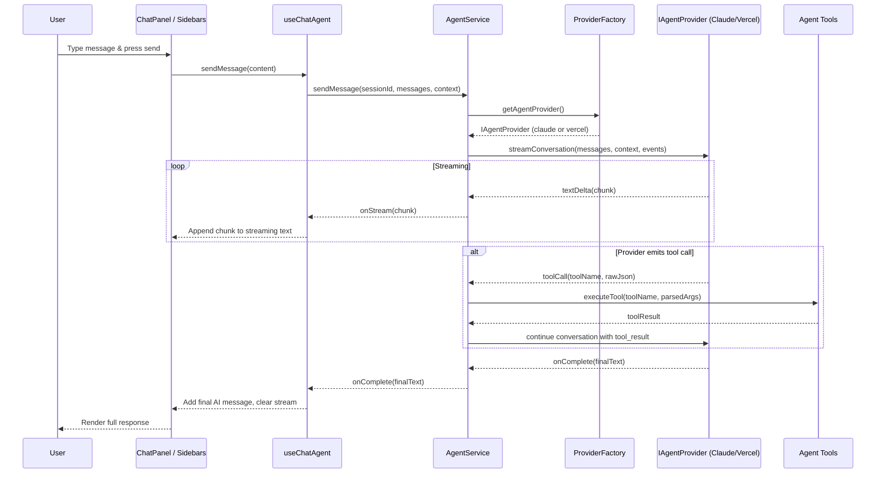

# Vercel AI SDK Alternative Provider PRD

**Status**: Planning  
**Priority**: High  
**Estimated Effort**: 3–4 days  
**Dependencies**: Existing `AgentService`, chat store/hooks, Anthropic/Claude SDK + OpenRouter integration  
**Target Version**: 0.5.x

---

## 1. Overview

### Context & Goals

- **Provider Flexibility**: Add **Vercel AI SDK** as an alternative LLM provider alongside the existing Claude/Anthropic stack, without breaking current chat and tooling flows.
- **Environment-Driven Activation**: Allow runtime selection of the active AI provider via `.env` so that different environments (local, staging, production) can flip between Claude and Vercel without code changes.
- **Preserve Local Claude Flow**: Keep the current Claude/Anthropic-based implementation fully functional for **local testing and debugging**.
- **Future-Proof Architecture**: Introduce a clean provider abstraction so that additional providers (e.g. OpenAI, local models) can be added later with minimal refactors.

### Current Pain Points

- **Single-Provider Coupling**: `AgentService` is tightly coupled to Anthropic’s SDK and streaming event model (`@anthropic-ai/sdk`), making it hard to plug in alternate providers.
- **Env-Specific Logic Scattered**: Environment checks (e.g. API keys, base URLs) are handled directly inside hooks/services instead of via a centralized configuration layer.
- **No Provider Strategy**: There is no formal notion of “AI provider” – swapping implementations currently would require invasive changes in `AgentService` and chat hooks.
- **Limited Experimentation**: Trying different models / providers (e.g. for latency vs. quality trade-offs) is cumbersome because of this tight coupling.

---

## 2. Proposed Solution

### High‑level Summary

- **Introduce an `IAgentProvider` Strategy Interface**: Define a provider-agnostic interface for streaming chat with tools (text deltas, tool invocations, completion events). This becomes the contract `AgentService` depends on.
- **Implement Two Concrete Providers**:
  - `ClaudeSdkProvider` wrapping the existing Anthropic client and preserving current behaviour and error semantics.
  - `VercelAiSdkProvider` using the Vercel AI SDK to talk to configured models (e.g. Anthropic/OpenAI via Vercel routing).
- **Add Provider Factory + Env Selection**: A small `AgentProviderFactory` reads `.env` (e.g. `VITE_AI_PROVIDER`) and instantiates the correct provider. If unset or invalid, it **defaults to Claude** for backward compatibility and local testing.
- **Keep `AgentService` as the Single Orchestrator**: `AgentService` retains responsibility for multi-turn conversations, tool execution, screenshot handling, and logging. It delegates only the low-level LLM streaming to the selected provider.
- **Centralize Provider Config**: Introduce a typed configuration module that validates provider-specific env vars (Claude vs. Vercel) and surfaces clear error messages to chat UI.

### Architecture & Directory Structure

```text
src/editor/services/agent/
├── AgentService.ts                       # Uses IAgentProvider, unchanged public API
├── CodebaseContextProvider.ts
├── types.ts                              # Add provider-related types
├── providers/
│   ├── AgentProviderFactory.ts           # Reads env, returns IAgentProvider
│   ├── IAgentProvider.ts                 # Provider strategy interface
│   ├── ClaudeSdkProvider.ts              # Wraps @anthropic-ai/sdk (current logic refactored)
│   └── VercelAiSdkProvider.ts            # NEW – wraps Vercel AI SDK
├── config/
│   └── AgentProviderConfig.ts            # Env parsing + validation for providers
└── tools/
    ├── ScreenshotFeedbackTool.ts
    ├── PrefabManagementTool.ts
    └── ... (existing tools, unchanged API)

docs/PRDs/editor/
└── vercel-ai-sdk-alternative-provider-prd.md   # THIS DOCUMENT
```

---

## 3. Implementation Plan

### Phase 1: Provider Abstraction & Env Design (0.5 day)

1. **Define Env Contract**
   - Add provider selection var and provider-specific keys to `.env.example`:
     - `VITE_AI_PROVIDER=claude | vercel`
     - `VITE_CLAUDE_CODE_SDK_API_KEY`, `VITE_CLAUDE_CODE_SDK_BASE_URL`, `VITE_CLAUDE_CODE_SDK_MODEL`
     - `VITE_VERCEL_AI_API_KEY`, `VITE_VERCEL_AI_MODEL`, `VITE_VERCEL_AI_BASE_URL` (optional override)
   - Document precedence: if `VITE_AI_PROVIDER` is missing or invalid, default to `claude`.
2. **Create `AgentProviderConfig`**
   - Parse env vars once, validate presence per provider with clear error messages.
   - Expose a typed config object consumed by providers and `AgentService`.
3. **Define `IAgentProvider` Interface**
   - Provider-agnostic API for streaming messages with tools and basic health checks.

### Phase 2: Claude Provider Extraction (1 day)

1. **Implement `ClaudeSdkProvider`**
   - Move Anthropic-specific streaming logic from `AgentService` into `ClaudeSdkProvider`.
   - Normalize Anthropic event stream (text deltas, tool use JSON, stop events) to the `IAgentProvider` event model.
2. **Refactor `AgentService`**
   - Replace direct `Anthropic` client usage with calls to `IAgentProvider.streamConversation`.
   - Keep multi-turn loop, tool execution (`executeTool`), screenshot handling, logging, and session management inside `AgentService`.
3. **Add `AgentProviderFactory`**
   - Read provider from `AgentProviderConfig`.
   - Instantiate and cache `ClaudeSdkProvider` by default; expose a `getProvider()` method.
4. **Wire Provider into Chat Hooks**
   - Ensure `useChatAgent` initialization path remains the same (still calls `AgentService.initialize()`), but error messages now mention the selected provider when relevant.

### Phase 3: Vercel AI SDK Provider (1.5 days)

1. **Add Dependency & Basic Client**
   - Install `ai` (Vercel AI SDK) and configure a minimal client using provider-specific API key & base URL.
   - Ensure calls are made from a safe context (Vite dev server / proxy) so secrets are not exposed directly in browser builds.
2. **Implement `VercelAiSdkProvider`**
   - Translate internal messages (`IAgentMessage` and tool schemas) into Vercel AI SDK calls (e.g. `streamText` with tool definitions).
   - Map Vercel streaming events into `IAgentProvider` events:
     - Text chunks → `textDelta`
     - Tool calls → `toolCallStart` + JSON payload
     - Tool results → `toolResult`
3. **Provider Selection via Env**
   - Extend `AgentProviderFactory` to resolve `"vercel"` into `VercelAiSdkProvider`.
   - Add safety: if `VITE_AI_PROVIDER=vercel` but required Vercel env vars are missing, surface a clear configuration error and fall back to Claude (configurable via `VITE_AI_PROVIDER_FALLBACK=claude|none`).
4. **Update Docs**
   - Add Vercel-specific setup section to `docs/claude-agent-sdk-setup.md` or a dedicated `docs/ai-providers.md`.

### Phase 4: Testing, Telemetry & Polishing (1 day)

1. **Unit Tests**
   - Test `AgentProviderConfig` env parsing and error messages for both providers.
   - Verify `AgentProviderFactory` selection and fallback behaviour.
   - Mock Anthropic/Vercel SDKs to validate `ClaudeSdkProvider` and `VercelAiSdkProvider` conformance to `IAgentProvider`.
2. **Integration Tests**
   - End-to-end chat flow for both providers: streaming, tool calls, screenshot flows.
   - Regression test to ensure Claude behaviour remains unchanged when `VITE_AI_PROVIDER=claude`.
3. **Telemetry & Logging**
   - Add provider name + model to `SessionLogger` metadata and high-level logs for easier debugging.
4. **Developer Experience**
   - Update `src/editor/chat/CLAUDE.md` with hints on how to switch providers via `.env`.
   - Add a quick CLI or script snippet for running dev against both providers (e.g. documented commands or env snippets).

---

## 4. File and Directory Structures

```text
src/editor/services/agent/
├── AgentService.ts
├── CodebaseContextProvider.ts
├── types.ts
├── config/
│   └── AgentProviderConfig.ts
├── providers/
│   ├── IAgentProvider.ts
│   ├── AgentProviderFactory.ts
│   ├── ClaudeSdkProvider.ts
│   └── VercelAiSdkProvider.ts
└── tools/
    ├── ScreenshotFeedbackTool.ts
    ├── PrefabManagementTool.ts
    └── ...
```

Env configuration (documented in `.env.example`):

```text
# Provider selection
VITE_AI_PROVIDER=claude

# Claude / Anthropic (existing)
VITE_CLAUDE_CODE_SDK_API_KEY=...
VITE_CLAUDE_CODE_SDK_BASE_URL=https://api.z.ai/api/anthropic
VITE_CLAUDE_CODE_SDK_MODEL=glm-4.6

# Vercel AI SDK
VITE_VERCEL_AI_API_KEY=...
VITE_VERCEL_AI_MODEL=anthropic/claude-3.5-sonnet
VITE_VERCEL_AI_BASE_URL=https://api.vercel.ai    # optional override

# Optional: fallback behaviour
VITE_AI_PROVIDER_FALLBACK=claude
```

---

## 5. Technical Details

### 5.1 `IAgentProvider` Interface

```ts
// src/editor/services/agent/providers/IAgentProvider.ts
import type { IAgentMessage, ICodebaseContext } from '@editor/services/agent/types';

export interface IAgentStreamEvents {
  onTextDelta?: (chunk: string) => void;
  onToolCall?: (toolName: string, rawInputJson: string) => void;
  onComplete?: (finalText: string) => void;
}

export interface IAgentProvider {
  readonly name: 'claude' | 'vercel';

  initialize(): void | Promise<void>;
  isInitialized(): boolean;

  streamConversation(params: {
    sessionId: string;
    messages: IAgentMessage[];
    context: ICodebaseContext;
    model: string;
    maxTokens: number;
    abortSignal: AbortSignal;
    events: IAgentStreamEvents;
  }): Promise<void>;

  testConnection(): Promise<boolean>;
}
```

### 5.2 Provider Config & Factory

```ts
// src/editor/services/agent/config/AgentProviderConfig.ts
export interface IAgentProviderConfig {
  provider: 'claude' | 'vercel';
  fallbackProvider: 'claude' | 'none';
  claude: {
    apiKey: string;
    baseUrl: string;
    model: string;
  };
  vercel: {
    apiKey: string | null;
    baseUrl: string;
    model: string;
  };
}

export const loadAgentProviderConfig = (): IAgentProviderConfig => {
  const providerEnv = import.meta.env.VITE_AI_PROVIDER as 'claude' | 'vercel' | undefined;
  const provider = providerEnv === 'vercel' ? 'vercel' : 'claude';

  const fallbackEnv = import.meta.env.VITE_AI_PROVIDER_FALLBACK as 'claude' | 'none' | undefined;
  const fallbackProvider = fallbackEnv === 'none' ? 'none' : 'claude';

  const claudeApiKey = import.meta.env.VITE_CLAUDE_CODE_SDK_API_KEY;
  const claudeBaseUrl = import.meta.env.VITE_CLAUDE_CODE_SDK_BASE_URL;
  const claudeModel = import.meta.env.VITE_CLAUDE_CODE_SDK_MODEL || 'glm-4.6';

  const vercelApiKey = import.meta.env.VITE_VERCEL_AI_API_KEY || null;
  const vercelBaseUrl = import.meta.env.VITE_VERCEL_AI_BASE_URL || 'https://api.vercel.ai';
  const vercelModel = import.meta.env.VITE_VERCEL_AI_MODEL || 'anthropic/claude-3.5-sonnet';

  // NOTE: actual implementation should log clear errors when required keys are missing.

  return {
    provider,
    fallbackProvider,
    claude: {
      apiKey: claudeApiKey,
      baseUrl: claudeBaseUrl,
      model: claudeModel,
    },
    vercel: {
      apiKey: vercelApiKey,
      baseUrl: vercelBaseUrl,
      model: vercelModel,
    },
  };
};
```

```ts
// src/editor/services/agent/providers/AgentProviderFactory.ts
import { Logger } from '@core/lib/logger';
import { loadAgentProviderConfig } from '@editor/services/agent/config/AgentProviderConfig';
import type { IAgentProvider } from './IAgentProvider';
import { ClaudeSdkProvider } from './ClaudeSdkProvider';
import { VercelAiSdkProvider } from './VercelAiSdkProvider';

const logger = Logger.create('AgentProviderFactory');

let cachedProvider: IAgentProvider | null = null;

export const getAgentProvider = (): IAgentProvider => {
  if (cachedProvider) return cachedProvider;

  const config = loadAgentProviderConfig();

  if (config.provider === 'vercel' && config.vercel.apiKey) {
    cachedProvider = new VercelAiSdkProvider(config);
    logger.info('Using Vercel AI SDK provider', { model: config.vercel.model });
    return cachedProvider;
  }

  // Fallback to Claude if Vercel is not fully configured
  cachedProvider = new ClaudeSdkProvider(config);
  logger.info('Using Claude provider', { model: config.claude.model });
  return cachedProvider;
};
```

### 5.3 Claude Provider Skeleton

```ts
// src/editor/services/agent/providers/ClaudeSdkProvider.ts
import Anthropic from '@anthropic-ai/sdk';
import { Logger } from '@core/lib/logger';
import type { IAgentMessage, ICodebaseContext } from '@editor/services/agent/types';
import type { IAgentProvider, IAgentStreamEvents } from './IAgentProvider';
import type { IAgentProviderConfig } from '@editor/services/agent/config/AgentProviderConfig';

const logger = Logger.create('ClaudeSdkProvider');

export class ClaudeSdkProvider implements IAgentProvider {
  readonly name = 'claude' as const;

  private client: Anthropic | null = null;
  private initialized = false;

  constructor(private readonly config: IAgentProviderConfig) {}

  initialize(): void {
    if (this.initialized) return;

    const { apiKey, baseUrl } = this.config.claude;
    if (!apiKey || !baseUrl) {
      throw new Error('Claude provider requires VITE_CLAUDE_CODE_SDK_API_KEY and BASE_URL');
    }

    const proxyEndpoint = '/api/ai';
    const customFetch: typeof fetch = (input, init) => {
      const url =
        typeof input === 'string' ? input : input instanceof Request ? input.url : String(input);
      const proxiedUrl = url.replace(baseUrl, proxyEndpoint);
      return fetch(proxiedUrl, init);
    };

    this.client = new Anthropic({
      apiKey,
      baseURL: baseUrl,
      dangerouslyAllowBrowser: true,
      fetch: customFetch,
    });

    this.initialized = true;
    logger.info('ClaudeSdkProvider initialized', { baseUrl });
  }

  isInitialized(): boolean {
    return this.initialized;
  }

  async streamConversation(params: {
    sessionId: string;
    messages: IAgentMessage[];
    context: ICodebaseContext;
    model: string;
    maxTokens: number;
    abortSignal: AbortSignal;
    events: IAgentStreamEvents;
  }): Promise<void> {
    // Implementation will mirror existing AgentService streaming logic,
    // but emit provider-agnostic events via params.events.
  }

  async testConnection(): Promise<boolean> {
    // Minimal health-check call to Anthropic
    return true;
  }
}
```

### 5.4 Vercel AI Provider Skeleton

```ts
// src/editor/services/agent/providers/VercelAiSdkProvider.ts
import { Logger } from '@core/lib/logger';
import type { IAgentMessage, ICodebaseContext } from '@editor/services/agent/types';
import type { IAgentProvider, IAgentStreamEvents } from './IAgentProvider';
import type { IAgentProviderConfig } from '@editor/services/agent/config/AgentProviderConfig';
// NOTE: actual import will depend on how the Vercel AI SDK is wired in this project
// import { streamText } from 'ai';

const logger = Logger.create('VercelAiSdkProvider');

export class VercelAiSdkProvider implements IAgentProvider {
  readonly name = 'vercel' as const;

  private initialized = false;

  constructor(private readonly config: IAgentProviderConfig) {}

  initialize(): void {
    if (this.initialized) return;

    if (!this.config.vercel.apiKey) {
      throw new Error('Vercel provider requires VITE_VERCEL_AI_API_KEY');
    }

    // Any SDK-level initialization or adapter setup would go here.

    this.initialized = true;
    logger.info('VercelAiSdkProvider initialized', {
      baseUrl: this.config.vercel.baseUrl,
      model: this.config.vercel.model,
    });
  }

  isInitialized(): boolean {
    return this.initialized;
  }

  async streamConversation(params: {
    sessionId: string;
    messages: IAgentMessage[];
    context: ICodebaseContext;
    model: string;
    maxTokens: number;
    abortSignal: AbortSignal;
    events: IAgentStreamEvents;
  }): Promise<void> {
    // Use Vercel AI SDK to stream text + tool calls,
    // then forward normalized events to params.events.
  }

  async testConnection(): Promise<boolean> {
    // Minimal health-check call via Vercel AI SDK
    return true;
  }
}
```

### 5.5 `AgentService` Integration

`AgentService` becomes responsible only for:

- Building system prompts and assembling `IAgentMessage` arrays.
- Managing multi-turn conversations, tool execution (`executeTool`), and screenshot flows.
- Delegating actual LLM interaction to `getAgentProvider().streamConversation`.

Conceptual change (simplified):

```ts
// Inside AgentService.sendMessage(...)
import { getAgentProvider } from '@editor/services/agent/providers/AgentProviderFactory';

const provider = getAgentProvider();

await provider.streamConversation({
  sessionId,
  messages,
  context,
  model,
  maxTokens,
  abortSignal: signal,
  events: {
    onTextDelta: (chunk) => {
      fullResponse += chunk;
      options?.onStream?.(chunk);
    },
    onToolCall: (toolName, rawJson) => {
      // parse, call executeTool, feed tool_results back into conversation loop
    },
    onComplete: (finalText) => {
      // finalize responseToUser, call options?.onComplete
    },
  },
});
```

---

## 5.1 UI/API Integration

- **Chat Hooks (`useChatAgent`, `useChatStreaming`)**
  - No API changes required for components consuming these hooks.
  - Initialization path now logs which provider is active and surfaces configuration errors (e.g. “Vercel provider selected but VITE_VERCEL_AI_API_KEY is missing; falling back to Claude.”).
- **Screenshot Feedback Tool**
  - Continues to work exactly as today, since it uses `OpenRouterService` separately from the core chat provider.
  - PRD recommends documenting that screenshot analysis may still use OpenRouter even when `VITE_AI_PROVIDER=vercel`, to avoid confusion.
- **Session Logging**
  - `SessionLogger` should include provider name and model in each session’s metadata so logs clearly show which backend handled a conversation.

---

## 6. Usage Examples

### Example 1: Switching Provider via `.env`

```bash
# Local development – keep Claude for stability
VITE_AI_PROVIDER=claude

# Staging – experiment with Vercel AI SDK
VITE_AI_PROVIDER=vercel
VITE_VERCEL_AI_API_KEY=sk-...
VITE_VERCEL_AI_MODEL=anthropic/claude-3.5-sonnet
```

### Example 2: Chat Hook Usage (Unchanged for UI)

```ts
// In ChatPanel.tsx
import { useChatAgent } from '@editor/chat/hooks/useChatAgent';

export const ChatPanel = () => {
  const { sendMessage, cancelMessage, isTyping, currentStream, initialized, error } = useChatAgent();

  // UI remains identical regardless of whether provider is Claude or Vercel.
};
```

### Example 3: Provider Metadata in Logs

```ts
// When starting a new session
const provider = getAgentProvider();
sessionLogger.log('SESSION_PROVIDER', {
  provider: provider.name,
  model: resolvedModel,
});
```

---

## 7. Testing Strategy

- **Unit Tests**
  - `AgentProviderConfig`:
    - Correctly resolves provider & fallback from env.
    - Validates that required env vars exist per provider and produces human-readable errors.
  - `AgentProviderFactory`:
    - Returns `ClaudeSdkProvider` when `VITE_AI_PROVIDER` is absent/invalid.
    - Returns `VercelAiSdkProvider` when `VITE_AI_PROVIDER=vercel` and Vercel env vars are present.
  - Provider Implementations:
    - Mock Anthropic/Vercel SDKs to assert that `streamConversation` invokes callbacks as expected.
- **Integration Tests**
  - Full conversation flow using Claude provider:
    - Streaming text + tool calls behave identically to current implementation.
  - Full conversation flow using Vercel provider:
    - Streaming works; tool calls execute correctly via `executeTool`.
  - Env switching:
    - Changing `VITE_AI_PROVIDER` flips behaviour without code changes.
  - Error handling:
    - Missing Vercel env vars with `VITE_AI_PROVIDER=vercel` → clear error, fallback to Claude (if configured).
- **Manual Testing**
  - Smoke-test chat with both providers: latency, quality, and tool usage.
  - Confirm screenshot workflows and chat UI remain stable.

---

## 8. Edge Cases

| Edge Case                                                   | Remediation                                                                                               |
| ----------------------------------------------------------- | --------------------------------------------------------------------------------------------------------- |
| `VITE_AI_PROVIDER=vercel` but `VITE_VERCEL_AI_API_KEY` missing | Show a clear configuration error in chat UI; log warning; if `VITE_AI_PROVIDER_FALLBACK=claude`, use Claude. |
| `VITE_AI_PROVIDER` unset or invalid                        | Default to Claude provider and log an info-level message.                                                 |
| Provider-specific model misconfiguration                    | Validate models at init; surface “invalid model” errors early instead of failing mid-conversation.        |
| Differences in tool-calling semantics between providers     | Normalize tool call representation in `IAgentProvider`; add tests to ensure consistent `executeTool` usage. |
| Network / rate limit errors from Vercel                    | Implement retries and user-friendly messages; fall back to Claude if configured and available.            |
| Long-running streams cancelled mid-way                     | Ensure both providers respect `AbortSignal`; propagate “Request cancelled” errors consistently.           |
| Future providers added (OpenAI, local)                     | Extend `IAgentProvider` and `AgentProviderFactory`; ensure no changes are needed in chat UI.              |

---

## 9. Sequence Diagram



---

## 10. Risks & Mitigations

| Risk                                             | Mitigation                                                                                  |
| ------------------------------------------------ | ------------------------------------------------------------------------------------------- |
| Refactor of `AgentService` introduces regressions | Introduce `ClaudeSdkProvider` first and ensure behaviour matches current implementation via tests and logs. |
| Vercel AI SDK integration adds build complexity  | Isolate Vercel-specific code under provider; keep public APIs unchanged; guard imports with clear comments. |
| Provider drift (one provider gets better tooling) | Keep `IAgentProvider` minimal and focused on streaming; handle advanced features in `AgentService`. |
| Confusing configuration for users                | Provide a concise `docs/ai-providers.md` with examples; surface provider name in chat status/logs. |
| Increased operational cost when switching to Vercel | Document cost expectations; allow quick flipping back to Claude via `.env` without redeploys. |

---

## 11. Timeline

| Phase                                      | Duration  | Notes                                                |
| ------------------------------------------ | --------- | ---------------------------------------------------- |
| Phase 1: Abstraction & Env Design          | 0.5 day   | Env contract, config types, `IAgentProvider`        |
| Phase 2: Claude Provider Extraction        | 1.0 day   | Move existing logic into `ClaudeSdkProvider`        |
| Phase 3: Vercel AI SDK Provider            | 1.5 days  | SDK integration, provider selection, docs           |
| Phase 4: Testing, Telemetry & Polishing    | 1.0 day   | Unit + integration tests, logs, documentation       |

**Total Estimated Time**: ~3–4 days (excluding CI/review cycles).

---

## 12. Acceptance Criteria

- [ ] `AgentService` uses `IAgentProvider` instead of `@anthropic-ai/sdk` directly.
- [ ] `ClaudeSdkProvider` reproduces current chat behaviour (streaming + tool calls) with no regressions.
- [ ] `VercelAiSdkProvider` is implemented and can handle full conversations, including tool calls, via the Vercel AI SDK.
- [ ] `VITE_AI_PROVIDER` switches the active provider without any code changes or rebuild-time flags.
- [ ] Missing or invalid provider configuration surfaces clear error messages in chat UI and logs.
- [ ] Local development continues to work with Claude by default when `VITE_AI_PROVIDER` is unset or set to `claude`.
- [ ] Session logs record provider name and model for each conversation.
- [ ] All new unit and integration tests pass for both providers.

---

## 13. Conclusion

Introducing a provider strategy layer around `AgentService` enables Vibe Coder 3D to integrate the Vercel AI SDK as a first-class alternative without sacrificing the stability of the existing Claude setup. By keeping the chat UI and tool APIs unchanged and centralizing provider selection in configuration, we gain the ability to experiment with different models and vendors per environment while preserving a single, well-tested agent orchestration path. This design also lays the groundwork for future providers (OpenAI, local models) to be added with minimal incremental complexity.

---

## 14. Assumptions & Dependencies

- **Assumptions**
  - Existing Anthropic/Claude implementation remains the canonical baseline for behaviour and quality.
  - Vercel AI SDK can be used from the project’s Node/Vite context without major architectural changes.
  - Chat components strictly depend on `useChatAgent`/`AgentService` and not on provider-specific details.
  - Environment variables follow current Vite conventions (`VITE_` prefix) and are available at build time.
- **Dependencies**
  - `@anthropic-ai/sdk` (already in use) for the Claude provider.
  - `ai` (Vercel AI SDK) as a new runtime dependency.
  - Vercel AI account and API key for staging/production environments.
  - Existing logging (`Logger`, `SessionLogger`) and chat store (`chatStore.ts`) for observability and state management.


