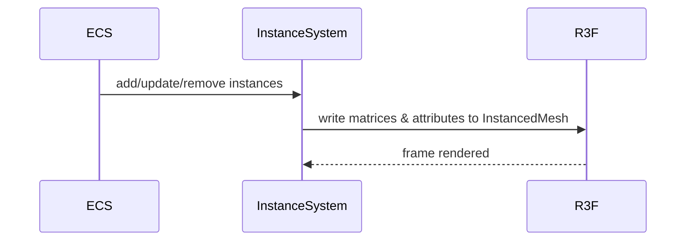

# R3F Instancing & Batching PRD

## Overview

### Context & Goals

- Leverage R3F/Three instancing to reduce draw calls for repeated meshes (trees, debris, bullets).
- Provide declarative APIs and ECS components to author instance sets and batched materials.
- Achieve mobile-friendly performance targets with minimal developer friction.

### Current Pain Points

- Repeated meshes render individually, causing excessive draw calls and CPU overhead.
- No unified API to manage instance transforms, per-instance attributes, and lifecycle.
- Manual instancing is error‑prone and hard to integrate with editor workflows.

## Proposed Solution

### High‑level Summary

- Introduce `InstanceSystem` and `IInstancedComponent` for ECS-driven instancing.
- Support `<Instances>`/`<InstancedMesh>` patterns and optional `@react-three/drei` helpers.
- Provide per-instance attributes (color, scale, custom props) with GPU-friendly buffers.
- Add editor tooling for instance set creation, scattering, and selection.

### Architecture & Directory Structure

```
/src/core/
  ├── systems/
  │   └── InstanceSystem.ts
  ├── components/instancing/
  │   ├── InstancedComponent.schema.ts
  │   └── InstancedGroup.tsx
  └── lib/instancing/
      ├── buffers.ts
      ├── attributes.ts
      └── batching.ts
/src/editor/components/instancing/
  ├── InstanceScatterTool.tsx
  └── InstanceInspector.tsx
```

## Implementation Plan

1. Phase 1: ECS & Core Buffers (0.5 day)

   1. Define Zod schema for `IInstancedComponent` (base mesh/material refs, capacity).
   2. Implement GPU buffer management for transforms and per-instance attributes.
   3. Add `InstanceSystem` to sync ECS data → `InstancedMesh`.

2. Phase 2: Authoring & Tools (0.75 day)

   1. Create `InstancedGroup` React wrapper for R3F.
   2. Editor scatter/paint tool; inspector for per-instance overrides.
   3. Selection and deletion flows; gizmo for bounds.

3. Phase 3: Batching & Materials (0.5 day)

   1. Material parameter merging rules; texture atlasing optional.
   2. Optional `drei` `<Instances>` integration.
   3. Add perf instrumentation and warnings for over-capacity.

4. Phase 4: QA & Docs (0.25 day)

   1. Write usage docs and examples.
   2. Benchmarks: draw calls vs baseline; FPS on mobile.

## File and Directory Structures

```
/docs/PRDs/
  └── 4-30-r3f-instancing-and-batching-prd.md
```

## Technical Details

```ts
export interface IInstancedComponent {
  enabled: boolean;
  capacity: number; // max instances
  baseMeshId: string; // reference to mesh/geometry resource
  baseMaterialId: string; // reference to material resource
  instances: Array<{
    position: [number, number, number];
    rotation?: [number, number, number];
    scale?: [number, number, number];
    color?: [number, number, number];
    userData?: Record<string, unknown>;
  }>;
}

export interface IInstanceSystemApi {
  add(entityId: number, data: Partial<IInstancedComponent>): void;
  updateTransform(
    entityId: number,
    index: number,
    t: {
      position?: [number, number, number];
      rotation?: [number, number, number];
      scale?: [number, number, number];
    },
  ): void;
  removeAt(entityId: number, index: number): void;
}
```

### Integration with R3F

```ts
// InstancedGroup.tsx
export const InstancedGroup: React.FC<{
  capacity: number;
  geometry: THREE.BufferGeometry;
  material: THREE.Material;
  children?: React.ReactNode; // optional overlays/gizmos
}> = ({ capacity, geometry, material, children }) => {
  // create InstancedMesh and expose ref for buffer updates
  return null;
};
```

## Usage Examples

```ts
// Create 1k grass instances
instanceApi.add(entityId, {
  capacity: 1000,
  baseMeshId: 'mesh/grassBlade',
  baseMaterialId: 'mat/grass',
});

// Update one instance transform
instanceApi.updateTransform(entityId, 42, { position: [10, 0, -5] });
```

## Testing Strategy

- Unit: buffer packing/unpacking, schema validation, capacity enforcement.
- Integration: draw call counts vs non-instanced baseline; editor scatter tool workflows.

## Edge Cases

| Edge Case                  | Remediation                                     |
| -------------------------- | ----------------------------------------------- |
| Exceeding capacity         | Warn and skip; suggest capacity increase        |
| Mixed materials/geometries | Batch by (geom, material); split groups         |
| Precision drift            | Periodic matrix rebuild; use Float32Array views |

## Sequence Diagram



## Risks & Mitigations

| Risk                     | Mitigation                                    |
| ------------------------ | --------------------------------------------- |
| CPU upload overhead      | Use partial updates, dirty ranges, throttling |
| Material incompatibility | Enforce batching rules, provide diagnostics   |
| Editor complexity        | Start minimal; iterate scatter tools          |

## Timeline

- Total: ~2.0 days (Core 0.5, Tools 0.75, Batching 0.5, QA 0.25)

## Acceptance Criteria

- Instance groups render with ≤1 draw call per (geom, material) batch.
- Editor can scatter and edit instances efficiently.
- Mobile scenes sustain target FPS with thousands of lightweight instances.

## Conclusion

Instancing and batching deliver large FPS gains and predictable performance for repeated scene content, aligned with R3F best practices.

## Assumptions & Dependencies

- Three.js/React Three Fiber; optional `@react-three/drei` for helpers; Zod available; existing asset/mesh registry.
