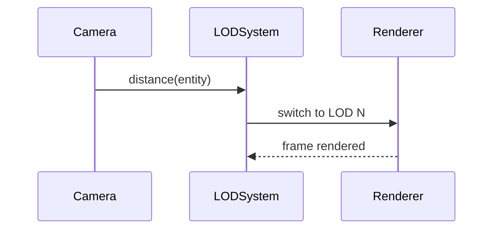

# R3F Level of Detail (LOD) System PRD

## Overview

### Context & Goals

- Dynamically reduce geometry/material complexity with camera distance to maintain FPS on mobile.
- Provide declarative ECS components and R3F wrappers for multi-LOD assets.
- Integrate with asset pipeline for autogenerated LODs when available.

### Current Pain Points

- High-poly models hurt mobile FPS; no automatic LOD switching.
- Manual LOD authoring is inconsistent; missing runtime heuristics.
- No editor previews or distance threshold tooling.

## Proposed Solution

### High‑level Summary

- Add `LODSystem` and `ILODComponent` with distance thresholds per level.
- Support Three.js `THREE.LOD` or custom swap strategy for meshes/materials.
- Editor support to preview LODs, tweak thresholds, and bake defaults per asset.
- Optional hysteresis to prevent LOD popping; fade or cross-fade where applicable.

### Architecture & Directory Structure

```
/src/core/
  ├── systems/
  │   └── LODSystem.ts
  ├── components/lod/
  │   ├── LODComponent.schema.ts
  │   └── LODGroup.tsx
  └── lib/lod/
      ├── thresholds.ts
      ├── hysteresis.ts
      └── integration.ts
/src/editor/components/lod/
  ├── LODInspector.tsx
  └── LODPreviewGizmo.tsx
```

## Implementation Plan

1. Phase 1: ECS & Runtime (0.75 day)

   1. Define schema for `ILODComponent` (levels, distances, hysteresis).
   2. Implement `LODSystem` to compute active LOD per frame using camera distance.
   3. R3F `LODGroup` wrapper to host multiple child levels.

2. Phase 2: Editor & Asset Hooks (0.5 day)

   1. Inspector UI for thresholds; preview gizmo; camera-driven preview.
   2. Integrate with asset manifest for per-asset default LOD configs.

3. Phase 3: Quality & Transitions (0.5 day)

   1. Hysteresis and cross-fade toggles to avoid popping.
   2. Metrics collection on LOD switch rate.

## File and Directory Structures

```
/docs/PRDs/
  └── 4-31-r3f-lod-system-prd.md
```

## Technical Details

```ts
export interface ILODLevel {
  id: string; // asset or mesh id
  distance: number; // switch-in distance
  screenSpaceError?: number; // optional alternative criterion
}

export interface ILODComponent {
  enabled: boolean;
  levels: ILODLevel[]; // sorted by increasing distance
  hysteresis?: number; // meters to prevent rapid toggling
  crossFade?: boolean;
}

export interface ILODSystemApi {
  setLevels(entityId: number, levels: ILODLevel[]): void;
  setHysteresis(entityId: number, meters: number): void;
}
```

### R3F Integration

```ts
// LODGroup.tsx
export const LODGroup: React.FC<{ levels: ILODLevel[]; crossFade?: boolean }>;
```

## Usage Examples

```ts
lodApi.setLevels(entityId, [
  { id: 'tree_high', distance: 0 },
  { id: 'tree_med', distance: 20 },
  { id: 'tree_low', distance: 40 },
]);
```

## Testing Strategy

- Unit: distance calculation with hysteresis; correct level selection.
- Integration: FPS stability across flythrough; editor preview toggles.

## Edge Cases

| Edge Case                | Remediation                                  |
| ------------------------ | -------------------------------------------- |
| Missing levels           | Clamp to nearest available level             |
| Rapid camera oscillation | Apply hysteresis; debounce selection updates |
| Asset mismatch           | Validate level ids; diagnostics in inspector |

## Sequence Diagram



## Risks & Mitigations

| Risk                    | Mitigation                               |
| ----------------------- | ---------------------------------------- |
| Pop-in visual artifacts | Cross-fade; tuned thresholds; hysteresis |
| Authoring overhead      | Defaults from asset pipeline; presets    |

## Timeline

- Total: ~1.75 days (Runtime 0.75, Editor 0.5, Quality 0.5)

## Acceptance Criteria

- LOD switching maintains target FPS on mobile scenes.
- Editor previews LOD levels and thresholds accurately.
- Hysteresis prevents rapid toggling in common flythroughs.

## Conclusion

LOD ensures scalable visual fidelity by adapting complexity to camera distance with minimal authoring friction.

## Assumptions & Dependencies

- Three.js LOD or equivalent; asset manifest provides multi-LOD variants; Zod available; access to active camera.
