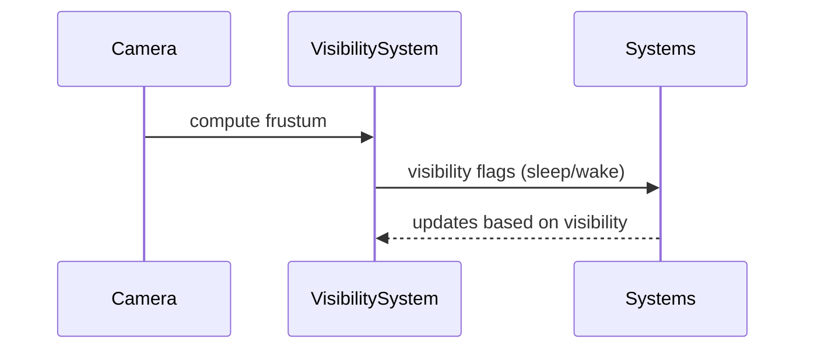

# R3F Culling & Visibility PRD

## Overview

### Context & Goals

- Reduce GPU/CPU work by avoiding rendering/updating objects outside view or relevance.
- Provide declarative visibility controls and ECS-driven culling policies.
- Integrate frustum, distance, and occlusion strategies; leverage `@react-three/drei` helpers.

### Current Pain Points

- All objects update every frame regardless of visibility.
- No unified culling strategy; manual hacks increase complexity.
- Lacking instrumentation to validate culling effectiveness.

## Proposed Solution

### High‑level Summary

- Implement `VisibilitySystem` with `IVisibilityComponent` controlling culling rules.
- Add frustum culling via `THREE.Frustum`, optional `VisibilityObserver` integration.
- Support distance thresholds and sleep/wake policies for script/physics.
- Provide editor visualization of bounds and culling state.

### Architecture & Directory Structure

```
/src/core/
  ├── systems/
  │   └── VisibilitySystem.ts
  ├── components/visibility/
  │   ├── VisibilityComponent.schema.ts
  │   └── VisibilityBounds.tsx
  └── lib/visibility/
      ├── frustum.ts
      ├── policies.ts
      └── metrics.ts
/src/editor/components/visibility/
  ├── VisibilityInspector.tsx
  └── BoundsGizmo.tsx
```

## Implementation Plan

1. Phase 1: Frustum & Distance (0.75 day)

   1. Implement frustum culling with cached AABBs/spheres.
   2. Distance-based visibility with thresholds and hysteresis.
   3. Metrics (visible count, culled count per frame).

2. Phase 2: Policies & Sleep (0.5 day)

   1. Script and physics sleep when not visible or too distant.
   2. Event hooks: `visibility:changed` for subsystem reactions.

3. Phase 3: Editor & Observer Integration (0.5 day)

   1. Bounds gizmo; inspector toggle of culling modes per entity.
   2. Optional integration with `drei` `VisibilityObserver`.

## File and Directory Structures

```
/docs/PRDs/
  └── 4-32-r3f-culling-and-visibility-prd.md
```

## Technical Details

```ts
export type VisibilityMode = 'auto' | 'always' | 'never';

export interface IVisibilityComponent {
  mode: VisibilityMode;
  frustum: boolean;
  distanceMax?: number;
  sleepOnHidden?: boolean;
}

export interface IVisibilitySystemApi {
  isVisible(entityId: number): boolean;
  setMode(entityId: number, mode: VisibilityMode): void;
}
```

### R3F Integration

```ts
// VisibilityBounds.tsx
export const VisibilityBounds: React.FC<{ targetRef: React.RefObject<THREE.Object3D> }>;
```

## Usage Examples

```ts
visibilityApi.setMode(entityId, 'auto');
// Configure distance culling
// in component data: { frustum: true, distanceMax: 100 }
```

## Testing Strategy

- Unit: frustum tests with known AABBs; distance thresholds; mode transitions.
- Integration: scene flythrough metrics; sleep/wake interaction with scripts.

## Edge Cases

| Edge Case            | Remediation                                  |
| -------------------- | -------------------------------------------- |
| Dynamic bounds       | Recompute AABB on transform/material changes |
| Large skinned meshes | Use conservative spheres; optional CPU bones |
| Rapid toggling       | Add hysteresis and debounce for visibility   |

## Sequence Diagram



## Risks & Mitigations

| Risk                | Mitigation                               |
| ------------------- | ---------------------------------------- |
| CPU cost of culling | Cache bounds; batch checks; coarse masks |
| Incorrect sleeping  | Emit events; whitelist critical systems  |

## Timeline

- Total: ~1.75 days (Core 0.75, Policies 0.5, Editor 0.5)

## Acceptance Criteria

- Frustum/distance culling reduces rendered object count measurably.
- Scripts/physics pause when hidden if enabled.
- Editor shows culling state and adjustable thresholds.

## Conclusion

Culling reduces unnecessary work across subsystems, improving FPS and battery life.

## Assumptions & Dependencies

- Access to active camera; Three.js math utilities; event bus; Zod for schemas; optional `@react-three/drei`.
