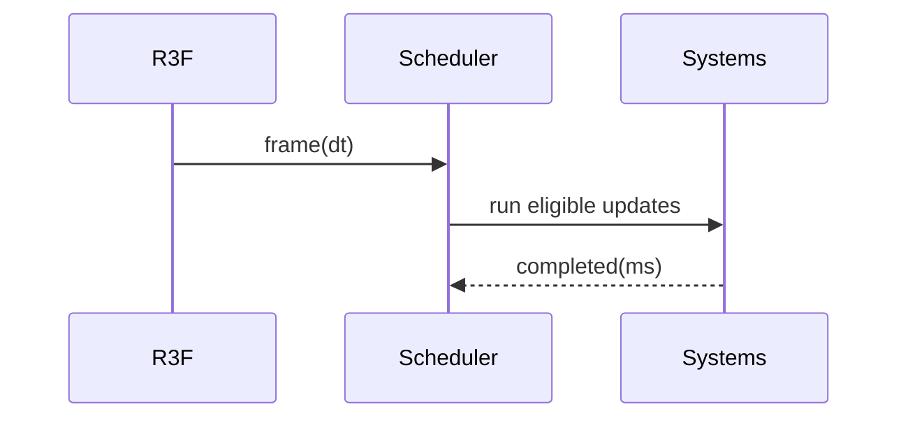

# R3F Frame Loop & Scheduling PRD

## Overview

### Context & Goals

- Align ECS/system updates with R3F `useFrame` while minimizing React re-renders.
- Provide scheduling controls (fixed/variable timesteps, throttled subsystems).
- Enable deterministic updates and dynamic cadence for mobile performance.

### Current Pain Points

- Mixed update cadences; some work runs every frame without prioritization.
- No standard skipping/throttling for AI/FX on weaker devices.
- Limited visibility into per-system timing and budget compliance.

## Proposed Solution

### High‑level Summary

- Extend loop with scheduler: per-system frequency, priority, and budgets.
- Keep React state updates out of the render loop; use stores/events.
- Provide APIs to register systems with cadence (every N frames / Hz / on demand).
- Integrate profiler metrics and dynamic quality hooks to downshift load.

### Architecture & Directory Structure

```
/src/core/
  ├── components/EngineLoop.tsx (augment)
  ├── lib/gameLoop.ts (augment)
  └── lib/scheduling/
      ├── Scheduler.ts
      ├── cadence.ts
      └── budgets.ts
```

## Implementation Plan

1. Phase 1: Scheduler Core (0.75 day)

   1. Define `IScheduledSystem` with cadence: `everyNFrames`, `hz`, `onDemand`.
   2. Implement scheduler that decides which systems run each frame.
   3. Hook into existing `runRegisteredSystems` path.

2. Phase 2: Budgets & Priorities (0.5 day)

   1. Per-frame time budget; optional soft fail with skip.
   2. Prioritize critical systems; demote non-critical under load.

3. Phase 3: Dynamic Downshifting (0.5 day)

   1. Connect to perf metrics; adjust cadence when FPS drops.
   2. Expose API for quality presets (high/medium/low).

## File and Directory Structures

```
/docs/PRDs/
  └── 4-33-r3f-frame-loop-and-scheduling-prd.md
```

## Technical Details

```ts
export type Cadence =
  | { mode: 'everyNFrames'; n: number }
  | { mode: 'hz'; value: number }
  | { mode: 'onDemand' };

export interface IScheduledSystem {
  id: string;
  priority: number; // lower = earlier
  cadence: Cadence;
  budgetMs?: number; // optional soft budget
  update: (dt: number) => void;
}

export interface ISchedulerApi {
  register(sys: IScheduledSystem): void;
  setCadence(id: string, cadence: Cadence): void;
}
```

### Engine Integration

```ts
// EngineLoop.tsx pseudo
if (scheduler.shouldRun('ai', frameCount, deltaTime)) ai.update(deltaTime);
```

## Usage Examples

```ts
scheduler.register({ id: 'ai', priority: 50, cadence: { mode: 'everyNFrames', n: 2 }, update: ai });
scheduler.register({ id: 'fx', priority: 60, cadence: { mode: 'hz', value: 30 }, update: fx });
```

## Testing Strategy

- Unit: cadence math for `everyNFrames` and `hz`; budget enforcement.
- Integration: FPS improvements with throttled subsystems; stability under load.

## Edge Cases

| Edge Case            | Remediation                               |
| -------------------- | ----------------------------------------- |
| Budget starvation    | Ensure minimum cadence for critical sys   |
| Clock drift (hz)     | Accumulate time and correct on boundaries |
| On-demand starvation | Trigger by events; add timeouts           |

## Sequence Diagram



## Risks & Mitigations

| Risk                    | Mitigation                             |
| ----------------------- | -------------------------------------- |
| Complexity creep        | Start minimal; clear diagnostics       |
| Over-throttling systems | Provide caps and role-based priorities |

## Timeline

- Total: ~1.75 days (Scheduler 0.75, Budgets 0.5, Downshift 0.5)

## Acceptance Criteria

- Systems can be registered with cadence and priorities.
- FPS stabilizes under load via dynamic downshifting.
- React re-renders remain decoupled from per-frame updates.

## Conclusion

Scheduling enables stable performance by controlling subsystem cadences aligned to R3F.

## Assumptions & Dependencies

- Zustand store available; Profiler metrics available; `runRegisteredSystems` hook-in.
