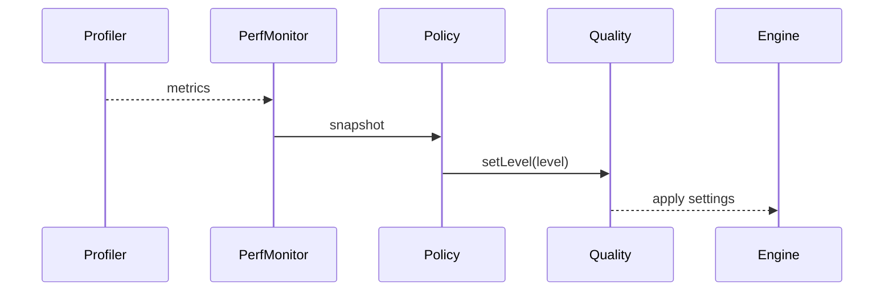

# R3F Performance Monitoring & Dynamic Quality PRD

## Overview

### Context & Goals

- Monitor runtime FPS, frame time, and hotspots to guide dynamic quality.
- Automatically adjust quality (shadows, post FX, DPR) to sustain target FPS.
- Provide developer and editor visibility into performance health.

### Current Pain Points

- Perf drops are reactive and ad‑hoc; no automated downshifting.
- Lacking consolidated metrics and top operation profiling.
- No consistent UI for developers or in-editor performance readouts.

## Proposed Solution

### High‑level Summary

- Centralize metrics via Profiler and a `PerformanceMonitor` service/hook.
- Implement `PerformancePolicy` that toggles quality levels based on FPS bands.
- Expose quality knobs: shadows, SSR/post, particles limit, scheduler cadence, DPR.
- Provide editor panel and optional overlay to visualize current quality and triggers.

### Architecture & Directory Structure

```
/src/core/lib/perf/ (augment)
  ├── PerformanceMonitor.ts
  ├── QualityController.ts
  └── policies/
      └── defaultPolicy.ts
/src/editor/components/perf/
  ├── PerformancePanel.tsx
  └── OverlayStats.tsx
```

## Implementation Plan

1. Phase 1: Metrics & Monitor (0.5 day)

   1. Aggregate FPS, frame time, and top operations from Profiler.
   2. Hook into engine loop to sample every frame; rolling windows.

2. Phase 2: Quality Controller (0.75 day)

   1. Define policies with thresholds (e.g., < 45 FPS → medium; < 30 → low).
   2. Apply quality presets that touch DPR, shadows, post, scheduler cadences.

3. Phase 3: UI & Editor (0.5 day)

   1. Editor panel and overlay; manual override controls.
   2. Telemetry events with reasons for quality changes.

## File and Directory Structures

```
/docs/PRDs/
  └── 4-34-r3f-performance-monitoring-and-dynamic-quality-prd.md
```

## Technical Details

```ts
export interface IPerfSnapshot {
  fps: number;
  frameTimeMs: number;
  topOperations: { id: string; totalMs: number }[];
}

export type QualityLevel = 'low' | 'medium' | 'high';

export interface IQualityPolicy {
  chooseLevel(snapshot: IPerfSnapshot): QualityLevel;
}

export interface IQualityControllerApi {
  setLevel(level: QualityLevel): void;
  getLevel(): QualityLevel;
}
```

### Quality Knobs

```ts
type QualitySettings = {
  dpr: number; // device pixel ratio clamp
  shadows: boolean;
  postProcessing: boolean;
  scheduler: { aiEveryNFrames: number; fxHz: number };
  particlesMax: number;
};
```

## Usage Examples

```ts
const snapshot = perfMonitor.getSnapshot();
const level = policy.chooseLevel(snapshot);
quality.setLevel(level);
```

## Testing Strategy

- Unit: policy thresholds, hysteresis between quality levels, settings application.
- Integration: sustained FPS after downshift; overlay reflects changes.

## Edge Cases

| Edge Case     | Remediation                        |
| ------------- | ---------------------------------- |
| Oscillation   | Add hysteresis; minimum dwell time |
| User override | Lock level until manual release    |
| DPR too low   | Clamp to readability minimum       |

## Sequence Diagram



## Risks & Mitigations

| Risk                     | Mitigation                            |
| ------------------------ | ------------------------------------- |
| Visual popping on change | Smooth transitions; fade; debounce    |
| Mis-detected hotspots    | Combine FPS with top ops + heuristics |

## Timeline

- Total: ~1.75 days (Metrics 0.5, Controller 0.75, UI 0.5)

## Acceptance Criteria

- Quality auto-adjust maintains target FPS bands on mobile.
- Overlay shows current level and change reasons.
- Developers can override and lock quality level.

## Conclusion

Dynamic quality closes the loop between observed performance and rendering load in R3F.

## Assumptions & Dependencies

- Profiler available; access to Canvas DPR and renderer settings; scheduler integration.
