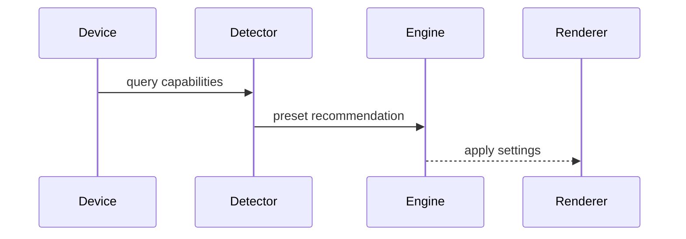

# R3F Mobile Optimization PRD

## Overview

### Context & Goals

- Optimize rendering and assets for mid/low-tier mobile GPUs.
- Detect device capabilities and apply conservative defaults.
- Minimize battery drain while preserving core visuals and UX.

### Current Pain Points

- Desktop defaults cause overdraw and excessive GPU work on mobile.
- No standardized device capability detection or tailored settings.
- Heavy post-processing and shadows degrade frame stability.

## Proposed Solution

### High‑level Summary

- Device profiling: DPR clamp, feature flags (shadows, MSAA), texture size caps.
- Mobile presets influencing renderer, post-processing, and scheduler.
- Asset pipeline alignment: KTX2, DRACO, reduced LODs for mobile profiles.

### Architecture & Directory Structure

```
/src/core/lib/mobile/
  ├── detectCapabilities.ts
  └── presets.ts
/src/core/rendering.ts (augment)
```

## Implementation Plan

1. Phase 1: Capability Detection (0.5 day)

   1. Detect DPR, GPU tier, WebGL2 presence, shader precision.
   2. Produce `MobileCapabilities` object with safe defaults.

2. Phase 2: Presets & Application (0.5 day)

   1. Define `mobileLow`, `mobileMid` presets.
   2. Apply to renderer (shadows off, low DPR, FX disabled) and scheduler.

3. Phase 3: Asset & Editor Hooks (0.5 day)

   1. Prefer KTX2 textures and mobile LOD variants.
   2. Editor badge indicating mobile constraints and overrides.

## File and Directory Structures

```
/docs/PRDs/
  └── 4-35-r3f-mobile-optimization-prd.md
```

## Technical Details

```ts
export interface IMobileCapabilities {
  dpr: number;
  webgl2: boolean;
  shaderPrecision: 'highp' | 'mediump' | 'lowp';
  supportShadows: boolean;
}

export interface IMobilePreset {
  name: string;
  dprClamp: number;
  shadows: boolean;
  postProcessing: boolean;
}
```

## Usage Examples

```ts
const caps = detectCapabilities();
const preset = chooseMobilePreset(caps);
applyPreset(preset);
```

## Testing Strategy

- Unit: capability detection fallbacks; preset selection.
- Integration: FPS improvement on mobile devices; visual sanity checks.

## Edge Cases

| Edge Case        | Remediation                        |
| ---------------- | ---------------------------------- |
| High DPI tablets | Clamp DPR; warn on extreme values  |
| Missing WebGL2   | Disable features; graceful degrade |

## Sequence Diagram



## Risks & Mitigations

| Risk           | Mitigation                    |
| -------------- | ----------------------------- |
| Over-constrain | Allow per-feature overrides   |
| Fragmentation  | Keep presets simple (2 tiers) |

## Timeline

- Total: ~1.5 days (Detection 0.5, Presets 0.5, Asset/Editor 0.5)

## Acceptance Criteria

- Engine detects device capabilities and applies mobile preset.
- Mobile preset improves FPS without major visual regressions.
- Developers can override specific features per scene.

## Conclusion

Targeted mobile defaults ensure consistent performance and better battery life.

## Assumptions & Dependencies

- Access to renderer controls; KTX2/DRACO in pipeline; scheduler integration.
