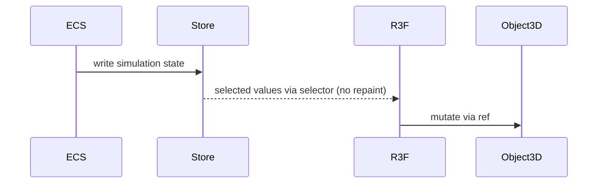

# R3F State Architecture PRD

## Overview

### Context & Goals

- Minimize React re-renders by isolating animation/game state from UI state.
- Adopt store-first (Zustand/Jotai) patterns; avoid `useState` in per-frame paths.
- Ensure predictable data flow from ECS/stores to R3F objects.

### Current Pain Points

- Components overuse React state; heavy updates trigger reconciliations.
- Global context changes cause broad re-renders.
- Lack of clear boundaries between UI state and simulation state.

## Proposed Solution

### High‑level Summary

- Define state tiers: Simulation (ECS/stores), Rendering (refs), UI (React).
- Provide selector-based hooks for zero‑repaint subscriptions.
- Event-driven updates for R3F objects via refs/mutators instead of state.

### Architecture & Directory Structure

```
/src/core/state/
  ├── simulationStore.ts
  ├── renderingRefs.ts
  └── uiStore.ts
/src/core/hooks/
  └── useZeroRepaintSelector.ts
```

## Implementation Plan

1. Phase 1: Stores & Selectors (0.75 day)

   1. Establish simulation/ui stores with namespaces.

   2. Implement `useZeroRepaintSelector` using equality fn and shallow compare.

2. Phase 2: R3F Mutators (0.5 day)

   1. Provide utilities to update object3D/material via refs without React state.
   2. Replace hot paths with mutators in systems.

3. Phase 3: Guidelines & Migration (0.5 day)

   1. Document patterns; examples for animating without React state.
   2. Migrate a couple of hotspots as exemplars.

## File and Directory Structures

```
/docs/PRDs/
  └── 4-36-r3f-state-architecture-prd.md
```

## Technical Details

```ts
export interface ISimulationState {
  /* ecs-driven data */
}
export interface IUIState {
  /* ui-related flags */
}

export function useZeroRepaintSelector<T>(
  selector: (s: unknown) => T,
  equals?: (a: T, b: T) => boolean,
): T;
```

## Usage Examples

```ts
const health = useZeroRepaintSelector((s: ISimulationState) => s.player.health);
// R3F mutator pattern
meshRef.current!.position.set(x, y, z);
```

## Testing Strategy

- Unit: selector stability, shallow compare; mutator correctness.
- Integration: reduced commit counts in React DevTools profiler.

## Edge Cases

| Edge Case            | Remediation                        |
| -------------------- | ---------------------------------- |
| Large nested objects | Normalize or select primitives     |
| Frequent UI updates  | Split stores; debounce and memoize |

## Sequence Diagram



## Risks & Mitigations

| Risk                  | Mitigation                            |
| --------------------- | ------------------------------------- |
| Over-abstracted hooks | Keep APIs minimal; align to hot paths |

## Timeline

- Total: ~1.75 days (Stores 0.75, Mutators 0.5, Migration 0.5)

## Acceptance Criteria

- Hot components avoid React state for per-frame updates.
- Selectors prevent unnecessary re-renders in profiling.
- Clear docs and examples for contributors.

## Conclusion

Store-first, ref-based updates align R3F with high-performance React patterns.

## Assumptions & Dependencies

- Zustand/Jotai available; ECS integration points; editor unaffected.
