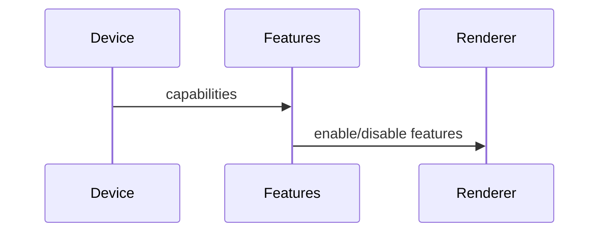

# R3F Advanced Rendering Patterns PRD

## Overview

### Context & Goals

- Support advanced techniques (MRT, post-processing, custom shaders, RTT) with mobile-aware toggles.
- Keep APIs declarative and composable within R3F scene graph.
- Provide safe fallbacks for low-end devices.

### Current Pain Points

- Ad-hoc shader setup and post chains; hard to disable on mobile.
- Limited reuse and configuration visibility.
- No unified capability/fallback layer.

## Proposed Solution

### High‑level Summary

- Introduce `RenderingFeatures` layer: flags for MRT, post, SSR, AO.
- Provide `<ShaderMaterialEx>` wrapper with typed uniforms and hot-reload safe usage.
- Create `RenderTargets` utilities for RTT (minimap/mirrors) with perf guards.

### Architecture & Directory Structure

```
/src/core/lib/rendering/
  ├── features.ts
  ├── shader/ShaderMaterialEx.ts
  └── rtt/
      ├── targets.ts
      └── compositors.ts
```

## Implementation Plan

1. Phase 1: Feature Flags (0.5 day)

   1. Detect capabilities; expose `RenderingFeatures` store.

2. Phase 2: Shader & Post (0.75 day)

   1. `ShaderMaterialEx` with schema-validated uniforms; safe updates.
   2. Optional post pipeline with toggles.

3. Phase 3: RTT Utilities (0.5 day)

   1. Render target helpers; low-res options for mobile; resource cleanup.

## File and Directory Structures

```
/docs/PRDs/
  └── 4-37-r3f-advanced-rendering-patterns-prd.md
```

## Technical Details

```ts
export interface IRenderingFeatures {
  mrt: boolean;
  post: boolean;
  reflections: boolean;
}

export interface IUniformSchema {
  [name: string]: 'float' | 'vec2' | 'vec3' | 'mat4';
}
```

## Usage Examples

```ts
if (features.post) enableBloom();
const material = new ShaderMaterialEx(schema, uniforms);
```

## Testing Strategy

- Unit: feature toggles; uniform schema enforcement.
- Integration: fallback behavior on low-end devices.

## Edge Cases

| Edge Case           | Remediation                         |
| ------------------- | ----------------------------------- |
| Unsupported MRT     | Disable and pick single target path |
| Memory pressure RTT | Lower resolution; release targets   |

## Sequence Diagram



## Risks & Mitigations

| Risk            | Mitigation                          |
| --------------- | ----------------------------------- |
| Shader mismatch | Typed uniforms; compile-time checks |

## Timeline

- Total: ~1.75 days (Flags 0.5, Shader/Post 0.75, RTT 0.5)

## Acceptance Criteria

- Features toggle cleanly with stable fallbacks on mobile.
- Shader wrapper enforces uniform schemas and safe updates.
- RTT utilities manage memory and clean up resources.

## Conclusion

Advanced features become safe and composable with clear capability gates.

## Assumptions & Dependencies

- Renderer access; capability detection; optional post library.
