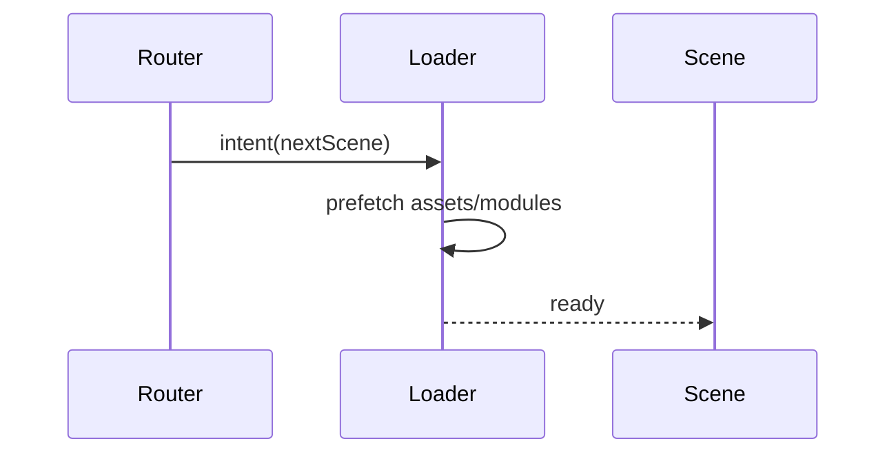

# R3F Lazy Loading & Code Splitting PRD

## Overview

### Context & Goals

- Reduce initial bundle size and time-to-interactive by deferring heavy assets and features.
- Load scenes, systems, and editor panels on demand using React `lazy`/`Suspense`.
- Preload/stream assets as users navigate.

### Current Pain Points

- Eagerly loading all scenes/assets harms startup time.
- No standardized preload strategy or route-based code splitting.

## Proposed Solution

### High‑level Summary

- Define loading boundaries for scenes, systems, and heavy UI panels.
- Use dynamic imports and asset prefetching tied to navigation intent.
- Provide priority-based asset queues and background warm-up.

### Architecture & Directory Structure

```
/src/core/lib/loading/
  ├── loader.ts
  ├── prefetch.ts
  └── boundaries.tsx
```

## Implementation Plan

1. Phase 1: Boundaries & Dynamic Imports (0.5 day)

   1. Create Suspense boundaries for scenes/panels.
   2. Convert heavy modules to dynamic imports.

2. Phase 2: Prefetch & Queues (0.5 day)

   1. Implement prioritized asset prefetching and cancellation.
   2. Background warm-up for likely next scenes.

3. Phase 3: Telemetry & Hints (0.5 day)

   1. Emit load timings; surface hints for missed opportunities.

## File and Directory Structures

```
/docs/PRDs/
  └── 4-38-r3f-lazy-loading-and-code-splitting-prd.md
```

## Technical Details

```ts
export interface IPreloadRequest {
  id: string;
  priority: number;
}
export interface ILoaderApi {
  prefetch(req: IPreloadRequest[]): Promise<void>;
  cancel(id: string): void;
}
```

## Usage Examples

```tsx
const Scene = React.lazy(() => import('@/game/scenes/Forest'));
<Suspense fallback={<Spinner />}>
  <Scene />
</Suspense>;
```

## Testing Strategy

- Unit: queue ordering; cancellation; fallback renders.
- Integration: measure TTI; cache hits on navigation.

## Edge Cases

| Edge Case     | Remediation                         |
| ------------- | ----------------------------------- |
| Slow networks | Show progressive feedback; timeouts |
| Preload waste | Cancel on route change              |

## Sequence Diagram



## Risks & Mitigations

| Risk             | Mitigation             |
| ---------------- | ---------------------- |
| Code split churn | Keep stable boundaries |

## Timeline

- Total: ~1.5 days (Boundaries 0.5, Prefetch 0.5, Telemetry 0.5)

## Acceptance Criteria

- Initial bundle shrinks; TTI improves measurably.
- Scenes/systems load on demand with user feedback.
- Preloading improves perceived navigation smoothness.

## Conclusion

On-demand loading aligns runtime cost with user intent and device capacity.

## Assumptions & Dependencies

- Routing/navigation signals available; asset manifest/loader present.
