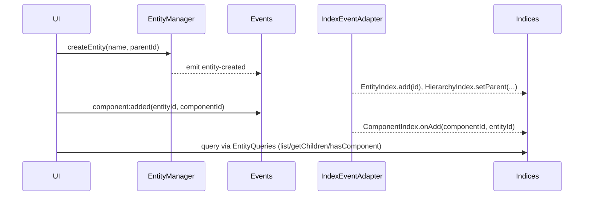

# 4-39 ECS Indexing & Entity Traversal Performance PRD

## Overview

- **Context & Goals**

  - Adopt truly indexed, event-driven entity/component lookups to eliminate quadratic scans that tank FPS as entity counts grow.
  - Consolidate query access through `EntityQueries` backed by `EntityIndex`, `HierarchyIndex`, and `ComponentIndex`.
  - Remove fixed-range ID scans and ad-hoc cache rebuilds; prefer incremental updates on the ECS event stream.
  - Provide clear APIs for UI/editor hooks to subscribe to incremental updates instead of rebuilding lists per render.

- **Current Pain Points**
  - `EntityManager` rebuilds lists by clearing caches and falls back to scanning 0..10000 EIDs; children arrays rebuilt via O(N²) filtering.
  - `ComponentRegistry` answers hot-path queries by iterating all BitECS components or scanning the first 1000 EIDs per call.
  - `useSceneState` computes “all entities” by scanning per-component and deduplicating, causing O(componentTypes × entities²) on updates.
  - Cache lifetimes are short and revalidation is frequent; indices already exist but are underused for hot paths.

## Proposed Solution

- **High‑level Summary**

  - Wire `ComponentIndex` to incremental updates by listening to `component:added`/`component:removed` events via the central event bus.
  - Refactor `EntityManager` to rely exclusively on indices for listing entities and hierarchy traversal; delete brute-force fallbacks.
  - Replace UI/editor scans with indexed queries from `EntityQueries` and event-driven updates.
  - If indices appear empty but the world contains entities, trigger a targeted `rebuildIndices()` instead of scanning.
  - Keep caches incremental and extend lifetimes where safe; prefer index-backed sets to recomputation.

- **Architecture & Directory Structure**

```
src/
  core/
    lib/
      ecs/
        EntityManager.ts                 # Refactor: remove brute-force scans; index-driven
        ComponentRegistry.ts             # No scans on hot paths; deprecate legacy scan helpers
        adapters/
          IndexEventAdapter.ts           # New: subscribe to component events; maintain ComponentIndex incrementally
        indexers/
          EntityIndex.ts
          HierarchyIndex.ts
          ComponentIndex.ts
        queries/
          entityQueries.ts               # UI entrypoint for indexed queries
      events.ts                          # Central bus already provides on/emit for component events
    hooks/
      useSceneState.ts                   # Refactor: use EntityQueries instead of component scans
```

## Implementation Plan

- Phase 1: ComponentIndex wiring (0.5 day)

  1. Subscribe `IndexEventAdapter` to `component:added` and `component:removed` using `on()` from `events.ts`.
  2. On add/remove, call `ComponentIndex.onAdd/onRemove`. Ensure detach unsubscribes.
  3. Keep `removeEntity()` integration to evict from all component sets on entity deletion.

- Phase 2: Remove brute-force scans in `EntityManager` (0.5 day)

  1. Replace `getAllEntitiesInternal()` to use `EntityQueries.listAllEntities()` for IDs and `HierarchyIndex.getChildren()` for children.
  2. Delete 0..10000 scans and children filtering loops; emit a single targeted `rebuildIndices()` when indices are suspected stale.
  3. Keep `entityCache` incremental via existing `entity-created|updated|deleted` events; stop clearing cache per call.

- Phase 3: Update UI/editor hooks (0.5 day)

  1. Refactor `useSceneState` to use `EntityQueries.getInstance().listAllEntities()`; subscribe to component/entity events to update state.
  2. Remove per-component dedupe scans; prefer `componentIndex.getComponentTypes()` and indexed list APIs.
  3. Audit other hot hooks/utilities (viewport, camera utils) to use `EntityQueries` instead of registry scans.

- Phase 4: Validation & Performance (0.5 day)
  1. Extend tests for index consistency during add/remove, parent changes, and full clears.
  2. Add perf tests with 10k entities to verify no O(N²) behavior and stable frame costs.
  3. Re-run profiling with high-entity scenes and document results.

## File and Directory Structures

```markdown
/home/jonit/projects/vibe-coder-3d/
├── src/core/lib/ecs/EntityManager.ts
├── src/core/lib/ecs/ComponentRegistry.ts
├── src/core/lib/ecs/adapters/IndexEventAdapter.ts
├── src/core/lib/ecs/indexers/EntityIndex.ts
├── src/core/lib/ecs/indexers/HierarchyIndex.ts
├── src/core/lib/ecs/indexers/ComponentIndex.ts
├── src/core/lib/ecs/queries/entityQueries.ts
├── src/core/lib/events.ts
└── src/core/hooks/useSceneState.ts
```

## Technical Details

- IndexEventAdapter: component event wiring

```typescript
// IndexEventAdapter.ts (additions)
import { on, off } from '../../events';

export class IndexEventAdapter {
  private componentAddedUnsub?: () => void;
  private componentRemovedUnsub?: () => void;

  attach(): void {
    // ...existing entity event subscriptions...
    this.componentAddedUnsub = on('component:added', ({ entityId, componentId }) => {
      this.components.onAdd(componentId, entityId);
    });

    this.componentRemovedUnsub = on('component:removed', ({ entityId, componentId }) => {
      this.components.onRemove(componentId, entityId);
    });
  }

  detach(): void {
    // ...existing detach logic...
    this.componentAddedUnsub?.();
    this.componentRemovedUnsub?.();
    this.componentAddedUnsub = undefined;
    this.componentRemovedUnsub = undefined;
  }
}
```

- EntityManager: index-first traversal and rebuild-on-suspect

```typescript
// EntityManager.ts (sketch)
import { EntityQueries } from './queries/entityQueries';

private getAllEntitiesInternal(): IEntity[] {
  const ids = this.queries?.listAllEntities() ?? [];
  if (ids.length === 0) {
    // If the world likely has entities (cheap probe), trigger rebuild instead of scanning
    if (this.hasAnyEntityCheapProbe()) {
      this.queries?.rebuildIndices();
    }
  }

  const entities: IEntity[] = [];
  for (const eid of this.queries?.listAllEntities() ?? []) {
    const entity = this.buildEntityFromEid(eid);
    if (entity) {
      entities.push(entity);
      this.entityCache.set(eid, entity);
    }
  }

  // Children via HierarchyIndex
  for (const e of entities) {
    try {
      e.children = this.queries?.getChildren(e.id) ?? [];
    } catch {
      e.children = [];
    }
  }
  return entities;
}
```

- useSceneState: index-backed queries

```typescript
// useSceneState.ts (sketch)
import { EntityQueries } from '../lib/ecs/queries/entityQueries';
import { on } from '../lib/events';

export const useSceneState = () => {
  const queries = EntityQueries.getInstance();

  const updateEntitiesList = useCallback(() => {
    setEntities(queries.listAllEntities().sort((a, b) => a - b));
  }, [queries]);

  useEvent('component:added', updateEntitiesList);
  useEvent('component:removed', updateEntitiesList);
  // optionally listen to entity events via EntityManager bus if exposed

  useEffect(() => {
    updateEntitiesList();
  }, [updateEntitiesList]);

  // ...rest unchanged...
};
```

- API Notes
  - Maintain named exports only; no barrel files. Prefix interfaces with `I`. Prefer Zod for input/config validation.
  - `ComponentRegistry.getEntitiesWithComponent` remains for legacy compatibility but should not be used by hot-path UI.
  - Consider adding `EntityQueries.subscribe(handler)` in the future to coalesce updates via the batched emitter.

## Usage Examples

- List all entities for editor panels

```typescript
const queries = EntityQueries.getInstance();
const entityIds = queries.listAllEntities();
```

- Query entities with specific components efficiently

```typescript
const cameraEntities = queries.listEntitiesWithComponent('Camera');
const renderables = queries.listEntitiesWithAnyComponent(['MeshRenderer', 'Light']);
```

- Traverse hierarchy

```typescript
const roots = queries.getRootEntities();
const children = queries.getChildren(someEntityId);
```

## Testing Strategy

- **Unit Tests**

  - `ComponentIndex` reacts to add/remove events; `removeEntity` evicts across all component types.
  - `HierarchyIndex` maintains parent/child integrity across reparenting and deletions.
  - `EntityIndex` stable iteration and membership.

- **Integration Tests**
  - `IndexEventAdapter` attaches/detaches cleanly; indices reflect `entity-created|deleted|updated` and `component:added|removed`.
  - `EntityManager.getAllEntities()` returns consistent children via `HierarchyIndex` without scans.
  - `useSceneState` updates entity list on component/entity events without scanning.

## Edge Cases

| Edge Case                             | Remediation                                                                 |
| ------------------------------------- | --------------------------------------------------------------------------- |
| Indices empty after world reset       | Trigger `rebuildIndices()` once; avoid 0..N scans.                          |
| Event ordering/race during bulk loads | Buffer via batched emitter; final `rebuildIndices()` at end of load.        |
| Circular parenting attempts           | Guard in `EntityManager.wouldCreateCircularDependency`; validate via tests. |
| Scenes >10k entities                  | Index iteration only; no fixed-range loops; verify perf tests.              |
| Stale cache due to missed event       | Periodic consistency check and conditional rebuild.                         |

## Sequence Diagram



## Risks & Mitigations

| Risk                                                  | Mitigation                                                                                    |
| ----------------------------------------------------- | --------------------------------------------------------------------------------------------- |
| Missed component events (listener not attached early) | Attach adapter during `EntityQueries.initialize()`; allow single `rebuildIndices()` fallback. |
| Memory growth in indices                              | Use `removeEntity` and `onRemove` for cleanup; clear on `entities-cleared`.                   |
| UI still calls legacy scan APIs                       | Lint rule and codeowners review; update docs and examples.                                    |
| Debug logs affecting perf                             | Gate verbose logs by env; remove deep logs in hot paths.                                      |

## Timeline

- Total: ~2.0 days
  - Phase 1: 0.5 day
  - Phase 2: 0.5 day
  - Phase 3: 0.5 day
  - Phase 4: 0.5 day

## Acceptance Criteria

- No fixed-range EID scans remain in hot paths (`EntityManager`, `ComponentRegistry` hot methods, editor hooks).
- `IndexEventAdapter` maintains `ComponentIndex` incrementally via event bus.
- `EntityManager.getAllEntities()` and hierarchy APIs rely on indices with no O(N²) filtering.
- `useSceneState` and similar hooks use `EntityQueries` for entity lists; no component-type loops and dedup arrays.
- Perf with 10k entities shows stable frame loop; per-frame work does not scale quadratically.
- Consistency checks pass across add/remove/reparent/clear flows.

## Conclusion

This change centralizes entity and component traversal on maintained indices with incremental, event-driven updates. It removes quadratic scans and cache churn from hot paths, stabilizing frame time as scenes scale, and provides clear, testable query APIs for UI/editor code.

## Assumptions & Dependencies

- Tech stack: TypeScript, BitECS, Zustand, Zod; named exports; no barrel files; interfaces prefixed with `I`.
- Central event bus `events.ts` is the source of truth for component lifecycle events.
- `EntityQueries` initialization occurs during app startup; adapter attaches before bulk scene loads where possible.
