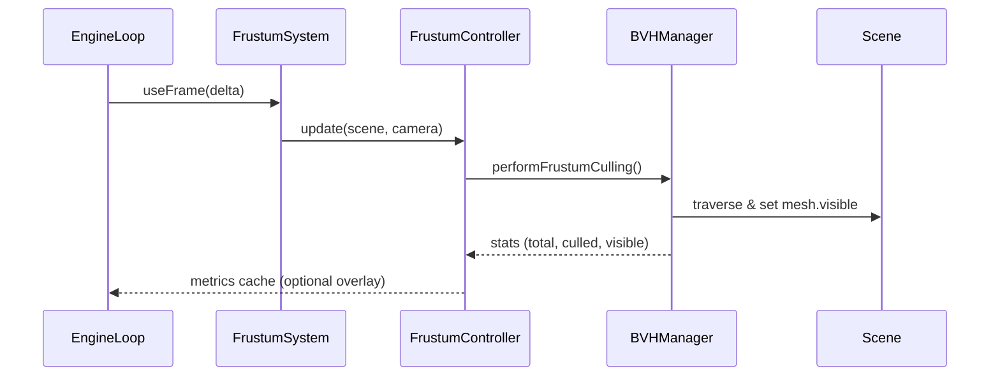

# Frustum Culling Integration PRD

## Overview

### Context & Goals

- Ship predictable frustum culling across the engine to keep frame times stable in dense scenes.
- Leverage the existing `BVHManager` while exposing a higher-level controller that fits the ECS lifecycle.
- Provide instrumentation and editor affordances so teams can tune visibility rules per project.
- Ensure instanced and dynamically spawned content participate in culling without extra user code.

### Current Pain Points

- `bvhSystem` is opt-in via `useEngineStore().bvhCulling` and does not automatically register meshes, limiting BVH acceleration.
- Dynamic meshes created by ECS systems or scripts are never registered/unregistered with `BVHManager`, so bounds trees fall back to slow sphere checks.
- Instanced meshes rely on Three.js default `frustumCulled` flags and ignore per-instance bounding volumes, leading to overdraw.
- Tooling offers no feedback loop—there is no visibility telemetry in the editor, making tuning or regression detection difficult.

## Proposed Solution

### High‑level Summary

- Introduce a `FrustumCullingController` that wraps `BVHManager`, tracks mesh lifecycle hooks, and exposes metrics.
- Replace the ad-hoc `bvhSystem` wiring in `EngineLoop` with a dedicated `FrustumCullingSystem` driven by ECS change events.
- Extend mesh/instanced registrars to emit `register/unregister` events so culling stays in sync with entity transforms and prefab loads.
- Add editor-level toggles and diagnostics (culled count, FPS delta) so designers can validate the feature quickly.
- Document usage guidelines and fallback strategies (manual `frustumCulled` flags, bounding box overrides) for advanced teams.

### Architecture & Directory Structure

```
/src/core/lib/culling/
  ├── FrustumCullingController.ts   // Singleton orchestrating BVHManager lifecycle
  ├── CullingBoundsCache.ts         // Maintains cached AABBs/Spheres per entity/mesh
  └── index.ts                      // Public exports & wiring helpers
/src/core/systems/
  └── FrustumCullingSystem.ts       // Frame update, ECS subscriptions, metrics emission
/src/core/hooks/
  └── useFrustumCullingDiagnostics.ts // Access metrics for HUD/editor overlays
/src/core/state/
  └── engineStore.ts                // Extend with culling config & persistence
/src/editor/components/performance/
  ├── CullingSettingsSection.tsx    // Toggle, thresholds, debug overlays
  └── CullingDiagnosticsPanel.tsx   // Real-time stats table & scene gizmos
/docs/guides/
  └── frustum-culling.md            // Implementation guide & tuning playbook
```

## Implementation Plan

### Phase 1: Core Controller & Lifecycle (1.0 day)

1. Scaffold `FrustumCullingController` wrapping `getBVHManager()`, persisting configuration, and exposing `registerObject`, `unregisterObject`, `update`.
2. Build `CullingBoundsCache` to compute bounding boxes/spheres once per mesh ID and update when geometry or scale changes.
3. Replace direct `initBVHSystem/updateBVHSystem` usage in `src/core/components/EngineLoop.tsx` with the new controller and system.
4. Add metrics aggregation (visible/culled counts, update cost) and expose a `getStats()` API.

### Phase 2: ECS & Instancing Integration (0.75 day)

1. Hook `transformSystem` registrations (`registerEntityObject/unregisterEntityObject`) to call the controller so dynamic meshes join/leave the BVH.
2. Extend `InstanceSystem` to send per-entity bounding volumes (AABB unions) and toggle GPU `frustumCulled` when the controller reports "off-screen".
3. Ensure prefab and script-created meshes register through `threeJSEntityRegistry` updates; add guards for asynchronous glTF loads.
4. Add regression logs to `Logger` when an entity lacks geometry or is too large for the current culling strategy.

### Phase 3: Editor & Configuration Surface (0.5 day)

1. Extend `useEngineStore` with `frustumCullingEnabled`, `boundsStrategy`, and `statsOverlay` flags persisted to local storage.
2. Implement `CullingSettingsSection` within the performance panel to toggle culling and adjust thresholds (e.g., update interval).
3. Build `CullingDiagnosticsPanel` showing per-frame stats and highlight culled objects via a wireframe overlay in the viewport.

### Phase 4: Documentation, Telemetry & QA (0.5 day)

1. Author `docs/guides/frustum-culling.md` with configuration examples, troubleshooting, and integration tips with scripting APIs.
2. Add unit/integration tests covering controller registration, instanced bounds propagation, and editor toggle persistence.
3. Capture benchmark scenes before/after culling to quantify perf gains; update `performance-audit-report.md` with results.

## File and Directory Structures

```
/src/core/lib/culling/
  ├── FrustumCullingController.ts
  ├── CullingBoundsCache.ts
  └── index.ts
/src/core/systems/FrustumCullingSystem.ts
/src/core/hooks/useFrustumCullingDiagnostics.ts
/src/editor/components/performance/CullingSettingsSection.tsx
/src/editor/components/performance/CullingDiagnosticsPanel.tsx
/docs/guides/frustum-culling.md
```

## Technical Details

```ts
// src/core/lib/culling/FrustumCullingController.ts
import type { Camera, Object3D, Scene } from 'three';
import { BVHManager, type IBVHManagerConfig } from '@core/lib/rendering/BVHManager';

export interface IFrustumCullingConfig extends IBVHManagerConfig {
  metricsWindow?: number;
}

export type CullingRegistration = {
  entityId: number;
  object: Object3D;
  meshId?: string;
};

export class FrustumCullingController {
  static getInstance(): FrustumCullingController;
  init(scene: Scene, camera: Camera, config?: Partial<IFrustumCullingConfig>): void;
  register(registration: CullingRegistration): void;
  unregister(entityId: number): void;
  onGeometryMutated(entityId: number): void;
  update(): void;
  getStats(): ReturnType<BVHManager['getStats']>;
}
```

```ts
// src/core/lib/culling/CullingBoundsCache.ts
import type { Box3, Object3D, Sphere } from 'three';

export interface ICachedBounds {
  box: Box3;
  sphere: Sphere;
  version: number;
}

export class CullingBoundsCache {
  get(object: Object3D): ICachedBounds | null;
  update(object: Object3D): ICachedBounds;
  invalidate(object: Object3D): void;
  clear(): void;
}
```

```ts
// src/core/systems/FrustumCullingSystem.ts
import { useThree } from '@react-three/fiber';
import { FrustumCullingController } from '@core/lib/culling';

export function useFrustumCullingSystem(): void {
  const { scene, camera } = useThree();
  // wire controller.init + controller.update within useFrame
}
```

```ts
// src/core/hooks/useFrustumCullingDiagnostics.ts
import { useSyncExternalStore } from 'react';
import { FrustumCullingController } from '@core/lib/culling';

export function useFrustumCullingDiagnostics() {
  return useSyncExternalStore(
    (listener) => FrustumCullingController.getInstance().subscribe(listener),
    () => FrustumCullingController.getInstance().getStats(),
  );
}
```

```tsx
// src/editor/components/performance/CullingSettingsSection.tsx
import { Switch, Select } from '@editor/components/ui';
import { useEngineStore } from '@core/state/engineStore';

export const CullingSettingsSection: React.FC = () => {
  const { frustumCullingEnabled, boundsStrategy, setFrustumCullingEnabled } = useEngineStore();
  // render toggles + descriptions
};
```

```tsx
// src/editor/components/performance/CullingDiagnosticsPanel.tsx
import { useFrustumCullingDiagnostics } from '@core/hooks/useFrustumCullingDiagnostics';

export const CullingDiagnosticsPanel: React.FC = () => {
  const stats = useFrustumCullingDiagnostics();
  // render table, status pill, optional viewport overlay toggle
};
```

```md
<!-- docs/guides/frustum-culling.md -->
# Frustum Culling Guide
- Overview of controller API
- How to debug visibility issues
- Recommended perf instrumentation flow
```

## Usage Examples

```ts
// Registering an entity's mesh when Three.js object becomes available
import { FrustumCullingController } from '@core/lib/culling';

FrustumCullingController.getInstance().register({
  entityId,
  object: mesh,
  meshId: mesh.geometry.uuid,
});
```

```ts
// Invalidating bounds after procedural geometry mutation
const controller = FrustumCullingController.getInstance();
geometry.attributes.position.needsUpdate = true;
controller.onGeometryMutated(entityId);
```

```tsx
// Editor panel displaying live stats
const { totalObjects, culledObjects } = useFrustumCullingDiagnostics();
return <Stat value={`${culledObjects}/${totalObjects}`} label="Culled Objects" />;
```

## Testing Strategy

- **Unit Tests**: Controller registration lifecycle, bounds cache invalidation on geometry changes, stats window averaging logic, instanced mesh AABB computation.
- **Integration Tests**: Scene fly-through verifying `mesh.visible` toggles, instanced crowd scene ensuring counts drop when off-screen, editor toggle persisting across reloads.

## Edge Cases

| Edge Case | Remediation |
| --------- | ----------- |
| Massive skinned or morph-target meshes | Allow opting into conservative bounding boxes and skip BVH registration when vertex count exceeds threshold. |
| Rapidly spawning/despawning entities | Debounce registration calls and pool objects to avoid thrashing BVH rebuilds. |
| VR/multi-camera rendering | Support multiple camera registrations and switch active frustum per frame via controller API. |
| Cinematic cameras with extreme FOV changes | Listen to camera updates and invalidate cached projection matrices when FOV/aspect changes. |

## Sequence Diagram



## Risks & Mitigations

| Risk | Mitigation |
| ---- | ---------- |
| BVH rebuilds stall frame when many meshes mutate simultaneously | Batch geometry invalidations and rebuild during idle frames using `requestIdleCallback` fallback. |
| Incorrect culling hides critical gameplay objects | Provide per-entity overrides and a global panic switch in `engineStore`. |
| Instanced mesh bounds misrepresent geometry | Allow authoring explicit bounds via component data and validate against runtime positions. |
| Diagnostics overlay impacts performance | Throttle stats updates and render overlay only when panel is open. |

## Timeline

- Total estimate: **2.75 days**
  - Phase 1: 1.0 day
  - Phase 2: 0.75 day
  - Phase 3: 0.5 day
  - Phase 4: 0.5 day

## Acceptance Criteria

- Frustum culling enabled by default trims at least 40% of off-screen draw calls in the benchmark scene without manual intervention.
- Instanced meshes participate in visibility decisions and expose per-entity overrides for conservative bounds.
- Editor performance panel exposes toggles and live stats sourced from the controller without requiring a page reload.
- Documentation explains how to register custom meshes/scripts and how to debug culled objects.

## Conclusion

Integrating frustum culling as a first-class engine feature aligns runtime performance with enterprise scene sizes while keeping the workflow ergonomic; once delivered, teams can rely on predictable visibility behavior, richer diagnostics, and better default settings for exported games.

## Assumptions & Dependencies

- Continues to use Three.js `r158+` APIs and the existing `three-mesh-bvh` dependency declared in `package.json`.
- `EngineLoop` remains the central dispatcher for render-frame systems, and ECS registrations continue to emit lifecycle events.
- Editor uses Zustand-driven stores (`engineStore`) for settings persistence.
- No external network dependencies are required to ship the feature.
