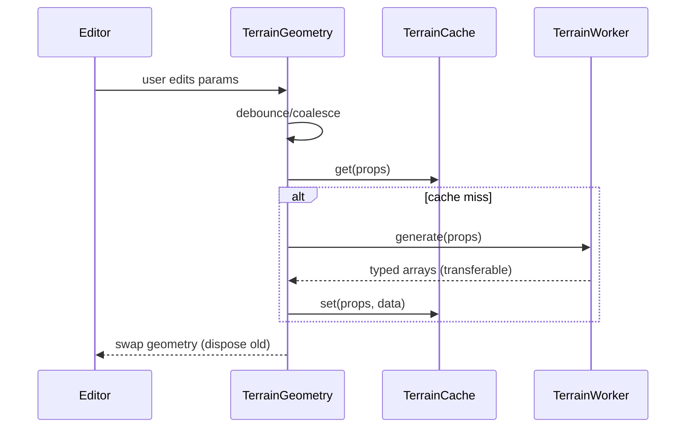

# Terrain Rendering Performance PRD (Core Fixes Only)

## 1. Overview

- **Context & Goals**

  - Remove main-thread stalls during terrain edits and runtime.
  - Minimize allocations and leaks when regenerating terrain.
  - Ensure predictable, smooth UX with simple guardrails and instrumentation.
  - Establish measurable baselines and performance gates.

- **Current Pain Points**
  - Synchronous rebuilds can hitch the frame during parameter changes.
  - Frequent rapid edits can trigger back-to-back generations.
  - Geometry disposal and cache controls need hardening to prevent growth.
  - No formal baselines/thresholds enforced in CI.

## 2. Proposed Solution

- **High‑level Summary**

  - Keep terrain generation off the main thread via the existing Web Worker; validate transferables.
  - Harden and tune `TerrainCache` (LRU eviction, size limits, preload hot presets).
  - Debounce and coalesce parameter changes before triggering generation.
  - Maintain low‑res fallback geometry while generating.
  - Enforce safe upper bounds for `segments` and clamp inputs in the inspector.
  - Instrument with `terrainProfiler` and export a simple editor overlay.

- **Architecture & Directory Structure**

```text
src/
├── core/
│   └── lib/
│       └── terrain/
│           ├── TerrainWorker.ts        # Worker generation (validate transferables)
│           ├── TerrainCache.ts         # LRU bounds + stats
│           ├── TerrainProfiler.ts      # Metrics + dev overlay hooks
│           └── index.ts
└── editor/
    └── components/panels/ViewportPanel/components/
        └── TerrainGeometry.tsx         # Debounce + fallback + disposal
```

## 3. Implementation Plan

### Phase 1: Baselines & Instrumentation (0.5 day)

1. Record baselines for 32×32, 129×129, 257×257 (FPS, ms/frame, memory).
2. Expose profiler mini‑panel (avg FPS, gen time, vertex/tri counts).
3. Add a simple automated perf script (reproducible camera path).

### Phase 2: Worker & Cache Hardening (0.5–1 day)

1. Verify worker messages use transferables for all typed arrays (already implemented).
2. Audit memory: ensure no retained references on regeneration.
3. Tune `TerrainCache` limits; add eviction logs and hit/miss counters.

### Phase 3: Debounce & Guardrails (0.5 day)

1. Add `DEBOUNCE_MS = 50–75` around terrain regeneration in `TerrainGeometry.tsx`.
2. Coalesce edits by cancelling stale requests (request id pattern).
3. Clamp `segments` in inspector to safe bounds (e.g., ≤ 257×257).

### Phase 4: Disposal & Tests (0.5 day)

1. Ensure previous geometry is disposed before swapping.
2. Unit tests for cache hit/miss, eviction, and debounced generation.
3. Perf smoke test: no sustained memory growth after 60s idle.

## 4. Technical Details

```tsx
// Debounced generation pattern (in TerrainGeometry.tsx)
const DEBOUNCE_MS = 60;
const requestIdRef = useRef(0);

const generate = useCallback(async () => {
  const requestId = ++requestIdRef.current;
  const cached = terrainCache.get(props);
  const data = cached ?? (await terrainWorker.generateTerrain(props));
  if (!cached) terrainCache.set(props, data);
  // Ignore stale results
  if (requestId !== requestIdRef.current) return;
  setGeometryData(data);
}, [props]);

useEffect(() => {
  const t = setTimeout(generate, DEBOUNCE_MS);
  return () => clearTimeout(t);
}, [generate]);
```

```ts
// Cache tuning (in TerrainCache.ts)
terrainCache.configure({ maxCacheSize: 50 * 1024 * 1024, maxEntries: 20 });
// Log stats in dev to detect thrash
// console.debug(terrainCache.getStats())
```

```ts
// Inspector clamp (pseudo)
const clampedSegments = [
  Math.min(Math.max(segments[0], 9), 257),
  Math.min(Math.max(segments[1], 9), 257),
] as const;
```

Notes:

- Low‑res fallback geometry remains while worker runs.
- All worker arrays are posted as transferables to avoid copies.
- Geometry disposal on unmount/regeneration prevents leaks.

## 5. Usage Examples

```tsx
// Typical terrain for editor
<TerrainGeometry
  size={[100, 100]}
  segments={[129, 129]}
  heightScale={10}
  noiseEnabled
  noiseSeed={1337}
  noiseFrequency={0.2}
  noiseOctaves={4}
  noisePersistence={0.5}
  noiseLacunarity={2.0}
/>
```

## 6. Testing Strategy

- **Unit Tests**

  - Cache: hit/miss/eviction behavior across repeated runs.
  - Debounce: bursts of prop updates result in ≤ 1 generation per window.
  - Disposal: no retained geometry after regeneration.

- **Integration Tests**
  - 129×129 scene edit loop: p95 frame time ≤ 16ms; no sustained memory growth after 60s.
  - Worker failure path falls back gracefully (flat terrain) without crashes.

## 7. Edge Cases

| Edge Case                   | Remediation                              |
| --------------------------- | ---------------------------------------- |
| Rapid parameter toggling    | Debounce + stale request cancellation.   |
| Very large `segments`       | Clamp to safe bounds in inspector.       |
| Worker unavailable (env)    | Synchronous flat fallback + warning.     |
| Cache pressure (low memory) | Tight LRU eviction thresholds + logging. |

## 8. Sequence Diagram



## 9. Risks & Mitigations

| Risk                    | Mitigation                                 |
| ----------------------- | ------------------------------------------ |
| Stale worker responses  | Request id guard; ignore outdated results. |
| Memory growth over time | Strict disposal + LRU cache limits.        |
| Debounce too aggressive | Tune to 50–75ms; expose dev setting.       |

## 10. Timeline

- Total: ~2 days
  - Phase 1: 0.5 day
  - Phase 2: 0.5–1 day
  - Phase 3: 0.5 day
  - Phase 4: 0.5 day

## 11. Acceptance Criteria

- 129×129 terrain:
  - p95 generation (worker) ≤ 5ms; main‑thread hitch ≤ 2ms.
  - Average FPS ≥ 60 on desktop reference; no visible jank.
- Rapid edits (5+ changes/sec) produce ≤ 1 generation per 75ms window.
- No retained geometries after 50 regenerate cycles; JS heap stabilizes after idle.
- Cache hit rate ≥ 50% across repeated param patterns in tests.

## 12. Conclusion

This KISS plan focuses on immediate, low‑risk wins: workerization validation, cache tuning, debouncing/coalescing, strict disposal, and clear baselines. It delivers smooth edits and predictable performance without introducing new systems or complexity.

## 13. Assumptions & Dependencies

- Web Worker support; synchronous fallback is acceptable in constrained environments.
- Existing `TerrainWorker.ts`, `TerrainCache.ts`, `TerrainGeometry.tsx`, `TerrainProfiler.ts` are available.
- React Three Fiber canvas remains frameloop="demand" to reduce idle work.
