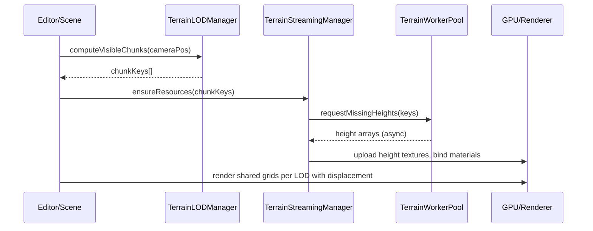

# Terrain Rendering Performance PRD

## 1. Overview

- **Context & Goals**

  - Improve real-time rendering performance for the terrain map system in editor/runtime while preserving visual quality.
  - Scale to very large landscapes via chunked LOD and streaming without frame drops or memory spikes.
  - Reduce main-thread work, allocations, and draw calls using workerization, shared buffers, and shader displacement.
  - Provide measurable, automated performance baselines and regression guards.

- **Current Pain Points**
  - Monolithic terrain meshes and synchronous rebuilds cause frame hitches during parameter changes.
  - No chunked LOD/streaming; far terrain uses unnecessary vertex density.
  - Geometry duplication across chunks inflates memory and GC pressure.
  - Limited culling integration and no seam handling between LOD levels.

## 2. Proposed Solution

- **High‑level Summary**

  - Introduce a quadtree-based chunked LOD terrain with streaming and frustum culling.
  - Reuse index/vertex grids per LOD and displace vertices in the vertex shader via height textures.
  - Move generation to a worker pool; cache per-chunk/LOD outputs with eviction and prefetch.
  - Add skirts and morphing to eliminate cracks and visible LOD popping.
  - Instrument with a dedicated profiler and automated benchmarks; expose runtime metrics in the editor.

- **Architecture & Directory Structure**

```text
src/
├── core/
│   └── lib/
│       └── terrain/
│           ├── TerrainLODManager.ts              # Quadtree LOD + distance bands
│           ├── TerrainStreamingManager.ts        # Chunk lifecycle, prefetch, eviction
│           ├── TerrainChunk.ts                   # Chunk entity, bounds, LOD, resources
│           ├── TerrainWorkerPool.ts              # Pooled workers for chunk generation
│           ├── TerrainHeightTexture.ts           # CPU→GPU height texture upload helpers
│           ├── TerrainSkirtUtil.ts               # Edge skirts/morph zones for seam fix
│           ├── shaders/
│           │   ├── terrainHeightDisplacement.vert
│           │   └── terrainPBR.frag
│           └── __tests__/                        # Unit tests for quadtree/LOD/culling
└── editor/
    └── components/
        └── panels/ViewportPanel/components/
            ├── StreamingTerrain.tsx              # R3F integration + chunk rendering
            └── TerrainDebugPanel.tsx             # Live metrics, LOD visualization
```

## 3. Implementation Plan

### Phase 1: Baseline & Instrumentation (0.5 day)

1. Add performance baselines (FPS, ms/frame, mem) on representative scenes (small/medium/large).
2. Wire `terrainProfiler` into editor overlay, capture generation/render/culling timings.
3. Define CI perf test harness with reproducible camera paths.

### Phase 2: Chunked LOD & Quadtree (2 days)

1. Implement `TerrainLODManager` with distance bands and screen-space error heuristic.
2. Build quadtree over world extents; compute per-node bounds and LOD.
3. Emit target chunk set each frame; handle create/update/remove events.

### Phase 3: Shared Grid + Shader Displacement (2 days)

1. Create reusable grid geometries per LOD level (index/vertex buffers shared).
2. Upload per-chunk height data to textures; sample in vertex shader for Y displacement.
3. Add skirts and morph factors to hide cracks and reduce LOD popping.

### Phase 4: Streaming Manager + Worker Pool (1.5 days)

1. Implement `TerrainWorkerPool` with N workers, backpressure, and cancellation.
2. Implement `TerrainStreamingManager` (prefetch ahead of camera, LRU eviction).
3. Integrate `TerrainCache` for per-chunk/LOD caching (keyed by coords + params).

### Phase 5: Culling & Scheduling (1 day)

1. Frustum cull chunks using bounds; integrate with existing BVH where applicable.
2. Defer non-critical updates and coalesce prop changes (debounce generation).
3. Ensure render loop remains smooth under parameter edits (schedule on idle/microtasks).

### Phase 6: Materials & Quality (1 day)

1. Provide simple and advanced materials (single-pass PBR with optional triplanar).
2. Dynamic quality scaling (reduce far texture resolution/height texture size).
3. Texture atlas or arrays for minimizing state changes.

### Phase 7: Tests, Benchmarks, and Hardening (1 day)

1. Unit tests for quadtree LOD, chunk keys, eviction, skirt generation.
2. Benchmarks for chunk build latency, worker throughput, memory usage.
3. Add editor toggles for LOD debug view, skirts on/off, morph visualization.

## 4. File and Directory Structures

```text
/src/core/lib/terrain/
├── TerrainLODManager.ts
├── TerrainStreamingManager.ts
├── TerrainChunk.ts
├── TerrainWorkerPool.ts
├── TerrainHeightTexture.ts
├── TerrainSkirtUtil.ts
└── shaders/
    ├── terrainHeightDisplacement.vert
    └── terrainPBR.frag

/src/editor/components/panels/ViewportPanel/components/
├── StreamingTerrain.tsx
└── TerrainDebugPanel.tsx
```

## 5. Technical Details

```ts
// src/core/lib/terrain/TerrainChunk.ts
export interface ITerrainChunkKey {
  lod: number;
  x: number;
  z: number;
}

export interface ITerrainChunkBounds {
  worldMin: [number, number, number];
  worldMax: [number, number, number];
}

export interface ITerrainChunkResources {
  heightTexture: THREE.DataTexture | THREE.DataTexture2DArray;
  material: THREE.Material;
}

export interface ITerrainChunk {
  key: ITerrainChunkKey;
  bounds: ITerrainChunkBounds;
  resources: ITerrainChunkResources | null;
  lastUsed: number;
}
```

```ts
// src/core/lib/terrain/TerrainLODManager.ts
export interface ITerrainLODConfig {
  maxLOD: number;
  lodDistances: number[]; // near→far thresholds
  chunkWorldSize: number; // meters
}

export class TerrainLODManager {
  constructor(private readonly config: ITerrainLODConfig) {}

  public computeVisibleChunks(cameraPos: THREE.Vector3): ITerrainChunkKey[] {
    // 1) Determine quadtree depth from distance
    // 2) Produce set of (lod,x,z) covering a view-aligned region
    // 3) Ensure parent/child coverage to avoid gaps
    return [];
  }
}
```

```ts
// src/core/lib/terrain/TerrainWorkerPool.ts
export interface ITerrainHeightGenJob {
  key: ITerrainChunkKey;
  resolution: number; // samples per side for this LOD
  seed: number;
  paramsHash: string; // hash from terrain config
}

export class TerrainWorkerPool {
  constructor(private readonly size: number) {}
  enqueue(job: ITerrainHeightGenJob): Promise<Float32Array> {
    // Round-robin or least-busy scheduling + cancellation tokens
    return Promise.resolve(new Float32Array());
  }
  dispose(): void {}
}
```

```glsl
// src/core/lib/terrain/shaders/terrainHeightDisplacement.vert
// attributes from shared grid, displace Y by height texture
uniform sampler2D uHeightMap;
uniform vec2 uUVScale;     // uv scaling to sample correct texel
uniform float uHeightScale;
uniform float uMorphFactor; // for LOD morphing near boundaries

varying vec3 vWorldPos;
varying vec3 vNormal;
varying vec2 vUv;

void main() {
  vec3 pos = position;
  vUv = uv * uUVScale;
  float h = texture2D(uHeightMap, vUv).r;
  pos.y += h * uHeightScale;
  // apply morph factor on edges if needed
  vec4 world = modelMatrix * vec4(pos, 1.0);
  vWorldPos = world.xyz;
  vNormal = normalize(normalMatrix * normal);
  gl_Position = projectionMatrix * viewMatrix * world;
}
```

```ts
// src/editor/components/panels/ViewportPanel/components/StreamingTerrain.tsx
export interface IStreamingTerrainProps {
  origin: [number, number, number];
  size: [number, number]; // world size (x,z)
  heightScale: number;
  seed: number;
  lod: { maxLOD: number; lodDistances: number[]; chunkWorldSize: number };
}

export const StreamingTerrain: React.FC<IStreamingTerrainProps> = (props) => {
  // 1) LODManager.computeVisibleChunks(camera.position)
  // 2) StreamingManager ensure resources exist (height textures, materials)
  // 3) Render chunk meshes using shared grid per LOD level
  return null;
};
```

## 6. Usage Examples

```tsx
// In EntityRenderer or scene component
<StreamingTerrain
  origin={[0, 0, 0]}
  size={[4096, 4096]}
  heightScale={80}
  seed={1337}
  lod={{ maxLOD: 4, lodDistances: [64, 128, 256, 512], chunkWorldSize: 64 }}
/>
```

```ts
// Programmatic update (e.g., editor inspector action)
terrainStreamingManager.updateConfig({ prefetchRings: 1, maxActiveChunks: 64 });
```

```ts
// Hook into profiler
terrainProfiler.setMetric('active_chunks', terrainStreamingManager.getActiveCount());
```

## 7. Testing Strategy

- **Unit Tests**

  - LODManager: distance→LOD selection, quadtree coverage, stable keys.
  - Chunk key hashing: uniqueness and consistency under movement.
  - Skirt generation: correct edge indices and coverage.
  - Worker pool: job scheduling, cancellation, fallback.

- **Integration Tests**
  - Camera sweep path: verify FPS never drops below target thresholds per scene size.
  - Memory growth under editing sessions: no sustained increase after idle (leak detection).
  - Culling effectiveness: visible vs culled chunk counts vs frustum position.
  - Asset hot-reload: material/height textures swapped without leaks or stalls.

## 8. Edge Cases

| Edge Case                               | Remediation                                                                        |
| --------------------------------------- | ---------------------------------------------------------------------------------- |
| Extremely large terrains (tens of km)   | Increase chunk size at high LODs, cap far LOD resolution, apply horizon cutoff.    |
| Rapid parameter edits thrash generation | Debounce updates, coalesce changes, cancel in-flight worker jobs.                  |
| LOD cracks at boundaries                | Add skirts, morph zones; ensure parent/child overlap.                              |
| GPU memory pressure on low-end devices  | Downscale far height textures; dynamic quality scaler; fallback to half-precision. |
| Long worker tasks blocking queue        | Use pool with concurrency limits; chunk-first scheduling near camera.              |
| Height data precision artifacts         | Normalize height textures and use 16-bit textures where available.                 |

## 9. Sequence Diagram



## 10. Risks & Mitigations

| Risk                           | Mitigation                                                              |
| ------------------------------ | ----------------------------------------------------------------------- |
| Visible LOD popping            | Morph factors at boundaries; cross-fade materials; temporal hysteresis. |
| Worker flood under fast motion | Prefetch rings; velocity-aware scheduling; max concurrency.             |
| Memory fragmentation           | Shared buffers; reuse textures; LRU eviction; periodic compaction.      |
| Shader cost on mobile          | Feature flags for simplified shading; dynamic quality.                  |
| Complexity creep               | Keep SRP per module; strict interfaces; profiling gates in CI.          |

## 11. Timeline

- Total: ~8 days
  - Phase 1: 0.5 day
  - Phase 2: 2 days
  - Phase 3: 2 days
  - Phase 4: 1.5 days
  - Phase 5: 1 day
  - Phase 6: 1 day
  - Phase 7: 1 day (overlaps via PRs)

## 12. Acceptance Criteria

- 60 FPS maintained on medium scenes (2k×2k world) on desktop; 45 FPS on mobile targets.
- Terrain edits do not produce frame drops > 16ms spikes during steady camera movement.
- No visible cracks between LOD levels; skirts pass visual QA at all distances.
- Peak JS heap within budget for target scenes; no sustained growth after 60s idle.
- Max chunk generation latency p95 < 8ms under worker pool with 4 workers.
- Automated perf tests pass in CI with baseline deltas ≤ 10%.

## 13. Conclusion

This plan introduces a scalable, modern terrain pipeline centered on chunked LOD, shader displacement with shared grids, workerized generation, and robust streaming. It lowers CPU/GPU cost, minimizes allocations, prevents visual seams, and provides measurable, enforced performance guarantees.

## 14. Assumptions & Dependencies

- WebGL2 availability for floating-point textures and vertex texture fetch; graceful fallbacks provided.
- Existing editor integration with React Three Fiber; hooks for profiler overlays available.
- Height generation is deterministic from seed + params; compatible with workerized jobs.
- Optional: BVH integration for scene-wide culling already available for non-terrain meshes.

- Related Documents
  - `docs/guides/terrain-system.md`
  - `docs/PRDs/editor/terrain-system-roadmap.md`
  - `docs/PRDs/performance/4-31-r3f-lod-system-prd.md`
  - `docs/PRDs/performance/4-45-frustum-culling-integration-prd.md`
  - `docs/PRDs/rust/done/lod-manager-rust-prd.md`
  - `docs/PRDs/rust/done/rust-bvh-culling-port-prd.md`
