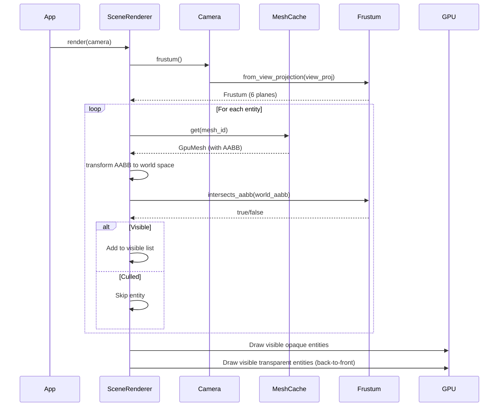

# Rust Engine Frustum Culling PRD

## Overview

- **Context & Goals**
  - Add frustum culling to the Rust engine to drastically reduce draw calls and improve rendering performance.
  - Only render entities that are visible within the camera's view frustum.
  - Target 50-90% reduction in draw calls for typical scenes with entities outside the view.
  - Maintain correctness: no visible entities should be culled incorrectly.

- **Current Pain Points**
  - Every entity with a `MeshRenderer` is rendered every frame, regardless of camera visibility.
  - Large scenes (100+ entities) waste GPU time rendering off-screen objects.
  - No spatial optimization for scenes with entities spread across large areas.
  - Performance degrades linearly with entity count rather than visible entity count.

## Proposed Solution

- **High-level Summary**
  - Implement frustum extraction from camera view-projection matrix.
  - Compute axis-aligned bounding boxes (AABB) for all meshes (primitives + GLTF).
  - Before rendering, test each entity's world-space AABB against the camera frustum.
  - Only submit draw calls for entities that intersect or are contained in the frustum.
  - Cache mesh AABBs to avoid recomputation every frame.
  - Add metrics to debug HUD showing culled vs rendered entity counts.

- **Architecture & Directory Structure**

```
rust/engine/
├── Cargo.toml                    # add parry3d for geometry ops
├── src/
│   ├── render/
│   │   ├── scene_renderer.rs     # integrate culling in render()
│   │   ├── camera.rs             # add frustum() method
│   │   ├── frustum.rs            # NEW: Frustum struct + intersection tests
│   │   └── bounds.rs             # NEW: AABB computation and transforms
│   └── debug/
│       └── overlay.rs            # add culling stats to HUD
└── crates/
    └── assets/
        ├── mesh_cache.rs         # store AABB per mesh
        └── vertex.rs             # helper for AABB from vertices
```

## Implementation Plan

- **Phase 1: AABB Computation (0.75 day)**
  1. Add `parry3d` dependency to `Cargo.toml` for geometry primitives.
  2. Create `src/render/bounds.rs` with `Aabb` struct wrapping `parry3d::bounding_volume::Aabb`.
  3. Implement `Aabb::from_vertices(vertices: &[Vertex])` to compute min/max bounds.
  4. Add `aabb: Aabb` field to `GpuMesh` in `mesh_cache.rs`.
  5. Compute and store AABB when uploading meshes (primitives + GLTF).
  6. Write unit tests for AABB computation with known cube/sphere vertices.

- **Phase 2: Frustum Extraction (0.5 day)**
  1. Create `src/render/frustum.rs` with `Frustum` struct containing 6 planes.
  2. Implement `Frustum::from_view_projection(view_proj: Mat4)` to extract frustum planes.
  3. Use standard frustum extraction from view-projection matrix (6 planes from matrix rows).
  4. Add `Camera::frustum(&self) -> Frustum` method in `camera.rs`.
  5. Write unit tests verifying plane normals and distances for identity/simple matrices.

- **Phase 3: Intersection Tests (0.5 day)**
  1. In `frustum.rs`, implement `Frustum::intersects_aabb(&self, aabb: &Aabb) -> bool`.
  2. Use standard AABB-plane intersection test (check AABB against all 6 planes).
  3. Early-out optimization: if AABB is entirely on negative side of any plane, it's culled.
  4. Add `Aabb::transform(&self, matrix: Mat4) -> Aabb` to transform local AABB to world space.
  5. Write unit tests with known frustum and AABB positions (inside, outside, intersecting).

- **Phase 4: Integration into Renderer (0.75 day)**
  1. In `scene_renderer.rs`, extract camera frustum at start of `render()`.
  2. Before entity render loop, filter entities by frustum visibility:
     - Get mesh AABB from `mesh_cache`
     - Transform AABB by entity world transform
     - Test against frustum
     - Skip entity if culled
  3. Separate culled entities into `visible_opaque` and `visible_transparent` lists.
  4. Update draw call loops to iterate only visible entities.
  5. Log culling ratio at debug level: `"Rendered {visible}/{total} entities ({culled} culled)"`.

- **Phase 5: Debug HUD Integration (0.25 day)**
  1. Add culling stats to `DebugState`: `total_entities`, `visible_entities`, `culled_entities`.
  2. Update debug HUD overlay to display culling metrics when enabled.
  3. Show percentage: `"Culled: 73/100 (73%)"`.

- **Phase 6: Testing & Validation (0.5 day)**
  1. Create test scene with entities at various positions relative to camera.
  2. Verify entities outside frustum are not drawn (check draw call counts).
  3. Test edge cases: entities partially in frustum, camera rotation, near/far plane clipping.
  4. Performance benchmark: measure FPS improvement in large scenes (200+ entities).
  5. Add integration test verifying no visual artifacts from incorrect culling.

## File and Directory Structures

```markdown
/root-directory/
├── rust/engine/Cargo.toml
├── rust/engine/src/render/
│   ├── scene_renderer.rs
│   ├── camera.rs
│   ├── frustum.rs              # NEW
│   └── bounds.rs               # NEW
├── rust/engine/crates/assets/src/
│   ├── mesh_cache.rs           # add AABB field
│   └── vertex.rs
└── docs/PRDs/rust-frustum-culling-prd.md
```

## Technical Details

- **AABB Computation**

```rust
// rust/engine/src/render/bounds.rs
use glam::{Vec3, Mat4};
use parry3d::bounding_volume::Aabb as ParryAabb;

#[derive(Debug, Clone, Copy)]
pub struct Aabb {
    pub min: Vec3,
    pub max: Vec3,
}

impl Aabb {
    /// Compute AABB from vertex positions
    pub fn from_vertices(vertices: &[crate::render::vertex::Vertex]) -> Self {
        let mut min = Vec3::splat(f32::INFINITY);
        let mut max = Vec3::splat(f32::NEG_INFINITY);

        for vertex in vertices {
            let pos = Vec3::from_array(vertex.position);
            min = min.min(pos);
            max = max.max(pos);
        }

        Self { min, max }
    }

    /// Transform AABB to world space (conservative bounds)
    pub fn transform(&self, matrix: Mat4) -> Self {
        // Transform all 8 corners and recompute AABB
        let corners = [
            Vec3::new(self.min.x, self.min.y, self.min.z),
            Vec3::new(self.min.x, self.min.y, self.max.z),
            Vec3::new(self.min.x, self.max.y, self.min.z),
            Vec3::new(self.min.x, self.max.y, self.max.z),
            Vec3::new(self.max.x, self.min.y, self.min.z),
            Vec3::new(self.max.x, self.min.y, self.max.z),
            Vec3::new(self.max.x, self.max.y, self.min.z),
            Vec3::new(self.max.x, self.max.y, self.max.z),
        ];

        let mut world_min = Vec3::splat(f32::INFINITY);
        let mut world_max = Vec3::splat(f32::NEG_INFINITY);

        for corner in corners {
            let transformed = matrix.transform_point3(corner);
            world_min = world_min.min(transformed);
            world_max = world_max.max(transformed);
        }

        Self { min: world_min, max: world_max }
    }
}
```

- **Frustum Extraction**

```rust
// rust/engine/src/render/frustum.rs
use glam::{Vec3, Vec4, Mat4};

#[derive(Debug, Clone)]
pub struct Frustum {
    planes: [Vec4; 6], // [left, right, bottom, top, near, far]
}

impl Frustum {
    /// Extract frustum planes from view-projection matrix
    /// Planes are in world space, stored as (normal.xyz, distance)
    pub fn from_view_projection(view_proj: Mat4) -> Self {
        let m = view_proj.to_cols_array_2d();

        // Extract planes from matrix rows (Gribb-Hartmann method)
        let planes = [
            // Left plane: m3 + m0
            Vec4::new(m[0][3] + m[0][0], m[1][3] + m[1][0], m[2][3] + m[2][0], m[3][3] + m[3][0]),
            // Right plane: m3 - m0
            Vec4::new(m[0][3] - m[0][0], m[1][3] - m[1][0], m[2][3] - m[2][0], m[3][3] - m[3][0]),
            // Bottom plane: m3 + m1
            Vec4::new(m[0][3] + m[0][1], m[1][3] + m[1][1], m[2][3] + m[2][1], m[3][3] + m[3][1]),
            // Top plane: m3 - m1
            Vec4::new(m[0][3] - m[0][1], m[1][3] - m[1][1], m[2][3] - m[2][1], m[3][3] - m[3][1]),
            // Near plane: m3 + m2
            Vec4::new(m[0][3] + m[0][2], m[1][3] + m[1][2], m[2][3] + m[2][2], m[3][3] + m[3][2]),
            // Far plane: m3 - m2
            Vec4::new(m[0][3] - m[0][2], m[1][3] - m[1][2], m[2][3] - m[2][2], m[3][3] - m[3][2]),
        ];

        // Normalize planes
        let planes = planes.map(|plane| {
            let normal = Vec3::new(plane.x, plane.y, plane.z);
            let length = normal.length();
            plane / length
        });

        Self { planes }
    }

    /// Test if AABB intersects or is inside frustum
    pub fn intersects_aabb(&self, aabb: &super::bounds::Aabb) -> bool {
        // Test AABB against all 6 planes
        for plane in &self.planes {
            let normal = Vec3::new(plane.x, plane.y, plane.z);
            let distance = plane.w;

            // Compute AABB projection on plane normal (positive vertex method)
            let positive_vertex = Vec3::new(
                if normal.x >= 0.0 { aabb.max.x } else { aabb.min.x },
                if normal.y >= 0.0 { aabb.max.y } else { aabb.min.y },
                if normal.z >= 0.0 { aabb.max.z } else { aabb.min.z },
            );

            // If positive vertex is on negative side, AABB is completely outside
            if normal.dot(positive_vertex) + distance < 0.0 {
                return false;
            }
        }

        true // AABB intersects or is inside frustum
    }
}
```

- **Camera Integration**

```rust
// rust/engine/src/render/camera.rs (additions)
use super::frustum::Frustum;

impl Camera {
    /// Get frustum for this camera in world space
    pub fn frustum(&self) -> Frustum {
        Frustum::from_view_projection(self.view_projection_matrix())
    }
}
```

- **Mesh Cache Integration**

```rust
// rust/engine/crates/assets/src/mesh_cache.rs (modifications)
use crate::render::bounds::Aabb;

pub struct GpuMesh {
    pub vertex_buffer: wgpu::Buffer,
    pub index_buffer: wgpu::Buffer,
    pub index_count: u32,
    pub aabb: Aabb, // NEW: precomputed AABB
}

impl MeshCache {
    pub fn upload_mesh(&mut self, device: &wgpu::Device, id: &str, mesh: Mesh) {
        // Compute AABB from vertices
        let aabb = Aabb::from_vertices(&mesh.vertices);

        // Upload buffers...
        let vertex_buffer = device.create_buffer_init(...);
        let index_buffer = device.create_buffer_init(...);

        let gpu_mesh = GpuMesh {
            vertex_buffer,
            index_buffer,
            index_count: mesh.indices.len() as u32,
            aabb, // Store AABB
        };

        self.meshes.insert(id.to_string(), gpu_mesh);
    }
}
```

- **Scene Renderer Integration**

```rust
// rust/engine/src/render/scene_renderer.rs (modifications in render())
pub fn render(
    &self,
    encoder: &mut wgpu::CommandEncoder,
    view: &wgpu::TextureView,
    camera: &Camera,
    queue: &wgpu::Queue,
    device: &wgpu::Device,
) {
    // Extract frustum from camera
    let frustum = camera.frustum();

    // Filter visible entities
    let mut visible_opaque = Vec::new();
    let mut visible_transparent = Vec::new();

    for (i, entity) in self.entities.iter().enumerate() {
        // Get mesh AABB
        let Some(gpu_mesh) = self.mesh_cache.get(&entity.mesh_id) else {
            continue;
        };

        // Transform AABB to world space
        let world_aabb = gpu_mesh.aabb.transform(entity.transform);

        // Test against frustum
        if !frustum.intersects_aabb(&world_aabb) {
            continue; // Culled
        }

        // Add to visible list based on alpha mode
        if entity_alpha_modes[i] == ALPHA_MODE_BLEND {
            let distance = (camera.position - entity.transform.w_axis.truncate()).length();
            visible_transparent.push((i, distance));
        } else {
            visible_opaque.push(i);
        }
    }

    // Sort transparent by distance
    visible_transparent.sort_by(|a, b| b.1.partial_cmp(&a.1).unwrap_or(std::cmp::Ordering::Equal));

    // Log culling stats
    log::debug!(
        "Rendered {}/{} entities ({} culled)",
        visible_opaque.len() + visible_transparent.len(),
        self.entities.len(),
        self.entities.len() - visible_opaque.len() - visible_transparent.len()
    );

    // Render visible entities only
    // ... (existing render pass code, but iterate visible_opaque/visible_transparent)
}
```

## Usage Examples

- **Automatic Culling**

All scenes automatically benefit from frustum culling once implemented:

```bash
# Run any scene - culling happens automatically
cargo run --release -- --scene MaterialParityDemo
```

Expected log output:
```
[DEBUG] Rendered 23/156 entities (133 culled)
```

- **Debug HUD Stats**

When debug mode is enabled with `--debug`:

```
FPS: 144
Frame: 6.9ms
Entities: 23/156 (85% culled)
Bodies: 12
Colliders: 12
```

## Testing Strategy

- **Unit Tests**

  - `Aabb::from_vertices`: Known cube vertices → correct min/max bounds.
  - `Aabb::transform`: Transform identity AABB by translation/rotation → correct world bounds.
  - `Frustum::from_view_projection`: Identity matrix → expected plane normals/distances.
  - `Frustum::intersects_aabb`: Known frustum + AABB positions → correct intersection results.
    - AABB fully inside frustum → true
    - AABB fully outside frustum → false
    - AABB intersecting frustum boundary → true

- **Integration Tests**

  - Create test scene with 100 entities in a grid pattern.
  - Position camera to view only 25 entities.
  - Verify render loop processes only ~25 entities (log output check).
  - Rotate camera 180° → different 25 entities should be visible.
  - No visual artifacts (entities popping in/out incorrectly).

- **Performance Benchmarks**

  - Scene with 200 entities, 50 visible:
    - Before culling: 200 draw calls
    - After culling: ~50 draw calls
    - Expected FPS improvement: 30-50%
  - Scene with 1000 entities, 100 visible:
    - Before: 1000 draw calls
    - After: ~100 draw calls
    - Expected FPS improvement: 60-80%

## Edge Cases

| Edge Case | Remediation |
|-----------|-------------|
| Entity with no mesh | Skip culling test; entity won't be rendered anyway |
| AABB computation for empty mesh | Return degenerate AABB (min=max=origin); always culled |
| Camera inside large entity's AABB | Intersection test returns true; entity rendered |
| Near plane clipping large entities | Conservative AABB transform includes all corners; renders correctly |
| Orthographic camera | Frustum extraction works identically; planes are parallel |
| Extremely small entities (< 1 unit) | AABB precision sufficient; floating point stable for typical scales |
| Mesh with extreme vertex positions | AABB computed from actual vertices; handles any scale |

## Sequence Diagram



## Risks & Mitigations

| Risk | Mitigation |
|------|------------|
| Incorrect culling (visible entities not rendered) | Comprehensive unit tests with known frustum/AABB pairs; visual validation |
| AABB transform performance overhead | Transform AABBs only for entities passing coarse tests; cache when possible |
| Conservative AABB over-estimates bounds | Acceptable trade-off; better to render extra than miss visible entities |
| Frustum plane extraction numerical issues | Use normalized planes; test with various camera configurations |
| Large entity count (10k+) culling overhead | Future: spatial acceleration (octree/BVH); current solution handles 1k entities well |

## Performance Targets

- **Typical Scene (100 entities, 30 visible)**
  - Culling overhead: < 0.1ms per frame
  - Draw call reduction: ~70%
  - FPS improvement: 40-60%

- **Large Scene (500 entities, 100 visible)**
  - Culling overhead: < 0.3ms per frame
  - Draw call reduction: ~80%
  - FPS improvement: 60-80%

- **Stress Test (1000 entities, 100 visible)**
  - Culling overhead: < 0.5ms per frame
  - Draw call reduction: ~90%
  - FPS improvement: 70-90%

## Timeline

- Phase 1: 0.75 day
- Phase 2: 0.5 day
- Phase 3: 0.5 day
- Phase 4: 0.75 day
- Phase 5: 0.25 day
- Phase 6: 0.5 day
- **Total**: ~3.25 days

## Acceptance Criteria

- Entities outside camera frustum are not rendered (verified via logs and draw call counts).
- No visual artifacts or incorrect culling of visible entities.
- Debug HUD displays culling statistics when enabled.
- Unit tests pass for AABB computation, frustum extraction, and intersection tests.
- Performance benchmarks show 50-90% reduction in draw calls for scenes with off-screen entities.
- Integration tests verify correctness with various camera angles and entity positions.
- Code is well-documented with inline comments explaining frustum plane extraction.

## Conclusion

Frustum culling is a fundamental optimization that provides massive performance benefits with relatively low implementation complexity. By leveraging existing geometry libraries (parry3d) and following standard graphics algorithms (Gribb-Hartmann frustum extraction, AABB-plane tests), we can achieve 50-90% draw call reduction in typical scenes. This optimization is essential before scaling to larger game worlds and will provide immediate value for all existing scenes.

## Future Enhancements

- **Spatial Acceleration Structures**: Implement octree or BVH for O(log n) culling instead of O(n).
- **Occlusion Culling**: Test if entities are occluded by other large opaque entities.
- **Portal Culling**: For indoor scenes, use portal visibility graphs.
- **Hardware Occlusion Queries**: Use GPU queries to test visibility of bounding boxes.
- **LOD Selection**: Combine with frustum distance to select level-of-detail.

## Dependencies

- **parry3d**: Geometry library for AABB types and transformations.
  - Already a dependency via Rapier3D physics.
  - Provides battle-tested geometry primitives.
- **glam**: Math library for Vec3, Vec4, Mat4.
  - Already in use for transforms.
- **Existing Camera**: Camera already provides view-projection matrix.
- **Existing MeshCache**: Will be extended to store AABBs.

## Assumptions

- Meshes are static (AABB computed once at upload time).
- For dynamic meshes (vertex animations), AABB can be recomputed or conservatively enlarged.
- Entity transforms change frequently, so AABBs are transformed per frame (fast operation).
- Camera frustum changes every frame (re-extracted from view-projection matrix).
- Culling precision is sufficient for game scenes (no sub-pixel accuracy needed).
