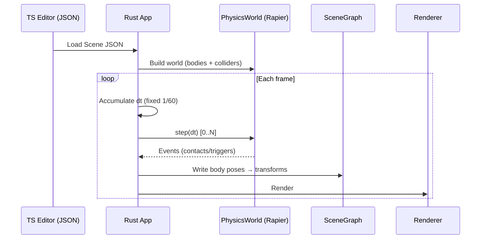

# Rust Physics Integration PRD (Rapier)

## Overview

- **Context & Goals**: Integrate the Rust Rapier physics engine into the native renderer to reach parity with the editor/runtime (which uses Rapier.js via `@react-three/rapier`). Support `RigidBody` and `MeshCollider` components authored in TypeScript so scenes simulate consistently in Rust. Provide a deterministic fixed-step loop, collider/shape mapping, materials, triggers, and collision events.
- **Current Pain Points**: Native engine lacks physics; `RigidBody`/`MeshCollider` are missing from Rust decoders; no physics step in the main loop; no event plumbing; no tri‑mesh collider path; no transform sync policy.

## Proposed Solution

- **High‑level Summary**:
  - Add a new crate `vibe-physics` wrapping `rapier3d` for world lifecycle, stepping, body/collider creation, and events.
  - Extend `vibe-ecs-bridge` with `RigidBody`/`MeshCollider` structs and decoders to mirror TS Zod schemas.
  - On scene load, construct bodies/colliders from components; store `EntityId`→`RigidBodyHandle` maps.
  - Introduce a fixed timestep accumulator; step physics at 60 Hz; sync poses into the `SceneGraph` before rendering.
  - Provide collision/trigger events via Rapier’s `EventQueue`, exposed through a simple API (future WASM bridge ready).

### Architecture & Directory Structure

```
rust/engine/
├── Cargo.toml
├── crates/
│   ├── ecs-bridge/
│   │   └── src/decoders.rs        # + Add RigidBody, MeshCollider
│   ├── physics/                   # NEW
│   │   ├── Cargo.toml
│   │   └── src/
│   │       ├── lib.rs
│   │       ├── world.rs           # PhysicsWorld (init, step, events)
│   │       ├── builder.rs         # Component→Rapier mapping
│   │       ├── components.rs      # Shared mapping/types
│   │       └── events.rs          # Event plumbing
│   ├── scene/
│   ├── scene-graph/
│   ├── assets/
│   └── wasm-bridge/
└── src/
    ├── app.rs                     # + Fixed-step accumulator + step call
    ├── ecs/
    └── render/
```

## Implementation Plan

- **Phase 1: Crate setup (0.5 day)**

  1. Create `crates/physics` with `rapier3d` dependency (`dim3`, `parallel` features).
  2. Add to workspace and `vibe-coder-engine` deps.
  3. Implement `PhysicsWorld` skeleton: init, integration params, step.

- **Phase 2: ECS decoders (0.5 day)**

  1. Add `RigidBody` and `MeshCollider` Rust structs in `ecs-bridge/src/decoders.rs` to mirror TS schemas and defaults.
  2. Implement `RigidBodyDecoder`/`MeshColliderDecoder`; register in `create_default_registry()`.
  3. Unit tests for decoding fields and defaults.

- **Phase 3: Builders and shape mapping (1 day)**

  1. Map `RigidBody.bodyType` → Rapier `RigidBodyType`; set `gravityScale`, damping, sleep, CCD.
  2. Map colliders: cuboid, ball, capsule; optional convex; tri‑mesh (via `vibe-assets`).
  3. Apply material: `friction`, `restitution`, `density`; `isTrigger` → sensor collider.

- **Phase 4: World bootstrap and entity binding (1 day)**

  1. On scene load, create `PhysicsWorld` and add entities with `RigidBody`/`MeshCollider`.
  2. Collider-only entities create a fixed body + collider.
  3. Maintain `EntityId`→handles; log warnings on invalid/missing data.

- **Phase 5: Fixed-step loop and transform sync (1 day)**

  1. Add fixed 1/60s accumulator in `src/app.rs` using existing `FrameTimer`.
  2. While `accumulator >= dt`: `PhysicsWorld::step(dt)`.
  3. After stepping, write poses back to entities and update `SceneGraph` before rendering.

- **Phase 6: Events (0.5 day)**

  1. Add `EventQueue` (channel collector) and pump contact/trigger begin/end.
  2. Expose a pull API for consumers (future scripts/WASM bridge).

- **Phase 7: Tri‑mesh pipeline (1–2 days, optional)**

  1. Use `vibe-assets` meshes/GLTF for tri‑mesh colliders.
  2. Fallback to convex or primitive bounds with clear warnings.

- **Phase 8: QA & perf (0.5 day)**
  1. Unit tests for mapping/step determinism.
  2. Integration tests: falling cube, triggers, tri‑mesh ground.

## File and Directory Structures

```
/rust/engine/
├── crates/
│   ├── physics/
│   │   ├── Cargo.toml
│   │   └── src/{lib.rs,world.rs,builder.rs,components.rs,events.rs}
│   └── ecs-bridge/src/decoders.rs  # + RigidBody/MeshCollider structs & decoders
└── src/app.rs                       # + accumulator & physics step
```

## Technical Details

```rust
// crates/physics/src/lib.rs
pub mod world;
pub mod builder;
pub mod components;
pub mod events;
pub use world::PhysicsWorld;
```

```rust
// crates/physics/src/world.rs (skeleton)
use rapier3d::prelude::*;
use std::collections::HashMap;
use vibe_scene::EntityId;

pub struct PhysicsWorld {
  pub gravity: Vector<Real>,
  pub pipeline: PhysicsPipeline,
  pub island_manager: IslandManager,
  pub broad_phase: BroadPhase,
  pub narrow_phase: NarrowPhase,
  pub rigid_bodies: RigidBodySet,
  pub colliders: ColliderSet,
  pub impulse_joints: ImpulseJointSet,
  pub multibody_joints: MultibodyJointSet,
  pub ccd_solver: CCDSolver,
  pub integration_params: IntegrationParameters,
  pub event_handler: ChannelEventCollector,
  pub entity_to_body: HashMap<EntityId, RigidBodyHandle>,
}

impl PhysicsWorld {
  pub fn new() -> Self { /* init fields */ }
  pub fn add_entity(&mut self, id: EntityId, body: RigidBody, colliders: Vec<Collider>) { /* ... */ }
  pub fn step(&mut self, dt: f32) { /* pipeline.step(...) */ }
}
```

```rust
// crates/physics/src/builder.rs (signatures)
use rapier3d::prelude::*;
use glam::{Quat, Vec3};
use vibe_ecs_bridge::{RigidBody as Rb, MeshCollider as Mc};

pub fn make_rb(rb: &Rb, position: Vec3, rotation: Quat) -> RigidBody { /* map fields */ }
pub fn make_colliders(mc: &Mc, scale: Vec3) -> Vec<Collider> { /* shapes/materials */ }
```

```rust
// src/app.rs (integration points)
// - Add fields: physics: PhysicsWorld, accumulator: f32, fixed_dt: f32
// - Build world from scene on new()
// - On update(): accumulate dt; while >= fixed_dt -> physics.step(fixed_dt)
// - After step: sync poses back to entities and update SceneGraph prior to render
```

## Usage Examples

```rust
// Populate world (simplified)
let mut world = PhysicsWorld::new();
for entity in &scene.entities {
  if let Some(rb) = entity.get_component::<vibe_ecs_bridge::RigidBody>("RigidBody") {
    let t = entity.get_component::<vibe_ecs_bridge::Transform>("Transform");
    let (pos, rot, scale) = extract_trs(t);
    let rb_desc = make_rb(&rb, pos, rot);
    let mut cols = vec![];
    if let Some(mc) = entity.get_component::<vibe_ecs_bridge::MeshCollider>("MeshCollider") {
      cols = make_colliders(&mc, scale);
    }
    world.add_entity(entity.entity_id().unwrap(), rb_desc, cols);
  }
}
```

```rust
// Fixed step in update()
accumulator += self.timer.delta_seconds();
while accumulator >= fixed_dt {
  self.physics.step(fixed_dt);
  accumulator -= fixed_dt;
}
// Then sync poses back into scene graph before rendering
```

## Testing Strategy

- **Unit Tests**:
  - Mapping correctness: body types, material properties, sensors, density/mass.
  - Shapes: cuboid, ball, capsule; tri‑mesh when available.
  - Determinism across runs given identical initial conditions.
- **Integration Tests**:
  - Falling cube onto plane; collision begin/end observed.
  - Tri‑mesh ground with dynamic convex body interaction.
  - Trigger volumes; enter/exit sequencing.

## Edge Cases

| Edge Case                                    | Remediation                                                               |
| -------------------------------------------- | ------------------------------------------------------------------------- |
| Non-uniform scale on colliders               | Prefer shape local space; for tri‑mesh, bake scale; document limitations. |
| Missing mesh for tri‑mesh collider           | Fallback to convex or bounds; warn in logs.                               |
| Zero/negative mass or density                | Clamp to minimum; treat as fixed below threshold.                         |
| Extremely large velocities                   | Enable CCD for marked fast bodies.                                        |
| Kinematic bodies with conflicting transforms | Physics authoritative; editor transform is initial pose.                  |
| Nested parenting with physics                | Sync world pose; recompute local from parent world before render.         |

## Sequence Diagram



## Risks & Mitigations

| Risk                                     | Mitigation                                                                  |
| ---------------------------------------- | --------------------------------------------------------------------------- |
| Tri‑mesh performance/memory              | Start with primitives/convex; stream mesh data; document constraints.       |
| Divergence from TS physics behavior      | Mirror schema defaults; parity tests; document differences.                 |
| Fixed-step jitter                        | Accumulator with clamped substeps; keep interpolation alpha for future use. |
| Transform sync complexity in hierarchies | Centralize via `SceneGraph`; convert world→local after physics as needed.   |
| Feature creep (joints/constraints)       | Defer to later phases; keep clean extension points.                         |

## Timeline

- Total estimate: ~5–6 days.
  - Phases 1–2: 1 day
  - Phases 3–4: 2 days
  - Phases 5–6: 1 day
  - Phase 7 (optional): 1–2 days
  - Phase 8: 0.5 day

## Acceptance Criteria

- Scenes with `RigidBody`/`MeshCollider` load and simulate in Rust.
- Dynamic bodies fall under gravity and collide with a static ground.
- Sensors emit begin/end; collisions are observable via API.
- Fixed-step runs deterministically; frame spikes do not destabilize sim.
- Tri‑mesh colliders supported or gracefully downgraded with logs.
- Transform sync updates visible poses before rendering.

## Conclusion

This plan introduces a focused `vibe-physics` crate around Rapier, deterministic stepping, and ECS parity for physics. It establishes clean interfaces, robust sync with the scene graph, and a path to advanced features (tri‑mesh, joints, scripting) without blocking core simulation.

## Assumptions & Dependencies

- `rapier3d` with `dim3`, `parallel`, optionally `simd-stable`.
- `vibe-assets` meshes/GLTF available when tri‑mesh is enabled; optional fallback.
- `SceneGraph` world transforms remain authoritative for rendering; physics writes poses prior to draw.
- No scripting coupling in this phase; events surfaced for future WASM integration.
