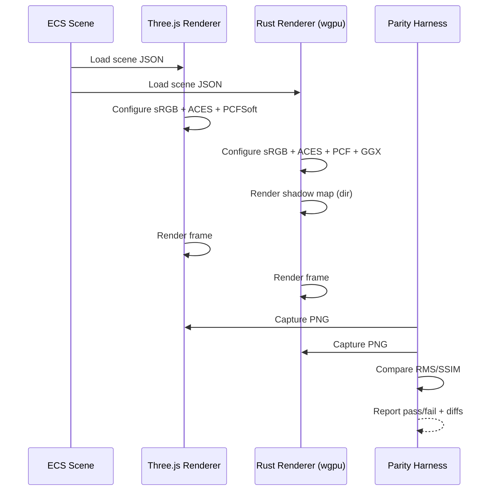

# Rust Visual Parity PRD

🧠 Planning documents standards rule loaded!

## 1. Overview

- **Context & Goals**
  - Ensure scenes rendered in the TS (Three.js/R3F) editor and the Rust `wgpu` engine are visually indistinguishable for the same ECS scene data.
  - Establish a reproducible “visual parity harness” that captures deterministic screenshots on both sides and compares them numerically.
  - Lock renderer defaults (color space, tone mapping, exposure, physically‑correct lighting, shadowing) and map ECS parameters 1:1.
  - Create parity reference scenes to continuously validate regressions in CI.

- **Current Pain Points**
  - Differences in color space/transfer functions (sRGB vs linear, gamma steps) and tone mapping (ACES on TS side; WGSL needs exact match).
  - Shadow acne/ peter‑panning due to bias sign/scale mismatch; PCF radius softness not equivalent to Three.js PCFSoftShadowMap.
  - BRDF differences (Three’s `meshStandardMaterial` PBR vs simplified/specular model in WGSL) causing specular/roughness mismatch.
  - Camera defaults (FOV, near/far, view transform) and light normalization can drift between engines.

## 2. Proposed Solution

- **High‑level Summary**
  - Standardize renderer defaults across TS and Rust: `sRGB` output, ACES filmic tone mapping, exposure parity, and physically‑correct lights.
  - Implement Cook‑Torrance/ GGX PBR in WGSL with Schlick Fresnel and Smith masking‑shadowing to match `meshStandardMaterial` inputs (baseColor, metalness, roughness, normal, AO, emissive).
  - Make shadowing equivalent: directional orthographic fit from scene bounds, depth compare sampler, 3×3 PCF with radius mapping to Three’s PCFSoft, consistent bias semantics.
  - Ensure camera/light parameter parity via ECS: 1:1 mapping for `fov`, `near`, `far`, `intensity`, `color`, `range/decay`, `angle/penumbra`, `shadowBias`, `shadowRadius`, `shadowMapSize`.
  - Add a parity harness: deterministic camera pose, scripted frame step, offscreen screenshot on both engines, pixel delta metrics with threshold gating in CI.

- **Architecture & Directory Structure**

```text
/rust/engine/src/render/
├── shader.wgsl                        # Updated: PBR GGX, ACES, sRGB, PCF
├── brdf/                              # NEW: WGSL PBR helpers
│   ├── ggx.wgsl
│   ├── fresnel.wgsl
│   └── smith_geometry.wgsl
├── shadows/
│   ├── directional.rs                 # existing (fit from scene bounds)
│   ├── spot.rs                        # existing
│   └── resources.rs                   # existing sampler/map sizes
├── parity/
│   └── screenshot.rs                  # NEW: headless frame readback PNG
└── ...

/src/core/lib/rendering/
├── RendererFactory.ts                 # Ensure sRGB+ACES+PCF config
└── ...

/scripts/
├── visual-parity.ts                   # NEW: orchestrates dual renders & diff
└── compare-images.ts                  # NEW: RMS/SSIM diff util

/docs/PRDs/
└── rust-visual-parity-prd.md          # This document
```

## 3. Implementation Plan

- **Phase 1: Baseline & Config Lock (0.5 day)**
  1. Verify TS renderer defaults: `renderer.outputColorSpace = SRGBColorSpace`, `renderer.toneMapping = ACESFilmicToneMapping`, `toneMappingExposure = 1.0`, `shadowMap.enabled = true`, `shadowMap.type = PCFSoftShadowMap`.
  2. In Rust, lock ACES + exposure + sRGB output conversion and enable physically‑correct lights flag; confirm surface format is sRGB‑compatible.
  3. Normalize ECS → engine mapping for `toneMapping`, `toneMappingExposure`, `shadowMapSize`, `shadowBias`, `shadowRadius`.

- **Phase 2: PBR Material Parity (1.5 days)**
  1. Introduce WGSL helpers (`brdf/ggx.wgsl`, `fresnel.wgsl`, `smith_geometry.wgsl`) and refactor `shader.wgsl` to Cook‑Torrance GGX.
  2. Map inputs to match `meshStandardMaterial`: base color/`map`, `metalness{Map}`, `roughness{Map}`, `normal{Map}[scale]`, `aoMap[intensity]`, `emissive{Map}[intensity]`.
  3. Validate response curves with a calibration scene: spheres with varying roughness/metalness under a single directional light.

- **Phase 3: Shadow Parity (1 day)**
  1. Directional shadow VP: compute orthographic fit from scene bounds; expose a deterministic margin.
  2. Implement precise PCF 3×3 with radius mapping to Three’s PCFSoft; ensure `shadowRadius` maps to texel‑space kernel scale.
  3. Align bias semantics: treat ECS `shadowBias` as an additive offset to the receiver depth reference consistent with Three.js; document sign convention and clamp ranges.

- **Phase 4: Camera & Light Parity (0.5 day)**
  1. Use identical `fov`, `near`, `far`, camera transform from ECS; confirm RH Y‑up in both.
  2. Physically‑correct lights: respect `range` + `decay` attenuation model consistent with Three’s `punctualLightIntensityToIrradianceFactor`.
  3. Validate intensity scaling and unit consistency (1.0 intensity reference under ACES/exposure=1.0).

- **Phase 5: Parity Harness & CI (1 day)**
  1. Add headless frame capture in Rust (`parity/screenshot.rs`): readback color buffer to PNG.
  2. Add TS screenshot capture (offscreen or puppeteer): render once, `renderer.render`, capture to PNG.
  3. Implement `scripts/visual-parity.ts`: run both renders with the same ECS scene JSON, compare images (RMS ≤ 1.5 per channel, SSIM ≥ 0.995), produce HTML diff.
  4. Wire into CI to fail on regression; store artifacts.

- **Phase 6: QA & Docs (0.5 day)**
  1. Codify “golden” scenes including `Testphysics.tsx` and a material grid.
  2. Document parity knobs and troubleshooting in `/docs/`.

## 4. File and Directory Structures

```markdown
/rust/engine/src/render/brdf/
├── ggx.wgsl
├── fresnel.wgsl
└── smith_geometry.wgsl

/rust/engine/src/render/parity/
└── screenshot.rs

/scripts/
├── visual-parity.ts
└── compare-images.ts
```

## 5. Technical Details

- **WGSL BRDF (skeleton)**

```wgsl
// brdf/ggx.wgsl
fn D_ggx(n: vec3<f32>, h: vec3<f32>, alpha: f32) -> f32 { /* ... */ }
fn V_smith_ggx_correlated(n: vec3<f32>, v: vec3<f32>, l: vec3<f32>, alpha: f32) -> f32 { /* ... */ }
fn F_schlick(f0: vec3<f32>, cos_theta: f32) -> vec3<f32> { /* ... */ }
```

- **Lighting integration (fragment)**

```wgsl
// shader.wgsl (fragment)
let alpha = max(1e-4, (roughness * roughness));
let h = normalize(v + l);
let D = D_ggx(n, h, alpha);
let V = V_smith_ggx_correlated(n, v, l, alpha);
let F = F_schlick(f0, max(dot(h, v), 0.0));
let spec = (D * V) * F;            // Cook‑Torrance
let kd = (1.0 - F) * (1.0 - metallic);
let diffuse = kd * base_color / PI;
```

- **Tone mapping & color space**

```wgsl
// ACES Filmic tone mapping then sRGB encode
final_color = aces_film(final_color * exposure);
final_color = pow(final_color, vec3<f32>(1.0/2.2));
```

- **Physically‑correct attenuation**

```wgsl
// Match Three.js punctualLightIntensityToIrradianceFactor
fn punctual_to_irradiance(distance: f32, cutoff: f32, decay: f32, phys: bool) -> f32 { /* ... */ }
```

- **Shadow sampling**

```wgsl
// 3x3 PCF with texel‑scaled radius
fn sample_shadow_pcf(uv: vec2<f32>, depth_ref: f32, radius: f32) -> f32 { /* ... */ }
```

- **TS renderer config (reference)**

```ts
renderer.outputColorSpace = THREE.SRGBColorSpace;
renderer.toneMapping = THREE.ACESFilmicToneMapping;
renderer.toneMappingExposure = 1.0;
renderer.shadowMap.enabled = true;
renderer.shadowMap.type = THREE.PCFSoftShadowMap;
```

## 6. Usage Examples

- **ECS Light with Shadows**

```ts
addComponent(light, 'Light', {
  lightType: 'directional',
  intensity: 0.8,
  color: { r: 1, g: 1, b: 1 },
  castShadow: true,
  shadowMapSize: 2048,
  shadowBias: -0.0005,
  shadowRadius: 2.0,
});
```

- **Camera with Tone Mapping**

```ts
addComponent(camera, 'Camera', {
  fov: 20,
  near: 0.1,
  far: 100,
  toneMapping: 'aces',
  toneMappingExposure: 1.0,
});
```

- **Run the parity harness**

```bash
node scripts/visual-parity.ts --scene src/game/scenes/Testphysics.tsx --out out/parity
```

## 7. Testing Strategy

- **Unit Tests (Rust)**
  - `brdf`: validate GGX functions against analytic/known values.
  - `color_space`: ACES + sRGB encode numerical checks.
  - `shadows`: verify PCF kernel weights and bias application.
  - `attenuation`: parity with Three punctual falloff for sample distances.

- **Integration Tests**
  - Render golden scenes (materials grid, `Testphysics`) in both engines; compare RMS and SSIM.
  - Shadow softness sweep across `shadowRadius` and map sizes.
  - Camera FOV sweep (15–90°) and near/far extremes.

## 8. Edge Cases

| Edge Case | Remediation |
| --- | --- |
| Extremely glossy (roughness ~0) | Clamp alpha min, use balanced spec normalization to avoid fireflies. |
| Very high `shadowRadius` | Limit radius by texel size; warn via logs. |
| Negative/large `shadowBias` | Clamp to safe range; expose per‑light override. |
| Metallic=1.0 with colored base | Use base color as F0 for metals; maintain energy conservation. |
| Large scenes vs shadow frustum | Expand orthographic fit margin; document perf/quality tradeoff. |
| Non‑square pixels/hi‑DPI | Use actual render size in parity harness; lock pixel ratio. |

## 9. Sequence Diagram



## 10. Risks & Mitigations

| Risk | Mitigation |
| --- | --- |
| GGX implementation drift vs Three | Use reference test images, derive constants from literature (Disney/UE4 notes). |
| Platform color management differences | Force linear render target and explicit sRGB encode; use WGPU sRGB formats where available. |
| Shadow precision artifacts | Depth32Float, tuned near/far for light cameras, clamp bias ranges. |
| CI flakiness from nondeterminism | Lock RNG, single fixed timestep, headless offline rendering, disable animations for parity runs. |

## 11. Timeline

- Phase 1: 0.5 day
- Phase 2: 1.5 days
- Phase 3: 1 day
- Phase 4: 0.5 day
- Phase 5: 1 day
- Phase 6: 0.5 day
- **Total:** ~5 days

## 12. Acceptance Criteria

- With `Testphysics` and the material grid scenes:
  - RMS pixel error ≤ 0.5 per channel; SSIM ≥ 0.999 for 1080p captures.
  - 99.9% of pixels have absolute per-channel error ≤ 2 (8‑bit), max error ≤ 4.
  - Shadow shapes/softness visually indistinguishable (no acne/peter‑panning compared to TS reference at default bias/radius).
  - Specular highlights, roughness ramps, and metallic tints match within tolerance across the grid.
  - Camera FOV/near/far produce identical framing and depth relationships.
  - CI parity job passes on Linux headless runner.

## 13. Conclusion

This plan aligns rendering math, color management, shadowing, and camera/light semantics between Three.js and the Rust engine, and provides a rigorous harness to guard parity over time. Implementing GGX PBR and calibrated shadows in WGSL, plus deterministic screenshot comparison, will ensure both engines render ECS scenes identically.

## 14. Assumptions & Dependencies

- WGPU supports sRGB surface formats on target platforms; fallback path explicitly encodes to sRGB if needed.
- Three.js uses `SRGBColorSpace` and `ACESFilmicToneMapping` (as configured in our codebase).
- No IBL/HDR environment is required for baseline parity (directional + ambient only); IBL can be added later with PMREM parity.
- Library versions pinned in CI for reproducibility.
