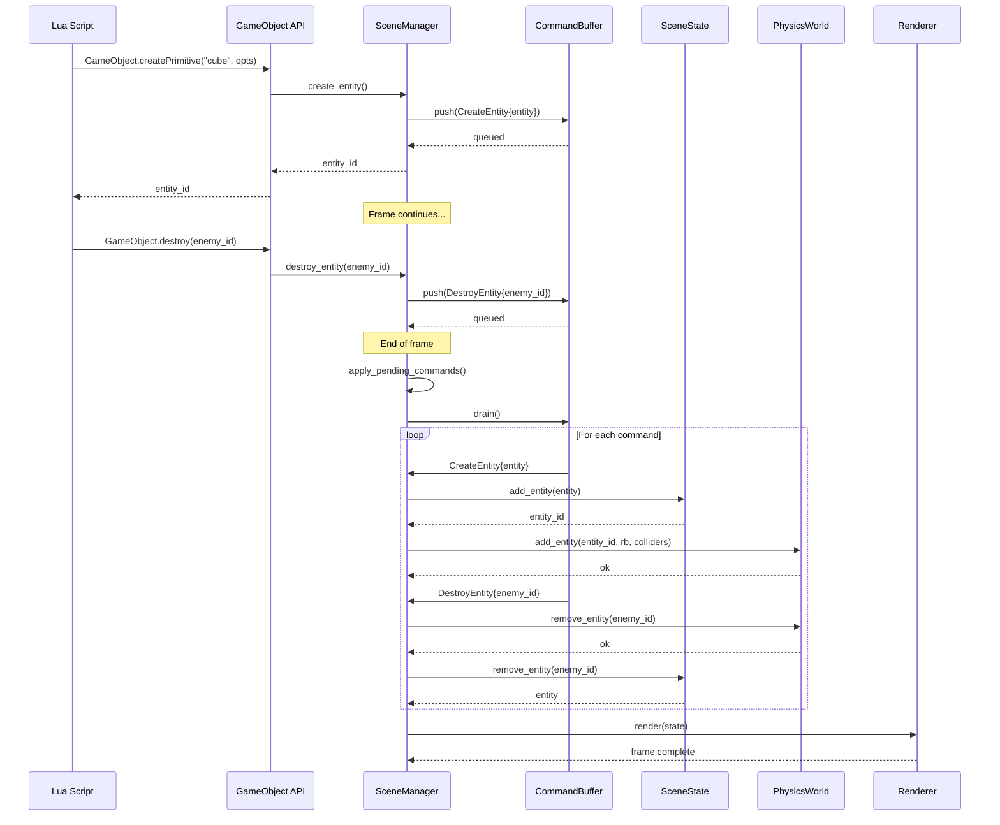

🧠 Planning documents standards rule loaded!

# PRD: Rust Engine — Mutable ECS Architecture for Runtime Entity Operations

## 1. Overview

- **Context & Goals**:

  - Enable runtime entity creation, modification, and destruction in the Rust engine to achieve parity with TypeScript editor capabilities.
  - Support GameObject CRUD API in Lua scripting by providing mutable access to scene state.
  - Maintain performance and safety through Rust's ownership model while allowing controlled mutation during gameplay.
  - Lay the foundation for advanced features like entity pooling, prefab instantiation, and dynamic content loading.

- **Current Pain Points**:
  - Scene is loaded from JSON as `Arc<Scene>` and treated as immutable - scripts have read-only access.
  - No entity creation/destruction at runtime - impossible to implement `GameObject.create()` or `entity.destroy()` in Lua.
  - PhysicsWorld is separate from Scene - no bidirectional sync for dynamically created entities.
  - ScriptSystem only receives `Arc<Scene>` at initialization - cannot react to scene changes.
  - All runtime mutations happen in PhysicsWorld but never sync back to Scene.

## 2. Proposed Solution

- **High‑level Summary**:

  - Introduce `SceneState` wrapper that owns mutable scene data and provides controlled mutation APIs.
  - Implement `EntityCommand` buffer for deferred entity operations (create, destroy, modify components).
  - Create `SceneManager` that owns SceneState, PhysicsWorld, and coordinates mutations across systems.
  - Refactor ScriptSystem to receive `&mut SceneManager` instead of `Arc<Scene>`.
  - Implement entity lifecycle hooks for physics world synchronization.

- **Architecture & Directory Structure**:

```
rust/engine/
├── crates/
│   ├── scene/
│   │   └── src/
│   │       ├── lib.rs                      # (existing) Entity, Scene, EntityId
│   │       ├── scene_state.rs              # NEW: Mutable scene wrapper
│   │       └── entity_commands.rs          # NEW: Command buffer for mutations
│   │
│   ├── ecs-manager/                        # NEW CRATE: Scene mutation manager
│   │   └── src/
│   │       ├── lib.rs                      # Exports
│   │       ├── scene_manager.rs            # Central coordinator
│   │       ├── entity_builder.rs           # Fluent API for entity creation
│   │       └── lifecycle_hooks.rs          # Integration points
│   │
│   ├── scripting/
│   │   └── src/
│   │       ├── script_system.rs            # Refactored to use &mut SceneManager
│   │       └── apis/
│   │           ├── gameobject_api.rs       # NEW: GameObject CRUD for Lua
│   │           ├── query_api.rs            # Updated to support raycasting
│   │           └── entity_api.rs           # Updated for mutations
│   │
│   └── physics/
│       └── src/
│           ├── world.rs                    # Updated for bidirectional sync
│           └── scene_sync.rs               # NEW: Physics <-> Scene sync
│
└── src/
    └── app_threed.rs                       # Use SceneManager instead of Scene

docs/PRDs/rust/5-01-mutable-ecs-architecture-prd.md
```

## 3. Implementation Plan

- **Phase 1: Foundation - SceneState & Commands (1.5 days)**

  1. Create `SceneState` struct wrapping `Scene` with interior mutability via `RefCell<Scene>`.
  2. Implement `EntityCommand` enum (Create, Destroy, ModifyComponent, SetActive).
  3. Create `EntityCommandBuffer` for batching deferred operations.
  4. Add `SceneState::apply_commands()` to process command buffer.
  5. Write unit tests for command buffer execution and validation.

- **Phase 2: SceneManager Integration (2 days)**

  1. Create `vibe-ecs-manager` crate with `SceneManager` struct.
  2. `SceneManager` owns `SceneState`, `PhysicsWorld`, and `EntityCommandBuffer`.
  3. Implement `SceneManager::create_entity()` with fluent `EntityBuilder` API.
  4. Implement `SceneManager::destroy_entity()` with physics cleanup.
  5. Add lifecycle hooks: `on_entity_created`, `on_entity_destroyed`.
  6. Wire physics world to automatically add/remove entities based on commands.

- **Phase 3: ScriptSystem Refactoring (1.5 days)**

  1. Refactor `ScriptSystem::initialize()` to take `&SceneManager` instead of `&Scene`.
  2. Update all API registration functions to receive `&SceneManager`.
  3. Store `Weak<RefCell<SceneManager>>` in script context for mutation access.
  4. Implement script API command buffering (execute at end of frame).
  5. Update existing tests to use SceneManager.

- **Phase 4: GameObject API Implementation (1 day)**

  1. Create `gameobject_api.rs` with `register_gameobject_api(&Lua, &SceneManager)`.
  2. Implement `GameObject.create(name, parent?)` → queues CreateEntity command.
  3. Implement `GameObject.createPrimitive(kind, options)` with default components.
  4. Implement `GameObject.destroy(entityRef)` → queues Destroy command.
  5. Add Lua-side validation and error handling.
  6. Write comprehensive tests for GameObject CRUD operations.

- **Phase 5: Physics Bidirectional Sync (1 day)**

  1. Create `scene_sync.rs` for physics world synchronization.
  2. Implement `PhysicsWorld::add_entity_from_scene()` for newly created entities.
  3. Implement `PhysicsWorld::remove_entity()` cleanup when entities destroyed.
  4. Add transform sync callbacks: physics → scene state on each frame.
  5. Test dynamic entity creation with physics components.

- **Phase 6: AppThreeD Integration (0.5 day)**

  1. Replace `Scene` with `SceneManager` in `AppThreeD::with_scene()`.
  2. Update render loop to call `scene_manager.apply_pending_commands()` each frame.
  3. Ensure command execution happens before physics step.
  4. Update screenshot and debug modes to work with SceneManager.

- **Phase 7: Testing & Validation (1 day)**

  1. Integration tests: create entities via Lua, verify in physics world.
  2. Integration tests: destroy entities, verify cleanup in physics/rendering.
  3. Test component modification propagation to physics.
  4. Benchmark performance impact of command buffer vs direct mutation.
  5. Test edge cases: destroying non-existent entities, circular parenting.

- **Phase 8: Documentation (0.5 day)**
  1. Update `rust/engine/CLAUDE.md` with SceneManager architecture.
  2. Create `crates/ecs-manager/CLAUDE.md` documenting mutation patterns.
  3. Add Lua API documentation for GameObject CRUD.
  4. Document migration path for existing code using Arc<Scene>.

## 4. File and Directory Structures

```
rust/engine/crates/
├── scene/
│   └── src/
│       ├── lib.rs
│       ├── scene_state.rs          # NEW
│       └── entity_commands.rs      # NEW
│
├── ecs-manager/                    # NEW CRATE
│   ├── Cargo.toml
│   ├── CLAUDE.md
│   └── src/
│       ├── lib.rs
│       ├── scene_manager.rs        # Central coordinator
│       ├── entity_builder.rs       # Fluent entity creation API
│       └── lifecycle_hooks.rs      # on_entity_created, on_entity_destroyed
│
├── scripting/
│   └── src/
│       ├── script_system.rs        # Updated
│       └── apis/
│           ├── gameobject_api.rs   # NEW
│           ├── query_api.rs        # Updated for raycasting
│           └── entity_api.rs       # Updated for mutations
│
└── physics/
    └── src/
        ├── world.rs                # Updated
        └── scene_sync.rs           # NEW
```

## 5. Technical Details

### SceneState - Mutable Scene Wrapper

```rust
// crates/scene/src/scene_state.rs
use std::cell::RefCell;
use std::rc::Rc;
use super::{Scene, Entity, EntityId};

pub struct SceneState {
    scene: RefCell<Scene>,
    next_entity_id: RefCell<u32>,
}

impl SceneState {
    pub fn new(scene: Scene) -> Self {
        let max_id = scene.entities.iter()
            .filter_map(|e| e.id)
            .max()
            .unwrap_or(0);

        Self {
            scene: RefCell::new(scene),
            next_entity_id: RefCell::new(max_id + 1),
        }
    }

    pub fn with_scene<F, R>(&self, f: F) -> R
    where F: FnOnce(&Scene) -> R
    {
        f(&self.scene.borrow())
    }

    pub fn add_entity(&self, entity: Entity) -> EntityId {
        let mut scene = self.scene.borrow_mut();
        let entity_id = entity.entity_id().expect("Entity must have ID");
        scene.entities.push(entity);
        entity_id
    }

    pub fn remove_entity(&self, entity_id: EntityId) -> Option<Entity> {
        let mut scene = self.scene.borrow_mut();
        let pos = scene.entities.iter()
            .position(|e| e.entity_id() == Some(entity_id))?;
        Some(scene.entities.remove(pos))
    }

    pub fn find_entity_mut<F>(&self, entity_id: EntityId, f: F)
    where F: FnOnce(&mut Entity)
    {
        let mut scene = self.scene.borrow_mut();
        if let Some(entity) = scene.entities.iter_mut()
            .find(|e| e.entity_id() == Some(entity_id))
        {
            f(entity);
        }
    }
}
```

### EntityCommand - Deferred Mutation Buffer

```rust
// crates/scene/src/entity_commands.rs
use super::{Entity, EntityId, ComponentKindId};
use serde_json::Value;

#[derive(Debug, Clone)]
pub enum EntityCommand {
    CreateEntity {
        entity: Entity,
    },
    DestroyEntity {
        entity_id: EntityId,
    },
    SetComponent {
        entity_id: EntityId,
        component_type: ComponentKindId,
        data: Value,
    },
    RemoveComponent {
        entity_id: EntityId,
        component_type: ComponentKindId,
    },
    SetParent {
        entity_id: EntityId,
        parent_id: Option<EntityId>,
    },
    SetActive {
        entity_id: EntityId,
        active: bool,
    },
}

pub struct EntityCommandBuffer {
    commands: Vec<EntityCommand>,
}

impl EntityCommandBuffer {
    pub fn new() -> Self {
        Self { commands: Vec::new() }
    }

    pub fn push(&mut self, command: EntityCommand) {
        self.commands.push(command);
    }

    pub fn drain(&mut self) -> impl Iterator<Item = EntityCommand> + '_ {
        self.commands.drain(..)
    }

    pub fn is_empty(&self) -> bool {
        self.commands.is_empty()
    }
}
```

### SceneManager - Central Coordinator

```rust
// crates/ecs-manager/src/scene_manager.rs
use vibe_scene::{SceneState, EntityCommandBuffer, EntityId, Entity};
use vibe_physics::PhysicsWorld;
use std::sync::Arc;

pub struct SceneManager {
    state: Arc<SceneState>,
    physics_world: PhysicsWorld,
    command_buffer: EntityCommandBuffer,
}

impl SceneManager {
    pub fn new(scene: Scene) -> Self {
        let state = Arc::new(SceneState::new(scene));
        let physics_world = PhysicsWorld::new();

        Self {
            state,
            physics_world,
            command_buffer: EntityCommandBuffer::new(),
        }
    }

    pub fn create_entity(&mut self) -> EntityBuilder {
        EntityBuilder::new(self)
    }

    pub fn destroy_entity(&mut self, entity_id: EntityId) {
        self.command_buffer.push(EntityCommand::DestroyEntity { entity_id });
    }

    pub fn apply_pending_commands(&mut self) {
        for command in self.command_buffer.drain() {
            match command {
                EntityCommand::CreateEntity { entity } => {
                    let entity_id = self.state.add_entity(entity.clone());

                    // Sync to physics if entity has physics components
                    if entity.has_component("RigidBody") || entity.has_component("MeshCollider") {
                        self.sync_entity_to_physics(entity_id);
                    }
                }
                EntityCommand::DestroyEntity { entity_id } => {
                    // Remove from physics first
                    let _ = self.physics_world.remove_entity(entity_id);

                    // Remove from scene
                    self.state.remove_entity(entity_id);
                }
                EntityCommand::SetComponent { entity_id, component_type, data } => {
                    self.state.find_entity_mut(entity_id, |entity| {
                        entity.components.insert(component_type.as_str().to_string(), data);
                    });
                }
                // ... handle other commands
                _ => {}
            }
        }
    }

    fn sync_entity_to_physics(&mut self, entity_id: EntityId) {
        // Implementation in Phase 5
    }

    pub fn scene_state(&self) -> &Arc<SceneState> {
        &self.state
    }

    pub fn physics_world(&self) -> &PhysicsWorld {
        &self.physics_world
    }

    pub fn physics_world_mut(&mut self) -> &mut PhysicsWorld {
        &mut self.physics_world
    }
}
```

### GameObject Lua API

```rust
// crates/scripting/src/apis/gameobject_api.rs
use mlua::prelude::*;
use std::sync::{Arc, Weak};
use std::cell::RefCell;
use vibe_ecs_manager::SceneManager;

pub fn register_gameobject_api(
    lua: &Lua,
    scene_manager: Weak<RefCell<SceneManager>>,
) -> LuaResult<()> {
    let gameobject = lua.create_table()?;

    // GameObject.create(name?, parent?)
    {
        let manager = scene_manager.clone();
        gameobject.set(
            "create",
            lua.create_function(move |lua, args: LuaMultiValue| {
                let name: Option<String> = args.get(0)
                    .and_then(|v| v.as_str().map(|s| s.to_string()));
                let parent: Option<u64> = args.get(1)
                    .and_then(|v| v.as_u64());

                let manager_rc = manager.upgrade()
                    .ok_or_else(|| LuaError::runtime("SceneManager no longer available"))?;
                let mut mgr = manager_rc.borrow_mut();

                let entity_id = mgr.create_entity()
                    .with_name(name.unwrap_or_else(|| "Entity".to_string()))
                    .with_parent(parent.map(EntityId::new))
                    .build();

                Ok(entity_id.as_u64())
            })?,
        )?;
    }

    // GameObject.createPrimitive(kind, options?)
    {
        let manager = scene_manager.clone();
        gameobject.set(
            "createPrimitive",
            lua.create_function(move |lua, (kind, options): (String, Option<LuaTable>)| {
                let manager_rc = manager.upgrade()
                    .ok_or_else(|| LuaError::runtime("SceneManager no longer available"))?;
                let mut mgr = manager_rc.borrow_mut();

                // Parse options table
                let mut builder = mgr.create_entity()
                    .with_name(&format!("{} Primitive", kind));

                if let Some(opts) = options {
                    // Extract transform
                    if let Ok(transform) = opts.get::<_, LuaTable>("transform") {
                        if let Ok(pos) = transform.get::<_, Vec<f32>>("position") {
                            builder = builder.with_position(pos.try_into().unwrap());
                        }
                        // ... rotation, scale
                    }

                    // Extract material
                    // ... similar pattern
                }

                // Add primitive components based on kind
                builder = builder.with_primitive(&kind);

                let entity_id = builder.build();
                Ok(entity_id.as_u64())
            })?,
        )?;
    }

    // GameObject.destroy(entityRef?)
    {
        let manager = scene_manager.clone();
        gameobject.set(
            "destroy",
            lua.create_function(move |lua, entity_ref: Option<LuaValue>| {
                let manager_rc = manager.upgrade()
                    .ok_or_else(|| LuaError::runtime("SceneManager no longer available"))?;
                let mut mgr = manager_rc.borrow_mut();

                let entity_id = if let Some(ref_val) = entity_ref {
                    // Parse entity reference (number, string guid, or table)
                    parse_entity_ref(ref_val)?
                } else {
                    // Use current entity from script context
                    get_current_entity_id(lua)?
                };

                mgr.destroy_entity(entity_id);
                Ok(())
            })?,
        )?;
    }

    lua.globals().set("GameObject", gameobject)?;
    Ok(())
}

fn parse_entity_ref(val: LuaValue) -> LuaResult<EntityId> {
    match val {
        LuaValue::Number(n) => Ok(EntityId::new(n as u64)),
        LuaValue::String(s) => {
            let guid = s.to_str()?;
            Ok(EntityId::from_persistent_id(guid))
        }
        LuaValue::Table(t) => {
            if let Ok(guid) = t.get::<_, String>("guid") {
                Ok(EntityId::from_persistent_id(&guid))
            } else if let Ok(id) = t.get::<_, u64>("id") {
                Ok(EntityId::new(id))
            } else {
                Err(LuaError::runtime("Invalid entity reference"))
            }
        }
        _ => Err(LuaError::runtime("Entity reference must be number, guid, or table"))
    }
}
```

## 6. Usage Examples

### Example 1: Create Entity from Lua Script

```lua
-- Create a dynamic cube at runtime
function onCreate()
    local cube = GameObject.createPrimitive("cube", {
        name = "Dynamic Cube",
        transform = {
            position = {0, 5, 0},
            rotation = {0, 45, 0},
            scale = {1, 1, 1}
        },
        material = {
            color = "#ff0000",
            metalness = 0.5,
            roughness = 0.5
        },
        physics = {
            body = "dynamic",
            collider = "box",
            mass = 1.0
        }
    })

    console.log("Created cube with ID:", cube)
end
```

### Example 2: Destroy Entity on Collision

```lua
function onCollisionEnter(other)
    if other.tag == "Projectile" then
        GameObject.destroy(other.id)
        GameObject.destroy() -- Destroy self
    end
end
```

### Example 3: Spawn Enemy Wave

```lua
local enemies = {}

function spawnWave(count)
    for i = 1, count do
        local angle = (i / count) * math.pi * 2
        local x = math.cos(angle) * 10
        local z = math.sin(angle) * 10

        local enemy = GameObject.createPrimitive("sphere", {
            name = "Enemy " .. i,
            transform = {
                position = {x, 1, z},
                scale = 0.5
            },
            physics = {
                body = "dynamic",
                collider = "sphere",
                mass = 0.5
            }
        })

        table.insert(enemies, enemy)
    end
end

function onUpdate(dt)
    if input.isKeyDown("Space") then
        spawnWave(5)
    end
end
```

## 7. Testing Strategy

### Unit Tests

- **SceneState mutation tests**:

  - Add entity, verify in scene entities vector
  - Remove entity, verify removal
  - Modify component, verify change propagation
  - Edge case: remove non-existent entity (no crash)

- **EntityCommandBuffer tests**:

  - Queue multiple commands, verify order preservation
  - Test command buffer drain
  - Test all command types serialization

- **EntityBuilder tests**:
  - Fluent API chaining
  - Default value application
  - Component validation

### Integration Tests

- **GameObject CRUD lifecycle**:

  - Create entity via Lua → verify in SceneState
  - Create entity with physics → verify in PhysicsWorld
  - Destroy entity → verify removal from both SceneState and PhysicsWorld
  - Modify component → verify sync to physics

- **Script execution flow**:

  - Commands buffered during script execution
  - Commands applied at frame end
  - Multiple scripts creating entities in same frame

- **Physics synchronization**:
  - Create dynamic entity → moves with gravity
  - Destroy entity → physics body removed
  - Transform changes propagate to physics

## 8. Edge Cases

| Edge Case                                         | Remediation                                          |
| ------------------------------------------------- | ---------------------------------------------------- |
| Destroy entity that doesn't exist                 | Log warning, return gracefully without crashing      |
| Create entity with invalid parent ID              | Log error, create entity without parent              |
| Circular parent reference                         | Detect cycle in SetParent command, reject with error |
| Create entity during entity destruction iteration | Buffer commands, apply after iteration complete      |
| Script creates 1000+ entities in single frame     | Add rate limiting, warn if threshold exceeded        |
| Modify component on destroyed entity              | Check entity existence before applying SetComponent  |
| Physics component added to entity mid-frame       | Sync to PhysicsWorld at command application time     |
| Entity created then destroyed in same frame       | Optimize by canceling both commands                  |

## 9. Sequence Diagram



## 10. Risks & Mitigations

| Risk                                                   | Mitigation                                                                              |
| ------------------------------------------------------ | --------------------------------------------------------------------------------------- |
| **Performance degradation** from command buffering     | Benchmark with 1000+ entities; optimize command processing; consider parallel execution |
| **Memory leaks** from unreleased entities in buffer    | Implement Drop trait on SceneManager; clear buffers on panic; add leak detection tests  |
| **Race conditions** between ScriptSystem and Renderer  | Single-threaded command application; use frame synchronization barriers                 |
| **Breaking changes** to existing code using Arc<Scene> | Provide SceneManager::as_scene() compatibility layer; gradual migration path            |
| **Physics/Rendering desync** after mutations           | Strict command ordering; physics sync happens before rendering; validation tests        |
| **Lua memory pressure** from large entity counts       | Implement entity pooling; add Lua GC tuning; monitor memory usage                       |

## 11. Timeline

**Total Estimated Time: 9 days**

- Phase 1: Foundation - 1.5 days
- Phase 2: SceneManager Integration - 2 days
- Phase 3: ScriptSystem Refactoring - 1.5 days
- Phase 4: GameObject API - 1 day
- Phase 5: Physics Sync - 1 day
- Phase 6: AppThreeD Integration - 0.5 day
- Phase 7: Testing & Validation - 1 day
- Phase 8: Documentation - 0.5 day

## 12. Acceptance Criteria

- [ ] SceneState provides thread-safe mutable access to Scene data
- [ ] EntityCommandBuffer correctly queues and executes all command types
- [ ] SceneManager successfully creates entities with Transform, MeshRenderer, and physics components
- [ ] GameObject.create() in Lua creates entities visible in rendering and physics
- [ ] GameObject.destroy() in Lua removes entities from all systems (scene, physics, rendering)
- [ ] GameObject.createPrimitive() spawns entities with correct geometry and materials
- [ ] Physics components auto-sync when entities created/destroyed
- [ ] All existing tests pass with SceneManager replacing Arc<Scene>
- [ ] No memory leaks detected in 1000 create/destroy cycle test
- [ ] Performance overhead <5% compared to static scene loading
- [ ] GameObject API documented in Lua API reference
- [ ] CLAUDE.md updated with architecture diagrams

## 13. Conclusion

This PRD establishes the foundation for mutable ECS in the Rust engine, unlocking GameObject CRUD APIs for Lua scripting and achieving parity with the TypeScript editor. By introducing SceneManager with command buffering, we maintain Rust's safety guarantees while enabling dynamic entity operations. This architecture is extensible for future features like entity pooling, prefab instantiation, and networked entity sync.

**Next Steps**:

1. Review and approve PRD with team
2. Begin Phase 1 implementation (SceneState & Commands)
3. Create companion PRD for Scripting Runtime Integration (raycasting, etc.)
4. Plan migration strategy for existing engine code

## 14. Assumptions & Dependencies

- **Rust Toolchain**: Requires Rust 1.70+ for latest RefCell optimizations
- **Crate Dependencies**:
  - `mlua` 0.9+ for Lua bindings
  - `rapier3d` for physics simulation
  - `serde_json` for component serialization
- **Scene Format**: Assumes JSON scene format remains stable during migration
- **Threading Model**: Single-threaded main loop; no multi-threaded script execution
- **Memory Model**: RefCell interior mutability acceptable for single-threaded game loop
- **TypeScript Parity**: GameObject API signatures should match TypeScript IGameObjectAPI where possible
- **No Breaking Changes**: Existing Lua scripts without GameObject API continue to work
