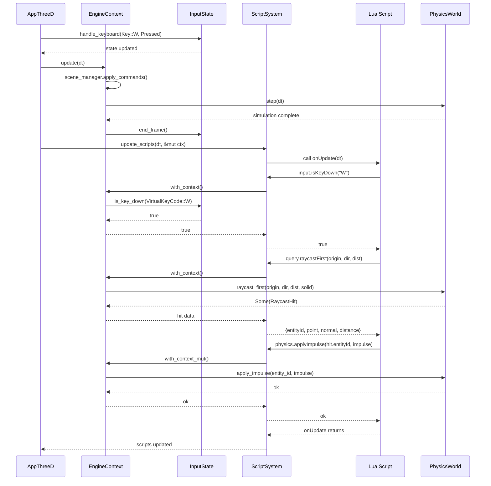

🧠 Planning documents standards rule loaded!

# PRD: Rust Engine — Scripting Runtime Integration with Live Engine State

## 1. Overview

- **Context & Goals**:

  - Enable Lua scripts to access runtime engine state (physics, input, rendering) beyond read-only Scene data.
  - Implement QueryAPI raycasting by providing PhysicsWorld access to scripting layer.
  - Support advanced gameplay APIs (Camera, Material, Mesh, Physics) that require engine system access.
  - Maintain performance through efficient state sharing and minimal Lua ↔ Rust crossing overhead.

- **Current Pain Points**:
  - QueryAPI can't implement `raycastFirst/raycastAll` - PhysicsWorld not accessible to Lua.
  - Input API is stubbed - no access to real keyboard/mouse state from winit event loop.
  - Camera API can't modify active camera - rendering state not exposed to scripts.
  - Material/Mesh APIs impossible - renderer state not accessible.
  - Scripts execute in isolation - can't query or influence runtime systems.

## 2. Proposed Solution

- **High‑level Summary**:

  - Introduce `EngineContext` that bundles all runtime systems (SceneManager, InputState, CameraState, RenderState).
  - Refactor ScriptSystem to receive `&mut EngineContext` instead of just `&Scene`.
  - Implement `ScriptContext` builder that provides controlled access to engine systems via Lua APIs.
  - Enable QueryAPI raycasting by passing PhysicsWorld reference through EngineContext.
  - Implement Input, Camera, Material APIs with real engine state integration.

- **Architecture & Directory Structure**:

```
rust/engine/
├── crates/
│   ├── engine-context/                   # NEW CRATE: Unified engine state
│   │   └── src/
│   │       ├── lib.rs                    # Exports
│   │       ├── engine_context.rs         # Bundle all runtime systems
│   │       ├── input_state.rs            # Keyboard/mouse state
│   │       ├── camera_state.rs           # Active camera management
│   │       └── render_state.rs           # Material/mesh/texture state
│   │
│   ├── scripting/
│   │   └── src/
│   │       ├── script_system.rs          # Updated to use EngineContext
│   │       ├── script_context.rs         # NEW: Per-script state wrapper
│   │       └── apis/
│   │           ├── query_api.rs          # Raycasting implementation
│   │           ├── input_api.rs          # Real input state
│   │           ├── camera_api.rs         # Camera control
│   │           ├── material_api.rs       # Material modification
│   │           ├── physics_api.rs        # Force/impulse application
│   │           └── mesh_api.rs           # Runtime mesh queries
│   │
│   └── ecs-manager/                      # From PRD 5-01
│       └── src/
│           └── scene_manager.rs          # Part of EngineContext
│
└── src/
    ├── app_threed.rs                     # Build EngineContext from all systems
    └── input_handler.rs                  # NEW: Input event aggregation

docs/PRDs/rust/5-02-scripting-runtime-integration-prd.md
```

## 3. Implementation Plan

- **Phase 1: EngineContext Foundation (1 day)**

  1. Create `vibe-engine-context` crate with `EngineContext` struct.
  2. EngineContext owns: `SceneManager`, `InputState`, `CameraState`, `RenderState`.
  3. Implement builder pattern for EngineContext initialization.
  4. Add `EngineContext::update(dt)` for per-frame updates.
  5. Write unit tests for context state management.

- **Phase 2: InputState & Event Handling (1 day)**

  1. Create `InputState` to track keyboard/mouse state from winit events.
  2. Implement `InputHandler` in AppThreeD to aggregate events into InputState.
  3. Add `InputState::is_key_down(key)`, `is_mouse_button_down(button)`, `mouse_position()`.
  4. Update AppThreeD event loop to feed events to InputState.
  5. Test input state persistence across frames.

- **Phase 3: ScriptContext with EngineContext (1.5 days)**

  1. Create `ScriptContext` wrapper around `EngineContext` for per-script isolation.
  2. Store `Weak<RefCell<EngineContext>>` in Lua registry for API access.
  3. Implement safe accessor methods preventing concurrent mutable borrows.
  4. Update `ScriptSystem::initialize()` to take `&EngineContext`.
  5. Update all API registration functions to receive `&ScriptContext`.
  6. Test multi-script execution with shared context.

- **Phase 4: QueryAPI Raycasting (1 day)**

  1. Update `register_query_api()` to receive `&ScriptContext`.
  2. Implement `query.raycastFirst(origin, dir, distance)` using PhysicsWorld from context.
  3. Implement `query.raycastAll(origin, dir, distance)` with sorted results.
  4. Return Lua tables with hit info: `{ entityId, point, normal, distance }`.
  5. Add tests for raycasting against static/dynamic entities.

- **Phase 5: Input API Implementation (0.5 day)**

  1. Update `register_input_api()` to use InputState from context.
  2. Implement `input.isKeyDown(key)` with VirtualKeyCode string mapping.
  3. Implement `input.isMouseButtonDown(button)` for Left/Right/Middle.
  4. Implement `input.getMousePosition()` returning `{x, y}`.
  5. Test input APIs with real keyboard/mouse events.

- **Phase 6: Camera API Implementation (1 day)**

  1. Create `CameraState` managing active camera entity and projection.
  2. Implement `camera.getPosition()`, `camera.getRotation()` reading from active camera entity.
  3. Implement `camera.setPosition()`, `camera.setRotation()` modifying Transform via SceneManager.
  4. Implement `camera.screenToWorld(screenPos)` and `camera.worldToScreen(worldPos)`.
  5. Test camera manipulation and coordinate conversion.

- **Phase 7: Material API Implementation (0.75 day)**

  1. Create `RenderState` tracking loaded materials.
  2. Implement `material.setColor(entityRef, color)` queuing component mutation.
  3. Implement `material.setMetalness/setRoughness(entityRef, value)`.
  4. Implement `material.get(entityRef)` returning material properties.
  5. Test material changes propagate to renderer.

- **Phase 8: Physics API Implementation (0.75 day)**

  1. Update `register_physics_api()` to access PhysicsWorld from context.
  2. Implement `physics.applyForce(entityRef, force)` using PhysicsWorld.
  3. Implement `physics.applyImpulse(entityRef, impulse)`.
  4. Implement `physics.setVelocity(entityRef, velocity)`.
  5. Test physics manipulation on dynamic bodies.

- **Phase 9: Integration & Testing (1 day)**

  1. Integration test: Raycast from script, hit dynamic entity, apply impulse.
  2. Integration test: Input-driven camera movement.
  3. Integration test: Material changes on collision.
  4. Benchmark script execution overhead with engine context.
  5. Test error handling when accessing destroyed entities.

- **Phase 10: Documentation (0.5 day)**
  1. Update `crates/scripting/CLAUDE.md` with EngineContext architecture.
  2. Document each API's access patterns and safety guarantees.
  3. Create Lua API examples for raycasting, input, camera, materials.
  4. Update ROADMAP.md marking QueryAPI raycasting as complete.

## 4. File and Directory Structures

```
rust/engine/crates/
├── engine-context/              # NEW CRATE
│   ├── Cargo.toml
│   ├── CLAUDE.md
│   └── src/
│       ├── lib.rs
│       ├── engine_context.rs    # Central state bundle
│       ├── input_state.rs       # Keyboard/mouse tracking
│       ├── camera_state.rs      # Active camera management
│       └── render_state.rs      # Material/mesh/texture state
│
├── scripting/
│   └── src/
│       ├── script_system.rs     # Updated for EngineContext
│       ├── script_context.rs    # NEW: Per-script wrapper
│       └── apis/
│           ├── query_api.rs     # Raycasting enabled
│           ├── input_api.rs     # Real implementation
│           ├── camera_api.rs    # Real implementation
│           ├── material_api.rs  # Real implementation
│           ├── physics_api.rs   # Real implementation
│           └── mesh_api.rs      # NEW
│
└── ecs-manager/
    └── src/
        └── scene_manager.rs     # Part of EngineContext

rust/engine/src/
├── app_threed.rs                # Build EngineContext
└── input_handler.rs             # NEW
```

## 5. Technical Details

### EngineContext - Unified Runtime State

```rust
// crates/engine-context/src/engine_context.rs
use vibe_ecs_manager::SceneManager;
use vibe_physics::PhysicsWorld;
use super::{InputState, CameraState, RenderState};

pub struct EngineContext {
    pub scene_manager: SceneManager,
    pub input_state: InputState,
    pub camera_state: CameraState,
    pub render_state: RenderState,
}

impl EngineContext {
    pub fn new(scene_manager: SceneManager) -> Self {
        Self {
            scene_manager,
            input_state: InputState::new(),
            camera_state: CameraState::new(),
            render_state: RenderState::new(),
        }
    }

    pub fn update(&mut self, dt: f32) {
        // Apply pending scene mutations
        self.scene_manager.apply_pending_commands();

        // Step physics simulation
        self.scene_manager.physics_world_mut().step(dt);

        // Update camera from active entity
        self.camera_state.sync_from_scene(&self.scene_manager);

        // Clear frame-based input state
        self.input_state.end_frame();
    }

    pub fn physics_world(&self) -> &PhysicsWorld {
        self.scene_manager.physics_world()
    }
}
```

### InputState - Keyboard & Mouse Tracking

```rust
// crates/engine-context/src/input_state.rs
use winit::event::{VirtualKeyCode, MouseButton, ElementState};
use std::collections::HashSet;

pub struct InputState {
    keys_down: HashSet<VirtualKeyCode>,
    mouse_buttons_down: HashSet<MouseButton>,
    mouse_position: (f64, f64),
    mouse_delta: (f64, f64),
}

impl InputState {
    pub fn new() -> Self {
        Self {
            keys_down: HashSet::new(),
            mouse_buttons_down: HashSet::new(),
            mouse_position: (0.0, 0.0),
            mouse_delta: (0.0, 0.0),
        }
    }

    pub fn handle_keyboard(&mut self, key: VirtualKeyCode, state: ElementState) {
        match state {
            ElementState::Pressed => { self.keys_down.insert(key); }
            ElementState::Released => { self.keys_down.remove(&key); }
        }
    }

    pub fn handle_mouse_button(&mut self, button: MouseButton, state: ElementState) {
        match state {
            ElementState::Pressed => { self.mouse_buttons_down.insert(button); }
            ElementState::Released => { self.mouse_buttons_down.remove(&button); }
        }
    }

    pub fn handle_mouse_motion(&mut self, x: f64, y: f64) {
        let delta = (x - self.mouse_position.0, y - self.mouse_position.1);
        self.mouse_position = (x, y);
        self.mouse_delta = delta;
    }

    pub fn is_key_down(&self, key: VirtualKeyCode) -> bool {
        self.keys_down.contains(&key)
    }

    pub fn is_mouse_button_down(&self, button: MouseButton) -> bool {
        self.mouse_buttons_down.contains(&button)
    }

    pub fn mouse_position(&self) -> (f64, f64) {
        self.mouse_position
    }

    pub fn end_frame(&mut self) {
        self.mouse_delta = (0.0, 0.0);
    }
}
```

### ScriptContext - Safe Engine Access

```rust
// crates/scripting/src/script_context.rs
use std::sync::{Arc, Weak};
use std::cell::RefCell;
use vibe_engine_context::EngineContext;
use mlua::prelude::*;

pub struct ScriptContext {
    engine_context: Weak<RefCell<EngineContext>>,
    entity_id: u64,
}

impl ScriptContext {
    pub fn new(engine_context: Weak<RefCell<EngineContext>>, entity_id: u64) -> Self {
        Self { engine_context, entity_id }
    }

    pub fn with_context<F, R>(&self, f: F) -> LuaResult<R>
    where F: FnOnce(&EngineContext) -> R
    {
        let ctx = self.engine_context.upgrade()
            .ok_or_else(|| LuaError::runtime("Engine context no longer available"))?;
        let ctx_ref = ctx.borrow();
        Ok(f(&ctx_ref))
    }

    pub fn with_context_mut<F, R>(&self, f: F) -> LuaResult<R>
    where F: FnOnce(&mut EngineContext) -> R
    {
        let ctx = self.engine_context.upgrade()
            .ok_or_else(|| LuaError::runtime("Engine context no longer available"))?;
        let mut ctx_ref = ctx.borrow_mut();
        Ok(f(&mut ctx_ref))
    }

    pub fn entity_id(&self) -> u64 {
        self.entity_id
    }
}
```

### QueryAPI Raycasting Implementation

```rust
// crates/scripting/src/apis/query_api.rs (updated)
use mlua::prelude::*;
use vibe_engine_context::EngineContext;
use super::super::script_context::ScriptContext;

pub fn register_query_api(lua: &Lua, context: &ScriptContext) -> LuaResult<()> {
    let query = lua.create_table()?;

    // query.raycastFirst(origin, direction, distance?)
    {
        let ctx = context.clone();
        query.set(
            "raycastFirst",
            lua.create_function(move |lua, args: LuaMultiValue| {
                // Parse arguments
                let origin: LuaTable = args.get(0)
                    .ok_or_else(|| LuaError::runtime("origin required"))?
                    .as_table()
                    .ok_or_else(|| LuaError::runtime("origin must be table"))?
                    .clone();

                let direction: LuaTable = args.get(1)
                    .ok_or_else(|| LuaError::runtime("direction required"))?
                    .as_table()
                    .ok_or_else(|| LuaError::runtime("direction must be table"))?
                    .clone();

                let max_distance: f32 = args.get(2)
                    .and_then(|v| v.as_f32())
                    .unwrap_or(1000.0);

                // Convert Lua tables to Vec3
                let origin_vec = table_to_vec3(&origin)?;
                let dir_vec = table_to_vec3(&direction)?;

                // Perform raycast using PhysicsWorld
                ctx.with_context(|engine_ctx| {
                    if let Some(hit) = engine_ctx.physics_world().raycast_first(
                        origin_vec,
                        dir_vec,
                        max_distance,
                        true, // solid
                    ) {
                        let result = lua.create_table()?;
                        result.set("entityId", hit.entity_id.as_u64())?;
                        result.set("point", vec3_to_table(lua, hit.point)?)?;
                        result.set("normal", vec3_to_table(lua, hit.normal)?)?;
                        result.set("distance", hit.distance)?;
                        Ok(LuaValue::Table(result))
                    } else {
                        Ok(LuaValue::Nil)
                    }
                })?
            })?,
        )?;
    }

    // query.raycastAll(origin, direction, distance?)
    {
        let ctx = context.clone();
        query.set(
            "raycastAll",
            lua.create_function(move |lua, args: LuaMultiValue| {
                let origin: LuaTable = args.get(0)?.as_table()?.clone();
                let direction: LuaTable = args.get(1)?.as_table()?.clone();
                let max_distance: f32 = args.get(2).and_then(|v| v.as_f32()).unwrap_or(1000.0);

                let origin_vec = table_to_vec3(&origin)?;
                let dir_vec = table_to_vec3(&direction)?;

                ctx.with_context(|engine_ctx| {
                    let hits = engine_ctx.physics_world().raycast_all(
                        origin_vec,
                        dir_vec,
                        max_distance,
                        true,
                    );

                    let result = lua.create_table()?;
                    for (i, hit) in hits.iter().enumerate() {
                        let hit_table = lua.create_table()?;
                        hit_table.set("entityId", hit.entity_id.as_u64())?;
                        hit_table.set("point", vec3_to_table(lua, hit.point)?)?;
                        hit_table.set("normal", vec3_to_table(lua, hit.normal)?)?;
                        hit_table.set("distance", hit.distance)?;
                        result.set(i + 1, hit_table)?;
                    }
                    Ok(LuaValue::Table(result))
                })?
            })?,
        )?;
    }

    lua.globals().set("query", query)?;
    Ok(())
}

fn table_to_vec3(table: &LuaTable) -> LuaResult<glam::Vec3> {
    let x: f32 = table.get(1)?;
    let y: f32 = table.get(2)?;
    let z: f32 = table.get(3)?;
    Ok(glam::Vec3::new(x, y, z))
}

fn vec3_to_table(lua: &Lua, vec: glam::Vec3) -> LuaResult<LuaTable> {
    let table = lua.create_table()?;
    table.set(1, vec.x)?;
    table.set(2, vec.y)?;
    table.set(3, vec.z)?;
    Ok(table)
}
```

### Input API Real Implementation

```rust
// crates/scripting/src/apis/input_api.rs (updated)
use mlua::prelude::*;
use super::super::script_context::ScriptContext;

pub fn register_input_api(lua: &Lua, context: &ScriptContext) -> LuaResult<()> {
    let input = lua.create_table()?;

    // input.isKeyDown(key)
    {
        let ctx = context.clone();
        input.set(
            "isKeyDown",
            lua.create_function(move |_, key: String| {
                ctx.with_context(|engine_ctx| {
                    let key_code = parse_key_string(&key)?;
                    Ok(engine_ctx.input_state.is_key_down(key_code))
                })
            })?,
        )?;
    }

    // input.isMouseButtonDown(button)
    {
        let ctx = context.clone();
        input.set(
            "isMouseButtonDown",
            lua.create_function(move |_, button: String| {
                ctx.with_context(|engine_ctx| {
                    let mouse_button = parse_mouse_button(&button)?;
                    Ok(engine_ctx.input_state.is_mouse_button_down(mouse_button))
                })
            })?,
        )?;
    }

    // input.getMousePosition()
    {
        let ctx = context.clone();
        input.set(
            "getMousePosition",
            lua.create_function(move |lua, ()| {
                ctx.with_context(|engine_ctx| {
                    let (x, y) = engine_ctx.input_state.mouse_position();
                    let table = lua.create_table()?;
                    table.set("x", x)?;
                    table.set("y", y)?;
                    Ok(table)
                })
            })?,
        )?;
    }

    lua.globals().set("input", input)?;
    Ok(())
}

fn parse_key_string(s: &str) -> LuaResult<winit::event::VirtualKeyCode> {
    use winit::event::VirtualKeyCode;
    match s.to_uppercase().as_str() {
        "W" => Ok(VirtualKeyCode::W),
        "A" => Ok(VirtualKeyCode::A),
        "S" => Ok(VirtualKeyCode::S),
        "D" => Ok(VirtualKeyCode::D),
        "SPACE" => Ok(VirtualKeyCode::Space),
        "ESCAPE" => Ok(VirtualKeyCode::Escape),
        // ... add all keys
        _ => Err(LuaError::runtime(format!("Unknown key: {}", s)))
    }
}

fn parse_mouse_button(s: &str) -> LuaResult<winit::event::MouseButton> {
    use winit::event::MouseButton;
    match s.to_lowercase().as_str() {
        "left" => Ok(MouseButton::Left),
        "right" => Ok(MouseButton::Right),
        "middle" => Ok(MouseButton::Middle),
        _ => Err(LuaError::runtime(format!("Unknown mouse button: {}", s)))
    }
}
```

## 6. Usage Examples

### Example 1: Raycasting for Interaction

```lua
function onUpdate(dt)
    if input.isMouseButtonDown("Left") then
        -- Get camera position and direction
        local camPos = camera.getPosition()
        local camRot = camera.getRotation()

        -- Calculate forward direction from camera rotation
        local forward = math.rotateVector({0, 0, -1}, camRot)

        -- Raycast from camera
        local hit = query.raycastFirst(camPos, forward, 100)

        if hit then
            console.log("Hit entity:", hit.entityId, "at distance:", hit.distance)

            -- Apply impulse to hit entity
            physics.applyImpulse(hit.entityId, {0, 10, 0})

            -- Change material color on hit
            material.setColor(hit.entityId, "#ff0000")
        end
    end
end
```

### Example 2: Input-Driven Player Movement

```lua
local moveSpeed = 5.0

function onUpdate(dt)
    local velocity = {0, 0, 0}

    -- Keyboard movement
    if input.isKeyDown("W") then
        velocity[3] = velocity[3] - moveSpeed
    end
    if input.isKeyDown("S") then
        velocity[3] = velocity[3] + moveSpeed
    end
    if input.isKeyDown("A") then
        velocity[1] = velocity[1] - moveSpeed
    end
    if input.isKeyDown("D") then
        velocity[1] = velocity[1] + moveSpeed
    end

    -- Apply velocity to physics body
    if velocity[1] ~= 0 or velocity[3] ~= 0 then
        physics.setVelocity(entity.id, velocity)
    end

    -- Raycast down to check if grounded
    local groundHit = query.raycastFirst(
        entity.getPosition(),
        {0, -1, 0},  -- down
        1.1          -- slightly more than player height
    )

    if groundHit and input.isKeyDown("Space") then
        -- Jump
        physics.applyImpulse(entity.id, {0, 500, 0})
    end
end
```

### Example 3: Camera Follow with Raycasting

```lua
local targetDistance = 10
local cameraHeight = 5

function onUpdate(dt)
    local playerPos = entity.getPosition()

    -- Calculate desired camera position
    local desiredPos = {
        playerPos[1],
        playerPos[2] + cameraHeight,
        playerPos[3] + targetDistance
    }

    -- Raycast from player to desired camera position
    local direction = math.normalize({
        desiredPos[1] - playerPos[1],
        desiredPos[2] - playerPos[2],
        desiredPos[3] - playerPos[3]
    })

    local hit = query.raycastFirst(playerPos, direction, targetDistance)

    local finalPos = desiredPos
    if hit then
        -- Camera would collide, pull it closer
        finalPos = hit.point
    end

    camera.setPosition(finalPos)
    camera.lookAt(playerPos)
end
```

## 7. Testing Strategy

### Unit Tests

- **EngineContext tests**:

  - Initialize with SceneManager
  - Update cycle applies commands and steps physics
  - Accessor methods return correct system references

- **InputState tests**:

  - Keyboard press/release tracking
  - Mouse button press/release tracking
  - Mouse position updates
  - Frame-based state reset

- **ScriptContext tests**:
  - Safe borrow checking (no concurrent mutable access)
  - Error handling when context dropped
  - Entity ID tracking per script

### Integration Tests

- **QueryAPI raycasting**:

  - Raycast hits static entity
  - Raycast hits dynamic entity
  - RaycastAll returns multiple sorted hits
  - Raycast misses returns nil

- **Input API**:

  - Keyboard state changes reflected in script
  - Mouse button state changes reflected in script
  - Mouse position updates in script

- **Camera API**:

  - Camera position/rotation modification
  - Screen-to-world and world-to-screen conversion
  - Camera follows entity transform

- **Cross-API integration**:
  - Raycast → get entity → apply physics force
  - Input → camera movement → raycast from camera
  - Material changes persist across frames

## 8. Edge Cases

| Edge Case                                      | Remediation                                         |
| ---------------------------------------------- | --------------------------------------------------- |
| Raycast from script while physics stepping     | Queue raycast, execute after physics step completes |
| Access engine context after script destroyed   | Return error, don't crash; check Weak upgrade       |
| Multiple scripts modifying same material       | Last write wins; consider command ordering          |
| Raycast hits entity being destroyed this frame | Check entity existence before returning hit         |
| Input polling frequency mismatch with physics  | Input state persists across frame; stable reads     |
| Camera manipulation during rendering           | Queue camera changes for next frame                 |
| Scripts running in parallel (future)           | Use RwLock instead of RefCell for EngineContext     |
| Very long raycasts (1000+ distance)            | Clamp max distance, warn on excessive values        |

## 9. Sequence Diagram



## 10. Risks & Mitigations

| Risk                                                 | Mitigation                                                     |
| ---------------------------------------------------- | -------------------------------------------------------------- |
| **Borrow checker violations** from concurrent access | Use RefCell with runtime checks; clear borrowing rules in docs |
| **Performance overhead** from Lua ↔ Rust crossings  | Benchmark critical paths; cache frequently accessed data       |
| **Script stability** when engine context changes     | Versioned context API; backward compatibility layer            |
| **Memory safety** with weak references               | Always check Weak::upgrade(); graceful error on None           |
| **Input lag** from event buffering                   | Process input events immediately; minimal buffering            |
| **Raycast performance** with many queries            | BVH acceleration structure (future); limit queries per frame   |
| **Thread safety** for future parallelism             | Design for Arc<RwLock> upgrade path from start                 |

## 11. Timeline

**Total Estimated Time: 8 days**

- Phase 1: EngineContext Foundation - 1 day
- Phase 2: InputState & Event Handling - 1 day
- Phase 3: ScriptContext Integration - 1.5 days
- Phase 4: QueryAPI Raycasting - 1 day
- Phase 5: Input API - 0.5 day
- Phase 6: Camera API - 1 day
- Phase 7: Material API - 0.75 day
- Phase 8: Physics API - 0.75 day
- Phase 9: Integration & Testing - 1 day
- Phase 10: Documentation - 0.5 day

## 12. Acceptance Criteria

- [ ] EngineContext bundles all runtime systems in single struct
- [ ] InputState tracks keyboard/mouse events from winit
- [ ] ScriptContext provides safe access to EngineContext from Lua
- [ ] query.raycastFirst() returns hit info from PhysicsWorld
- [ ] query.raycastAll() returns sorted array of hits
- [ ] input.isKeyDown() reflects real keyboard state
- [ ] input.getMousePosition() returns current mouse coordinates
- [ ] camera.setPosition/setRotation() modifies active camera
- [ ] material.setColor() changes entity material properties
- [ ] physics.applyForce/applyImpulse() affects rigid bodies
- [ ] All APIs documented in Lua reference
- [ ] Performance overhead <10% vs no-script baseline
- [ ] No memory leaks in 10-minute gameplay test
- [ ] Concurrent script execution doesn't cause crashes

## 13. Conclusion

This PRD establishes runtime integration between Lua scripting and the Rust engine's live state, enabling advanced gameplay APIs. By introducing EngineContext and ScriptContext, we provide controlled access to physics, input, camera, and rendering systems while maintaining Rust's safety guarantees. This unlocks raycasting, input handling, camera control, and material manipulation from Lua scripts.

**Next Steps**:

1. Implement in conjunction with PRD 5-01 (Mutable ECS)
2. Begin with EngineContext and InputState (Phases 1-2)
3. Prioritize QueryAPI raycasting (Phase 4) as it has highest gameplay impact
4. Consider BVH acceleration for raycasting in future PRD

## 14. Assumptions & Dependencies

- **Depends on**: PRD 5-01 (Mutable ECS) for SceneManager
- **Rust Toolchain**: 1.70+ for RefCell optimizations
- **Crate Dependencies**:
  - `mlua` 0.9+ for Lua bindings
  - `winit` for input events
  - `glam` for vector math
  - `rapier3d` for raycasting
- **Threading Model**: Single-threaded main loop; RefCell safe
- **Input Events**: winit DeviceEvent and WindowEvent only
- **Camera Model**: Single active camera per scene
- **No Breaking Changes**: Existing Lua scripts continue to work
- **TypeScript Parity**: API signatures match where possible
