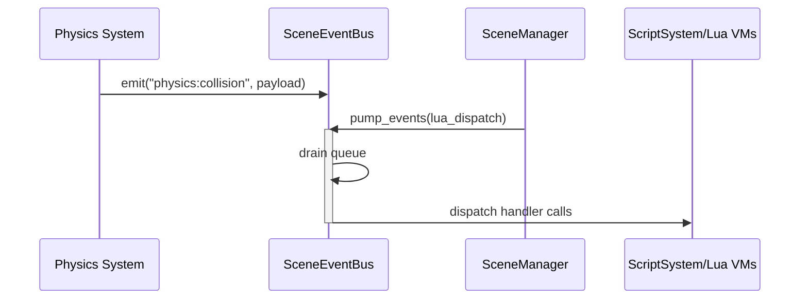

🧠 Planning documents standards rule loaded!

# PRD: Rust Engine — Cross‑Entity Event API

## 1. Overview

- **Context & Goals**

  - Provide a native Rust Event API for cross‑entity, cross‑system communication in the engine runtime, harmonizing with the existing TypeScript editor bus and Lua scripting APIs.
  - Enable decoupled systems (physics, scene, audio, scripting, renderer) to publish/subscribe to events without tight coupling or direct references.
  - Ensure safe delivery to Lua VMs and support future WASM/TS bridging via `wasm-bridge`.
  - Offer predictable lifetime and cleanup tied to entities and scenes to avoid leaks.

- **Current Pain Points**
  - Lua `event_api.rs` is a global singleton with ad‑hoc cleanup and no integration with engine ECS lifecycle.
  - No unified engine‑level event bus for Rust systems; physics has a local queue but no general dispatch across subsystems.
  - Cross‑VM delivery to multiple Lua contexts is fragile without a central, frame‑driven dispatcher.
  - No typed contract for engine events; payloads are loosely typed and conversions are ad‑hoc.

## 2. Proposed Solution

- **High‑level Summary**

  - Introduce a new `vibe-events` crate providing a frame‑driven, thread‑safe `SceneEventBus` owned by `SceneManager`.
  - Support global and targeted events (to specific `EntityId`s), with per‑entity subscription tracking and automatic cleanup on entity destroy.
  - Adopt a non‑blocking producer model with an internal event queue (crossbeam channels) and a deterministic `pump_events()` step each frame.
  - Unify Lua `events:on/off/emit` to delegate to `SceneEventBus` (remove global statics), and add bridges for physics and other systems.
  - Provide a minimal typed envelope (`EventKey`, `EventPayload`) with serde support; allow strongly‑typed Rust enums per domain (e.g., physics) to serialize/deserialize through the envelope.

- **Architecture & Directory Structure**

```text
rust/engine/
├── crates/
│   ├── events/                      # NEW: engine-wide event bus
│   │   └── src/
│   │       ├── lib.rs               # re-exports
│   │       ├── bus.rs               # SceneEventBus, subscription management
│   │       ├── types.rs             # EventKey, EventPayload, SubscriberId
│   │       └── targeted.rs          # helpers for per-entity targeting
│   ├── scripting/
│   │   └── src/apis/event_api.rs    # EDIT: delegate to SceneEventBus
│   ├── physics/
│   │   └── src/events.rs            # INTEGRATE: publish physics events to bus
│   ├── ecs-manager/
│   │   └── src/scene_manager.rs     # OWN bus; call pump_events() per frame
│   └── wasm-bridge/
│       └── src/bridge.rs            # OPTIONAL: surface event hooks across WASM
└── src/
    └── app_threed.rs                # Ensure game loop pumps events each tick
```

## 3. Implementation Plan

### Phase 1: Foundations (0.5 day)

1. Create `crates/events` with `SceneEventBus` and core types.
2. Define `EventKey` (interned `String` or `Cow<'static, str>`), `EventPayload` (`serde_json::Value`), `SubscriberId` (`u64`).
3. Implement subscription maps and per‑entity subscription index.
4. Add `emit()` and `emit_to(entity_id, ...)` producing items into a `crossbeam_channel::Sender`.

### Phase 2: Runtime Integration (0.5 day)

1. Add `SceneEventBus` to `SceneManager` and expose `events()` getter.
2. Implement `pump_events(&mut self, script_system: &mut ScriptSystem)` to drain queue and dispatch to Lua handlers safely on the main thread.
3. Wire `app_threed` or equivalent main loop to call `pump_events()` once per frame (after systems update).

### Phase 3: Lua API Refactor (0.5 day)

1. Refactor `scripting/src/apis/event_api.rs` to delegate `on/off/emit` to `SceneEventBus` rather than global statics.
2. Track handler lifetimes per entity; automatically unsubscribe in `cleanup_event_api()` and on entity destroy hooks.
3. Add basic payload conversion between `mlua::Value` and `serde_json::Value`.

### Phase 4: Physics and System Bridges (0.5 day)

1. Publish `CollisionEvent` from `physics::events` via the bus using standardized keys (e.g., `"physics:collision"`).
2. Provide helper adapters for other systems (audio, assets) as needed.
3. Add per‑entity targeting examples (e.g., deliver to involved entities only).

### Phase 5: Type Safety & Tests (0.5 day)

1. Define event key constants for core domains to reduce typos.
2. Unit tests for `SceneEventBus` (subscribe/unsubscribe/emit/targeting/cleanup).
3. Integration tests validating end‑to‑end delivery to Lua handlers and physics publishing.

## 4. File and Directory Structures

```text
/rust/engine/crates/events/
├── Cargo.toml
└── src/
    ├── lib.rs
    ├── bus.rs
    ├── types.rs
    └── targeted.rs
```

## 5. Technical Details

```rust
// crates/events/src/types.rs
use serde::{Deserialize, Serialize};

pub type SubscriberId = u64;

#[derive(Clone, Debug, PartialEq, Eq, Hash, Serialize, Deserialize)]
pub struct EventKey(pub String);

#[derive(Clone, Debug, Serialize, Deserialize)]
pub struct EventEnvelope {
    pub key: EventKey,
    pub target: Option<vibe_scene::EntityId>,
    pub payload: serde_json::Value,
}
```

```rust
// crates/events/src/bus.rs
use std::collections::HashMap;
use std::sync::{Arc, RwLock};
use crossbeam_channel::{unbounded, Receiver, Sender};
use crate::types::{EventEnvelope, EventKey, SubscriberId};

type HandlerFn = Arc<dyn Fn(&EventEnvelope) + Send + Sync + 'static>;

pub struct SceneEventBus {
    tx: Sender<EventEnvelope>,
    rx: Receiver<EventEnvelope>,
    // key -> handlers
    handlers: RwLock<HashMap<EventKey, Vec<(SubscriberId, HandlerFn)>>>,
    // entity -> subscriber ids
    per_entity: RwLock<HashMap<vibe_scene::EntityId, Vec<SubscriberId>>>,
    // reverse index: subscriber -> key
    reverse: RwLock<HashMap<SubscriberId, EventKey>>,
    next_id: RwLock<SubscriberId>,
}

impl SceneEventBus {
    pub fn new() -> Self {
        let (tx, rx) = unbounded();
        Self {
            tx,
            rx,
            handlers: RwLock::new(HashMap::new()),
            per_entity: RwLock::new(HashMap::new()),
            reverse: RwLock::new(HashMap::new()),
            next_id: RwLock::new(0),
        }
    }

    pub fn on(
        &self,
        key: EventKey,
        owner: Option<vibe_scene::EntityId>,
        handler: HandlerFn,
    ) -> SubscriberId {
        let mut id_guard = self.next_id.write().unwrap();
        *id_guard += 1;
        let id = *id_guard;
        drop(id_guard);

        {
            let mut map = self.handlers.write().unwrap();
            map.entry(key.clone())
                .or_default()
                .push((id, handler));
        }

        if let Some(eid) = owner {
            let mut per = self.per_entity.write().unwrap();
            per.entry(eid).or_default().push(id);
        }

        self.reverse.write().unwrap().insert(id, key);
        id
    }

    pub fn off(&self, id: SubscriberId) {
        if let Some(key) = self.reverse.write().unwrap().remove(&id) {
            let mut map = self.handlers.write().unwrap();
            if let Some(list) = map.get_mut(&key) {
                list.retain(|(sid, _)| *sid != id);
            }
        }
    }

    pub fn emit(&self, key: impl Into<EventKey>, payload: serde_json::Value) {
        let _ = self.tx.send(EventEnvelope { key: key.into(), target: None, payload });
    }

    pub fn emit_to(&self, target: vibe_scene::EntityId, key: impl Into<EventKey>, payload: serde_json::Value) {
        let _ = self.tx.send(EventEnvelope { key: key.into(), target: Some(target), payload });
    }

    // Call once per frame on the main thread
    pub fn pump_events<F>(&self, mut lua_dispatch: F)
    where
        F: FnMut(&EventEnvelope),
    {
        while let Ok(env) = self.rx.try_recv() {
            // Rust handlers
            if let Some(handlers) = self.handlers.read().unwrap().get(&env.key) {
                for (_, h) in handlers.iter() {
                    h(&env);
                }
            }
            // Lua bridge (safe to call on main thread)
            lua_dispatch(&env);
        }
    }

    pub fn cleanup_entity(&self, entity: vibe_scene::EntityId) {
        let ids = self.per_entity.write().unwrap().remove(&entity).unwrap_or_default();
        for id in ids { self.off(id); }
    }
}
```

```rust
// ecs-manager/src/scene_manager.rs (sketch of integration points)
pub struct SceneManager {
    events: std::sync::Arc<vibe_events::SceneEventBus>,
    // ... existing fields ...
}

impl SceneManager {
    pub fn events(&self) -> std::sync::Arc<vibe_events::SceneEventBus> { self.events.clone() }

    pub fn on_entity_destroyed(&mut self, entity_id: EntityId) -> anyhow::Result<()> {
        self.events.cleanup_entity(entity_id);
        Ok(())
    }

    pub fn pump_events(&mut self, script_system: &mut vibe_scripting::ScriptSystem) {
        let events = self.events.clone();
        events.pump_events(|env| {
            // Convert and deliver to Lua handlers via ScriptSystem
            let _ = script_system.dispatch_event(env);
        });
    }
}
```

## 6. Usage Examples

```rust
// Rust system publishes a global event
scene_manager.events().emit(
    EventKey("scene:loaded".to_string()),
    serde_json::json!({ "sceneName": "Level01" })
);
```

```rust
// Rust system publishes a targeted event to an entity
scene_manager.events().emit_to(
    entity_id,
    EventKey("ui:show".to_string()),
    serde_json::json!({ "panel": "Inventory" })
);
```

```lua
-- Lua script subscribes with per-entity ownership (on Start)
local unsubscribe = events:on("game:scoreChanged", function(data)
  console:log("New score:", data.newScore)
end)

-- Later, onDestroy: unsubscribe automatically handled on entity destroy,
-- or call: unsubscribe()
```

## 7. Testing Strategy

- **Unit Tests**

  - Subscribe/unsubscribe lifecycle; per‑entity cleanup; duplicate handlers; handler order.
  - Global vs targeted emit; no handlers case; high‑volume burst (batch drain).
  - Payload round‑trip via serde; key constants validation.

- **Integration Tests**
  - Physics publishes collision events -> Lua handlers receive correct payloads once per frame.
  - Multiple Lua VMs subscribe; events delivered correctly and safely.
  - SceneManager destroys entity -> associated subscriptions removed.

## 8. Edge Cases

| Edge Case                                  | Remediation                                                                                         |
| ------------------------------------------ | --------------------------------------------------------------------------------------------------- |
| Handler throws in Lua                      | Catch/log per‑handler; continue dispatch; never panic engine loop.                                  |
| Burst of events per frame                  | Bounded draining or configurable max per frame; leftover process next tick.                         |
| Entity destroyed with active subscriptions | Auto‑cleanup via per‑entity index on destroy.                                                       |
| Cross‑thread emit from physics             | Use channel sender; all dispatch occurs on main thread in `pump_events()`.                          |
| Reentrancy (handler emitting more events)  | Queue appended; processed in same frame after current drain completes or next frame (configurable). |

## 9. Sequence Diagram



## 10. Risks & Mitigations

| Risk                                 | Mitigation                                                      |
| ------------------------------------ | --------------------------------------------------------------- |
| Memory leaks from missed unsubs      | Per‑entity subscription index + cleanup on destroy.             |
| Deadlocks with locks during dispatch | Use channels; only read locks during main‑thread dispatch.      |
| Type mismatches across Lua/serde     | Constrain payloads; validate on boundary; log clear errors.     |
| Performance regression               | Pre‑allocate vectors; avoid per‑event allocations; batch drain. |

## 11. Timeline

- Total: ~2.5 days
  - Phase 1: 0.5 day
  - Phase 2: 0.5 day
  - Phase 3: 0.5 day
  - Phase 4: 0.5 day
  - Phase 5: 0.5 day

## 12. Acceptance Criteria

- Engine provides `SceneEventBus` accessible via `SceneManager`.
- Lua `events:on/off/emit` backed by `SceneEventBus` (no global static bus).
- Physics publishes collision events to the bus; Lua handlers receive them reliably.
- Per‑entity subscriptions are auto‑cleaned on entity destroy and script cleanup.
- Event dispatch occurs on the main thread via `pump_events()` without panics.
- Tests cover unit and integration scenarios described above.

## 13. Conclusion

Implementing a unified Rust event bus aligns engine runtime with the editor’s decoupled design, enabling robust cross‑entity and cross‑system communication. The proposed `SceneEventBus` yields predictable lifetimes, safer Lua delivery, and a clean bridge for physics and future modules.

## 14. Assumptions & Dependencies

- All Lua callbacks must be invoked on the main thread via `ScriptSystem`.
- `crossbeam_channel` available for MPSC queues; `RwLock` acceptable for handler maps.
- `serde_json` for payload interoperability across Rust/Lua/WASM boundaries.
- `SceneManager` is the orchestration point for per‑frame `pump_events()`.

