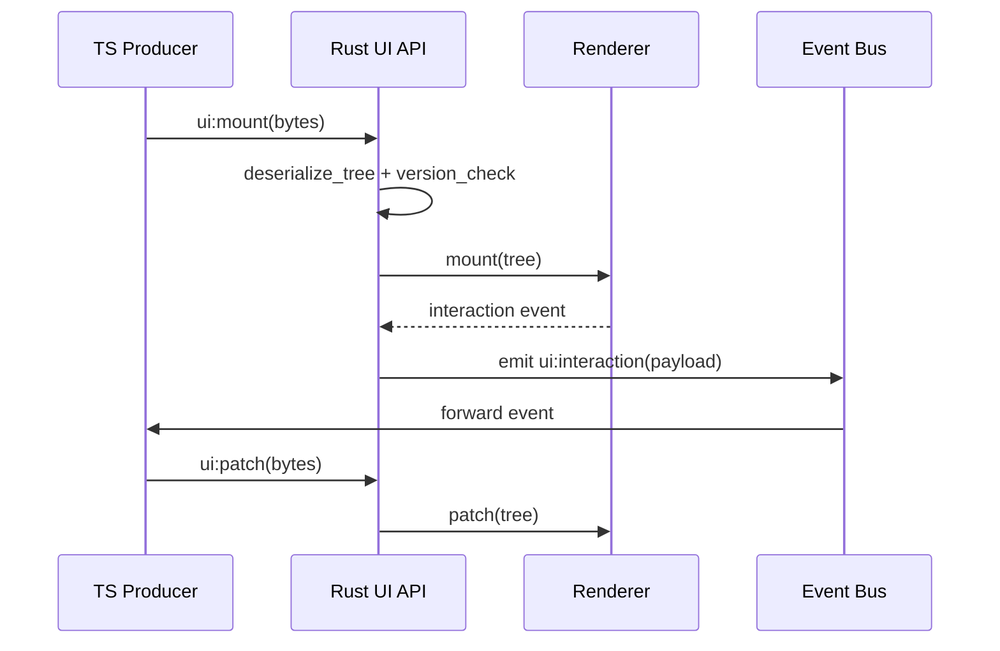

🧠 Planning documents standards rule loaded!

# PRD: UI API (Rust Runtime)

## 1. Overview

- **Context & Goals**

  - Provide a Rust UI API crate that ingests serialized UI trees and mounts them into the renderer.
  - Mirror TypeScript schema with serde-friendly types and strict version compatibility.
  - Offer a stable registry and event channel for bidirectional UI interactions.
  - Ensure predictable performance with minimal overhead and deterministic processing.

- **Current Pain Points**
  - No authoritative Rust-side schema; payloads are loosely structured and error-prone.
  - Mount/patch flows are not standardized, complicating renderer integration.
  - Event propagation lacks typed contracts and ordering guarantees.
  - Limited automated tests for payload compatibility and runtime behavior.

## 2. Proposed Solution

- **High‑level Summary**

  - Create `ui_api` crate with schema types, serializer/decoder, registry, and error model.
  - Implement a renderer bridge that maps UI nodes to render commands.
  - Enforce semantic versioning and compatibility checks at mount/patch time.
  - Provide event channel integration with the engine's bus to enable user interactions.
  - Ship a parity test harness and golden snapshots for payloads.

- **Architecture & Directory Structure**

```text
docs/PRDs/rust/5-04-ui-api-rust-prd.md
rust/engine/crates/ui_api/
├── Cargo.toml
└── src/
    ├── lib.rs
    ├── schema.rs
    ├── serializer.rs
    ├── registry.rs
    ├── events.rs
    └── error.rs
rust/engine/src/ui/
├── mod.rs
└── renderer_bridge.rs
```

## 3. Implementation Plan

### Phase 1: crate_setup (0.5 day)

1. scaffold `ui_api` with `Cargo.toml`, features, and error handling.
2. define version metadata and compatibility policy.

### Phase 2: schema_types (0.75 day)

1. implement `ui_component`, `ui_component_kind`, `ui_event_descriptor`, and layout nodes.
2. derive `Serialize`/`Deserialize` with `serde`.
3. add conversions and basic integrity checks.

### Phase 3: serializer_and_validation (0.5 day)

1. implement `deserialize_tree` for baseline JSON.
2. add version gating and structured errors for incompatibility.
3. unit tests for malformed payloads and version mismatch.

### Phase 4: registry_and_renderer_bridge (0.75 day)

1. implement `ui_registry` to mount/patch trees.
2. define `ui_renderer` trait with `mount` and `patch`.
3. implement `renderer_bridge` to map nodes to engine render commands.

### Phase 5: events_and_integration (0.5 day)

1. define event envelope and async stream integration with the engine bus.
2. add monotonic sequencing to avoid out-of-order updates.
3. integration tests for round-trip (payload → render → event).

Total: ~3.0 days

## 4. File and Directory Structures

```text
rust/engine/crates/ui_api/src/
├── lib.rs
├── schema.rs
├── serializer.rs
├── registry.rs
├── events.rs
└── error.rs
```

## 5. Technical Details

```rust
// rust/engine/crates/ui_api/src/schema.rs
use serde::{Deserialize, Serialize};

#[derive(Debug, Clone, Serialize, Deserialize)]
pub enum ui_component_kind {
    Button,
    Text,
    Image,
    Stack,
    Grid,
    Overlay,
}

#[derive(Debug, Clone, Serialize, Deserialize)]
pub struct ui_event_descriptor {
    pub name: String,
    pub payload_schema: serde_json::Value,
}

#[derive(Debug, Clone, Serialize, Deserialize)]
pub struct ui_component {
    pub kind: ui_component_kind,
    pub props: serde_json::Value,
    pub children: Vec<ui_component>,
    pub events: Vec<ui_event_descriptor>,
}
```

```rust
// rust/engine/crates/ui_api/src/serializer.rs
use crate::schema::ui_component;
use crate::error::ui_error;

pub fn deserialize_tree(bytes: &[u8]) -> Result<ui_component, ui_error> {
    let payload: serde_json::Value = serde_json::from_slice(bytes)?;
    // perform version checks and structural validation (placeholder)
    let tree: ui_component = serde_json::from_value(payload)?;
    Ok(tree)
}
```

```rust
// rust/engine/crates/ui_api/src/registry.rs
use crate::error::ui_error;
use crate::schema::ui_component;
use crate::serializer::deserialize_tree;

pub trait ui_renderer: Send {
    fn mount(&mut self, tree: ui_component);
    fn patch(&mut self, tree: ui_component);
}

pub struct ui_registry {
    renderer: Box<dyn ui_renderer>,
}

impl ui_registry {
    pub fn new(renderer: Box<dyn ui_renderer>) -> Self {
        Self { renderer }
    }

    pub fn mount_tree(&mut self, bytes: &[u8]) -> Result<(), ui_error> {
        let tree = deserialize_tree(bytes)?;
        self.renderer.mount(tree);
        Ok(())
    }

    pub fn patch_tree(&mut self, bytes: &[u8]) -> Result<(), ui_error> {
        let tree = deserialize_tree(bytes)?;
        self.renderer.patch(tree);
        Ok(())
    }
}
```

```rust
// rust/engine/crates/ui_api/src/error.rs
use thiserror::Error;

#[derive(Debug, Error)]
pub enum ui_error {
    #[error("payload format error: {0}")]
    Payload(String),
    #[error(transparent)]
    Serde(#[from] serde_json::Error),
    #[error("version mismatch: required {required}, got {actual}")]
    Version { required: String, actual: String },
}
```

## 6. Usage Examples

```rust
// mount a payload
use ui_api::ui_registry;

fn on_payload(bytes: &[u8], registry: &mut ui_registry) {
    if let Err(err) = registry.mount_tree(bytes) {
        eprintln!("ui mount failed: {err}");
    }
}
```

```rust
// forward an interaction event
pub fn forward_click(event_bus: &impl Fn(&str, serde_json::Value), component_id: &str) {
    let payload = serde_json::json!({
        "component_id": component_id,
        "state": "clicked"
    });
    event_bus("ui:interaction", payload);
}
```

## 7. Testing Strategy

- **Unit Tests**
  - `deserialize_tree` rejects malformed payloads and incompatible versions.
  - schema round-trip (serialize → deserialize) preserves structure.
  - registry routes mount/patch to renderer in correct order.
- **Integration Tests**
  - headless renderer bridge mounts canonical layouts.
  - event loop round-trip: renderer emits → event bus forwards → patch applied.
  - golden snapshots for canonical layouts to prevent regressions.

## 8. Edge Cases

| Edge Case                | Remediation                                                     |
| ------------------------ | --------------------------------------------------------------- |
| payload version mismatch | return `ui_error::Version` and abort mount/patch                |
| out_of_order patches     | include sequence numbers; drop stale patches                    |
| extremely deep trees     | limit depth, stream children lazily in renderer bridge          |
| large asset references   | prefetch asynchronously; placeholder nodes until asset is ready |

## 9. Sequence Diagram



## 10. Risks & Mitigations

| Risk                                         | Mitigation                                                  |
| -------------------------------------------- | ----------------------------------------------------------- |
| cpu overhead from deserialize on main thread | perform parsing in worker/thread; amortize with patch diffs |
| schema evolution breaking compatibility      | strict semver policy, CI checks, compatibility matrix       |
| renderer coupling to schema details          | use `ui_renderer` trait and adapter boundary                |
| event race conditions                        | single-threaded dispatcher and monotonic sequence ids       |

## 11. Timeline

- Phase 1: 0.5 day
- Phase 2: 0.75 day
- Phase 3: 0.5 day
- Phase 4: 0.75 day
- Phase 5: 0.5 day
- **Total:** ~3.0 days

## 12. Acceptance Criteria

- `ui_api` crate exposes schema, serializer, registry, and error types.
- renderer bridge mounts and patches canonical layouts without panics.
- version checks enforce compatibility; errors are actionable.
- integration tests pass for round-trip flows and snapshots.
- event channel forwards user interactions to the host bus.

## 13. Conclusion

This plan delivers a production-ready Rust UI API with clear contracts, strong validation, and clean integration points. It enables consistent rendering, robust event handling, and predictable performance aligned with the engine architecture.

## 14. Assumptions & Dependencies

- serde/serde_json available; potential future binary codec (e.g., rmp-serde).
- engine event bus is available for outbound interaction payloads.
- renderer exposes an adapter implementing `ui_renderer`.
- cross-stack coordination and artifacts are managed by TypeScript tooling.
