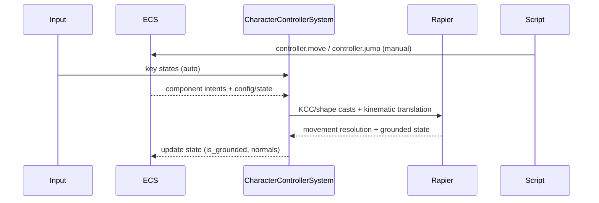

🧠 Planning documents standards rule loaded!

# PRD: Character Controller Gap Closure (Rust)

## 1. Overview

- **Context & Goals**: Replace temporary input-driven kinematic hacks with a robust, Rapier-based kinematic character controller, integrated with ECS, scripting, and editor contracts.
- **Current Pain Points**: A stopgap in `app_threed.rs` directly nudges kinematic bodies; no dedicated controller module/system; partial script API; inconsistent grounded/step/slope behavior; parity gaps vs TS contract v2.0.
- **Outcomes**: First-class `character_controller` module (component + system + queries), removal of the stopgap, deterministic update order with physics, and parity with TS schema and inspector UX.
- **Measure of Success**: Acceptance criteria met, stable locomotion across slopes/steps/moving platforms, and CI contract checks green.

## 1.1 Current Pain Points

- Temporary movement in engine loop (`apply_character_controller_inputs`) manipulates position directly; lacks Rapier KCC usage.
- No dedicated ECS component/system/state for controller (grounded, normals, coyote time, intents).
- Input mapping handled in stopgap; needs to be formalized in component with `control_mode` and `input_mapping`.
- Scripting API queues mutations but system-level consumption is missing/incomplete.

## 2. Proposed Solution

### High‑level Summary

- Implement `character_controller` module in `crates/physics` with `component.rs`, `system.rs`, and `queries.rs`.
- Use Rapier’s Kinematic Character Controller or shape-casts for ground snapping, slopes, and steps.
- Consume scripting mutations (`__move`, `__jump`, param setters) into ECS component each frame.
- Add `control_mode` and `input_mapping` to rust-side decoding, aligned with Contract v2.0.
- Remove the temporary movement from `app_threed.rs`; ensure precise update order.

### Architecture & Directory Structure

```
rust/engine/crates/physics/src/character_controller/
  mod.rs
  component.rs
  system.rs
  queries.rs

rust/engine/crates/ecs-bridge/src/
  decoders_character_controller.rs        # decoder for Contract v2.0

rust/engine/src/app_threed.rs             # remove stopgap & wire system update
rust/engine/crates/scripting/src/apis/physics_api.rs  # confirm mutation wiring
```

## 3. Implementation Plan

### Phase 1: ECS Component & Decoder (0.5 day)

1. Add `CharacterController` config/state with serde mappings (snake_case; TS camelCase field renames).
2. Implement `decoders_character_controller.rs` and register in ECS-bridge.
3. Include `control_mode` and optional `input_mapping` (Contract v2.0).

### Phase 2: Physics Queries & System (1–1.5 days)

1. Implement `queries.rs` for ground detection, slope checks, and step handling (capsule casts or KCC).
2. Implement `system.rs` update: read inputs (auto/manual), compute desired motion, apply kinematic movement with collision resolution.
3. Update `is_grounded`, ground normal, and state (incl. coyote time).

### Phase 3: Engine Integration (0.5 day)

1. Remove `apply_character_controller_inputs` from `app_threed.rs`.
2. Add `CharacterControllerSystem` to the engine’s update order (before or within physics step as required).
3. Ensure consistent fixed timestep behavior (60 Hz) and clamp max iterations.

### Phase 4: Scripting & Parity (0.5 day)

1. Confirm mutations in `physics_api.rs` (`__move`, `__jump`, param setters) are consumed by the system.
2. Expose `isGrounded()` to scripting; optionally expose `getGroundNormal()`.
3. Parity checks against Contract v2.0 across defaults and field names.

### Phase 5: Tests & Demos (0.5–1 day)

1. Unit: slope limit, step resolution, snap-to-ground threshold, coyote time.
2. Integration: flat ground, steep slopes, stairs, ledge drops, moving platforms, pushing dynamics.
3. Visual test scenes for QA and regression.

## 4. File and Directory Structures

```
rust/engine/crates/physics/src/character_controller/
├── component.rs     # config + state (serde)
├── system.rs        # per-frame update; consumes intents
├── queries.rs       # ground/slope/step checks
└── mod.rs           # pub use
```

## 5. Technical Details

### Component (skeleton)

```rust
// rust/engine/crates/physics/src/character_controller/component.rs
use serde::{Deserialize, Serialize};

#[derive(Debug, Clone, Serialize, Deserialize)]
pub struct InputMapping {
    pub forward: String,
    pub backward: String,
    pub left: String,
    pub right: String,
    pub jump: String,
}

#[derive(Debug, Clone, Serialize, Deserialize)]
pub struct CharacterControllerConfig {
    pub enabled: bool,
    pub slope_limit_deg: f32,
    pub step_offset: f32,
    pub skin_width: f32,
    pub gravity_scale: f32,
    pub max_speed: f32,
    pub jump_strength: f32,
    pub control_mode: String,                     // "auto" | "manual"
    pub input_mapping: Option<InputMapping>,      // when auto
}

#[derive(Debug, Clone, Default, Serialize, Deserialize)]
pub struct CharacterControllerState {
    pub is_grounded: bool,
    pub last_grounded_ms: u64,
    pub pending_jump: bool,
    pub desired_input_xz: [f32; 2],
    pub ground_normal: [f32; 3],
}
```

### System (skeleton)

```rust
// rust/engine/crates/physics/src/character_controller/system.rs
pub struct CharacterControllerSystem;
impl CharacterControllerSystem {
    pub fn update(&mut self, world: &mut PhysicsWorld, delta_seconds: f32) {
        // 1) Iterate entities with CharacterController
        // 2) If control_mode=="auto", read input mapping, aggregate [x,z]
        // 3) Compute desired velocity; use Rapier KCC or shape casts
        // 4) Apply kinematic translation; resolve collisions; set is_grounded
        // 5) Handle jump (coyote time); clear pending intent
    }
}
```

### Queries (skeleton)

```rust
// rust/engine/crates/physics/src/character_controller/queries.rs
pub struct GroundHit {
    pub is_grounded: bool,
    pub normal: [f32; 3],
    pub distance: f32,
}
```

### ECS-Bridge Decoder (Contract v2.0)

```rust
// rust/engine/crates/ecs-bridge/src/decoders_character_controller.rs
// - serde renames: slopeLimit, stepOffset, skinWidth, gravityScale, maxSpeed, jumpStrength, controlMode, inputMapping, isGrounded
// - defaults aligned with TS
```

### Engine Loop Integration

```rust
// rust/engine/src/app_threed.rs
// - remove apply_character_controller_inputs
// - call CharacterControllerSystem::update(...) in the correct phase
```

## 6. Usage Examples

```lua
-- Script-driven (manual mode)
local mv = input:getActionValue('Gameplay','Move')
entity.controller:move(mv, 6.0, time.deltaTime)
if input:isActionActive('Gameplay','Jump') and entity.controller:isGrounded() then
  entity.controller:jump(6.5)
end
```

## 7. Testing Strategy

- **Unit Tests**: slope limit; step offset; snap-to-ground threshold; jump + coyote time; state transitions.
- **Integration Tests**: flat ground; slopes above/below limit; stairs; ledge drop; moving platform carry; pushing dynamic bodies.
- **Visual Scenes**: curated scenes for quick QA regression.

## 8. Edge Cases

| Edge Case                       | Remediation                                                    |
| ------------------------------- | -------------------------------------------------------------- |
| Missing kinematic body/collider | Auto-provision or block with clear error; no silent fallbacks. |
| High dt spikes                  | Sub-step controller updates; clamp per-step displacement.      |
| Ceiling detection               | Cancel jump if head contact; avoid penetration.                |
| Moving platforms                | Apply base surface velocity when grounded.                     |
| Narrow gaps                     | Shape casts with depenetration clamp.                          |

## 9. Sequence Diagram



## 10. Risks & Mitigations

| Risk                               | Mitigation                                                   |
| ---------------------------------- | ------------------------------------------------------------ |
| Update order with physics          | Define explicit phase; test both pre/post integration.       |
| Performance under many controllers | Batch queries; avoid allocation; profile; cap depenetration. |
| Contract drift vs TS               | CI parity checks; versioned contract updates.                |
| Back-compat with scripts           | Keep API surface; map to intents internally.                 |

## 11. Timeline

- Total: ~2–3 weeks
  - Phase 1: 0.5 day
  - Phase 2: 1–1.5 days
  - Phase 3: 0.5 day
  - Phase 4: 0.5 day
  - Phase 5: 0.5–1 day

## 12. Acceptance Criteria

- Stopgap movement removed from engine loop; system-based control in place.
- Kinematic controller handles ground snapping, slopes, steps, wall slide, and jump reliably.
- Scripting API works with manual mode; auto mode respects input mapping.
- Contract v2.0 parity validated; defaults match TS; inspector reflects runtime state.
- Tests and demo scenes pass; no regressions in physics stability/performance.

## 13. Conclusion

This plan replaces temporary logic with a principled kinematic controller integrated into the engine, delivering stable character locomotion and solid parity with the editor and scripting layers.

## 14. Assumptions & Dependencies

- Rapier3D is available and configured; engine exposes necessary collider/body registries.
- ECS-bridge decoding infrastructure supports new component and field renames.
- Input manager provides normalized, case-insensitive key states.
