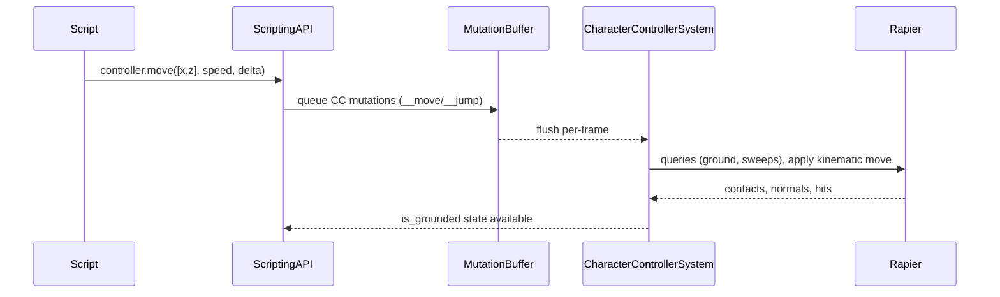

🧠 Planning documents standards rule loaded!

# PRD: Character Controller (Rust Engine)

## 1. Overview

- **Context & Goals**: Deliver a robust, kinematic character controller in the Rust engine that supports grounded locomotion, slope/step handling, ground snapping, and jumping, while integrating cleanly with ECS, physics (Rapier3D), and scripting APIs.
- **Why**: As per `ROADMAP.md`, the Character Controller is critical for playable scenes. TS has a helper API; Rust lacks the actual controller logic and ECS processing loop.
- **Outcomes**: A production-ready controller component and system, end-to-end script access via `entity.controller`, deterministic updates, and thorough tests/demos.
- **Measure of Success**: Acceptance criteria met, demo scenes functional at 60 FPS, and parity with the TS-side helper API semantics.

## 2. Current Pain Points

- No Rust-side character controller system processing movement, slope limits, steps, and ground snapping.
- Scripting API in Rust exposes `entity.controller` only when `CharacterController` component exists, but there is no engine logic to consume controller mutations.
- Grounded detection in TS helper is simplistic (velocity-based) and not physically robust; needs capsule queries/sweeps on Rust side.
- Missing standardized configuration (slope limit, step offset, skin width, gravity scale override) at the ECS component level.

## 3. Proposed Solution

### High‑level Summary

- Implement a `CharacterController` ECS component (config/state) and a `CharacterControllerSystem` that runs each frame.
- Integrate with Rapier3D using capsule shape casts or Rapier kinematic character utilities for ground detection, sliding, step up/down, and slope limiting.
- Wire scripting mutations (`__move`, `__jump`, `slopeLimit`, `stepOffset`) to the ECS component; system consumes them deterministically.
- Provide editor-facing defaults and script-friendly methods; maintain separation of concerns (system handles physics; script sets intents/params).
- Ensure compatibility with existing mutation buffer and physics world update order.

### Architecture & Directory Structure

```
rust/engine/crates/physics/
  src/
    components.rs
    world.rs
    scene_integration.rs
    events.rs
    builder.rs
    lib.rs
    character_controller/
      mod.rs
      component.rs
      system.rs
      queries.rs

rust/engine/crates/scripting/
  src/apis/physics_api.rs  # already registers entity.controller (extend if needed)

docs/PRDs/rust/character-controller-rust-prd.md
```

## 4. Implementation Plan

### Phase 1: ECS & Config (0.5 day)

1. Add `CharacterController` component with config fields: `slope_limit_deg`, `step_offset`, `skin_width`, `gravity_scale_override`, `max_speed`, `jump_strength`.
2. Add runtime state: `is_grounded`, `last_grounded_time_ms`, `desired_input_xz`, `pending_jump`, `ground_normal`.
3. Register component type in scene integration and ensure serialization hooks (if applicable).

### Phase 2: Physics Queries & Movement (1–1.5 days)

1. Implement `queries.rs` for ground checks: capsule cast down, ground snapping within `skin_width`, slope angle validation vs `slope_limit_deg`.
2. Implement `system.rs` move-step: input projection on ground plane, slide along surfaces, ascend/descend within `step_offset`, apply gravity when not grounded.
3. Integrate with Rapier kinematic API or shape casts; ensure stable results under variable `delta_time` (sub-stepping if needed).

### Phase 3: Scripting Integration (0.5 day)

1. Consume scripting mutations enqueued via `physics_api.rs` (`__move`, `__jump`, setters) into ECS component each frame.
2. Expose readback of `is_grounded` to scripting and optional `getGroundNormal()` (future).
3. Keep TS helper API behavior consistent; TS’s `move` and `jump` should remain thin wrappers where applicable.

### Phase 4: Tests & Demo (0.5–1 day)

1. Unit tests for slope-limit logic, step resolution, grounded detection, coyote time.
2. Integration tests with Rapier world: flat ground, slopes above/below limit, stairs/steps, ledge drop, moving platform (basic).
3. Add a demo scene and script sample exercising movement and jumping.

### Phase 5: Polish & Docs (0.5 day)

1. Performance validation under 1k update entities (micro-benchmark).
2. Document tuning guidelines (friction, step offset, slope limits) and pitfalls.
3. Update docs navigation if required.

## 5. File and Directory Structures

```
rust/engine/crates/physics/src/character_controller/
├── component.rs     # ECS component: config + runtime state
├── system.rs        # CharacterControllerSystem: frame update logic
├── queries.rs       # Ground detection, sweeps, slope tests
└── mod.rs           # pub use, module wiring
```

## 6. Technical Details

### Rust: Component (skeleton)

```rust
// rust/engine/crates/physics/src/character_controller/component.rs
use serde::{Deserialize, Serialize};

#[derive(Debug, Clone, Serialize, Deserialize)]
pub struct CharacterControllerConfig {
    pub slope_limit_deg: f32,   // e.g., 45.0
    pub step_offset: f32,       // e.g., 0.3
    pub skin_width: f32,        // e.g., 0.08
    pub gravity_scale: f32,     // e.g., 1.0 (override)
    pub max_speed: f32,         // e.g., 6.0
    pub jump_strength: f32,     // e.g., 6.5
}

impl Default for CharacterControllerConfig {
    fn default() -> Self {
        Self {
            slope_limit_deg: 45.0,
            step_offset: 0.3,
            skin_width: 0.08,
            gravity_scale: 1.0,
            max_speed: 6.0,
            jump_strength: 6.5,
        }
    }
}

#[derive(Debug, Clone, Default, Serialize, Deserialize)]
pub struct CharacterControllerState {
    pub is_grounded: bool,
    pub last_grounded_time_ms: u64,
    pub desired_input_xz: [f32; 2],
    pub pending_jump: bool,
    pub ground_normal: [f32; 3],
}

#[derive(Debug, Clone, Serialize, Deserialize)]
pub struct CharacterControllerComponent {
    pub config: CharacterControllerConfig,
    pub state: CharacterControllerState,
}

impl CharacterControllerComponent {
    pub fn set_move_input(&mut self, input: [f32; 2]) { self.state.desired_input_xz = input; }
    pub fn request_jump(&mut self) { self.state.pending_jump = true; }
    pub fn set_slope_limit(&mut self, deg: f32) { self.config.slope_limit_deg = deg.clamp(0.0, 90.0); }
    pub fn set_step_offset(&mut self, h: f32) { self.config.step_offset = h.max(0.0); }
}
```

### Rust: System (skeleton)

```rust
// rust/engine/crates/physics/src/character_controller/system.rs
use super::component::CharacterControllerComponent;
use crate::world::PhysicsWorld;

pub struct CharacterControllerSystem;

impl CharacterControllerSystem {
    pub fn update(&mut self, world: &mut PhysicsWorld, delta_seconds: f32) {
        // Pseudocode outline:
        // 1) For each entity with CharacterControllerComponent:
        // 2) Read desired_input_xz, project onto ground plane (if grounded)
        // 3) Perform ground check (queries.rs) to compute is_grounded, ground_normal
        // 4) Apply horizontal movement with collision resolution and slope/step handling
        // 5) If pending_jump and grounded (or coyote time), apply vertical impulse
        // 6) Update state, clear pending_jump
        // 7) Write back transform/velocity via physics world
        let _ = (world, delta_seconds);
    }
}
```

### Rust: Queries (skeleton)

```rust
// rust/engine/crates/physics/src/character_controller/queries.rs
use rapier3d::prelude::*;

pub struct GroundHit {
    pub is_grounded: bool,
    pub normal: [f32; 3],
    pub distance: f32,
}

pub fn compute_ground(
    physics: &mut rapier3d::prelude::PhysicsPipeline, // placeholder; use actual world access
    collider_set: &ColliderSet,
    bodies: &RigidBodySet,
    character_pos: Isometry<f32>,
    capsule: Capsule,
    max_snap: f32,
) -> GroundHit {
    let _ = (physics, collider_set, bodies, character_pos, capsule, max_snap);
    GroundHit { is_grounded: false, normal: [0.0, 1.0, 0.0], distance: f32::MAX }
}
```

### Scripting: Consuming Mutations

- Continue using `scripting/src/apis/physics_api.rs` to queue `EntityMutation::SetComponent` for `CharacterController` with keys:
  - `__move: { input: [x, z], speed, delta }`
  - `__jump: number`
  - `slopeLimit: number`
  - `stepOffset: number`
- The controller system reads these intents each frame, updates component state, and applies motion.

## 7. Usage Examples

### TypeScript (scripts)

```ts
// Move + Jump using Input system
const [mx, mz] = input.getActionValue('Gameplay', 'Move') as [number, number];
controller.move([mx, mz], 6.0);
if (input.isActionActive('Gameplay', 'Jump') && controller.isGrounded()) {
  controller.jump(6.5);
}
```

### Lua (if applicable in runtime)

```lua
-- Per-frame update
local mv = input:getActionValue('Gameplay','Move')
entity.controller:move(mv, 6.0, time.deltaTime)
if input:isActionActive('Gameplay','Jump') and entity.controller:isGrounded() then
  entity.controller:jump(6.5)
end
```

## 8. Testing Strategy

- **Unit Tests (Rust)**:
  - Slope limit: prevent ascent when angle > limit; allow when <= limit.
  - Step resolution: can step up to `step_offset`; cannot step beyond.
  - Ground snapping: snap within `skin_width`; do not snap when too far.
  - Coyote time window respected (configurable or fixed 150ms).
- **Integration Tests (Rust + Rapier)**:
  - Flat ground: stays grounded; horizontal movement preserves Y.
  - Slope scenario: above-limit slides; below-limit climbs.
  - Stair/step volumes: steps within `step_offset` are traversed.
  - Ledge drop: becomes ungrounded; gravity applies; snap on land.
  - Moving platform basic: position follows contact surface when grounded.
- **Script/Runtime (TS)**:
  - Example scene: WASD + Jump works; `controller.isGrounded()` toggles appropriately.
  - Regression: `move` while airborne preserves lateral intent but respects gravity.
- **Performance**:
  - 1k controllers at 60 FPS on target machine (document baseline & results).

## 9. Edge Cases

| Edge Case                        | Remediation                                                                          |
| -------------------------------- | ------------------------------------------------------------------------------------ |
| Vertical walls and sharp corners | Use slide vector computation and depenetration; clamp iterations per frame.          |
| High delta spikes                | Sub-step controller updates; clamp displacement per step.                            |
| Extremely low ceilings           | Prevent jump if head clearance insufficient; early abort when sweep detects ceiling. |
| Moving platforms                 | Treat as kinematic base; apply surface velocity to character when grounded.          |
| Low friction surfaces            | Blend movement with surface friction; cap horizontal acceleration.                   |
| Narrow gaps and tunneling        | Use shape-casts vs. simple rays; limit penetration.                                  |

## 10. Sequence Diagram



## 11. Risks & Mitigations

| Risk                                      | Mitigation                                                               |
| ----------------------------------------- | ------------------------------------------------------------------------ |
| Edge-case explosion in collision handling | Start with a minimal, tested subset; add toggles and diagnostics.        |
| Ordering with physics step                | Run controller before rigid body integration; define clear update order. |
| Performance with many controllers         | Batch queries; reduce allocations; early-out when idle.                  |
| API drift vs TS helper                    | Align typings; add CI checks to compare rust/TS API surface docs.        |

## 12. Timeline

- Total: ~2–3 weeks
  - Phase 1: 0.5 day
  - Phase 2: 1–1.5 days
  - Phase 3: 0.5 day
  - Phase 4: 0.5–1 day
  - Phase 5: 0.5 day
  - Buffer & iteration: remainder to harden edge cases and perf

## 13. Acceptance Criteria

- `CharacterController` component exists with config/state; serializable where needed.
- System moves character with slope limit, step offset, ground snap, and jump.
- `entity.controller` works in scripts: `isGrounded`, `move`, `jump`, `setSlopeLimit`, `setStepOffset`.
- Demo scene shows reliable grounded locomotion and jumping; steep slopes block ascent.
- Unit and integration tests pass; performance target documented.

## 14. Assumptions & Dependencies

- Rapier3D available for physics, shape-casts, and kinematic utilities.
- ECS and mutation buffer already in place (existing engine infrastructure).
- Input system already complete; example uses action maps for movement/jump.
- TS helper API remains a thin layer; Rust becomes source of truth for physical correctness.
