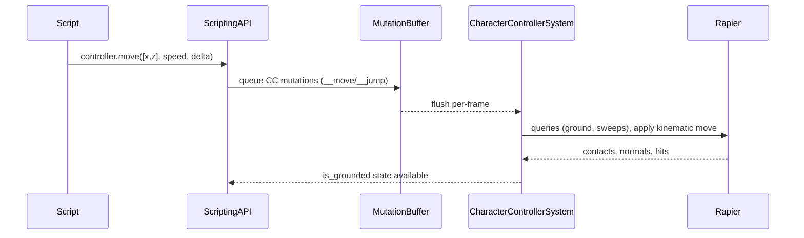

🧠 Planning documents standards rule loaded!

# PRD: Character Controller (Rust Engine)

## 1. Overview

- **Context & Goals**: Deliver a robust, kinematic character controller in the Rust engine that supports grounded locomotion, slope/step handling, ground snapping, and jumping, while integrating cleanly with ECS, physics (Rapier3D), and scripting APIs.
- **Why**: As per `ROADMAP.md`, the Character Controller is critical for playable scenes. TS has a helper API; Rust lacks the actual controller logic and ECS processing loop.
- **Outcomes**: A production-ready controller component and system, end-to-end script access via `entity.controller`, deterministic updates, and thorough tests/demos.
- **Measure of Success**: Acceptance criteria met, demo scenes functional at 60 FPS, and parity with the TS-side helper API semantics.

## 2. Current Pain Points

- No Rust-side character controller system processing movement, slope limits, steps, and ground snapping.
- Scripting API in Rust exposes `entity.controller` only when `CharacterController` component exists, but there is no engine logic to consume controller mutations.
- Grounded detection in TS helper is simplistic (velocity-based) and not physically robust; needs capsule queries/sweeps on Rust side.
- Missing standardized configuration (slope limit, step offset, skin width, gravity scale override) at the ECS component level.

## 3. Proposed Solution

### High‑level Summary

- Implement a `CharacterController` ECS component (config/state) and a `CharacterControllerSystem` that runs each frame.
- Integrate with Rapier3D using capsule shape casts or Rapier kinematic character utilities for ground detection, sliding, step up/down, and slope limiting.
- Wire scripting mutations (`__move`, `__jump`, `slopeLimit`, `stepOffset`) to the ECS component; system consumes them deterministically.
- Provide editor-facing defaults and script-friendly methods; maintain separation of concerns (system handles physics; script sets intents/params).
- Ensure compatibility with existing mutation buffer and physics world update order.

### Architecture & Directory Structure

```
rust/engine/crates/physics/
  src/
    components.rs
    world.rs
    scene_integration.rs
    events.rs
    builder.rs
    lib.rs
    character_controller/
      mod.rs
      component.rs
      system.rs
      queries.rs

rust/engine/crates/scripting/
  src/apis/physics_api.rs  # already registers entity.controller (extend if needed)

src/core/lib/ecs/components/
  definitions/
    CharacterControllerComponent.ts      # TS schema + defaults (zod), editor-facing
  accessors/
    types.ts                             # add ICharacterControllerData & accessor if needed

src/editor/components/inspector/adapters/
  CharacterControllerAdapter.tsx         # Adapter wires ECS <-> Inspector section

src/editor/components/panels/InspectorPanel/CharacterController/
  CharacterControllerSection.tsx         # Inspector UI for controller config

docs/PRDs/rust/character-controller-rust-prd.md
```

### Shared Contract v2.0 (TS ↔ Rust)

| TS Field        | Rust Field      | Serde Rename                                                           | Default  | Notes                                 |
| --------------- | --------------- | ---------------------------------------------------------------------- | -------- | ------------------------------------- |
| enabled         | enabled         | n/a                                                                    | true     | Component enabled state               |
| slopeLimit      | slope_limit_deg | #[serde(rename="slopeLimit")]                                          | 45.0     | Max climbable slope (degrees)         |
| stepOffset      | step_offset     | #[serde(rename="stepOffset")]                                          | 0.3      | Max step height                       |
| skinWidth       | skin_width      | #[serde(rename="skinWidth")]                                           | 0.08     | Ground detection offset               |
| gravityScale    | gravity_scale   | #[serde(rename="gravityScale")]                                        | 1.0      | Gravity multiplier                    |
| maxSpeed        | max_speed       | #[serde(rename="maxSpeed")]                                            | 6.0      | Maximum movement speed                |
| jumpStrength    | jump_strength   | #[serde(rename="jumpStrength")]                                        | 6.5      | Jump impulse force                    |
| controlMode     | control_mode    | #[serde(rename="controlMode")]                                         | "auto"   | "auto" or "manual"                    |
| inputMapping    | input_mapping   | #[serde(rename="inputMapping", skip_serializing_if="Option::is_none")] | Optional | Key bindings for auto mode            |
| isGrounded (ro) | is_grounded     | #[serde(rename="isGrounded")]                                          | false    | Runtime-only, not serialized to scene |

**Contract v2.0** (2025-11-05): Added `controlMode` and `inputMapping` for Unity-like auto-input support.

#### Input Mapping Schema (for auto mode)

| TS Field | Rust Field | Type   | Default |
| -------- | ---------- | ------ | ------- |
| forward  | forward    | string | "w"     |
| backward | backward   | string | "s"     |
| left     | left       | string | "a"     |
| right    | right      | string | "d"     |
| jump     | jump       | string | " "     |

Contract v2.0 (2025‑11‑05). See TS PRD for editor details: `docs/PRDs/editor/character-controller-ts-prd.md`.

**Rust Implementation Notes for Auto Mode:**

- When `control_mode == "auto"`, the Rust engine should process keyboard input directly using the `input_mapping` configuration
- System should listen for configured keys and automatically call movement/jump logic without script intervention
- When `control_mode == "manual"`, behavior is script-driven as originally designed
- Input mapping is serialized/deserialized as JSON object with string keys matching the schema above

### Three.js Editor Integration (TS + R3F)

- Add an editor Inspector section for `CharacterController` with fields: `slopeLimit`, `stepOffset`, `skinWidth`, `gravityScale`, `maxSpeed`, `jumpStrength` and Enabled toggle.
- Persist edits via the mutation buffer and `updateComponent('CharacterController', patch)` using existing editor plumbing.
- Validate inputs with Zod; clamp and mirror Rust defaults for parity.
- Show warnings when a suitable collider (capsule/box) is missing or incompatible.
- In Play mode, disable editing of runtime-only values; show read-only `isGrounded` indicator.
- Follow existing component patterns:
  - Add `CharacterController` to `KnownComponentTypes`.
  - Define TS schema under `src/core/lib/ecs/components/definitions/` like Camera/RigidBody.
  - Use an Adapter (e.g., `RigidBodyAdapter`) that feeds a Section component.
  - Integrate into `ComponentList` and `useEntityComponents` for presence/getters.

## 4. Implementation Plan

### Phase 1: ECS & Config (0.5 day)

1. Add `CharacterController` component with config fields: `slope_limit_deg`, `step_offset`, `skin_width`, `gravity_scale_override`, `max_speed`, `jump_strength`.
2. Add runtime state: `is_grounded`, `last_grounded_time_ms`, `desired_input_xz`, `pending_jump`, `ground_normal`.
3. Register component type in scene integration and ensure serialization hooks (if applicable).

### Phase 2: Physics Queries & Movement (1–1.5 days)

1. Implement `queries.rs` for ground checks: capsule cast down, ground snapping within `skin_width`, slope angle validation vs `slope_limit_deg`.
2. Implement `system.rs` move-step: input projection on ground plane, slide along surfaces, ascend/descend within `step_offset`, apply gravity when not grounded.
3. Integrate with Rapier kinematic API or shape casts; ensure stable results under variable `delta_time` (sub-stepping if needed).

### Phase 3: Scripting Integration (0.5 day)

1. Consume scripting mutations enqueued via `physics_api.rs` (`__move`, `__jump`, setters) into ECS component each frame.
2. Expose readback of `is_grounded` to scripting and optional `getGroundNormal()` (future).
3. Keep TS helper API behavior consistent; TS’s `move` and `jump` should remain thin wrappers where applicable.

### Phase 3b: Editor Integration (0.5 day)

1. Create `definitions/CharacterControllerComponent.ts` (TS) with Zod schema, defaults mirroring Rust.
2. Add `ICharacterControllerData` to `accessors/types.ts` and optional accessor interface for future helpers.
3. Implement `CharacterControllerSection.tsx` with inputs, clamping, and enable toggle using Tailwind.
4. Add `CharacterControllerAdapter.tsx` under `inspector/adapters`, convert ECS data to section props, and call `updateComponent`/`removeComponent` using `KnownComponentTypes`.
5. Display live `isGrounded` read-only value during Play mode.
6. Add to `KnownComponentTypes` and extend `ComponentList` to render the adapter when present.

### Phase 4: Tests & Demo (0.5–1 day)

1. Unit tests for slope-limit logic, step resolution, grounded detection, coyote time.
2. Integration tests with Rapier world: flat ground, slopes above/below limit, stairs/steps, ledge drop, moving platform (basic).
3. Add a demo scene and script sample exercising movement and jumping.

### Phase 5: Polish & Docs (0.5 day)

1. Performance validation under 1k update entities (micro-benchmark).
2. Document tuning guidelines (friction, step offset, slope limits) and pitfalls.
3. Update docs navigation if required.

## 5. File and Directory Structures

```
rust/engine/crates/physics/src/character_controller/
├── component.rs     # ECS component: config + runtime state
├── system.rs        # CharacterControllerSystem: frame update logic
├── queries.rs       # Ground detection, sweeps, slope tests
└── mod.rs           # pub use, module wiring
```

```
src/editor/components/panels/InspectorPanel/CharacterController/
├── CharacterControllerSection.tsx  # Editor UI for controller

src/core/lib/ecs/components/
├── definitions/
│   └── CharacterControllerComponent.ts # Zod schema + defaults (camelCase)
└── accessors/
    └── types.ts                    # add ICharacterControllerData
```

## 6. Technical Details

### Rust: Component (skeleton)

```rust
// rust/engine/crates/physics/src/character_controller/component.rs
use serde::{Deserialize, Serialize};

#[derive(Debug, Clone, Serialize, Deserialize)]
pub struct CharacterControllerConfig {
    pub slope_limit_deg: f32,   // e.g., 45.0
    pub step_offset: f32,       // e.g., 0.3
    pub skin_width: f32,        // e.g., 0.08
    pub gravity_scale: f32,     // e.g., 1.0 (override)
    pub max_speed: f32,         // e.g., 6.0
    pub jump_strength: f32,     // e.g., 6.5
}

impl Default for CharacterControllerConfig {
    fn default() -> Self {
        Self {
            slope_limit_deg: 45.0,
            step_offset: 0.3,
            skin_width: 0.08,
            gravity_scale: 1.0,
            max_speed: 6.0,
            jump_strength: 6.5,
        }
    }
}

#[derive(Debug, Clone, Default, Serialize, Deserialize)]
pub struct CharacterControllerState {
    pub is_grounded: bool,
    pub last_grounded_time_ms: u64,
    pub desired_input_xz: [f32; 2],
    pub pending_jump: bool,
    pub ground_normal: [f32; 3],
}

#[derive(Debug, Clone, Serialize, Deserialize)]
pub struct CharacterControllerComponent {
    pub config: CharacterControllerConfig,
    pub state: CharacterControllerState,
}

impl CharacterControllerComponent {
    pub fn set_move_input(&mut self, input: [f32; 2]) { self.state.desired_input_xz = input; }
    pub fn request_jump(&mut self) { self.state.pending_jump = true; }
    pub fn set_slope_limit(&mut self, deg: f32) { self.config.slope_limit_deg = deg.clamp(0.0, 90.0); }
    pub fn set_step_offset(&mut self, h: f32) { self.config.step_offset = h.max(0.0); }
}
```

### Rust: System (skeleton)

```rust
// rust/engine/crates/physics/src/character_controller/system.rs
use super::component::CharacterControllerComponent;
use crate::world::PhysicsWorld;

pub struct CharacterControllerSystem;

impl CharacterControllerSystem {
    pub fn update(&mut self, world: &mut PhysicsWorld, delta_seconds: f32) {
        // Pseudocode outline:
        // 1) For each entity with CharacterControllerComponent:
        // 2) Read desired_input_xz, project onto ground plane (if grounded)
        // 3) Perform ground check (queries.rs) to compute is_grounded, ground_normal
        // 4) Apply horizontal movement with collision resolution and slope/step handling
        // 5) If pending_jump and grounded (or coyote time), apply vertical impulse
        // 6) Update state, clear pending_jump
        // 7) Write back transform/velocity via physics world
        let _ = (world, delta_seconds);
    }
}
```

### Rust: Queries (skeleton)

```rust
// rust/engine/crates/physics/src/character_controller/queries.rs
use rapier3d::prelude::*;

pub struct GroundHit {
    pub is_grounded: bool,
    pub normal: [f32; 3],
    pub distance: f32,
}

pub fn compute_ground(
    physics: &mut rapier3d::prelude::PhysicsPipeline, // placeholder; use actual world access
    collider_set: &ColliderSet,
    bodies: &RigidBodySet,
    character_pos: Isometry<f32>,
    capsule: Capsule,
    max_snap: f32,
) -> GroundHit {
    let _ = (physics, collider_set, bodies, character_pos, capsule, max_snap);
    GroundHit { is_grounded: false, normal: [0.0, 1.0, 0.0], distance: f32::MAX }
}
```

### Scripting: Consuming Mutations

- Continue using `scripting/src/apis/physics_api.rs` to queue `EntityMutation::SetComponent` for `CharacterController` with keys:
  - `__move: { input: [x, z], speed, delta }`
  - `__jump: number`
  - `slopeLimit: number`
  - `stepOffset: number`
- The controller system reads these intents each frame, updates component state, and applies motion.

### Three.js Editor: TS Schemas & UI (skeletons)

```ts
// src/core/lib/ecs/components/definitions/CharacterControllerComponent.ts
import { z } from 'zod';

export const characterControllerSchema = z.object({
  enabled: z.boolean().default(true),
  slopeLimit: z.number().min(0).max(90).default(45),
  stepOffset: z.number().min(0).default(0.3),
  skinWidth: z.number().min(0).default(0.08),
  gravityScale: z.number().default(1),
  maxSpeed: z.number().min(0).default(6),
  jumpStrength: z.number().min(0).default(6.5),
});

export type ICharacterControllerData = z.infer<typeof characterControllerSchema>;

export const CHARACTER_CONTROLLER_COMPONENT = 'CharacterController';
```

```tsx
// src/editor/components/panels/InspectorPanel/CharacterController/CharacterControllerSection.tsx
import React from 'react';
import { FiUser } from 'react-icons/fi';
import { GenericComponentSection } from '@/editor/components/shared/GenericComponentSection';

export interface ICharacterControllerSectionProps {
  data: ICharacterControllerData | null;
  setData: (data: ICharacterControllerData | null) => void;
  isPlaying: boolean;
  isGrounded?: boolean; // read-only at runtime
}

export const CharacterControllerSection: React.FC<ICharacterControllerSectionProps> = ({
  data,
  setData,
  isPlaying,
  isGrounded,
}) => {
  if (!data) return null;
  const update = (patch: Partial<ICharacterControllerData>) => setData({ ...data, ...patch });
  return (
    <GenericComponentSection
      title="Character Controller"
      icon={<FiUser />}
      headerColor="purple"
      componentId="CharacterController"
    >
      {/* Enabled */}
      <div className="flex items-center justify-between">
        <span className="text-xs font-medium text-gray-400">Enabled</span>
        <input
          type="checkbox"
          checked={data.enabled}
          onChange={(e) => update({ enabled: e.target.checked })}
          disabled={isPlaying}
          className="rounded border-gray-600 bg-black/30 text-purple-500 focus:ring-purple-500 disabled:opacity-50"
        />
      </div>
      {/* Numeric fields: slopeLimit, stepOffset, skinWidth, gravityScale, maxSpeed, jumpStrength */}
      {/* Implement with standard number inputs and clamping in onChange */}
      {isPlaying && (
        <div className="text-[10px] text-gray-500">Grounded: {isGrounded ? 'Yes' : 'No'}</div>
      )}
    </GenericComponentSection>
  );
};
```

```tsx
// src/editor/components/inspector/adapters/CharacterControllerAdapter.tsx
import React from 'react';
import { IComponent, KnownComponentTypes } from '@/core/lib/ecs/IComponent';
import { ICharacterControllerData } from '@/core/lib/ecs/components/definitions/CharacterControllerComponent';
import { CharacterControllerSection } from '@/editor/components/panels/InspectorPanel/CharacterController/CharacterControllerSection';

export const CharacterControllerAdapter: React.FC<{
  component: IComponent<ICharacterControllerData> | null;
  updateComponent: (type: string, data: ICharacterControllerData | null) => boolean;
  removeComponent: (type: string) => boolean;
  addComponent: (
    type: string,
    data: ICharacterControllerData,
  ) => IComponent<ICharacterControllerData> | null;
  isPlaying: boolean;
}> = ({ component, updateComponent, removeComponent, addComponent, isPlaying }) => {
  const data = component?.data;
  if (!data) return null;
  const setData = (next: ICharacterControllerData | null) => {
    if (next === null) removeComponent(KnownComponentTypes.CHARACTER_CONTROLLER as any);
    else updateComponent(KnownComponentTypes.CHARACTER_CONTROLLER as any, next);
  };
  return (
    <CharacterControllerSection
      data={data}
      setData={setData}
      isPlaying={isPlaying}
      isGrounded={false}
    />
  );
};
```

```diff
// src/core/lib/ecs/IComponent.ts
 export const KnownComponentTypes = {
   TRANSFORM: 'Transform',
   MESH_RENDERER: 'MeshRenderer',
   RIGID_BODY: 'RigidBody',
   MESH_COLLIDER: 'MeshCollider',
   CAMERA: 'Camera',
   LIGHT: 'Light',
   SCRIPT: 'Script',
   SOUND: 'Sound',
   TERRAIN: 'Terrain',
   PERSISTENT_ID: 'PersistentId',
   GEOMETRY_ASSET: 'GeometryAsset',
+  CHARACTER_CONTROLLER: 'CharacterController',
 } as const;
```

```diff
// src/editor/components/inspector/sections/ComponentList.tsx (render adapter when present)
 {/* CharacterController Component */}
 {components.find((c) => c.type === 'CharacterController') && (
   <CharacterControllerAdapter
     component={/* getter */ null as any}
     updateComponent={updateComponent}
     removeComponent={removeComponent}
     addComponent={addComponent}
     isPlaying={isPlaying}
   />
 )}
```

### Cross-Language Schema Mapping (TS ↔ Rust)

See Contract v2.0 above for complete field mapping including `controlMode` and `inputMapping`.

### Rust ECS-Bridge Decoder (skeleton - Contract v2.0)

```rust
// rust/engine/crates/ecs-bridge/src/decoders_character_controller.rs
use serde::{Deserialize, Serialize};
use std::collections::HashMap;

#[derive(Debug, Deserialize, Serialize, Clone)]
pub struct InputMapping {
    #[serde(default = "default_forward")] pub forward: String,
    #[serde(default = "default_backward")] pub backward: String,
    #[serde(default = "default_left")] pub left: String,
    #[serde(default = "default_right")] pub right: String,
    #[serde(default = "default_jump")] pub jump: String,
}

fn default_forward() -> String { "w".to_string() }
fn default_backward() -> String { "s".to_string() }
fn default_left() -> String { "a".to_string() }
fn default_right() -> String { "d".to_string() }
fn default_jump() -> String { " ".to_string() }

impl Default for InputMapping {
    fn default() -> Self {
        Self {
            forward: default_forward(),
            backward: default_backward(),
            left: default_left(),
            right: default_right(),
            jump: default_jump(),
        }
    }
}

#[derive(Debug, Deserialize, Serialize, Clone)]
pub struct CharacterController {
    #[serde(default = "default_true")] pub enabled: bool,
    #[serde(default = "default_slope", rename = "slopeLimit")] pub slope_limit_deg: f32,
    #[serde(default = "default_step", rename = "stepOffset")] pub step_offset: f32,
    #[serde(default = "default_skin", rename = "skinWidth")] pub skin_width: f32,
    #[serde(default = "default_one", rename = "gravityScale")] pub gravity_scale: f32,
    #[serde(default = "default_speed", rename = "maxSpeed")] pub max_speed: f32,
    #[serde(default = "default_jump", rename = "jumpStrength")] pub jump_strength: f32,
    #[serde(default = "default_control_mode", rename = "controlMode")] pub control_mode: String,
    #[serde(skip_serializing_if = "Option::is_none", rename = "inputMapping")] pub input_mapping: Option<InputMapping>,
    #[serde(default, rename = "isGrounded")] pub is_grounded: bool,
}

fn default_true() -> bool { true }
fn default_slope() -> f32 { 45.0 }
fn default_step() -> f32 { 0.3 }
fn default_skin() -> f32 { 0.08 }
fn default_one() -> f32 { 1.0 }
fn default_speed() -> f32 { 6.0 }
fn default_jump() -> f32 { 6.5 }
fn default_control_mode() -> String { "auto".to_string() }
```

```rust
// ecs-bridge: register decoder
pub struct CharacterControllerDecoder;
impl IComponentDecoder for CharacterControllerDecoder {
    fn can_decode(&self, kind: &str) -> bool { kind == "CharacterController" }
    fn decode(&self, value: &Value) -> Result<Box<dyn Any>> {
        let c: CharacterController = serde_json::from_value(value.clone())?;
        Ok(Box::new(c))
    }
    fn capabilities(&self) -> ComponentCapabilities {
        ComponentCapabilities { affects_rendering: false, requires_pass: None, stable: true }
    }
    fn component_kinds(&self) -> Vec<ComponentKindId> { vec![ComponentKindId::new("CharacterController")] }
}
```

```diff
// ecs-bridge/src/decoders.rs
 pub fn create_default_registry() -> ComponentRegistry {
   let mut registry = ComponentRegistry::new();
   // ... existing register(...)
+  registry.register(CharacterControllerDecoder);
   registry
 }
```

## 7. Usage Examples

### TypeScript (scripts)

```ts
// Move + Jump using Input system
const [mx, mz] = input.getActionValue('Gameplay', 'Move') as [number, number];
const controller = entity.controller;
controller?.move([mx, mz], 6.0);
if (controller && input.isActionActive('Gameplay', 'Jump') && controller.isGrounded()) {
  controller.jump(6.5);
}
```

### Lua (if applicable in runtime)

```lua
-- Per-frame update
local mv = input:getActionValue('Gameplay','Move')
entity.controller:move(mv, 6.0, time.deltaTime)
if input:isActionActive('Gameplay','Jump') and entity.controller:isGrounded() then
  entity.controller:jump(6.5)
end
```

### Editor (TS) - add/update component

```ts
// Add component with defaults
addComponent('CharacterController', { enabled: true });

// Update from inspector
updateComponent('CharacterController', { slopeLimit: 50, stepOffset: 0.4 });
```

## 8. Testing Strategy

- **Unit Tests (Rust)**:
  - Slope limit: prevent ascent when angle > limit; allow when <= limit.
  - Step resolution: can step up to `step_offset`; cannot step beyond.
  - Ground snapping: snap within `skin_width`; do not snap when too far.
  - Coyote time window respected (configurable or fixed 150ms).
- **Integration Tests (Rust + Rapier)**:
  - Flat ground: stays grounded; horizontal movement preserves Y.
  - Slope scenario: above-limit slides; below-limit climbs.
  - Stair/step volumes: steps within `step_offset` are traversed.
  - Ledge drop: becomes ungrounded; gravity applies; snap on land.
  - Moving platform basic: position follows contact surface when grounded.
- **Script/Runtime (TS)**:
  - Example scene: WASD + Jump works; `controller.isGrounded()` toggles appropriately.
  - Regression: `move` while airborne preserves lateral intent but respects gravity.
- **Editor (TS)**:
  - Inspector shows and persists controller fields; Zod validation clamps invalid input.
  - Play mode disables edits to runtime-only data; `isGrounded` displays correctly.
- **Performance**:
  - 1k controllers at 60 FPS on target machine (document baseline & results).

## 9. Edge Cases

| Edge Case                        | Remediation                                                                          |
| -------------------------------- | ------------------------------------------------------------------------------------ |
| Vertical walls and sharp corners | Use slide vector computation and depenetration; clamp iterations per frame.          |
| High delta spikes                | Sub-step controller updates; clamp displacement per step.                            |
| Extremely low ceilings           | Prevent jump if head clearance insufficient; early abort when sweep detects ceiling. |
| Moving platforms                 | Treat as kinematic base; apply surface velocity to character when grounded.          |
| Low friction surfaces            | Blend movement with surface friction; cap horizontal acceleration.                   |
| Narrow gaps and tunneling        | Use shape-casts vs. simple rays; limit penetration.                                  |

## 10. Sequence Diagram



## 11. Risks & Mitigations

| Risk                                      | Mitigation                                                                          |
| ----------------------------------------- | ----------------------------------------------------------------------------------- |
| Edge-case explosion in collision handling | Start with a minimal, tested subset; add toggles and diagnostics.                   |
| Ordering with physics step                | Run controller before rigid body integration; define clear update order.            |
| Performance with many controllers         | Batch queries; reduce allocations; early-out when idle.                             |
| API drift vs TS helper                    | Align typings; add CI checks to compare rust/TS API surface docs.                   |
| Editor/Engine schema drift                | Generate TS schema from Rust JSON/IDL or maintain a shared schema source.           |
| Adapter vs Section divergence             | Use Adapter pattern consistently (like RigidBodyAdapter); avoid direct section use. |

## 12. Timeline

- Total: ~2–3 weeks
  - Phase 1: 0.5 day
  - Phase 2: 1–1.5 days
  - Phase 3: 0.5 day
  - Phase 4: 0.5–1 day
  - Phase 5: 0.5 day
  - Phase 3b (Editor): 0.5 day
  - Buffer & iteration: remainder to harden edge cases and perf

## 13. Acceptance Criteria

- `CharacterController` component exists with config/state; serializable where needed.
- System moves character with slope limit, step offset, ground snap, and jump.
- `entity.controller` works in scripts: `isGrounded`, `move`, `jump`, `setSlopeLimit`, `setStepOffset`.
- Demo scene shows reliable grounded locomotion and jumping; steep slopes block ascent.
- Unit and integration tests pass; performance target documented.
- Three.js Editor: Inspector exposes Character Controller; edits persist and reflect at runtime; `isGrounded` shown during Play mode.
- KnownComponentTypes includes CharacterController; ComponentList renders CharacterControllerAdapter.
- ECS-Bridge registers CharacterControllerDecoder; TS↔Rust field mapping validated.

## 14. Assumptions & Dependencies

- Rapier3D available for physics, shape-casts, and kinematic utilities.
- ECS and mutation buffer already in place (existing engine infrastructure).
- Input system already complete; example uses action maps for movement/jump.
- TS helper API remains a thin layer; Rust becomes source of truth for physical correctness.
- Three.js editor (R3F + Tailwind + Zustand) provides Inspector, mutation buffer, and play/pause; TS/Rust kept in sync via shared defaults and schema parity.
