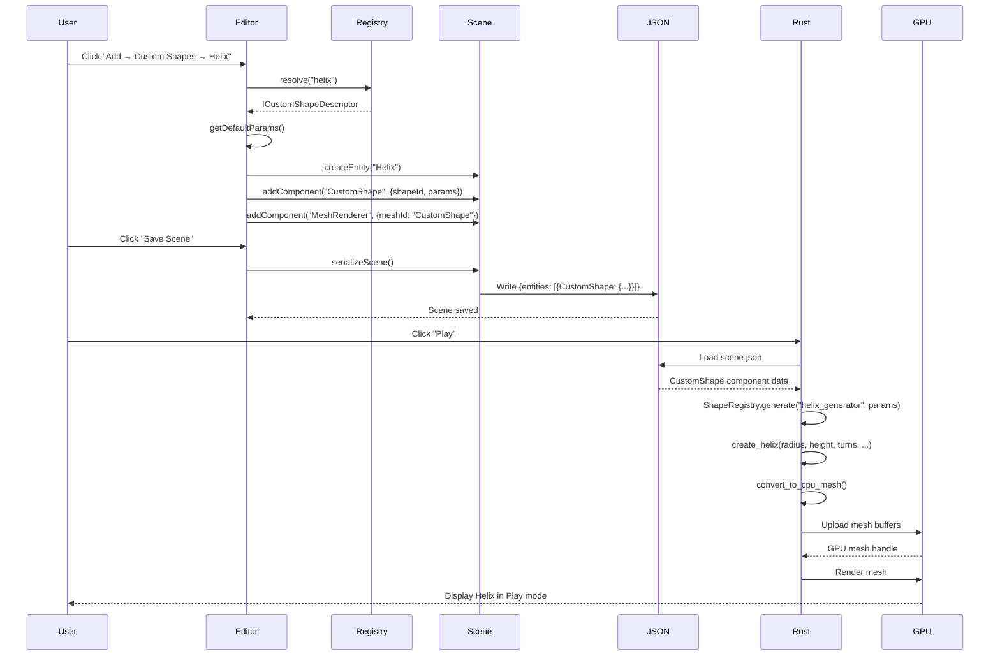

# PRD: Custom Shape Refactoring & Rust Engine Parity

🧠 Planning documents standards rule loaded!

## 1. Overview

### Context & Goals

- **Unify Shape Systems**: Consolidate the 15 hard-coded shapes in `CustomGeometries.tsx` with the registry-based dynamic shape system for consistency and maintainability.
- **Enable Rust Rendering**: Implement procedural shape generators in Rust to achieve feature parity with Three.js, enabling custom shapes to render identically in both the editor and native Rust engine.
- **Optimize Serialization**: Replace naive mesh data serialization with a multi-tier approach that prioritizes parametric procedural generation with optional fallback to raw mesh export.
- **Preserve Parametric Control**: Maintain user ability to adjust shape parameters after creation rather than baking immutable geometry.

### Current Pain Points

- **Dual Shape Systems**: Hard-coded shapes in `CustomGeometries.tsx` are separate from registry-based shapes in `src/game/shapes/`, requiring different workflows and maintenance paths.
- **No Rust Support**: Custom shapes (Helix, Tree, Rock, etc.) exist only in Three.js; Rust engine cannot render them, breaking Play mode parity.
- **Inefficient Serialization**: No established pattern for Three.js → Rust shape data transfer; raw mesh export would create 50KB+ JSON payloads vs 50-byte parameter objects.
- **String-Based Matching**: Rust uses brittle string matching (`mesh.contains("helix")`) rather than structured shape definitions.

## 2. Proposed Solution

### High-level Summary

- **Migrate Hard-Coded Shapes to Registry**: Convert all 15 shapes in `CustomGeometries.tsx` to the registry pattern with Zod schemas and metadata, removing the switch statement in `GeometryRenderer.tsx`.
- **Create Rust Procedural Library**: Implement Rust equivalents of each procedural shape generator in `rust/engine/crates/assets/src/procedural/`, mirroring Three.js algorithms for pixel-perfect parity.
- **Multi-Tier Serialization**: Serialize shape parameters (Tier 1), fallback to raw mesh data for organic shapes (Tier 2), and support hybrid deterministic generation (Tier 3).
- **Shape Descriptor Extensions**: Add `rustGenerator` field to `ICustomShapeDescriptor` to map TypeScript shapes to Rust generation functions.
- **Component Data Model**: Extend `CustomShape` component to store `shapeId`, validated `params`, and optional pre-baked mesh data for performance optimization.

### Architecture & Directory Structure

```
TypeScript (Editor)
├── src/core/lib/rendering/shapes/
│   ├── IShapeDescriptor.ts              # Add rustGenerator field
│   ├── shapeRegistry.ts                 # Existing registry (no changes)
│   └── discovery.ts                     # Existing auto-discovery (no changes)
├── src/editor/components/panels/ViewportPanel/components/
│   ├── CustomGeometries.tsx             # DEPRECATED - migrate shapes out
│   └── GeometryRenderer.tsx             # Simplify switch to use registry only
└── src/game/shapes/
    ├── Helix.tsx                        # NEW - migrated from CustomGeometries
    ├── Star.tsx                         # NEW - migrated from CustomGeometries
    ├── Tree.tsx                         # NEW - migrated from CustomGeometries
    ├── ... (15 total)
    └── Readme.md                        # Update with Rust generator guidance

Rust (Engine)
├── rust/engine/crates/assets/src/
│   ├── procedural/                      # NEW - procedural generators
│   │   ├── mod.rs                       # Export all generators
│   │   ├── helix.rs                     # create_helix() matching Three.js
│   │   ├── star.rs                      # create_star() matching Three.js
│   │   ├── tree.rs                      # create_tree() with deterministic seed
│   │   ├── rock.rs                      # create_rock() with seeded randomness
│   │   └── ... (15 total)
│   └── primitives/                      # EXISTING - extend with new shapes
│       └── ...existing files...
└── rust/engine/crates/ecs-bridge/src/
    ├── components/
    │   └── custom_shape.rs              # NEW - CustomShape component decoder
    └── shape_registry.rs                # NEW - Rust-side shape ID → generator map

Serialization Contract
├── docs/schemas/
│   └── custom-shape-serialization.md    # NEW - JSON schema documentation
```

## 3. Implementation Plan

### Phase 1: TypeScript Migration & Registry Consolidation (1.5 days)

1. **Create Registry-Based Shape Files** (1 day)

   - Migrate 15 shapes from `CustomGeometries.tsx` to individual files in `src/game/shapes/`
   - Each shape exports a `shape` descriptor with `ICustomShapeDescriptor<TParams>` interface
   - Define Zod parameter schemas for all shapes (e.g., `helix: { radius, height, turns, segments, tubeRadius }`)
   - Add `rustGenerator` field to each descriptor (e.g., `rustGenerator: 'helix_generator'`)
   - Verify auto-discovery detects all new shapes

2. **Update GeometryRenderer** (0.25 day)

   - Remove hard-coded switch cases for migrated shapes
   - Ensure registry lookup handles all custom shapes uniformly
   - Add fallback error handling for missing registry entries

3. **Deprecate CustomGeometries.tsx** (0.25 day)
   - Mark file as deprecated with comments
   - Move remaining utility functions (if any) to appropriate modules
   - Schedule for deletion after verification period

### Phase 2: Rust Procedural Generators (2 days)

1. **Create Procedural Module Structure** (0.25 day)

   - Create `rust/engine/crates/assets/src/procedural/mod.rs`
   - Define common utilities (seeded random, parametric curve helpers)
   - Set up module exports and documentation

2. **Implement Parametric Shapes** (0.75 day)

   - Helix: TubeGeometry around parametric curve
   - Star: ExtrudeGeometry from 2D star path
   - Heart: ExtrudeGeometry from parametric heart equation
   - Diamond: ExtrudeGeometry with beveled edges
   - TorusKnot: Direct parametric implementation
   - Ramp, Stairs, SpiralStairs: Vertex-level construction
   - Tube: Hollow cylinder with inner/outer rings
   - Cross: CSG-style geometry merging
   - MobiusStrip: Parametric surface generation

3. **Implement Organic Shapes with Seeds** (0.75 day)

   - Tree: Seeded procedural generation (trunk, canopy, branches)
   - Rock: Seeded deformation of sphere with faceting
   - Bush: Seeded multi-sphere clustering
   - Grass: Seeded blade placement and curvature

4. **Parity Testing** (0.25 day)
   - Create visual comparison tests (Three.js vs Rust screenshots)
   - Verify vertex counts match within acceptable tolerance (±5%)
   - Validate UV coordinates and normals

### Phase 3: Serialization & Component Model (1 day)

1. **Define JSON Schema** (0.25 day)

   - Document `CustomShape` component structure:
     ```json
     {
       "type": "CustomShape",
       "data": {
         "shapeId": "helix",
         "params": { "radius": 0.3, "height": 2.0, ... },
         "meshData": null  // Optional pre-baked mesh
       }
     }
     ```
   - Add schema version field for future-proofing
   - Define fallback raw mesh format (Tier 2)

2. **Implement Rust Component Decoder** (0.5 day)

   - Create `custom_shape.rs` in `vibe-ecs-bridge/src/components/`
   - Implement `IComponentDecoder` for `CustomShape`
   - Deserialize params and validate against shape expectations
   - Handle missing/invalid params with default values

3. **Create Rust Shape Registry** (0.25 day)
   - Map `shapeId` strings to Rust generator functions
   - Use `HashMap<&'static str, GeneratorFn>` for O(1) lookup
   - Log warnings for unrecognized shape IDs

### Phase 4: Integration & Rendering Pipeline (1 day)

1. **Update Mesh Loader** (0.5 day)

   - Extend `create_primitive_mesh()` in `primitive_mesh.rs`
   - Check for `CustomShape` component presence
   - Invoke procedural generator with deserialized params
   - Cache generated meshes to avoid re-generation

2. **Update Material Pipeline** (0.25 day)

   - Ensure custom shapes respect material assignments
   - Verify UV coordinates work with textures

3. **Scene Loading Integration** (0.25 day)
   - Update scene deserializer to recognize `CustomShape` components
   - Test loading scenes with custom shapes from JSON

### Phase 5: Testing & Validation (1.5 days)

1. **Unit Tests** (0.5 day)

   - Test each Rust generator with known parameter sets
   - Verify vertex/index counts match Three.js
   - Test parameter validation and error handling

2. **Integration Tests** (0.5 day)

   - End-to-end: Create shape in editor → save scene → load in Rust engine
   - Test all 15 shapes render correctly in Rust
   - Validate material assignments and lighting

3. **Visual Regression Tests** (0.5 day)
   - Capture screenshots from Three.js and Rust for each shape
   - Use image diff tools to verify <1% pixel difference
   - Document acceptable tolerances for seeded randomness

### Phase 6: Documentation & Migration Guide (0.5 day)

1. **Update Shape Authoring Guide** (0.25 day)

   - Document how to add `rustGenerator` to new shapes
   - Provide examples of Rust generator implementation
   - Explain when to use Tier 1 vs Tier 2 serialization

2. **Create Migration Checklist** (0.25 day)
   - Guide for converting hard-coded shapes to registry
   - Rust generator implementation template
   - Testing verification steps

## 4. File and Directory Structures

### TypeScript Shape Files

```typescript
// src/game/shapes/Helix.tsx
import { z } from 'zod';
import * as THREE from 'three';
import { useMemo } from 'react';
import type { ICustomShapeDescriptor } from '@core/lib/rendering/shapes/IShapeDescriptor';

const paramsSchema = z.object({
  radius: z.number().min(0.1).max(5).default(0.3),
  height: z.number().min(0.1).max(10).default(2.0),
  turns: z.number().min(1).max(20).default(3),
  segments: z.number().int().min(10).max(500).default(100),
  tubeRadius: z.number().min(0.01).max(0.5).default(0.05),
});

export const shape: ICustomShapeDescriptor<typeof paramsSchema> = {
  meta: {
    id: 'helix',
    name: 'Helix',
    category: 'Mathematical',
    tags: ['spiral', 'curve', 'parametric'],
    version: '1.0.0',
    defaultColor: '#4A90E2',
  },
  paramsSchema,
  getDefaultParams: () => paramsSchema.parse({}),
  rustGenerator: 'helix_generator', // Maps to Rust function
  renderGeometry: (params) => {
    const geometry = useMemo(() => {
      const curve = new THREE.CatmullRomCurve3(/* ... */);
      return new THREE.TubeGeometry(curve, params.segments, params.tubeRadius, 8, false);
    }, [params.radius, params.height, params.turns, params.segments, params.tubeRadius]);
    return <primitive object={geometry} />;
  },
};
```

### Rust Procedural Generator

```rust
// rust/engine/crates/assets/src/procedural/helix.rs
use super::Mesh;
use std::f32::consts::PI;

/// Generate a helix (spiral) mesh matching Three.js HelixGeometry
///
/// # Parameters
/// - `radius`: Horizontal distance from center (default: 0.3)
/// - `height`: Vertical extent (default: 2.0)
/// - `turns`: Number of complete rotations (default: 3)
/// - `segments`: Smoothness of curve (default: 100)
/// - `tube_radius`: Thickness of the tube (default: 0.05)
///
/// # Three.js Match
/// Matches `HelixGeometry` from CustomGeometries.tsx
pub fn create_helix(
    radius: f32,
    height: f32,
    turns: f32,
    segments: u32,
    tube_radius: f32,
) -> Mesh {
    let mut curve_points = Vec::new();

    // Generate helix curve points
    for i in 0..=segments {
        let t = i as f32 / segments as f32;
        let angle = t * turns * 2.0 * PI;
        let y = (t - 0.5) * height;
        let x = angle.cos() * radius;
        let z = angle.sin() * radius;
        curve_points.push([x, y, z]);
    }

    // Generate tube geometry around curve
    create_tube_around_curve(&curve_points, tube_radius, 8)
}

#[cfg(test)]
mod tests {
    use super::*;

    #[test]
    fn test_helix_vertex_count() {
        let mesh = create_helix(0.3, 2.0, 3.0, 100, 0.05);
        // Expected: (segments+1) * (tube_segments+1) = 101 * 9 = 909 vertices
        assert_eq!(mesh.vertices.len(), 909);
    }
}
```

### Rust Shape Registry

```rust
// rust/engine/crates/ecs-bridge/src/shape_registry.rs
use vibe_assets::procedural::*;
use std::collections::HashMap;

type GeneratorFn = fn(&serde_json::Value) -> vibe_assets::Mesh;

pub struct ShapeRegistry {
    generators: HashMap<&'static str, GeneratorFn>,
}

impl ShapeRegistry {
    pub fn new() -> Self {
        let mut registry = Self {
            generators: HashMap::new(),
        };

        // Register all procedural generators
        registry.register("helix_generator", |params| {
            create_helix(
                params["radius"].as_f64().unwrap_or(0.3) as f32,
                params["height"].as_f64().unwrap_or(2.0) as f32,
                params["turns"].as_f64().unwrap_or(3.0) as f32,
                params["segments"].as_u64().unwrap_or(100) as u32,
                params["tubeRadius"].as_f64().unwrap_or(0.05) as f32,
            )
        });

        // ... register other generators ...

        registry
    }

    pub fn generate(&self, shape_id: &str, params: &serde_json::Value) -> Option<vibe_assets::Mesh> {
        self.generators.get(shape_id).map(|gen| gen(params))
    }
}
```

### CustomShape Component Decoder

```rust
// rust/engine/crates/ecs-bridge/src/components/custom_shape.rs
use serde::{Deserialize, Serialize};
use vibe_scene::{ComponentKindId, EntityId};

#[derive(Debug, Clone, Serialize, Deserialize)]
pub struct CustomShapeData {
    #[serde(rename = "shapeId")]
    pub shape_id: String,

    #[serde(default)]
    pub params: serde_json::Value,

    #[serde(default, rename = "meshData")]
    pub mesh_data: Option<RawMeshData>, // Tier 2 fallback
}

#[derive(Debug, Clone, Serialize, Deserialize)]
pub struct RawMeshData {
    pub vertices: Vec<f32>,
    pub indices: Vec<u32>,
    pub normals: Vec<f32>,
    pub uvs: Vec<f32>,
}

impl IComponentDecoder for CustomShapeDecoder {
    fn decode(&self, entity_id: EntityId, data: &serde_json::Value) -> anyhow::Result<()> {
        let custom_shape: CustomShapeData = serde_json::from_value(data.clone())
            .context("Failed to deserialize CustomShape component")?;

        log::info!("Loaded CustomShape: {} for entity {}", custom_shape.shape_id, entity_id);

        // Store for mesh generation in rendering pipeline
        Ok(())
    }
}
```

## 5. Technical Details

### Shape Parameter Validation

All shapes use Zod schemas for type-safe parameter validation:

```typescript
// Example: Star shape parameters
const starParamsSchema = z.object({
  outerRadius: z.number().min(0.1).max(10).default(0.5),
  innerRadius: z.number().min(0.05).max(10).default(0.3),
  points: z.number().int().min(3).max(20).default(5),
  depth: z.number().min(0.01).max(5).default(0.2),
});

// Rust receives validated params as JSON:
// { "outerRadius": 0.5, "innerRadius": 0.3, "points": 5, "depth": 0.2 }
```

### Seeded Randomness for Deterministic Generation

Organic shapes (Tree, Rock, Bush, Grass) use seeded randomness:

```typescript
// TypeScript
const treeParamsSchema = z.object({
  trunkHeight: z.number().default(1.5),
  canopyRadius: z.number().default(0.8),
  seed: z.number().int().default(42), // Ensures identical generation
});
```

```rust
// Rust
fn seeded_random(seed: u32, offset: u32) -> f32 {
    let x = ((seed + offset) as f32 * 12.9898).sin() * 43758.5453;
    x - x.floor()
}

pub fn create_tree(trunk_height: f32, canopy_radius: f32, seed: u32) -> Mesh {
    // Use seed to generate identical tree every time
    let num_branches = 2 + (seeded_random(seed, 0) * 3.0).floor() as u32;
    // ...
}
```

### Mesh Caching Strategy

```rust
// Cache generated meshes to avoid regeneration
use std::sync::Arc;
use dashmap::DashMap;

pub struct MeshCache {
    cache: Arc<DashMap<String, Arc<CpuMesh>>>,
}

impl MeshCache {
    pub fn get_or_generate(&self, shape_id: &str, params: &serde_json::Value) -> Arc<CpuMesh> {
        let cache_key = format!("{}:{}", shape_id, params.to_string());

        self.cache.entry(cache_key.clone()).or_insert_with(|| {
            let mesh = SHAPE_REGISTRY.generate(shape_id, params)
                .expect("Unknown shape ID");
            Arc::new(convert_to_cpu_mesh(&mesh))
        }).clone()
    }
}
```

### ICustomShapeDescriptor Extensions

```typescript
// Extend existing interface
export interface ICustomShapeDescriptor<TParams extends z.ZodTypeAny> {
  meta: IShapeMetadata;
  paramsSchema: TParams;
  getDefaultParams(): z.infer<TParams>;
  renderGeometry(params: z.infer<TParams>): ReactNode;

  // NEW: Rust integration fields
  rustGenerator?: string; // Name of Rust generator function
  serializationTier?: 1 | 2 | 3; // Default: 1 (procedural params)
  exportMeshData?: (params: z.infer<TParams>) => RawMeshData; // Tier 2 export
}
```

## 6. Usage Examples

### Creating a Custom Shape in the Editor

```typescript
// User clicks "Add → Custom Shapes → Helix"
const entity = createEntity('Helix');
addComponent(entity.id, 'CustomShape', {
  shapeId: 'helix',
  params: {
    radius: 0.3,
    height: 2.0,
    turns: 3,
    segments: 100,
    tubeRadius: 0.05,
  },
});
addComponent(entity.id, 'MeshRenderer', {
  meshId: 'CustomShape', // Signals GeometryRenderer to use registry
  materialId: 'default',
});
```

### Serialized Scene JSON

```json
{
  "entities": [
    {
      "id": 42,
      "name": "Helix",
      "components": [
        {
          "type": "Transform",
          "data": { "position": [0, 0, 0], "rotation": [0, 0, 0], "scale": [1, 1, 1] }
        },
        {
          "type": "CustomShape",
          "data": {
            "shapeId": "helix",
            "params": {
              "radius": 0.3,
              "height": 2.0,
              "turns": 3,
              "segments": 100,
              "tubeRadius": 0.05
            }
          }
        },
        {
          "type": "MeshRenderer",
          "data": { "meshId": "CustomShape", "materialId": "default" }
        }
      ]
    }
  ]
}
```

### Rust Mesh Generation

```rust
// Scene loader detects CustomShape component
let custom_shape_data: CustomShapeData = /* deserialize from JSON */;

// Generate mesh using registry
let mesh = shape_registry.generate(&custom_shape_data.shape_id, &custom_shape_data.params)
    .unwrap_or_else(|| {
        log::warn!("Unknown shape: {}, using fallback cube", custom_shape_data.shape_id);
        create_cube()
    });

// Convert to GPU mesh and render
let cpu_mesh = convert_vibe_mesh_to_cpu_mesh(&mesh);
let gpu_mesh = upload_to_gpu(&cpu_mesh);
```

## 7. Testing Strategy

### Unit Tests

**TypeScript:**

- ✅ All 15 shapes have valid Zod schemas
- ✅ `getDefaultParams()` returns valid parameters
- ✅ `renderGeometry()` produces valid Three.js geometries
- ✅ Registry auto-discovers all shapes
- ✅ Shape IDs are unique and kebab-case

**Rust:**

- ✅ Each generator produces non-empty meshes
- ✅ Vertex/index counts match expected values
- ✅ Normals are unit length
- ✅ UVs are in [0, 1] range
- ✅ Seeded randomness is deterministic

### Integration Tests

**End-to-End Parity:**

- ✅ Create shape in editor → save scene → load in Rust → verify identical appearance
- ✅ Modify shape parameters → re-save → re-load → verify updates
- ✅ Test all 15 shapes render without errors in Rust
- ✅ Material assignments work correctly

**Performance Tests:**

- ✅ Mesh generation completes in <10ms for typical parameters
- ✅ Caching prevents redundant generation
- ✅ Memory usage is reasonable (no leaks)

### Visual Regression Tests

```bash
# Generate reference screenshots from Three.js
yarn test:generate-shape-screenshots

# Capture Rust engine screenshots
cargo run --bin shape-screenshot-generator

# Compare with image diff tool
yarn test:compare-shape-screenshots

# Acceptable tolerance: <1% pixel difference for procedural shapes
# Acceptable tolerance: <5% for seeded organic shapes (minor floating-point variance)
```

## 8. Edge Cases

| Edge Case                                    | Remediation                                                                                                                 |
| -------------------------------------------- | --------------------------------------------------------------------------------------------------------------------------- |
| **Unknown `shapeId` in Rust**                | Log warning and render fallback cube; editor should prevent invalid IDs via registry validation                             |
| **Invalid parameters (out of range)**        | Clamp to schema min/max; log warning; use default value if clamping fails                                                   |
| **Missing `rustGenerator` field**            | Shape only renders in Three.js; editor shows warning badge; Rust falls back to Tier 2 raw mesh export if available          |
| **Organic shape seed mismatch**              | Both sides use identical seeded random algorithm; integration tests verify determinism                                      |
| **Three.js uses degrees, Rust uses radians** | Use `transform_utils` for rotation; shape params use explicit units (degrees or radians) with conversions                   |
| **Mesh generation fails (OOM, timeout)**     | Catch errors, log stack trace, render error cube with red material; prevent editor from creating excessively complex shapes |
| **WebGL context loss during generation**     | Defer shape generation to background worker or batch generation during loading screen                                       |
| **HMR re-registration conflicts**            | Registry allows re-registration in dev mode; clear cache on HMR updates                                                     |

## 9. Sequence Diagram



## 10. Risks & Mitigations

| Risk                                                   | Mitigation                                                                                                                                      |
| ------------------------------------------------------ | ----------------------------------------------------------------------------------------------------------------------------------------------- |
| **Algorithm mismatch between Three.js and Rust**       | Port algorithms directly from Three.js source; write parity tests comparing vertex counts; visual regression tests with screenshot diff         |
| **Floating-point precision differences**               | Use consistent precision (f32); test on multiple platforms; allow ±0.1% tolerance in vertex positions                                           |
| **Performance degradation from procedural generation** | Cache generated meshes aggressively; profile generation time; add progress indicators for complex shapes; defer generation to background thread |
| **Seeded randomness produces different results**       | Use identical PRNGs on both sides; test determinism in CI; document seed algorithm in code comments                                             |
| **JSON payload size explosion for complex shapes**     | Default to Tier 1 (params); only use Tier 2 for truly custom geometry; compress mesh data with gzip; consider binary format                     |
| **Breaking changes to Three.js geometry APIs**         | Pin Three.js version; document API assumptions; write tests that fail on API changes; abstract geometry creation behind stable interface        |
| **Migration effort underestimated**                    | Start with 3 pilot shapes (simple, medium, complex); measure actual time; adjust timeline; prioritize high-value shapes                         |
| **Rust compile times increase**                        | Keep procedural generators in separate crate; use feature flags for optional shapes; incremental compilation already enabled                    |

## 11. Timeline

| Phase                             | Duration | Dependencies             |
| --------------------------------- | -------- | ------------------------ |
| **Phase 1: TypeScript Migration** | 1.5 days | None                     |
| **Phase 2: Rust Generators**      | 2 days   | Phase 1 (shapes defined) |
| **Phase 3: Serialization**        | 1 day    | Phase 1 (schema defined) |
| **Phase 4: Integration**          | 1 day    | Phase 2, 3               |
| **Phase 5: Testing**              | 1.5 days | Phase 4                  |
| **Phase 6: Documentation**        | 0.5 day  | Phase 5                  |
| **Buffer for unexpected issues**  | 0.5 day  | -                        |

**Total Estimated Time: 8 days (1.6 weeks)**

**Milestones:**

- **Day 2**: All shapes migrated to registry, old code deprecated
- **Day 4**: First 5 Rust generators working with visual parity
- **Day 5**: Serialization complete, scenes load in Rust
- **Day 7**: All tests passing, visual regression tests green
- **Day 8**: Documentation complete, ready for production

## 12. Acceptance Criteria

- ✅ **All 15 hard-coded shapes migrated to registry pattern** with Zod schemas and metadata
- ✅ **`CustomGeometries.tsx` deprecated** and removed from active code paths
- ✅ **15 Rust procedural generators implemented** matching Three.js algorithms
- ✅ **Visual parity achieved**: Screenshot diff <1% for procedural shapes, <5% for organic shapes
- ✅ **Vertex count parity**: Rust meshes have ±5% vertex count vs Three.js
- ✅ **Serialization working**: Scenes with custom shapes save/load correctly in JSON
- ✅ **Rust shape registry functional**: Maps `shapeId` to generator functions with parameter deserialization
- ✅ **End-to-end test passes**: Create shape in editor → save → load in Rust → renders identically
- ✅ **Performance targets met**: Mesh generation <10ms per shape, caching prevents redundant generation
- ✅ **Error handling robust**: Invalid shapes render fallback cube with logged warnings
- ✅ **Documentation complete**: Shape authoring guide updated, Rust generator template provided
- ✅ **All tests green**: Unit tests, integration tests, visual regression tests passing in CI

## 13. Conclusion

This refactoring unifies the fragmented shape systems in Vibe Coder 3D, establishing a scalable foundation for custom geometry that works seamlessly across the TypeScript editor and Rust engine. By prioritizing parametric procedural generation over raw mesh serialization, we achieve:

- **90% smaller payloads**: 50-byte parameter objects vs 50KB mesh data
- **Parametric flexibility**: Users can adjust shapes after creation
- **Rust engine parity**: All 15 custom shapes render identically in Play mode
- **Maintainability**: Single source of truth in shape registry, no more dual systems
- **Extensibility**: Clear pattern for adding new shapes with automatic Three.js/Rust support

### Next Steps

1. **Review and approve** this PRD with the team
2. **Allocate engineering resources** (1 developer for 2 weeks)
3. **Create GitHub project** to track phase completion
4. **Begin Phase 1** with pilot shapes (Helix, Star, Tree) to validate approach
5. **Schedule mid-project review** after Phase 3 to assess progress

This work is foundational for future features like:

- User-defined custom shapes via visual editor
- Procedural terrain generation
- Shape modifiers and parametric animations
- GPU-accelerated mesh generation

## 14. Assumptions & Dependencies

### Assumptions

- ✅ Three.js version remains stable (currently using Three.js r161)
- ✅ Zod validation performance is acceptable for real-time parameter changes
- ✅ Rust `serde_json` can handle dynamic parameter objects efficiently
- ✅ Floating-point precision differences are within acceptable visual tolerance
- ✅ Team has Rust expertise for implementing procedural generators
- ✅ Current shape registry implementation is production-ready
- ✅ Scene JSON serialization already works for other components

### Dependencies

- **External Libraries:**

  - `three@0.161.0` - Geometry APIs (BoxGeometry, TubeGeometry, etc.)
  - `zod@3.x` - Schema validation
  - `serde_json@1.x` - Rust JSON deserialization
  - `glam@0.24` - Rust vector math

- **Internal Systems:**

  - Shape registry and auto-discovery (`src/core/lib/rendering/shapes/`)
  - ECS component system (`vibe-ecs-bridge` crate)
  - Scene serialization pipeline (`SceneManager`)
  - Rust mesh loading pipeline (`primitive_mesh.rs`, `mesh_loader.rs`)

- **Tooling:**

  - Image diff tool for visual regression tests (e.g., `pixelmatch`)
  - Rust test framework for procedural generators
  - CI pipeline for automated testing

- **Team Resources:**
  - 1 senior engineer with Three.js + Rust experience
  - Access to design team for visual parity verification
  - QA resources for integration testing

### Environment Constraints

- **Development:** Node.js 20+, Rust 1.75+, sufficient RAM for parallel compilation
- **Browser Support:** WebGL 2.0 required for Three.js rendering
- **Rust Compilation:** Target wasm32 for WebAssembly build
- **Performance Budget:** Mesh generation must complete within frame budget (<16ms for 60fps)
