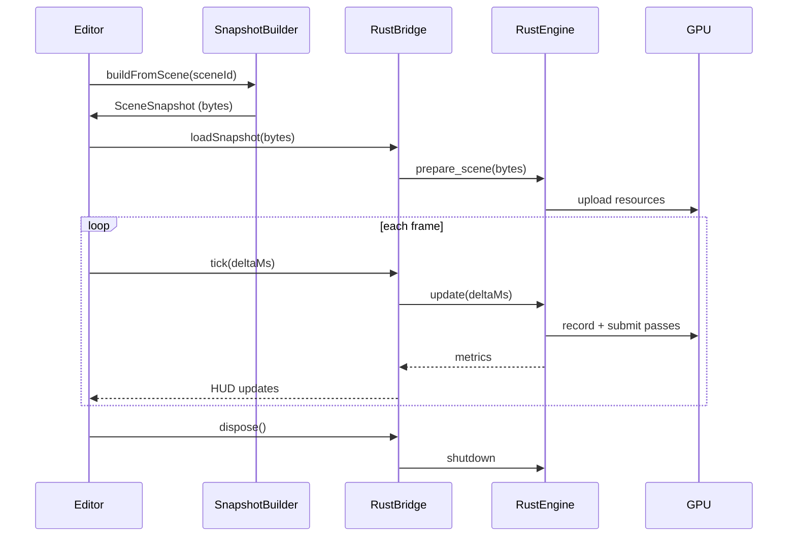

# Rust Integration Plan

🧠 Planning documents standards rule loaded!

## Overview

### Context & Goals

- Deliver a Rust-based renderer that can consume the same ECS artifacts produced in the editor, beginning with `src/game/scenes/*` scene definitions.
- Preserve the existing BitECS authoring stack (`SceneLoader`, `EntitySerializer`, `ComponentRegistry`) as the authoritative source of truth while exporting a Rust-friendly runtime snapshot.
- Provide a switchable runtime so that the React editor can hand off rendering to the Rust engine without losing editor interactivity or scene parity.
- Enable future native builds (desktop, console) that reuse the Rust renderer with minimal changes.

### Current Pain Points

- React Three Fiber + three.js struggles to maintain stable frame times for larger scenes; GC pressure and JS/TS math slow down complex compositions.
- Rendering logic is tightly coupled to React lifecycle hooks (`EngineLoop`, `transformSystem`), making it difficult to reuse outside the browser.
- There is no serialization contract today that Rust can rely on; scene data lives in TSX modules and runtime registries.
- Asset loading, instancing, and material state are managed piecemeal, complicating any cross-language renderer handoff.

## Proposed Solution

### High-level Summary

- Stand up a `rust/renderer` crate powered by `wgpu` + `bevy_ecs` (or `hecs`) that mirrors the existing BitECS component set (`Transform`, `MeshRenderer`, `Light`, `Camera`, `RigidBody`).
- Introduce a `SceneSnapshot` contract generated via the existing `SceneSerializer`/`EntitySerializer`, enriched with material, prefab, and asset metadata for Rust consumption.
- Expose a `RustRendererBridge` TypeScript module that loads the Rust engine compiled to WebAssembly for the editor, with an identical API compiled to a native binary via `winit`.
- Layer an asset resolver that maps logical IDs (materialId, meshId) from the editor into filesystem/URL handles understood by the Rust runtime.
- Allow the editor to toggle between `EngineLoop` (WebGL) and the new Rust pipeline, validating that both consume the same ECS data.

### Architecture & Directory Structure

```
repo-root/
├── docs/
│   └── rust-integration.md
├── rust/
│   ├── Cargo.toml
│   └── renderer/
│       ├── Cargo.toml
│       └── src/
│           ├── lib.rs
│           ├── engine/
│           │   ├── mod.rs
│           │   └── renderer.rs
│           ├── scene/
│           │   ├── mod.rs
│           │   ├── types.rs
│           │   └── loader.rs
│           ├── ecs/
│           │   ├── mod.rs
│           │   └── systems.rs
│           └── bridge/
│               └── wasm.rs
└── src/
    └── core/
        └── lib/
            └── rendering/
                └── rust/
                    ├── RustRendererBridge.ts
                    ├── SceneSnapshotBuilder.ts
                    ├── AssetResolver.ts
                    └── wasm-entry.ts
```

## Implementation Plan

### Phase 1: Data Contract & Inventory (0.5 day)

1. Audit `SceneLoader`, `SceneDeserializer`, `EntitySerializer`, and `ComponentRegistry` to catalogue all component schemas that must be supported.
2. Define a `SceneSnapshot` TypeScript interface capturing metadata, entity trees, component payloads, and asset references (materials, meshes, textures, scripts).
3. Document asset resolution rules (e.g., `meshId` maps to `/public/assets/models`, `materialId` to `src/game/assets/materials`).

### Phase 2: Rust Workspace & Build Tooling (0.5 day)

1. Create `rust/Cargo.toml` workspace with a `renderer` crate targeting both `cdylib` (for Wasm) and `bin` (for native).
2. Configure `wasm-pack`/`wasm-bindgen` pipeline (integrated via `vite-plugin-rsw` or custom script) so `yarn build` can produce the Wasm artifact.
3. Establish CI tasks for `cargo fmt`, `cargo clippy`, and Rust unit tests alongside existing JS lint/test commands.

### Phase 3: Scene Snapshot Builder (0.75 day)

1. Implement `SceneSnapshotBuilder` that invokes `SceneLoader.load` with adapters pointing at an isolated `EntityManager`/`ComponentRegistry` instance (`EntityManager(world, registry)` constructor variant) to avoid mutating the live editor world.
2. Serialize entity/component data via `EntitySerializer.serializeWithCompression`, collect deduplicated materials, and gather referenced assets into the snapshot.
3. Emit snapshot bytes (JSON for dev, optional postcard/bincode) and surface them through `SceneSnapshotBuilder.buildFromScene(sceneId)` for downstream consumption.

### Phase 4: Rust Renderer Core (1.5 days)

1. Model Rust `scene::Snapshot` structs mirroring the snapshot contract; implement deserialization (JSON first, binary behind a feature flag) with validation.
2. Implement `ecs` module using `bevy_ecs` (or `hecs`) with systems for transforms, instancing, and render submission. Map component IDs to strongly typed Rust components.
3. Build `engine::renderer` on top of `wgpu`, loading meshes/materials via `gltf`/`obj` helpers and caching GPU resources keyed by persistent IDs.
4. Add basic render loop with camera handling, directional + ambient lights, and PBR-lite shading to match the current editor lighting expectations.

### Phase 5: Editor Integration & Runtime Switching (1 day)

1. Wrap the Wasm renderer in `RustRendererBridge` exposing `init(canvas)`, `load(sceneId | snapshot)`, `update(dt)`, `resize(bounds)`, and `dispose()`; ensure it reuses the editor’s `SceneSnapshotBuilder`.
2. Extend `GameEngine` (or a new `RustPlaySurface`) to hide the Three.js canvas while the Rust renderer owns the DOM canvas; wire Play/Stop controls to start/stop the Rust loop.
3. Implement diff streaming: when entities/components mutate in the editor, produce incremental snapshot fragments and feed them to Rust without full reload.

### Phase 6: Validation, Tooling, & Native Harness (0.75 day)

1. Add parity tests that compare renderable entity counts/material assignments between BitECS (`EntityQueries`) and the snapshot consumed by Rust.
2. Ship a native `cargo run --bin player --scene example-multi-file.scene.json` harness (via `winit`) that loads snapshots from disk for native profiling.
3. Instrument both runtimes with shared FPS/metrics reporting, exposing them via editor HUD for side-by-side comparison.

## File and Directory Structures

```
docs/
├── 0-navigation.md
├── rust-renderer-integration.md   # legacy plan (reference)
└── rust-integration.md            # this document

src/core/lib/rendering/rust/
├── AssetResolver.ts               # maps logical IDs to asset URIs
├── RustRendererBridge.ts          # JS <-> Wasm bridge API
├── SceneSnapshotBuilder.ts        # snapshot generation
└── wasm-entry.ts                  # bootstraps wasm-pack bundle

rust/
├── Cargo.toml                     # workspace definition
└── renderer/
    ├── Cargo.toml                 # crate manifest (wgpu, bevy_ecs, serde)
    └── src/
        ├── lib.rs                 # wasm_bindgen + native entry points
        ├── engine/
        │   ├── mod.rs
        │   └── renderer.rs        # wgpu pipelines, frame submission
        ├── ecs/
        │   ├── mod.rs
        │   └── systems.rs         # systems for lights, transforms, scripts
        ├── scene/
        │   ├── mod.rs
        │   ├── loader.rs          # async asset loading & caching
        │   └── types.rs           # serde snapshot structs
        ├── assets/
        │   └── mod.rs             # mesh/material/texture managers
        └── bridge/
            └── wasm.rs            # wasm-bindgen plumbing
```

## Technical Details

```ts
// src/core/lib/rendering/rust/SceneSnapshotBuilder.ts
import { SceneLoader } from '@core/lib/serialization/SceneLoader';
import { componentRegistry } from '@core/lib/ecs/ComponentRegistry';
import { EntityManager } from '@core/lib/ecs/EntityManager';
import { SceneSnapshot } from './types';

export class SceneSnapshotBuilder {
  private loader = new SceneLoader();
  private worldEntityManager = new EntityManager();

  async buildFromScene(sceneId: string): Promise<SceneSnapshot> {
    const scene = await import(`@/game/scenes/${sceneId}.tsx`);
    await this.loader.load(scene.default.data, this.worldEntityManager, componentRegistry, {
      refreshMaterials: () => {},
      refreshPrefabs: () => {},
    });
    return this.serialize();
  }

  private serialize(): SceneSnapshot {
    // TODO: Use EntitySerializer + ComponentRegistry to build snapshot payload
    return {
      version: 1,
      metadata: {
        /* ... */
      },
      entities: [],
      assets: { materials: [], meshes: [], textures: [] },
    };
  }
}
```

```ts
// src/core/lib/rendering/rust/RustRendererBridge.ts
import initWasm, { RendererHandle } from './wasm-entry';

export class RustRendererBridge {
  private handle?: RendererHandle;

  async init(canvas: HTMLCanvasElement): Promise<void> {
    await initWasm();
    this.handle = await RendererHandle.create(canvas);
  }

  async loadSnapshot(bytes: Uint8Array): Promise<void> {
    if (!this.handle) throw new Error('Rust renderer not initialized');
    await this.handle.load_scene(bytes);
  }

  tick(deltaMs: number): void {
    this.handle?.update(deltaMs);
  }

  dispose(): void {
    this.handle?.dispose();
    this.handle = undefined;
  }
}
```

```rust
// rust/renderer/src/lib.rs
use wasm_bindgen::prelude::*;

mod bridge;
mod engine;
mod scene;

#[wasm_bindgen]
pub struct RendererHandle {
    core: bridge::RendererCore,
}

#[wasm_bindgen]
impl RendererHandle {
    #[wasm_bindgen(constructor)]
    pub fn new(canvas_id: &str) -> Result<RendererHandle, JsValue> {
        console_error_panic_hook::set_once();
        let core = bridge::RendererCore::new(canvas_id)?;
        Ok(Self { core })
    }

    #[wasm_bindgen]
    pub async fn load_scene(&mut self, bytes: &[u8]) -> Result<(), JsValue> {
        let snapshot = scene::Snapshot::from_bytes(bytes)?;
        self.core.prepare_scene(snapshot).await.map_err(JsValue::from)
    }

    #[wasm_bindgen]
    pub fn update(&mut self, delta_ms: f32) -> Result<(), JsValue> {
        self.core.tick(delta_ms).map_err(JsValue::from)
    }

    #[wasm_bindgen]
    pub fn dispose(self) {}
}
```

```rust
// rust/renderer/src/scene/types.rs
use serde::{Deserialize, Serialize};

#[derive(Debug, Serialize, Deserialize)]
pub struct Snapshot {
    pub version: u16,
    pub metadata: Metadata,
    pub entities: Vec<Entity>,
    pub materials: Vec<Material>,
    pub meshes: Vec<Mesh>,
    pub assets: AssetRefs,
}

#[derive(Debug, Serialize, Deserialize)]
pub struct Entity {
    pub id: u32,
    pub name: String,
    pub parent: Option<u32>,
    pub components: Components,
}

#[derive(Debug, Serialize, Deserialize, Default)]
pub struct Components {
    pub transform: Option<Transform>,
    pub mesh_renderer: Option<MeshRenderer>,
    pub light: Option<Light>,
    pub camera: Option<Camera>,
    pub rigid_body: Option<RigidBody>,
    pub scripts: Vec<ScriptRef>,
}
```

## Usage Examples

```ts
// src/editor/playMode/useRustRuntime.ts
const bridge = new RustRendererBridge();
await bridge.init(document.getElementById('rust-canvas') as HTMLCanvasElement);
const snapshot = await snapshotBuilder.buildFromScene(activeSceneId);
await bridge.loadSnapshot(snapshot.toBinary());
gameLoop.subscribe((dt) => bridge.tick(dt * 1000));
```

```tsx
// src/App.tsx (runtime switch)
{
  isRustPlayMode ? (
    <canvas id="rust-canvas" className="absolute inset-0" />
  ) : (
    <Canvas>{children}</Canvas>
  );
}
```

```rust
// rust/renderer/src/bin/player.rs
fn main() -> anyhow::Result<()> {
    let path = std::env::args().nth(1).expect("scene file path");
    let data = std::fs::read(path)?;
    let snapshot = renderer::scene::Snapshot::from_bytes(&data)?;
    renderer::native::run(snapshot)?;
    Ok(())
}
```

## Testing Strategy

- **Unit Tests (TypeScript)**: Verify `SceneSnapshotBuilder` output matches `ISceneData` for representative scenes; snapshot component counts vs. `EntityQueries`.
- **Unit Tests (Rust)**: Deserialize sample snapshots, validate component presence, confirm resource caches deduplicate materials/meshes.
- **Integration Tests**: Spin up Wasm renderer in headless `@react-three/test-renderer` harness to ensure `load -> tick -> dispose` works; native `cargo test -- --ignored` to open offscreen surface and render single frame.
- **Performance Benchmarks**: Measure frame time and GPU submission cost with test scenes, comparing WebGL vs. Rust renderer inside CI/perf harness.

## Edge Cases

| Edge Case                                          | Remediation                                                                                                 |
| -------------------------------------------------- | ----------------------------------------------------------------------------------------------------------- |
| Scene references meshes/materials not yet exported | AssetResolver surfaces missing handles; Rust loader substitutes debug material and logs telemetry.          |
| Scripts/components unsupported by Rust renderer    | Snapshot flags unsupported components; Rust engine skips them while editor displays compatibility warnings. |
| Large instanced scenes (>10k entities)             | Batch instancing in Rust ECS; support streaming updates and frustum culling before upload.                  |
| Hot reload during playback                         | Diff dispatcher queues changes; Rust renderer applies component-wise patches between frames.                |
| Mismatched coordinate systems (Three.js vs. wgpu)  | Define explicit conversion matrix in SceneSnapshot; include regression test validating camera orientation.  |

## Sequence Diagram



## Risks & Mitigations

| Risk                                                                   | Mitigation                                                                                                                |
| ---------------------------------------------------------------------- | ------------------------------------------------------------------------------------------------------------------------- |
| Snapshot schema divergence between TS and Rust                         | Generate TypeScript `SceneSnapshot` types from Rust `serde` using `typeshare` or JSON schema; add CI compatibility tests. |
| Wasm binary size and load time                                         | Use `wasm-bindgen --target web` with `wee_alloc`, strip symbols in release builds, lazy-load on Play.                     |
| Asset path discrepancies across environments (dev vs. prod vs. native) | Centralize asset root resolution in `AssetResolver`; allow overrides via config/environment variables.                    |
| Complexity of maintaining two renderers (Three.js + Rust)              | Gate Rust runtime behind feature flag initially; keep WebGL as fallback until parity tests pass.                          |
| GPU feature availability (WebGPU vs. native wgpu backends)             | Feature-detect adapters; provide fallback shader paths and disable unsupported effects dynamically.                       |

## Timeline

- Total estimate: **4.0 days**
  - Phase 1: 0.5 day
  - Phase 2: 0.5 day
  - Phase 3: 0.75 day
  - Phase 4: 1.5 days
  - Phase 5: 1.0 day
  - Phase 6: 0.75 day

## Acceptance Criteria

- `SceneSnapshotBuilder` exports deterministic snapshots for scenes in `src/game/scenes/*`, including materials, prefabs, and locked IDs.
- Rust renderer (Wasm) can initialize, load snapshots, render, and dispose without errors inside the editor Play mode.
- Native `cargo run -- scene.scene.json` renders the same scene assets (camera, lighting, meshes) as the editor preview.
- Diff-based updates reflect Transform/Material/Light changes within one frame when editing during play.
- CI runs Rust tests, lints, and snapshot contract verification alongside existing JS pipelines.
- Clear fallback to the legacy WebGL renderer when Rust runtime initialization fails or the environment lacks GPU support.

## Conclusion

This plan establishes a shared snapshot contract so the Rust renderer consumes the same ECS data that powers the existing editor, while introducing a dual-target Rust runtime (Wasm + native) for high-performance rendering. By phasing work across data contracts, renderer implementation, and editor integration, we preserve current workflows and unlock native-class performance for complex scenes.

## Assumptions & Dependencies

- `SceneLoader`/`EntitySerializer` remain authoritative for translating TS scene modules into runtime entities.
- Asset pipeline (materials, meshes, textures) will be accessible via file URLs or packaged resources compatible with both Vite dev server and native filesystem.
- Rust toolchain (1.75+) and `wasm-pack` will be available in CI; WebGPU support is available in target browsers or we fall back to native builds.
- Future physics/audio integrations will reuse existing JS services; the Rust renderer initially focuses on visuals while consuming ECS positional data.
