## Geometry Metadata (BufferGeometry Parity) PRD

🧠 Planning documents standards rule loaded!

## 1. Overview

- **Context & Goals**: Define an engine‑agnostic geometry metadata format (JSON-first) that encodes the essentials of `THREE.BufferGeometry` so shapes authored/edited in the editor can be exported and reproduced exactly in the Rust renderer.
- **Current Pain Points**: Custom shapes are TSX modules with React/Three logic; this couples authoring to runtime, blocks Rust parity, and complicates serialization/versioning.
- **Scope**: MVP covers triangle meshes with attributes: `position`, `index`, `normal`, `uv`, and optional `color`, `tangent`, `groups`, `drawRange`. Extensions (morphs, skinning) are out of MVP.
- **Non‑Goals**: Material authoring, animation, and skeleton formats are separate concerns.

## 2. Proposed Solution

- **High‑level Summary**:

  - Introduce a JSON geometry metadata format that mirrors `BufferGeometry` semantics and attribute names.
  - Provide parsers: TS → `BufferGeometry` and Rust → `CpuMesh`/`Mesh` with identical topology and attributes.
  - Add exporter in the editor to capture any `BufferGeometry` into metadata; add importer to spawn entities from metadata.
  - Replace legacy TSX custom shapes with JSON geometry assets and a new `GeometryAsset` component.
  - Keep optional binary packing for large arrays (JSON+BIN) while defaulting to JSON arrays for simplicity.

- **Architecture & Directory Structure**:

```
src/
├── core/
│   ├── lib/
│   │   └── geometry/
│   │       ├── metadata/
│   │       │   ├── IGeometryMeta.ts               # TS types + Zod schema
│   │       │   ├── parseMetaToBufferGeometry.ts   # TS importer → BufferGeometry
│   │       │   ├── exportBufferGeometryToMeta.ts  # TS exporter ← BufferGeometry
│   │       │   └── io.ts                          # JSON/JSON+BIN IO helpers
│   │       └── ecs/
│   │           └── GeometryAssetComponent.ts      # Zod schema + BitECS fields
│   └── index.ts                                   # named exports only
├── editor/
│   ├── components/
│   │   ├── menus/
│   │   │   └── EnhancedAddObjectMenu.tsx          # Integrates Geometry Assets
│   │   ├── shared/
│   │   │   └── GeometryBrowserModal.tsx           # Discover/import/preview geometry
│   │   └── panels/ViewportPanel/components/
│   │       └── GeometryRenderer.tsx               # Adds GeometryAsset rendering path
│   └── hooks/
│       ├── useGeometryAssets.ts                   # Discovery/search hooks
│       └── useEntityCreation.ts                   # createGeometryAssetEntity()
├── game/
│   └── geometry/
│       ├── Readme.md                              # Authoring/format guide
│       ├── example_box.shape.json                 # Example asset
│       └── ... user‑provided metadata files ...
└── rust/
    └── engine/
        ├── crates/ecs-bridge/src/decoders.rs      # Add GeometryAsset decoder
        ├── crates/assets/src/geometry_meta.rs     # Rust structs + parsing
        └── src/renderer/mesh_loader.rs            # Build CpuMesh from meta
```

## 3. Implementation Plan

### Phase 1: Schema & Parsers (0.5 day)

1. Define `IGeometryMeta` and attribute shapes in TS with Zod.
2. Implement TS importer `parseMetaToBufferGeometry(meta: IGeometryMeta): BufferGeometry`.
3. Implement TS exporter `exportBufferGeometryToMeta(geom: BufferGeometry): IGeometryMeta`.

### Phase 2: Rust Structures & Loader (1 day)

1. Add `geometry_meta.rs` with `GeometryMeta`, `Attribute`, `Accessor` using snake_case.
2. Implement JSON parsing (serde) and optional BIN loading for arrays.
3. Build `CpuMesh` in `mesh_loader.rs` from `GeometryMeta` (positions, indices, normals, uvs, tangents).
4. Compute tangents in Rust when absent; compute normals when absent (optional flag).

### Phase 3: ECS & Rendering Integration (0.5 day)

1. Add `GeometryAssetComponent` (TS) with fields: `geometryId` | `path`, `options` (recomputeNormals, recenter, etc.).
2. Update `combineRenderingContributions` to map to meshType `'GeometryAsset'`.
3. Extend `GeometryRenderer.tsx` to render via TS importer for previews and runtime.
4. Add Rust decoder for `GeometryAsset` in `ecs-bridge` to load metadata and create meshes.

### Phase 4: Editor UX (0.5 day)

1. Add `GeometryBrowserModal` to list `game/geometry/*.shape.json` files with search/tags.
2. Add “Import from Selection” exporter to save any selected mesh’s BufferGeometry to metadata.
3. Add Enhanced Add menu category: “Geometry Assets …” with Browse flow and quick items.

### Phase 5: Migration & Coexistence (0.5 day)

1. Feature flag both systems: `enableJsonGeometryAssets`.
2. Provide script to convert existing CustomShape entities to `GeometryAsset` referencing exported metadata.
3. Keep TSX custom shapes read‑only during migration; warn on creation.

### Phase 6: Cleanup & Deletion (0.5 day)

1. Remove `shapeRegistry`, `discovery.ts`, TSX shape descriptors under `src/game/shapes`.
2. Remove CustomShape code paths from `GeometryRenderer`, editor hooks, tests, and docs.
3. Finalize docs and examples under `game/geometry/`.

## 4. File and Directory Structures

```
/src/core/lib/geometry/metadata/
├── IGeometryMeta.ts
├── parseMetaToBufferGeometry.ts
├── exportBufferGeometryToMeta.ts
└── io.ts

/src/core/lib/ecs/
└── GeometryAssetComponent.ts

/src/editor/components/shared/
└── GeometryBrowserModal.tsx

/src/game/geometry/
├── Readme.md
└── *.shape.json
```

## 5. Technical Details

### 5.1 Geometry Metadata Schema (TS)

```ts
// src/core/lib/geometry/metadata/IGeometryMeta.ts
import { z } from 'zod';

export const AttributeTypeSchema = z.enum([
  'float32',
  'float16',
  'uint32',
  'uint16',
  'uint8',
  'int32',
  'int16',
  'int8',
]);

export const AccessorSchema = z.object({
  itemSize: z.number().int().min(1),
  normalized: z.boolean().default(false),
  // One of the following data sources must be provided
  array: z.array(z.number()).optional(), // Inline numbers (JSON)
  uri: z.string().optional(), // External .bin or data URI
  type: AttributeTypeSchema.default('float32'),
});

export const GeometryMetaSchema = z.object({
  meta: z.object({
    version: z.string().default('1.0.0'),
    generator: z.string().default('vibe-geometry-exporter'),
    name: z.string().optional(),
    tags: z.array(z.string()).optional(),
  }),
  attributes: z.object({
    position: AccessorSchema, // required
    normal: AccessorSchema.optional(), // optional
    uv: AccessorSchema.optional(), // optional
    color: AccessorSchema.optional(), // optional
    tangent: AccessorSchema.optional(), // optional (xyz + w)
    // Future: skinIndex, skinWeight, morphAttributes, etc.
  }),
  index: AccessorSchema.optional(),
  groups: z
    .array(
      z.object({
        start: z.number().int(),
        count: z.number().int(),
        materialIndex: z.number().int().optional(),
      }),
    )
    .optional(),
  drawRange: z.object({ start: z.number().int(), count: z.number().int() }).optional(),
  bounds: z
    .object({
      aabb: z
        .tuple([
          z.tuple([z.number(), z.number(), z.number()]),
          z.tuple([z.number(), z.number(), z.number()]),
        ])
        .optional(),
      sphere: z
        .object({ center: z.tuple([z.number(), z.number(), z.number()]), radius: z.number() })
        .optional(),
    })
    .optional(),
});

export type IGeometryMeta = z.infer<typeof GeometryMetaSchema>;
```

### 5.2 TS Importer/Exporter Signatures

```ts
// parseMetaToBufferGeometry.ts
export function parseMetaToBufferGeometry(meta: IGeometryMeta): THREE.BufferGeometry;

// exportBufferGeometryToMeta.ts
export function exportBufferGeometryToMeta(
  geom: THREE.BufferGeometry,
  opts?: { inline?: boolean },
): IGeometryMeta;
```

### 5.3 Rust Structures (serde)

```rust
// rust/engine/crates/assets/src/geometry_meta.rs
use serde::Deserialize;

#[derive(Debug, Deserialize, Clone)]
pub struct Accessor {
    pub item_size: u32,
    pub normalized: Option<bool>,
    pub r#type: Option<String>,
    pub array: Option<Vec<f32>>, // for float32; indices may use u32/u16 via type
    pub uri: Option<String>,     // optional external BIN or data URI
}

#[derive(Debug, Deserialize, Clone)]
pub struct Group { pub start: u32, pub count: u32, pub material_index: Option<u32> }

#[derive(Debug, Deserialize, Clone)]
pub struct BoundsSphere { pub center: [f32; 3], pub radius: f32 }

#[derive(Debug, Deserialize, Clone)]
pub struct Bounds { pub aabb: Option<([f32;3],[f32;3])>, pub sphere: Option<BoundsSphere> }

#[derive(Debug, Deserialize, Clone)]
pub struct GeometryMeta {
    pub attributes: Attributes,
    pub index: Option<Accessor>,
    pub groups: Option<Vec<Group>>,
    pub draw_range: Option<Range>,
    pub bounds: Option<Bounds>,
}

#[derive(Debug, Deserialize, Clone)]
pub struct Attributes {
    pub position: Accessor,
    pub normal: Option<Accessor>,
    pub uv: Option<Accessor>,
    pub color: Option<Accessor>,
    pub tangent: Option<Accessor>,
}

#[derive(Debug, Deserialize, Clone)]
pub struct Range { pub start: u32, pub count: u32 }
```

### 5.4 Building Meshes from Metadata

```rust
// mesh_loader.rs (conceptual)
fn mesh_from_meta(context: &Context, meta: &GeometryMeta) -> CpuMesh {
    use three_d::{Positions, Indices, Vector2, Vector3};

    let positions: Vec<Vector3<f32>> = to_vec3(meta.attributes.position);
    let normals: Option<Vec<Vector3<f32>>> = meta.attributes.normal.as_ref().map(|a| to_vec3(*a));
    let uvs: Option<Vec<Vector2<f32>>> = meta.attributes.uv.as_ref().map(|a| to_vec2(*a));
    let indices: Vec<u32> = to_indices(meta.index.as_ref());

    CpuMesh {
        positions: Positions::F32(positions),
        normals,
        uvs,
        indices: Indices::U32(indices),
        ..Default::default()
    }
}
```

### 5.5 Editor Export/Import

```ts
// Export selected mesh geometry to JSON metadata
export async function exportSelectedToGeometryMeta(
  node: THREE.Object3D,
  opts?: { inline?: boolean },
) {
  const mesh = node as THREE.Mesh;
  const geom = mesh.geometry as THREE.BufferGeometry;
  const meta = exportBufferGeometryToMeta(geom, { inline: true });
  // Save to /src/game/geometry/<name>.shape.json
}

// Import JSON metadata to a previewable Three BufferGeometry
export async function importGeometryMeta(path: string) {
  const meta = await fetch(path).then((r) => r.json());
  return parseMetaToBufferGeometry(GeometryMetaSchema.parse(meta));
}
```

## 6. Usage Examples

- **Create entity from geometry asset (TS)**:

```ts
import { createGeometryAssetEntity } from '@/editor/hooks/useEntityCreation';
createGeometryAssetEntity('/src/game/geometry/example_box.shape.json');
```

- **Rust load on scene decode**:

```rust
// decoders.rs
if let Some(geom_path) = geometry_asset.path { load_geometry_meta_and_create_mesh(geom_path)?; }
```

## 7. Testing Strategy

- **Unit Tests (TS)**:
  - Export/import round‑trip for cube/sphere/plane geometries matches vertex/index counts and bounds.
  - Validation: reject malformed attributes; ensure `itemSize` semantics.
- **Unit Tests (Rust)**:
  - Parse minimal and full metadata; build `CpuMesh`; verify counts and bounds.
  - Compute normals/tangents paths when attributes are missing.
- **Integration Tests**:
  - Editor exports a shape; Rust loads and renders identical triangle topology (hash counts).
  - UI browser lists JSON files and previews without errors.

## 8. Edge Cases

| Edge Case                        | Remediation                                               |
| -------------------------------- | --------------------------------------------------------- |
| Missing normals/tangents         | Optional compute flags; default safe values               |
| Large arrays (JSON bloat)        | Support JSON+BIN (uri) with base64 or external .bin       |
| 16‑bit vs 32‑bit indices         | `type` in Accessor; upgrade to u32 when needed            |
| Non‑indexed geometry             | Omit index; expand as provided                            |
| Different winding orders         | Preserve order; document CCW; offer optional flip utility |
| Groups/material splits           | Preserve groups in metadata; map to submeshes if needed   |
| Attribute alignment/interleaving | MVP uses non‑interleaved; interleaved as future extension |

## 9. Sequence Diagram

```mermaid
sequenceDiagram
  participant Editor
  participant Exporter
  participant Files
  participant TSImporter
  participant RustLoader
  participant Renderer

  Editor->>Exporter: Select mesh → Export metadata
  Exporter->>Files: Write *.shape.json (+ .bin optional)
  Editor->>TSImporter: Load metadata for preview
  TSImporter-->>Editor: BufferGeometry
  Renderer->>TSImporter: Use BufferGeometry in viewport
  RustLoader->>Files: Read *.shape.json
  RustLoader-->>Renderer: CpuMesh with identical topology
```



## 10. Risks & Mitigations

| Risk                                         | Mitigation                                                      |
| -------------------------------------------- | --------------------------------------------------------------- |
| JSON size overhead for large meshes          | Support external BIN; gzip on distribution                      |
| Divergent parity between TS and Rust parsing | Single source of truth schema; golden files; round‑trip tests   |
| Legacy TSX custom shape dependency           | Feature flag coexistence; explicit migration; scheduled cleanup |
| Incorrect attribute types                    | Strict Zod/serde validation; clear error messages               |

## 11. Timeline

- Phase 1: 0.5 day
- Phase 2: 1.0 day
- Phase 3: 0.5 day
- Phase 4: 0.5 day
- Phase 5: 0.5 day
- Phase 6: 0.5 day
- **Total**: ~3.5 days

## 12. Acceptance Criteria

- Exporter produces `*.shape.json` that can be imported in TS and Rust with identical vertex/index counts and bounding volumes.
- Editor can browse/import geometry assets and instantiate entities using `GeometryAssetComponent`.
- Rust loader renders geometry assets without regressions; normals/tangents computed when requested.
- Legacy CustomShape flows are removed after migration; tests/docs updated.
- rust use visual debugger and a created test scene to prove it worked

## 13. Conclusion

This plan replaces TSX‑based custom shapes with a unified geometry metadata format that ensures exact `BufferGeometry` parity in Rust. It decouples authoring from runtime, enables stable serialization/versioning, and simplifies UI flows for importing, previewing, and instantiating geometry.

## 14. Assumptions & Dependencies

- Three.js present in editor for exporter/importer usage; Yarn toolchain.
- TS path aliases configured; Zod available.
- Rust uses `serde` for JSON and existing `three_d`/`wgpu` stack; tangent computation already present.
- Optional: `base64` crate for data URIs; file IO available for BINs.
