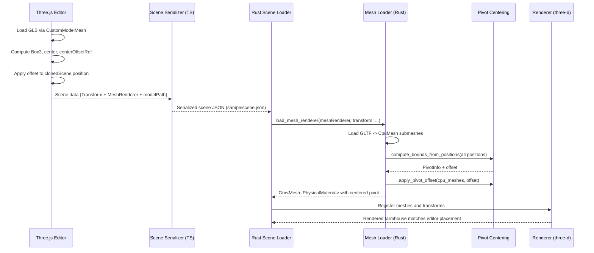

## GLB Pivot Centering Parity PRD (Three.js ↔ Rust)

🧠 Planning documents standards rule loaded!

## 1. Overview

- **Context & Goals**

  - Ensure GLB / custom model pivots are handled identically in the editor (Three.js) and the Rust renderer so entities occupy the same world-space position across stacks.
  - Replicate the editor’s bounding-box centering logic (used for `meshId: 'custom'` and selection outlines) inside the Rust GLTF loading path, behind clear configuration.
  - Preserve compatibility with existing geometry-metadata (`GeometryAsset`) flows and LOD pipelines without breaking current scenes.
  - Provide a path to migrate parity-critical sample scenes (e.g. `samplescene`) so houses and props reliably “sit” on terrain in both runtimes.

- **Current Pain Points**

  - Three.js editor **recenters custom GLBs to their bounding-box center** before applying the entity `Transform`, while Rust applies the same transform to meshes using the **raw GLB origin**.
  - As a result, the farmhouse in `samplescene` appears correctly grounded in the editor but floats or is vertically offset in the Rust runtime.
  - Geometry assets (`GeometryAsset` with `options.recenter`) already support origin recentering parity, but standard GLB flows via `MeshRenderer` do not.
  - There is no unified configuration or metadata that describes whether a given GLB should be recentered, making behavior implicit and hard to debug.

## 2. Proposed Solution

- **High‑level Summary**

  - Introduce a **pivot-centering pipeline** in the Rust GLTF loader that can mirror the editor’s behavior: compute the GLB’s bounding box, derive a center-offset vector, and bake it into the mesh transform.
  - Add a **pivot-centering configuration surface** that can be driven by:
    - Scene metadata (e.g. a `meshOriginMode` or `recenter` flag on `MeshRenderer` or a dedicated metadata map).
    - Sensible defaults for `meshId: 'custom'` and known asset families (FarmHouse, NightStalker, etc.).
  - Standardize GLB origin treatment across:
    - Three.js editor custom-model path (`CustomModelMesh` + `EntityOutline`).
    - Rust `load_mesh_renderer` GLTF path (with optional recentering).
    - Geometry metadata assets (keep using `options.recenter`).
  - Add **visual and numeric parity tests** (farmhouse-on-terrain snapshot scenes) to validate that entity world transforms match between TS and Rust within a small tolerance.

- **Architecture & Directory Structure**

```text
src/
├── editor/
│   └── components/panels/ViewportPanel/components/
│       ├── EntityMesh.tsx                   # Existing: bounding-box centering for custom models
│       └── EntityOutline.tsx                # Uses userData.boundsSize for outlines
rust/
└── engine/
    ├── src/
    │   ├── renderer/
    │   │   ├── mesh_loader.rs              # Add GLB pivot-centering path
    │   │   ├── pivot_centering.rs          # NEW: GLB bounding-box centering helpers
    │   │   └── transform_utils.rs          # Ensure consistent application of offset
    │   └── threed/
    │       └── threed_renderer.rs          # No major changes; uses mesh_loader API
    └── game/
        └── scenes/tests/
            ├── test_pivot_farmhouse.json   # Rust visual parity test scene
            └── test_pivot_variants.json    # Additional GLB pivot test cases
docs/
└── PRDs/
    └── rust/
        └── glb-pivot-centering-parity-prd.md
```

## 3. Implementation Plan

### Phase 1: Behavior Audit & Spec (0.5 day)

1. **Audit Three.js centering behavior**
   - Confirm `CustomModelMesh` in `EntityMesh.tsx`:
     - Computes a `Box3` from the loaded GLB scene.
     - Stores a **single center offset** per entity (`centerOffsetRef`).
     - Applies this offset to align the model so that its bounding-box center is at the entity origin.
   - Verify how `EntityOutline` leverages `userData.boundsSize` and whether any other systems assume a centered origin.
2. **Catalog GLB usages**
   - Enumerate all scene entities with `MeshRenderer.meshId === 'custom'` and non-empty `modelPath` (e.g. farmhouse, NightStalker).
   - Identify which assets need centering for parity vs which rely on native pivots (e.g. FPS arms, camera rigs).
3. **Define origin modes**
   - Draft a small set of origin modes:
     - `raw`: Use GLB origin as-is (no recenter).
     - `bbox_center`: Match editor center logic (bounding-box center to origin).
     - (Optional) `bbox_bottom_center`: Align bounding-box bottom-center to origin (for standing characters / props).

### Phase 2: Rust Pivot Centering Module (0.75 day)

1. Add `pivot_centering.rs` in `rust/engine/src/renderer/` with:
   - `pub enum PivotOriginMode { Raw, BboxCenter, BboxBottomCenter }`
   - Helper that takes `CpuMesh` or raw positions and returns:
     - `center: GlamVec3`
     - `bounds_size: GlamVec3`
     - `offset: GlamVec3` to apply to mesh vertices or local transform.
2. Implement **CPU-side bounding box calculation** that mirrors Three.js:
   - Iterate over `positions` (Vector3<f32>) to compute min/max and center.
   - Support both single-submesh and multi-submesh GLTF loads.
3. Add a function:
   - `pub fn apply_pivot_offset(cpu_mesh: &mut CpuMesh, offset: GlamVec3)`
   - Shift all positions by `offset` but preserve normals, uvs, and indices.
4. Ensure **snake_case** in all Rust code (`pivot_origin_mode`, `bounds_size`, `apply_pivot_offset`).

### Phase 3: Mesh Loader Integration (0.75 day)

1. Extend `load_mesh_renderer` GLTF path in `mesh_loader.rs`:
   - After loading GLTF into `cpu_meshes`, but before creating `Mesh`, determine a `PivotOriginMode` for each submesh.
   - Apply `PivotOriginMode::BboxCenter` by default for:
     - `mesh_id == "custom"` or contains `"custom"` (custom GLBs).
     - Future: any mesh with explicit metadata request (see Phase 4).
2. For `PivotOriginMode::BboxCenter`:
   - Compute bounding box & center for the union of all submeshes belonging to this entity.
   - Compute `offset = -center`.
   - Apply this offset uniformly to all submeshes for the entity so transforms stay consistent.
3. Preserve **final world transform parity**:
   - Keep existing `convert_transform_to_matrix` logic unchanged; the pivot-centering should be a pure adjustment to mesh-local positions.
   - Ensure `final_scale` and `base_scale` are unaffected (only positions are offset).
4. Optionally propagate `bounds_size` into `userData` equivalent if later needed for debug overlays.

### Phase 4: Configuration Surface & Metadata (0.75 day)

1. Define how origin mode is chosen:
   - **Short term**: heuristic based on `mesh_id` and presence of `model_path`.
   - **Long term**: add an optional `originMode?: 'raw' | 'bbox_center' | 'bbox_bottom_center'` to `IMeshRendererComponent` and TS encoder, mirrored in Rust `MeshRenderer` decoder.
2. Extend scene serialization (TS):
   - Update `IMeshRendererComponent` and any schema (if used) to include `originMode?`.
   - Default to `bbox_center` for `meshId: 'custom'` **only in editor-generated scenes**, to avoid breaking existing content.
3. Extend Rust ECS bridge:
   - Add `origin_mode: Option<String>` (or a small enum) to the Rust `MeshRenderer` decoder if/when the field is present.
   - Map string to `PivotOriginMode` in `mesh_loader`.
4. Document the behavior in scene-authoring docs and the model optimization guide so authors know how pivots are treated.

### Phase 5: Tests & Visual Parity Scenes (0.75 day)

1. Add **unit tests** in Rust:
   - `pivot_centering::test_bbox_center_simple_cube` – verify that a cube centered at (0,0,0) stays invariant.
   - `pivot_centering::test_bbox_center_offset_mesh` – mesh with positions in `[1,2]` range is correctly re-centered to origin.
2. Add **integration tests** via small JSON scenes:
   - `test_pivot_farmhouse.json` mirroring the editor sample scene:
     - Same `Transform`, `MeshRenderer`, and `Terrain` configuration as `samplescene`.
   - Snapshot tests that compare the farmhouse’s world-space transform in Rust vs a recorded TS baseline (position & bounding-box minY).
3. Create or reuse **visual QA scenes**:
   - Place farmhouse, NightStalker, and a few other GLBs on terrain at known positions.
   - Capture screenshots from both runtimes and compare visually / by pixel diff tolerance.
4. Wire basic parity tests into CI:
   - At minimum, ensure pivot-centering unit tests and scene loading tests run with `cargo test`.

### Phase 6: Migration & Documentation (0.5 day)

1. Migrate **sample scenes**:
   - Update `samplescene` and other parity-critical scenes to rely on `originMode` instead of hand-tuned transforms, if needed.
   - Validate that previously “floating” houses now sit correctly on terrain in both runtimes.
2. Update docs:
   - Add a short “GLB Pivot Handling” section to:
     - `docs/3D-ASSET-OPTIMIZATION-GUIDE.md`
     - `docs/PRDs/assets/auto-triangle-budget-prd.md` (cross-link, not change behavior).
   - Document origin modes and recommended usage in `src/game/geometry/Readme.md` and scene-authoring guides.
3. Optional: add a **debug overlay** mode in Rust that visualizes bounding boxes and pivot points for meshes to help debug future pivot issues.

## 4. File and Directory Structures

```text
rust/engine/src/renderer/
├── mesh_loader.rs             # Integrate pivot_origin_mode into GLTF path
├── pivot_centering.rs         # NEW: pivot origin helpers (bbox center/bottom)
└── transform_utils.rs         # No behavioral change, but used alongside

rust/game/scenes/tests/
├── test_pivot_farmhouse.json  # Farmhouse on terrain parity test
└── test_pivot_variants.json   # Misc GLB pivot test cases

docs/PRDs/rust/
├── geometry-metadata-prd.md
├── terrain-visual-parity-gap-closure-prd.md
└── glb-pivot-centering-parity-prd.md       # This document
```

## 5. Technical Details

### 5.1 Pivot Centering API (Rust)

```rust
// rust/engine/src/renderer/pivot_centering.rs
use glam::Vec3 as GlamVec3;
use three_d::{CpuMesh, Positions, Vector3};

#[derive(Debug, Clone, Copy, PartialEq, Eq)]
pub enum PivotOriginMode {
    Raw,
    BboxCenter,
    BboxBottomCenter,
}

pub struct PivotInfo {
    pub min: GlamVec3,
    pub max: GlamVec3,
    pub center: GlamVec3,
    pub bounds_size: GlamVec3,
}

pub fn compute_bounds_from_positions(positions: &[Vector3<f32>]) -> Option<PivotInfo> {
    // Iterate over positions to compute min/max/center/bounds_size
    // Returns None for empty meshes
    None
}

pub fn pivot_offset_for_mode(info: &PivotInfo, mode: PivotOriginMode) -> GlamVec3 {
    match mode {
        PivotOriginMode::Raw => GlamVec3::ZERO,
        PivotOriginMode::BboxCenter => GlamVec3::new(-info.center.x, -info.center.y, -info.center.z),
        PivotOriginMode::BboxBottomCenter => {
            let bottom_center = GlamVec3::new(info.center.x, info.min.y, info.center.z);
            -bottom_center
        }
    }
}

pub fn apply_pivot_offset(cpu_mesh: &mut CpuMesh, offset: GlamVec3) {
    if offset.length_squared() == 0.0 {
        return;
    }
    if let Positions::F32(ref mut verts) = cpu_mesh.positions {
        for v in verts.iter_mut() {
            v.x += offset.x;
            v.y += offset.y;
            v.z += offset.z;
        }
    }
}
```

### 5.2 Mesh Loader Integration (Rust)

```rust
// rust/engine/src/renderer/mesh_loader.rs (conceptual excerpt)
use crate::renderer::pivot_centering::{self, PivotOriginMode};

fn infer_pivot_mode(mesh_renderer: &MeshRenderer) -> PivotOriginMode {
    // 1) Respect explicit originMode when present (future extension).
    // 2) Default to BboxCenter for custom GLBs (mesh_id == "custom" && model_path non-empty).
    // 3) Fallback to Raw for built-in primitives and other cases.
    PivotOriginMode::Raw
}

pub async fn load_mesh_renderer(...) -> Result<Vec<(Gm<Mesh, PhysicalMaterial>, GlamVec3, GlamVec3)>> {
    // ...
    let pivot_mode = infer_pivot_mode(mesh_renderer);

    // After loading cpu_meshes from GLTF:
    if matches!(pivot_mode, PivotOriginMode::BboxCenter | PivotOriginMode::BboxBottomCenter) {
        // Compute unified bounds across submeshes
        let mut all_positions = Vec::new();
        for cpu_mesh in &cpu_meshes {
            if let Positions::F32(ref verts) = cpu_mesh.positions {
                all_positions.extend_from_slice(verts);
            }
        }
        if let Some(info) = pivot_centering::compute_bounds_from_positions(&all_positions) {
            let offset = pivot_centering::pivot_offset_for_mode(&info, pivot_mode);
            for cpu_mesh in &mut cpu_meshes {
                pivot_centering::apply_pivot_offset(cpu_mesh, offset);
            }
        }
    }

    // Then create Mesh + apply Transform as today via convert_transform_to_matrix()
    // ...
}
```

### 5.3 Editor Behavior Reference (TypeScript)

```ts
// src/editor/components/panels/ViewportPanel/components/EntityMesh.tsx (conceptual)
const box = new Box3();
box.setFromObject(clonedScene);
const center = new Vector3();
box.getCenter(center);

if (centerOffsetRef.current === null) {
  centerOffsetRef.current = new Vector3(-center.x, -center.y, -center.z);
}

const offset = centerOffsetRef.current;
clonedScene.position.set(offset.x, offset.y, offset.z);
clonedScene.rotation.set(0, 0, 0);
clonedScene.scale.set(1, 1, 1);
clonedScene.updateMatrixWorld(true);
```

This is the behavior Rust pivot centering should mirror for `PivotOriginMode::BboxCenter`.

## 6. Usage Examples

```ts
// Scene TSX: farmhouse using custom GLB (editor side)
{
  id: 12,
  name: 'FarmHouse',
  components: {
    Transform: { position: [2.5, 0.5, -0.5], rotation: [0, -30, 0], scale: [1, 1, 1] },
    MeshRenderer: {
      meshId: 'custom',
      materialId: 'default',
      modelPath: '/assets/models/FarmHouse/lod/farm_house_basic_shaded.low_fidelity.glb',
      // Future:
      // originMode: 'bbox_center',
    },
  },
}
```

```rust
// Rust: loading farmhouse GLB with pivot centering
let meshes = load_mesh_renderer(
    context,
    entity,
    &mesh_renderer,
    transform.as_ref(),
    material_manager,
    lod_component,
    lod_manager,
    camera_position,
)
.await?;
// Internally, PivotOriginMode::BboxCenter is inferred for this MeshRenderer.
```

```rust
// Rust: unit test for pivot centering
#[test]
fn test_bbox_center_pivot() {
    use three_d::{Positions, Vector3, CpuMesh};
    let mut mesh = CpuMesh {
        positions: Positions::F32(vec![
            Vector3::new(1.0, 2.0, 3.0),
            Vector3::new(3.0, 4.0, 5.0),
        ]),
        ..Default::default()
    };

    let info = compute_bounds_from_positions(match &mesh.positions {
        Positions::F32(v) => v,
        _ => &[],
    }).expect("bounds");
    let offset = pivot_offset_for_mode(&info, PivotOriginMode::BboxCenter);
    apply_pivot_offset(&mut mesh, offset);

    // Assert that resulting positions are symmetric around origin
}
```

## 7. Testing Strategy

- **Unit Tests**

  - Pivot centering math:
    - Bounds computation for simple and skewed meshes.
    - `PivotOriginMode::BboxCenter` and `BboxBottomCenter` offsets behave as expected.
  - Mesh loader integration:
    - GLTF paths with `meshId: 'custom'` use non-raw pivot mode.
    - Primitive meshes (`cube`, `sphere`, etc.) remain unaffected (`Raw`).

- **Integration Tests**

  - Load `test_pivot_farmhouse.json` in Rust:
    - Assert farmhouse world transform (position & rotation) closely matches a recorded TS baseline (within ε on position).
  - Combine farmhouse + terrain:
    - Ensure AABB of farmhouse intersects terrain or sits within a small epsilon above ground (no obvious floating).
  - LOD variants:
    - Verify pivot centering is stable across `glb/`, `high_fidelity`, and `low_fidelity` variants for the same asset.

## 8. Edge Cases

| Edge Case                                      | Remediation                                                                 |
| --------------------------------------------- | --------------------------------------------------------------------------- |
| Empty or degenerate mesh (no positions)       | Skip pivot centering; log a warning; default to `PivotOriginMode::Raw`.    |
| Extremely large or tiny bounds                | Clamp offsets and sizes; avoid NaNs; use epsilon thresholds for zeros.     |
| Multi-submesh GLTF with different bounds      | Compute a unified bounding box across all submeshes for consistent pivot.  |
| Assets that must keep authored pivot (rigs)   | Allow explicit `originMode: 'raw'` to opt-out of centering.                |
| LOD variants with inconsistent geometry       | Use union bounds across LODs or per-LOD offsets but reuse same world pivot |
| Performance impact for very large meshes      | Cache bounds computations; only compute once per GLB per quality variant.  |

## 9. Sequence Diagram



## 10. Risks & Mitigations

| Risk                                                   | Mitigation                                                                                     |
| ------------------------------------------------------ | ---------------------------------------------------------------------------------------------- |
| Breaking existing content that relied on raw pivots    | Default centering narrowly (e.g. `meshId: 'custom'`), add opt-out via `originMode: 'raw'`.     |
| Performance overhead on large GLBs                     | Cache bounds per GLB path and quality; compute once per asset; use simple O(n) pass.          |
| Numerical drift between TS and Rust centering          | Mirror Box3 behavior exactly; add golden tests comparing TS-exported bounds vs Rust bounds.   |
| Inconsistent behavior across LOD variants              | Ensure pivot offsets are derived from a shared or union bounding box; document expectations.  |
| Future asset formats (e.g. skinned meshes)             | Keep pivot-centering optional; document that skinned rigs should use `originMode: 'raw'`.     |

## 11. Timeline

- Total: ~3.0 days
  - Phase 1: 0.5 day
  - Phase 2: 0.75 day
  - Phase 3: 0.75 day
  - Phase 4: 0.75 day
  - Phase 5: 0.75 day
  - Phase 6: 0.5 day (overlaps with other work; some tasks can be batched)

## 12. Acceptance Criteria

- For parity-critical scenes (e.g. `samplescene` farmhouse on terrain):
  - World-space farmhouse position in Rust matches Three.js baseline within ε ≤ 1e-3 on each axis.
  - Visual inspection shows no noticeable floating or sinking relative to terrain in either runtime.
- GLB origin handling is **explicit**:
  - Origin mode (`raw` / `bbox_center` / `bbox_bottom_center`) is either configured or inferred deterministically.
  - Geometry metadata (`GeometryAsset`) recenter behavior remains unchanged and is documented.
- Unit and integration tests for pivot centering pass in CI.
- Docs updated to describe GLB pivot behavior and how to opt in/out of centering.

## 13. Conclusion

By introducing an explicit pivot-centering pipeline in the Rust GLTF loader that mirrors the editor’s bounding-box centering, this plan closes the spatial parity gap for GLBs such as the farmhouse in `samplescene`. Making origin handling configurable and test-backed ensures models land in the same place across Three.js and Rust, while keeping room for special cases (rigs, FPS arms) that must retain authored pivots.

## 14. Assumptions & Dependencies

- GLTF loading in Rust already produces valid `CpuMesh` data for all submeshes (positions, normals, uvs, indices).
!- Geometry metadata (`*.shape.json`) parity is already implemented and should not be regressed.
- Existing LOD infrastructure (paths, quality selection) will remain unchanged; pivot centering must work across variants.
- Scenes will gradually adopt explicit origin modes where necessary, but initial rollout can rely on conservative heuristics.
- Related documents:
  - `docs/PRDs/rust/geometry-metadata-prd.md`
  - `docs/PRDs/rust/terrain-visual-parity-gap-closure-prd.md`
  - `docs/PRDs/assets/auto-triangle-budget-prd.md`
  - `docs/3D-ASSET-OPTIMIZATION-GUIDE.md`
  - `src/game/geometry/Readme.md`


