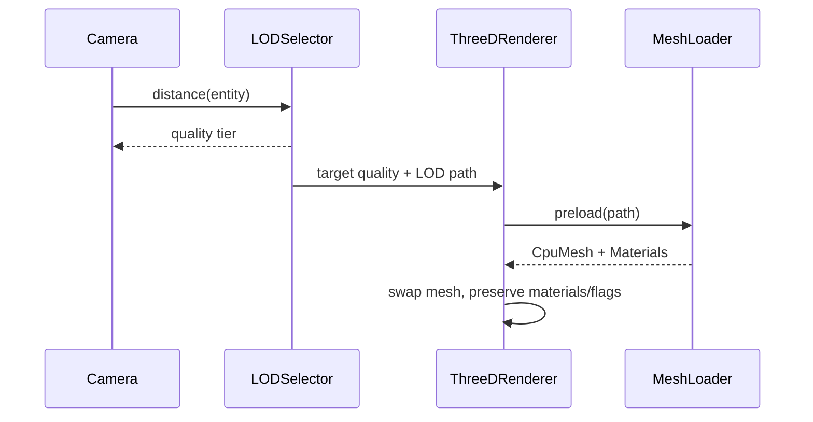

# Rust LOD (Level of Detail) Manager PRD

## Overview

### Context & Goals

- Provide a native Rust LOD manager mirroring the existing TypeScript behavior to ensure performance parity in native builds.
- Support three named quality tiers: `original`, `high_fidelity`, `low_fidelity`, with distance-based switching and manual/global overrides.
- Integrate with the asset pipeline that generates LOD variants via `scripts/optimize-models.js`.
- Expose LOD configuration to runtime systems with clean SRP boundaries and minimal renderer churn.

### Current Pain Points

- Rust engine lacks any LOD component or runtime selection logic; all meshes are loaded at a single quality.
- No distance-based switching in the render loop; camera-driven quality scaling is missing.
- No path resolution utility in Rust to map base model paths to LOD variants consistent with TS logic.

## Proposed Solution

### High‑level Summary

- Implement a Rust `LODManager` (singleton-like service) with global config: quality preset, auto-switch toggle, and distance thresholds.
- Add a `LODComponent` to the scene model to describe per-entity LOD metadata and per-entity overrides.
- Provide path utilities in Rust to resolve `.high_fidelity`/`.low_fidelity` variant paths identical to TS `LODManager.getLODPath()`.
- Hook into mesh loading and the per-frame render update to select the appropriate LOD variant based on camera distance and settings.
- Respect global quality overrides and support per-entity overrides; default thresholds: high=50, low=100.

### Architecture & Directory Structure

```text
/rust/engine/
  src/
    renderer/
      lod_manager.rs           # Global LOD config + path utilities + selection helpers
      lod_selector.rs          # Distance computation + hysteresis (optional) + per-frame updates
      mesh_loader.rs           # (integrate) initial LOD variant resolution at load time
    threed_renderer.rs         # (integrate) call into lod_selector in the frame loop
  crates/
    scene/
      src/models/
        lod.rs                 # LODComponent: per-entity LOD metadata

/src/core/ (TS)
  lib/rendering/LODManager.ts  # Reference implementation (parity target)
  hooks/useLODModel.ts         # Reference of path resolution and dynamic switching behavior
  lib/rendering/lodUtils.ts    # Reference path utilities and normalization
```

## Implementation Plan

### Phase 1: Foundations (0.5 day)

1. Implement `LODQuality` enum and `LODConfig` struct with defaults: quality=`original`, auto_switch=false, thresholds=[50, 100].
2. Implement `lod_path` utilities replicating TS `getLODPath()` behavior (handle `/glb/`→`/lod/`, suffix replacement, multi-dot filenames).
3. Add `LODManager` with `set_quality`, `get_quality`, `set_auto_switch`, `set_distance_thresholds`, `get_quality_for_distance`, `get_all_lod_paths`.

### Phase 2: Scene Model & Loader Integration (0.75 day)

1. Add `LODComponent` to scene models with fields: `original_path`, `high_fidelity_path?`, `low_fidelity_path?`, `distance_thresholds`, `override_quality?`.
2. Extend `mesh_loader` to resolve the initial model path via `LODManager` (respect per-entity override and global config).
3. Add normalization to original path when needed to maintain consistent cache keys.

### Phase 3: Runtime Selection (0.75 day)

1. Introduce `lod_selector` that runs each frame: compute camera→entity distance, select target quality per thresholds/global override.
2. If target quality differs from current, trigger a safe mesh swap: preload new CPU mesh, update `Gm<Mesh, PhysicalMaterial>` while preserving material overrides.
3. Optional hysteresis window to prevent popping (future toggle; basic thresholds first).

### Phase 4: Configuration Surfaces (0.5 day)

1. Add engine-level API for setting global LOD quality and thresholds at runtime (for future scripting/UI binding).
2. Bridge to scripting layer later (out of scope for this PRD, but API surfaces should be stable).

### Phase 5: Tests & Validation (0.5 day)

1. Unit tests for path utilities (all TS test cases mirrored).
2. Unit tests for `get_quality_for_distance` edge cases (negative/zero/very large distances).
3. Integration test: load entity with `LODComponent`, simulate camera distances, assert variant swaps and no panics.

## File and Directory Structures

```text
/rust/engine/src/renderer/
├── lod_manager.rs
├── lod_selector.rs
├── mesh_loader.rs              (modified)
└── mod.rs                      (ensure new modules are exported)

/rust/engine/crates/scene/src/models/
└── lod.rs
```

## Technical Details

### Rust Types and APIs (skeletons)

```rust
// rust/engine/src/renderer/lod_manager.rs

use std::sync::{Arc, Mutex};

#[derive(Clone, Copy, Debug, PartialEq, Eq)]
pub enum LODQuality {
    Original,
    HighFidelity,
    LowFidelity,
}

#[derive(Clone, Debug)]
pub struct LODConfig {
    pub quality: LODQuality,
    pub auto_switch: bool,
    pub distance_thresholds: [f32; 2], // [high, low]
}

impl Default for LODConfig {
    fn default() -> Self {
        Self { quality: LODQuality::Original, auto_switch: false, distance_thresholds: [50.0, 100.0] }
    }
}

pub struct LODManager {
    config: Mutex<LODConfig>,
}

impl LODManager {
    pub fn new() -> Arc<Self> { Arc::new(Self { config: Mutex::new(LODConfig::default()) }) }

    pub fn set_quality(&self, quality: LODQuality) {
        let mut c = self.config.lock().unwrap();
        c.quality = quality;
        // Manual set implies auto_switch off (matches TS semantics)
        c.auto_switch = false;
    }

    pub fn get_quality(&self) -> LODQuality { self.config.lock().unwrap().quality }

    pub fn set_auto_switch(&self, enabled: bool) { self.config.lock().unwrap().auto_switch = enabled; }

    pub fn set_distance_thresholds(&self, high: f32, low: f32) {
        self.config.lock().unwrap().distance_thresholds = [high, low];
    }

    pub fn get_quality_for_distance(&self, distance: f32) -> LODQuality {
        let c = self.config.lock().unwrap();
        if !c.auto_switch { return c.quality; }
        let high = c.distance_thresholds[0];
        let low = c.distance_thresholds[1];
        if distance < high { LODQuality::Original } else if distance < low { LODQuality::HighFidelity } else { LODQuality::LowFidelity }
    }

    pub fn get_lod_path(&self, base_path: &str, quality: Option<LODQuality>) -> String {
        let q = quality.unwrap_or_else(|| self.get_quality());
        get_lod_path_internal(base_path, q)
    }
}

pub fn get_lod_path_internal(base_path: &str, quality: LODQuality) -> String {
    // Original -> unchanged
    if matches!(quality, LODQuality::Original) { return base_path.to_string(); }

    let mut path = base_path.to_string();
    let has_high = path.contains(".high_fidelity.");
    let has_low = path.contains(".low_fidelity.");
    if has_high || has_low {
        path = path.replace(".high_fidelity.", match quality { LODQuality::HighFidelity => ".high_fidelity.", LODQuality::LowFidelity => ".low_fidelity.", LODQuality::Original => "." })
                   .replace(".low_fidelity.", match quality { LODQuality::HighFidelity => ".high_fidelity.", LODQuality::LowFidelity => ".low_fidelity.", LODQuality::Original => "." });
        return path;
    }

    // Insert /lod/ directory when needed
    if path.contains("/glb/") {
        path = path.replacen("/glb/", "/lod/", 1);
    } else if !path.contains("/lod/") {
        if let Some(idx) = path.rfind('/') {
            let (dir, file) = path.split_at(idx + 1);
            path = format!("{}lod/{}", dir, file);
        }
    }

    // Suffix before extension
    if let Some(dot) = path.rfind('.') {
        let (without_ext, ext) = path.split_at(dot);
        let suffix = match quality { LODQuality::HighFidelity => ".high_fidelity", LODQuality::LowFidelity => ".low_fidelity", LODQuality::Original => "" };
        format!("{}{}{}", without_ext, suffix, ext)
    } else {
        path // No extension; return as-is
    }
}
```

```rust
// rust/engine/crates/scene/src/models/lod.rs

#[derive(Clone, Debug)]
pub struct LODComponent {
    pub original_path: String,
    pub high_fidelity_path: Option<String>,
    pub low_fidelity_path: Option<String>,
    pub distance_thresholds: Option<[f32; 2]>,
    pub override_quality: Option<super::LODQuality>,
}
```

```rust
// rust/engine/src/renderer/lod_selector.rs

use glam::Vec3 as GlamVec3;
use super::lod_manager::{LODManager, LODQuality, get_lod_path_internal};

pub struct LODSelector {
    pub manager: std::sync::Arc<LODManager>,
}

impl LODSelector {
    pub fn update_entity_quality(
        &self,
        camera_pos: GlamVec3,
        entity_pos: GlamVec3,
        base_path: &str,
        override_quality: Option<LODQuality>,
    ) -> (LODQuality, String) {
        let distance = camera_pos.distance(entity_pos).max(0.0);
        let target = override_quality.unwrap_or_else(|| self.manager.get_quality_for_distance(distance));
        let path = get_lod_path_internal(base_path, target);
        (target, path)
    }
}
```

### Integration Points

- `mesh_loader.rs`: when loading a model, compute the initial path using `LODManager.get_lod_path()` (respect per-entity override and thresholds when `auto_switch=false` or no distance known, default to global quality).
- `threed_renderer.rs` frame loop: compute camera-to-entity distance, ask `lod_selector` for target quality, and if it differs from current, preload and swap mesh safely.
- Material preservation: when swapping meshes, re-apply existing material bindings via `MaterialManager` and keep `mesh_cast_shadows` / `mesh_receive_shadows` flags.

## Usage Examples

```rust
// Global configuration (e.g., during engine init)
let lod_manager = LODManager::new();
lod_manager.set_distance_thresholds(50.0, 100.0);
lod_manager.set_auto_switch(true);

// Resolve a path explicitly
let base = "/assets/models/Robot/glb/Robot.glb";
let hi = lod_manager.get_lod_path(base, Some(LODQuality::HighFidelity));
// => /assets/models/Robot/lod/Robot.high_fidelity.glb
```

```rust
// Per-frame selection
let (quality, path) = lod_selector.update_entity_quality(camera_pos, entity_pos, base_path, None);
if quality != current_quality_for_entity {
    // Preload and swap mesh (implementation in renderer)
}
```

## Testing Strategy

### Unit Tests

- Path resolution parity with TS (`get_lod_path_internal`):
  - `/glb/` → `/lod/` mapping
  - Already suffixed paths replacement
  - Multiple dots in filenames
  - Different extensions (`.glb`, `.gltf`)
  - Paths without `/glb/` directory
- Distance thresholds:
  - Auto-switch off returns current quality
  - Boundaries: `< high`, `== high`, `< low`, `== low`
  - Negative/zero/very large distances

### Integration Tests

- Load scene with entities having `LODComponent` and simulate camera distances; assert mesh path changes and stability.
- Verify materials, shadow flags, and transforms persist across swaps.

## Edge Cases

| Edge Case                                                 | Remediation                                                 |
| --------------------------------------------------------- | ----------------------------------------------------------- |
| Path already contains `.high_fidelity` or `.low_fidelity` | Replace suffix with target quality (no duplicate suffixes). |
| Missing `/glb/` subdir                                    | Insert `/lod/` before filename.                             |
| Multiple dots in filename                                 | Insert quality suffix before extension only.                |
| Negative distance                                         | Clamp to 0; treat as `< high`.                              |
| LOD variant file missing                                  | Fallback to `original` path; log warning.                   |
| Frequent flicker near thresholds                          | Add small hysteresis window (future toggle).                |

## Sequence Diagram



## Risks & Mitigations

| Risk                                         | Mitigation                                          |
| -------------------------------------------- | --------------------------------------------------- |
| Runtime swaps cause frame hitches            | Preload before swap; stagger updates; cache meshes. |
| Asset variant missing                        | Fallback to `original`; log once per asset.         |
| Material mismatches on swap                  | Re-apply material overrides via `MaterialManager`.  |
| Excess memory from caching multiple variants | LRU cache size limits; release unused variants.     |
| Divergence from TS behavior                  | Mirror TS tests; add parity tests.                  |

## Timeline

- Phase 1: 0.5 day
- Phase 2: 0.75 day
- Phase 3: 0.75 day
- Phase 4: 0.5 day
- Phase 5: 0.5 day
- Total: ~3.0 days

## Acceptance Criteria

- Global APIs: set/get quality, auto-switch, set thresholds implemented and thread-safe.
- Path resolution matches TS behavior across all tested cases.
- Entities with `LODComponent` load the correct initial variant and switch at the defined distances.
- Mesh swaps preserve materials, cast/receive shadows, and transforms.
- If a variant is unavailable, engine falls back to `original` without crashing.
- Unit and integration tests pass; logs show single warning per missing variant.

## Conclusion

This PRD delivers a Rust-native LOD system that mirrors our TS implementation for performance parity. It provides predictable path resolution, camera-driven switching, and safe runtime swaps, while laying groundwork for optional hysteresis and scripting integration.

## Assumptions & Dependencies

- Asset pipeline (`scripts/optimize-models.js`) generates `/lod/` variants with `.high_fidelity`/`.low_fidelity` suffixes.
- three-d renderer supports hot mesh swapping without invalidating materials.
- Scene model can be extended with `LODComponent` and serialized accordingly.
- Global config may later be exposed to scripting; current scope is engine-level APIs only.

