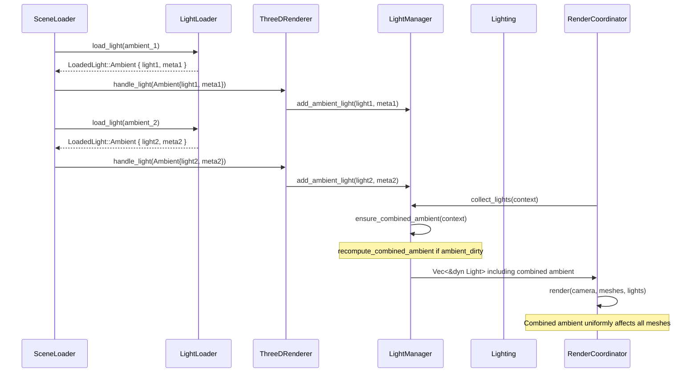

# Rust Ambient Light Parity PRD

## Overview

- **Context & Goals**

  - Achieve feature parity for ambient light handling between the TypeScript/Three.js editor runtime and the Rust/WGPU engine runtime.
  - Support multiple ambient lights in Rust, matching Three.js behavior where multiple `<ambientLight>` components contribute additively to scene illumination.
  - Ensure scenes authored in the TS editor with multiple ambient lights render equivalently in Rust, maintaining visual consistency across both runtimes.
  - Align ambient light intensity and color blending behavior to match Three.js additive lighting model.

- **Current Pain Points**
  - Rust engine only supports a single ambient light (`Option<AmbientLight>`), causing subsequent ambient lights to overwrite previous ones.
  - When multiple ambient lights exist in a scene, only the last loaded ambient light affects rendering, losing intensity and color contributions from earlier lights.
  - Three.js side supports multiple ambient lights that contribute additively (intensities sum, colors blend), creating a mismatch in rendering behavior.
  - No mechanism to combine multiple ambient lights into a single effective ambient light for the three_d rendering pipeline.
  - `EnvironmentLighting.tsx` component sums ambient light intensities but Rust doesn't yet reflect this additive behavior.

## Proposed Solution

- **High‑level Summary**

  - Change `ThreeDLightManager` to store multiple ambient lights (`Vec<AmbientLight>`) instead of a single `Option<AmbientLight>`.
  - Maintain a parallel `Vec<AmbientLightMetadata>` capturing authoring-time parameters (intensity, color, enabled, etc.).
  - Introduce a deterministic algorithm to combine multiple ambient lights into a single effective ambient contribution that matches Three.js semantics.
  - Centralize combination and caching in `ThreeDLightManager` so that render-time code only consumes a stable set of `&dyn Light`.
  - Update light collection, scene loading, and renderer integration to use the new structures.
  - Maintain backward compatibility for existing single-ambient scenes.
  - Provide visibility and test coverage to guarantee visual parity and avoid regressions.

- **Refinement Notes**

  - Semantics are aligned with how scenes are authored in the TS editor and consumed in Three.js:
    - Multiple `AmbientLight` instances are allowed; their effects sum.
    - Disabling/removing one light proportionally reduces the total ambient contribution.
  - The Rust implementation must:
    - Avoid invalid lifetimes (no borrowing temporaries in returned light slices).
    - Avoid heavy per-frame allocations by caching combined ambient state.
    - Respect `three_d` constraints (e.g., `AmbientLight` is constructed via `AmbientLight::new(context, intensity, color)` and treated as opaque).
  - `ThreeDLightManager` is the single source of truth:
    - Owns physical `AmbientLight` instances.
    - Owns `AmbientLightMetadata` and a cached `combined_ambient_light`.
    - Exposes query/debug APIs for counts and effective ambient values.

- **Architecture & Directory Structure**

```text
rust/engine/
└── src/
    ├── renderer/
    │   ├── lighting.rs                    # Ambient combination utilities (pure-ish helpers)
    │   └── light_loader.rs                # Loads lights + metadata from scene
    └── threed/
        ├── threed_light_manager.rs        # Owns ambient lights + metadata + cached combined ambient
        ├── threed_renderer.rs             # Uses add_ambient_light() API
        └── threed_render_coordinator.rs   # Consumes collected lights; no custom ambient hacks
```

## Implementation Plan

### Design Principles

These principles guide all phases:

- Match authoring semantics:
  - Behavior must match how designers expect lights to behave in Three.js scenes authored via the editor.
- Keep renderer API simple:
  - Downstream render code works with a final `Vec<&dyn Light>`; complexity stays in the manager.
- Avoid per-frame churn:
  - Recompute combined ambient only when ambient configuration changes.
- Sound ownership and lifetimes:
  - No references to temporaries; combined ambient is owned where its references live.
- Backward compatible:
  - Single-ambient scenes continue to behave the same (modulo any bug fixes that improve correctness).
- Debbugable and observable:
  - Make it easy (especially under a debug flag) to inspect raw ambient entries and the combined result.

### Phase 1: Update Light Manager Storage (0.75 day)

1. Introduce `AmbientLightMetadata`:

```rust
#[derive(Clone)]
pub struct AmbientLightMetadata {
    pub intensity: f32,
    pub color: Srgba,
    pub enabled: bool, // mirrors component state; disabled lights excluded from combination
}
```

2. Change `ThreeDLightManager` from `Option<AmbientLight>` to:

```rust
pub struct ThreeDLightManager {
    directional_lights: Vec<EnhancedDirectionalLight>,
    point_lights: Vec<PointLight>,
    spot_lights: Vec<EnhancedSpotLight>,
    ambient_lights: Vec<AmbientLight>,
    ambient_light_metadata: Vec<AmbientLightMetadata>,
    combined_ambient_light: Option<AmbientLight>,
    ambient_dirty: bool,
    ambient_cfg: AmbientCombineConfig,
}
```

3. API changes in `ThreeDLightManager`:

- Replace `set_ambient_light()` with:

```rust
pub fn add_ambient_light(
    &mut self,
    light: AmbientLight,
    metadata: AmbientLightMetadata,
) {
    self.ambient_lights.push(light);
    self.ambient_light_metadata.push(metadata);
    self.ambient_dirty = true;
}
```

- Add:

```rust
pub fn clear_ambient_lights(&mut self) {
    self.ambient_lights.clear();
    self.ambient_light_metadata.clear();
    self.combined_ambient_light = None;
    self.ambient_dirty = false;
}

pub fn ambient_lights(&self) -> &Vec<AmbientLight> {
    &self.ambient_lights
}

pub fn ambient_light_metadata(&self) -> &Vec<AmbientLightMetadata> {
    &self.ambient_light_metadata
}

pub fn has_ambient_light(&self) -> bool {
    !self.ambient_lights.is_empty()
}

pub fn light_counts(&self) -> (usize, usize, usize, usize) {
    (
        self.directional_lights.len(),
        self.point_lights.len(),
        self.spot_lights.len(),
        self.ambient_lights.len(),
    )
}
```

4. Ensure invariants:

- `ambient_lights.len() == ambient_light_metadata.len()` must always hold.
- All mutating methods that add/remove ambient entries must update both and mark `ambient_dirty = true`.

### Phase 2: Implement Ambient Light Combination (0.75 day)

Goal: Convert many authored ambient lights into a single effective `AmbientLight` that approximates Three.js behavior while remaining numerically stable.

#### AmbientCombineConfig

```rust
pub struct AmbientCombineConfig {
    pub max_intensity: f32,       // e.g. 0.0 = no clamp, or 10.0 default safety
    pub max_color_component: u8,  // e.g. 255
}
```

#### recompute_combined_ambient

```rust
pub fn recompute_combined_ambient(
    metadata: &[AmbientLightMetadata],
    context: &Context,
    cfg: &AmbientCombineConfig,
) -> Option<AmbientLight> {
    let mut acc_r = 0.0f32;
    let mut acc_g = 0.0f32;
    let mut acc_b = 0.0f32;
    let mut total_intensity = 0.0f32;
    let mut any_enabled = false;

    for m in metadata {
        if !m.enabled {
            continue;
        }
        any_enabled = true;
        total_intensity += m.intensity;

        // Treat metadata color as sRGB; apply simple intensity-weighted addition.
        acc_r += m.color.r as f32 * m.intensity;
        acc_g += m.color.g as f32 * m.intensity;
        acc_b += m.color.b as f32 * m.intensity;
    }

    if !any_enabled {
        return None;
    }

    let max_intensity = if cfg.max_intensity > 0.0 {
        cfg.max_intensity
    } else {
        f32::INFINITY
    };
    let clamped_intensity = total_intensity.min(max_intensity);

    if clamped_intensity <= 0.0 {
        return None;
    }

    let max_c = cfg.max_color_component as f32;
    let color = Srgba::new(
        acc_r.min(max_c) as u8,
        acc_g.min(max_c) as u8,
        acc_b.min(max_c) as u8,
        255,
    );

    Some(AmbientLight::new(context, clamped_intensity, color))
}
```

#### Manager integration

```rust
impl ThreeDLightManager {
    fn ensure_combined_ambient(&mut self, context: &Context) {
        if !self.ambient_dirty {
            return;
        }
        self.combined_ambient_light =
            recompute_combined_ambient(&self.ambient_light_metadata, context, &self.ambient_cfg);
        self.ambient_dirty = false;
    }
}
```

Key points:

- Combination uses metadata only; it does NOT depend on reading properties back from `AmbientLight`.
- Disabled or zero-intensity lights naturally drop out.
- Clamping is safety-oriented; config allows tuning for parity scenes.

### Phase 3: Update Light Collection Logic (1.0 day)

Objective: Centralize all combination logic in `ThreeDLightManager`; keep renderer consumption simple and lifetime-safe.

```rust
impl ThreeDLightManager {
    pub fn collect_lights<'a>(&'a mut self, context: &Context) -> Vec<&'a dyn Light> {
        self.ensure_combined_ambient(context);

        let mut lights: Vec<&dyn Light> = Vec::new();
        for l in &self.directional_lights {
            lights.push(l);
        }
        for l in &self.point_lights {
            lights.push(l);
        }
        for l in &self.spot_lights {
            lights.push(l);
        }
        if let Some(ref ambient) = self.combined_ambient_light {
            lights.push(ambient);
        }

        lights
    }
}
```

Updates:

- `renderer/lighting.rs`:

  - Provides `AmbientCombineConfig` and `recompute_combined_ambient`.
  - Does NOT create temporaries whose references escape.

- Call site changes:
  - `threed_render_coordinator.rs`:
    - Use `light_manager.collect_lights(context)` directly.
  - `camera_renderer.rs`:
    - Receive `&mut ThreeDLightManager` or pre-collected lights instead of manually dealing with ambient.
  - Any previous `collect_lights(...)` overloads that took `Option<AmbientLight>` are removed or updated.

### Phase 4: Update Renderer Integration (0.75 day)

1. `light_loader.rs::load_light()`:
   - Ensure we emit ambient metadata from JSON/component:

```rust
pub enum LoadedLight {
    Directional(EnhancedDirectionalLight),
    Point(PointLight),
    Spot(EnhancedSpotLight),
    Ambient {
        light: AmbientLight,
        metadata: AmbientLightMetadata,
    },
}
```

2. `threed_renderer.rs::handle_light()`:

```rust
match loaded_light {
    LoadedLight::Directional(light) => self.light_manager.add_directional_light(light),
    LoadedLight::Point(light) => self.light_manager.add_point_light(light),
    LoadedLight::Spot(light) => self.light_manager.add_spot_light(light),
    LoadedLight::Ambient { light, metadata } => {
        self.light_manager.add_ambient_light(light, metadata);
    }
}
```

3. `threed_render_coordinator.rs`:

   - Replace `ambient_light_ref()` usage with:
     - `light_manager.collect_lights(context)` or
     - `light_manager.ambient_lights()/ambient_light_metadata()` only for diagnostics / specialized paths.

4. `create_test_lights()`:
   - Use `add_ambient_light()` so metadata and cache invariants hold.

### Phase 5: Update Type Signatures and Documentation (0.25 day)

- Replace occurrences of `Option<AmbientLight>` in:
  - `ThreeDLightManager` interface.
  - `collect_lights` helpers.
  - Any render functions expecting a single ambient.
- Update doc comments:
  - Clarify multiple ambient lights are supported.
  - Clarify there is a single effective combined ambient used by the renderer.
- Document:
  - Combination rules (intensity sum, intensity-weighted additive color, optional clamps).
  - How this maps to Three.js expectations.

### Phase 6: Testing and Validation (0.75 day)

#### Unit Tests

For `recompute_combined_ambient`:

1. Empty metadata:
   - All disabled or slice empty -> `None`.
2. Single ambient:
   - Returns `Some` with matching intensity/color (no changes besides clamping if configured).
3. Multiple lights, same color:
   - Intensity sums, color scales accordingly with clamp.
4. Multiple lights, different colors:
   - Intensity-weighted additive combination; assert expected bounds and relative contributions.
5. Intensity clamp:
   - Sum above `max_intensity` -> clamp.
6. Enabled flag / zero intensity:
   - Disabled lights ignored; zero-intensity lights do not affect intensity, but may optionally still contribute color if desired (test and decide).
7. Manager invariants:
   - Adding/removing ambient lights updates `ambient_dirty`.
   - `collect_lights` reflects updated combined ambient only after changes.

#### Integration Tests

- `rust/game/scenes/tests/test_ambient_multiple.json`:

```json
{
  "entities": [
    {
      "id": 1,
      "name": "Ambient Light 1",
      "components": {
        "Light": {
          "lightType": "ambient",
          "intensity": 0.3,
          "color": { "r": 1.0, "g": 1.0, "b": 1.0 },
          "enabled": true
        }
      }
    },
    {
      "id": 2,
      "name": "Ambient Light 2",
      "components": {
        "Light": {
          "lightType": "ambient",
          "intensity": 0.2,
          "color": { "r": 0.8, "g": 0.9, "b": 1.0 },
          "enabled": true
        }
      }
    }
  ]
}
```

- Additional scenes:
  - 3+ ambient lights with varied colors to test additive mix.
  - Scenes mirroring existing Three.js parity fixtures.

Checks:

- Both ambient entries are loaded, produce metadata, and result in a combined ambient.
- Visual/regression tests:
  - Use `rust-visual-test-scenes-prd` contract to compare Three.js vs Rust frames.
- Backward compatibility:
  - Existing single-ambient scenes unchanged; `add_ambient_light` called once, combination results identical effective ambient.

## File and Directory Structures

```text
rust/engine/
├── src/
│   ├── renderer/
│   │   ├── lighting.rs
│   │   │   ├── AmbientCombineConfig
│   │   │   └── recompute_combined_ambient()
│   │   └── light_loader.rs
│   └── threed/
│       ├── threed_light_manager.rs
│       ├── threed_renderer.rs
│       └── threed_render_coordinator.rs
└── rust/game/scenes/tests/
    └── test_ambient_multiple.json
```

## Technical Details

### Why Manager-Owned Cached Combined Ambient?

- The earlier draft `collect_lights` pattern that returned `Vec<&dyn Light>` with a reference to a locally created combined ambient is not sound in Rust.
- By owning `combined_ambient_light` in `ThreeDLightManager`:
  - All returned references outlive the `collect_lights` call.
  - Reuse across frames is cheap; recomputation only happens when `ambient_dirty` is set.

### Color and Intensity Semantics

- Primary objective is behavioral parity with typical Three.js usage, not exact internal shader parity:
  - Sum intensities from all enabled ambient entries.
  - Use additive combination of RGB channels scaled by intensities.
  - Clamp only to protect against pathological scenes (configurable).
- If stricter parity is required:
  - Introduce a mode where:
    - Linear color space is used internally.
    - Gamma correction and scaling are matched against Three.js reference renders.

### Debuggability

- Under a feature flag (`debug_lighting`):

```rust
pub struct EffectiveAmbientDebugInfo {
    pub lights: Vec<AmbientLightMetadata>,
    pub combined_intensity: f32,
    pub combined_color: Srgba,
}

#[cfg(feature = "debug_lighting")]
impl ThreeDLightManager {
    pub fn debug_effective_ambient_info(&self) -> Option<EffectiveAmbientDebugInfo> {
        // derive from metadata and combined_ambient_light
    }
}
```

- This enables:
  - Logging effective ambient state in parity tests.
  - Exposing diagnostics to the editor UI if desired.

## Sequence Diagram (Updated)



## Risks & Mitigations

- `AmbientLight` API limitations:
  - Mitigation: use metadata as single source of truth.
- Performance impact:
  - Mitigation: dirty-flag + cached `combined_ambient_light`; O(N) only on changes.
- Breaking changes:
  - Mitigation: mechanical migration from `Option<AmbientLight>` to new APIs; comprehensive search.
- Color mismatch with Three.js:
  - Mitigation: add visual parity tests; tune `AmbientCombineConfig` using captured reference frames.
- ECS / multi-engine consistency:
  - Mitigation: treat this PRD as canonical; ensure other Rust lighting PRDs reference the same combination behavior.

## Acceptance Criteria

- [ ] `ThreeDLightManager` stores multiple ambient lights plus `AmbientLightMetadata` with invariant length matching.
- [ ] `add_ambient_light()` appends without overwriting; marks ambient state dirty.
- [ ] `clear_ambient_lights()` and any removal paths maintain invariants and reset combined ambient.
- [ ] `AmbientCombineConfig` and `recompute_combined_ambient()` implemented and unit-tested (empty, single, multi, clamp, disabled).
- [ ] `collect_lights()` returns references only to owned lights (no temporaries).
- [ ] All previous `Option<AmbientLight>` call sites updated to use the new API.
- [ ] Test scene `test_ambient_multiple.json` and additional parity scenes render as expected.
- [ ] Visual parity tests confirm Rust output matches Three.js for multi-ambient configurations.
- [ ] No measurable performance regressions; recomputation only on ambient changes.
- [ ] Documentation and debug utilities clearly describe behavior and effective ambient results.

## Timeline

- **Phase 1**: Update Light Manager Storage - 0.5 day
- **Phase 2**: Implement Ambient Light Combination - 1.0 day
- **Phase 3**: Update Light Collection Logic - 0.75 day
- **Phase 4**: Update Renderer Integration - 0.5 day
- **Phase 5**: Update Type Signatures and Documentation - 0.25 day
- **Phase 6**: Testing, Visual Parity, and Tuning - 1.25 days

**Total Estimated Time**: 4.25 days (~4.5 days)
