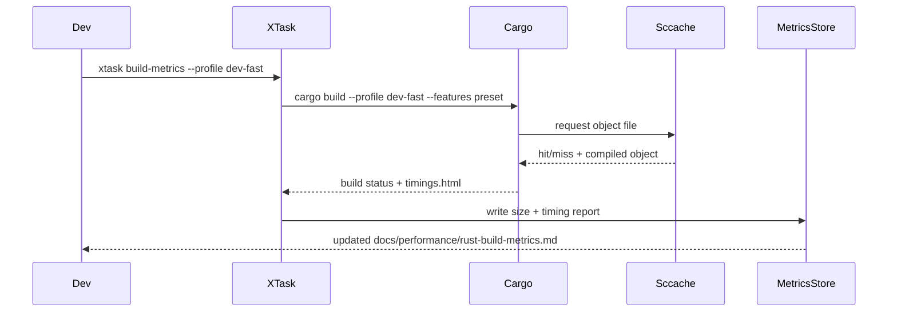

# Rust Engine Build Performance Optimization PRD

## Overview

- **Context & Goals**
  - Reduce the initial `cargo build --manifest-path rust/engine/Cargo.toml` from the current 5–10 minute window documented in `rust/engine/README.md` to <3 minutes on clean machines so that contributors can iterate faster.
  - Shrink the oversized debug and release binaries (`rust/engine/target/debug/vibe-engine` ≈ 325 MB, `rust/engine/target/release/vibe-engine` ≈ 23 MB) so they can ship inside the repo, be attached to CI artifacts, and load faster in deployment scripts.
  - Provide deterministic build profiles and tooling so CI and local developers produce identical artifacts, enabling binary diffs and reproducible performance investigations.
  - Establish visibility (timings, cache hit rates, binary diff reports) so regressions in compile time or size are caught automatically.
- **Current Pain Points**
  - `rust/engine/src/app_threed.rs` unconditionally instantiates physics (`vibe_physics`) and scripting (`vibe_scripting`) even when scenes do not need them, so every build pays for `rapier3d`, `mlua` (vendored Lua), and supporting crates.
  - `rust/engine/.cargo/config.toml` only sets job counts and incremental compilation; there are no tuned `dev-fast`, `dist`, or size-optimized profiles, and debug symbols stay embedded in the binary.
  - The workspace enables heavy features by default (`Cargo.toml` sets `default = ["gltf-support", "scripting-support"]`), so `yarn rust:build` cannot opt into leaner builds.
  - CI lacks build caching, meaning each check recompiles 100+ crates with `cargo build`, wasting minutes and power.

## Proposed Solution

- **High‑level Summary**
  - Introduce build observability via an `xtask` utility that runs `cargo build -Z timings`, `cargo bloat`, and binary size diffing to generate markdown artifacts under `docs/performance/`.
  - Wire up `sccache` + `cargo-chef` baked into `.cargo/config.toml` and CI scripts so dependency compilation is cached locally and remotely, and switch to `mold`/`lld` linkers for faster linking.
  - Restructure workspace features so physics, scripting, terrain, BVH demos, and debug tooling use opt-in feature flags, and move BVH demos/tests into separate targets to keep the main binary slim.
  - Add tuned profiles (`dev-fast`, `dist`) that use `split-debuginfo = "packed"`, `panic = "abort"`, `strip = "debuginfo"`, LTO/`codegen-units`, and `opt-level = "s"` to keep binaries compact without hurting dev ergonomics.
  - Audit dependency features (e.g., drop `three-d-asset/http` unless remote fetches are used, make `rapier3d`'s `parallel` feature opt-in) and prune unused crates to shrink both compile graphs and produced artifacts.
- **Architecture & Directory Structure**

```
rust/engine/
├── .cargo/
│   └── config.toml                # tuned profiles, sccache + linker config
├── Cargo.toml                     # refactored feature matrix + profile definitions
├── xtask/
│   ├── Cargo.toml
│   └── src/
│       ├── main.rs
│       └── commands/
│           ├── build_metrics.rs   # wraps cargo timings/bloat
│           ├── feature_matrix.rs  # generates feature presets
│           └── size_report.rs     # binary diff + strip verification
├── scripts/
│   └── ci/
│       └── rust-build-metrics.sh  # CI entry point
└── docs/performance/
    └── rust-build-metrics.md      # rolling report with charts + thresholds
```

## Implementation Plan

- **Phase 0: Baseline Instrumentation (0.5 day)**

  1. Capture current build + size metrics using `cargo build -Z timings`, `hyperfine`, and `cargo bloat` for both debug and release profiles.
  2. Store raw outputs under `generated/build-metrics/<timestamp>/` and summarize top offenders (e.g., `three-d`, `rapier3d`, `mlua`) in `docs/performance/rust-build-metrics.md`.
  3. Define numeric targets (e.g., cold build ≤3 min, debug binary ≤120 MB, release binary ≤12 MB).

- **Phase 1: Tooling & Cache Infrastructure (1.0 day)**

  1. Create `rust/engine/xtask/` binary with `build_metrics`, `ci-build`, and `size-report` subcommands; expose Yarn aliases (`yarn rust:build:fast`, `yarn rust:build:metrics`).
  2. Update `.cargo/config.toml` to set `RUSTC_WRAPPER = "sccache"`, default linker `mold`/`lld`, and opt into `sparse` registries; document prerequisites in `rust/engine/README.md`.
  3. Add GitHub Actions (or existing CI) steps that run `cargo chef prepare/cook` to warm dependency layers before `cargo build`.

- **Phase 2: Feature Partitioning & Workspace Hygiene (2.0 days)**

  1. Mark heavy crates as optional in `rust/engine/Cargo.toml` (`vibe-physics`, `vibe-audio`, `vibe-scripting`, GLTF extras) and create grouped features (`physics`, `scripting`, `terrain`, `bvh-tools`, `screenshot`).
  2. Gate code paths in `app_threed.rs`, `renderer/physics_sync.rs`, and `renderer/post_processing.rs` with `#[cfg(feature = "physics")]`, etc., providing no-op shims when disabled.
  3. Move BVH demos/tests (`src/bvh_demo.rs`, `src/bvh_integration_demo.rs`) into a separate `examples/` binary or integration tests compiled only when the `bvh-tools` feature is set.
  4. Introduce feature presets in `xtask feature-matrix` so `cargo build --no-default-features --features renderer` is trivial for headless CI tests.

- **Phase 3: Profile Tuning & Binary Slimming (1.5 days)**

  1. Extend `.cargo/config.toml` with `[profile.dev-fast]`, `[profile.dist]`, and `split-debuginfo = "packed"` for dev builds to externalize DWARF into `.dwp` files (shrinks debug binary sizes).
  2. Configure `[profile.dist]` (inherits release) with `lto = "thin"`, `codegen-units = 1`, `opt-level = "s"`, `strip = "symbols"`, and `panic = "abort"`, and update `yarn rust:build:release` to use it.
  3. Add `cargo bloat` + `cargo objdump` to `xtask size-report` to highlight large symbols, then trim dependency features (e.g., remove `three-d-asset/http`, gate `rapier3d/parallel`) per report.
  4. Ensure assets remain external instead of being embedded as `include_bytes!` (verify `renderer/skybox.rs`, `renderer/terrain_generator.rs`), swapping to runtime IO when needed.

- **Phase 4: CI & Regression Safeguards (0.75 day)**

  1. Update CI workflows to run `xtask build-metrics --profile dev-fast --features minimal` on every PR and compare numbers against thresholds stored in `docs/performance/rust-build-metrics.md`.
  2. Upload stripped binaries plus `.dwp` files as artifacts for verification.
  3. Fallback logic: if sccache is unavailable, the scripts should warn but keep builds running (guarded in shell script).

- **Phase 5: Verification & Rollout (0.75 day)**
  1. Validate sample scenes with and without optional features to ensure runtime parity.
  2. Backfill developer documentation (README, CONTRIBUTING) with new commands and feature explanations.
  3. Close the loop by updating metric targets once the new baseline is proven.

## File and Directory Structures

```markdown
/rust/engine/
├── .cargo/
│ └── config.toml # build profiles, linker + sccache config
├── Cargo.toml # optional deps + feature presets
├── xtask/
│ ├── Cargo.toml
│ └── src/
│ ├── main.rs
│ ├── commands/
│ │ ├── build_metrics.rs
│ │ ├── feature_matrix.rs
│ │ └── size_report.rs
│ └── util/
│ └── cmd.rs
├── scripts/
│ └── ci/
│ └── rust-build-metrics.sh
└── docs/performance/
└── rust-build-metrics.md
```

## Technical Details

- **`.cargo/config.toml` profile and toolchain setup**

```toml
[env]
RUSTC_WRAPPER = "sccache"
RUSTFLAGS = "-Csymbol-mangling-version=v0"

[target.x86_64-unknown-linux-gnu]
linker = "clang"
rustflags = ["-Clink-arg=-fuse-ld=mold"]

[profile.dev]
debug = 1
split-debuginfo = "packed"
incremental = true

[profile.dev-fast]
inherits = "dev"
opt-level = 1
codegen-units = 256

[profile.dist]
inherits = "release"
opt-level = "s"
codegen-units = 1
panic = "abort"
lto = "thin"
strip = "symbols"
```

- **`Cargo.toml` feature matrix (excerpt)**

```toml
[dependencies]
vibe-physics = { path = "crates/physics", optional = true }
vibe-scripting = { path = "crates/scripting", optional = true }
vibe-audio = { path = "crates/audio", optional = true }
rapier3d = { version = "0.17", default-features = false, features = ["dim3"] }
three-d-asset = { version = "0.7", default-features = false }

[features]
default = ["renderer", "physics", "gltf-support"]
renderer = ["three-d"]
physics = ["vibe-physics", "rapier3d/parallel"]
scripting = ["vibe-scripting"]
audio = ["vibe-audio"]
terrain = []
bvh-tools = []
screenshot = []
```

- **`xtask/src/main.rs` command router**

```rust
fn main() -> anyhow::Result<()> {
    let cli = Cli::parse();
    match cli.command {
        Command::BuildMetrics(opts) => commands::build_metrics::run(opts),
        Command::SizeReport(opts) => commands::size_report::run(opts),
        Command::FeatureMatrix => commands::feature_matrix::run(),
    }
}
```

- **`xtask/src/commands/build_metrics.rs` skeleton**

```rust
pub fn run(opts: BuildMetricsOptions) -> anyhow::Result<()> {
    Cmd::new("cargo")
        .args(["build", "--profile", &opts.profile])
        .args(feature_flags(&opts.feature_preset)?)
        .env("CARGO_TIMINGS", "1")
        .env("CARGO_PROFILE_DEV_DEBUG", "1")
        .run_with_spinner("Compiling engine")?;

    Cmd::new("cargo")
        .args(["bloat", "--crates", "--profile", &opts.profile])
        .write_to("generated/build-metrics/latest/bloat.txt")?;

    SizeReport::new(opts.profile)?.write_markdown("docs/performance/rust-build-metrics.md")
}
```

- **`scripts/ci/rust-build-metrics.sh` helper**

```bash
#!/usr/bin/env bash
set -euo pipefail
if ! command -v sccache >/dev/null; then
  echo "warning: sccache missing, continuing without cache"
fi
cargo chef prepare --recipe-path target/recipe.json
cargo chef cook --recipe-path target/recipe.json --profile dev-fast
cargo xtask build-metrics --profile dev-fast --preset minimal
```

- **Conditional compilation shim (e.g., `renderer/physics_sync.rs`)**

```rust
#[cfg(feature = "physics")]
pub fn sync_physics_transforms(...) { /* existing logic */ }

#[cfg(not(feature = "physics"))]
pub fn sync_physics_transforms(...) {
    // no-op to keep call sites simple
}
```

## Usage Examples

- `cargo xtask build-metrics --profile dev-fast --preset minimal` → captures timings, cache stats, and updates the performance report for the lean profile.
- `cargo build --profile dev-fast --no-default-features --features renderer,screenshot` → developer build for pure rendering without physics/scripting overhead.
- `cargo build --profile dist --features renderer,physics,scripting --locked` → produces the stripped distributable binary uploaded by CI.

## Testing Strategy

- **Unit Tests**
  - `cargo test --no-default-features` ensures renderer-only builds compile and unit tests covering shimmed modules pass.
  - `cargo test -p xtask` validates command parsing and file generation logic (use `assert_cmd` + temp dirs).
  - Feature-flag compilation tests (`cargo test --features "physics"` etc.) to confirm optional modules expose the expected APIs.
- **Integration Tests**
  - `xtask build-metrics` invoked inside CI to assert that metrics files and artifacts exist.
  - Run sample scenes (`yarn rust:engine --scene MaterialTest`) under both minimal and full feature sets to ensure runtime parity and LOD/screenshot features still work.
  - Binary-size regression check: script fails CI if `target/dist/vibe-engine` exceeds the configured threshold.

## Edge Cases

| Edge Case                                                                   | Remediation                                                                                                                           |
| --------------------------------------------------------------------------- | ------------------------------------------------------------------------------------------------------------------------------------- |
| Developer machine lacks `sccache`, `mold`, or `cargo-chef`                  | `xtask` detects missing tooling, logs actionable warnings, and falls back to the standard cargo toolchain.                            |
| Scenes require scripting or physics but developer built with minimal preset | CLI prints a structured error (“feature not enabled”) and instructs the user to rebuild with `--features scripting,physics`.          |
| Split debug info unsupported on macOS/Windows toolchains                    | Guard profile settings behind target-specific sections in `.cargo/config.toml` and keep the current behavior for unsupported targets. |
| CI cache corruption causes inconsistent artifacts                           | Provide `yarn rust:clean && cargo clean` fallback step triggered when cache key mismatches are detected.                              |

## Sequence Diagram



## Risks & Mitigations

| Risk                                                                 | Mitigation                                                                                                                                |
| -------------------------------------------------------------------- | ----------------------------------------------------------------------------------------------------------------------------------------- |
| Misconfigured features accidentally exclude runtime-critical modules | Provide preset validation in `xtask` and add compile-time assertions using `#[cfg]` checks in `main.rs`.                                  |
| Thin LTO increases release build time beyond acceptable limits       | Keep `release` profile untouched for dev builds and only use `dist` in CI; monitor build duration via metrics.                            |
| Dependency feature pruning breaks GLTF/http workflows                | Document optional feature toggles, keep `gltf-support` preset enabled in default build, and add integration tests that cover GLTF scenes. |
| Tooling maintenance overhead (xtask, scripts)                        | Keep implementation small (<500 LOC), add unit tests, and document update steps in CONTRIBUTING.                                          |

## Timeline

- Phase 0: 0.5 day
- Phase 1: 1.0 day
- Phase 2: 2.0 days
- Phase 3: 1.5 days
- Phase 4: 0.75 day
- Phase 5: 0.75 day
- **Total:** ~6.5 days, assuming one experienced Rust engineer plus CI access.

## Acceptance Criteria

- Build metrics report shows cold build ≤3 minutes and incremental rebuild ≤15 seconds on baseline hardware.
- `target/debug/vibe-engine` ≤120 MB with split debug info; `target/dist/vibe-engine` ≤12 MB and uploaded by CI.
- `cargo build --no-default-features --features renderer` succeeds and runs MaterialTest without runtime panics.
- CI pipeline uses cached dependencies (observed via `sccache` hit rate >80%) and fails if new metrics regress by >10%.
- Documentation (`rust/engine/README.md`, CONTRIBUTING) describes new build profiles, presets, and troubleshooting steps.

## Conclusion

Implementing dedicated tooling, tuned profiles, and modular features transforms the Rust engine builds from a monolith into a configurable pipeline: developers regain fast edit-compile-run loops, CI artifacts become lightweight, and regressions are surfaced automatically. Once merged, the team can iterate on additional optimizations (e.g., async asset streaming) without being blocked by build overhead.

## Assumptions & Dependencies

- `sccache`, `cargo-chef`, `cargo-bloat`, and `cargo-objdump` are allowed in CI images and developer environments.
- Access to adjust GitHub Actions (or the current CI provider) configuration for caching and artifact upload exists.
- The planned feature gates do not conflict with other in-flight refactors (e.g., renderer modularization).
- Developers are comfortable installing `mold`/`lld`; fallback to `gcc` remains for unsupported systems.
