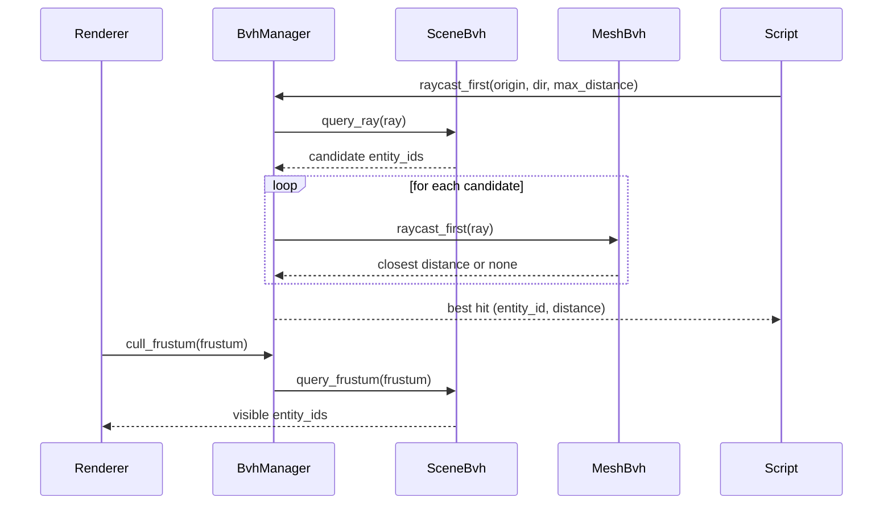

# Rust BVH Culling & Raycasting Acceleration PRD (Port from TypeScript)

Status: Draft  
Last Updated: 2025-11-05

## 1. Overview

### Context & Goals

- Port the proven BVH-based culling and accelerated raycasting from TypeScript (`three-mesh-bvh`) to the Rust engine to achieve 10–100x raycasting speedups and predictable visibility performance.
- Replace O(n) ray traversal and culling with O(log n) coarse queries, enabling large scenes and heavy ray-query features (selection, interaction, AI vision).
- Unify culling and raycasting acceleration under a single spatial system with clear lifecycle, metrics, and editor tooling.
- Preserve correctness and stability: zero false negatives for visible geometry; deterministic results across platforms.

### Current Pain Points

- Rust engine lacks BVH acceleration for rendering/raycasting; culling relies on naive filtering or is absent in hot loops.
- Raycasting in Rust is tied to physics shapes; mesh-accurate picking requires triangle tests and becomes slow at scale.
- No scene-wide spatial index; repeated full scans degrade with entity/triangle count.
- No per-frame instrumentation for visibility ratios or ray-query budgets.

## 2. Proposed Solution

### High‑level Summary

- Implement a two-tier acceleration system in Rust:
  - Per-mesh triangle BVH (MeshBVH) for precise ray–triangle tests.
  - Scene-level BVH (SceneBVH) over mesh/world AABBs for coarse culling and candidate selection.
- Integrate with renderer to filter visible meshes before draw submission; integrate with scripting Query API to service `raycastFirst`/`raycastAll` via BVH.
- Provide configurable builders (leaf size, SAH/CENTER/AVERAGE), incremental updates, and metrics.
- Leverage `parry3d` primitives and math (`glam`), optionally `bvh` crate for SAH variants if needed.
- Maintain snake_case for all Rust symbols; keep TypeScript parity for settings naming at integration boundaries.

### Architecture & Directory Structure

```
rust/engine/
├── Cargo.toml                       # add parry3d = "^0.x" (already via rapier), optional bvh = "^0.x"
├── src/
│  ├── spatial/
│  │  ├── bvh_manager.rs            # BvhManager: orchestrates MeshBVH/SceneBVH, public API
│  │  ├── mesh_bvh.rs               # MeshBVH: per-mesh triangle hierarchy
│  │  ├── scene_bvh.rs              # SceneBVH: scene-wide BVH of mesh/world AABBs
│  │  ├── primitives.rs             # Ray, Aabb, Triangle helpers (glam/parry3d glue)
│  │  └── intersect.rs              # Intersectable trait, ray traversal utils
│  └── renderer/
│     ├── threed_renderer.rs        # integrate culling via SceneBVH, optional debug overlays
│     └── visibility.rs             # small adapter extracting visible indices via SceneBVH
└── crates/
   └── scripting/
      └── src/apis/query_api.rs     # wire query.raycastFirst/query.raycastAll to BvhManager
```

## 3. Implementation Plan

### Phase 1: Foundations & Primitives (0.5 day)

1. Add `parry3d` (if not exposed) and evaluate `bvh` crate for SAH; keep behind feature flag.
2. Implement `primitives.rs`: `Ray { origin, dir }`, `Aabb { min, max }`, `Triangle { a,b,c }` using `glam` + `parry3d` conversions.
3. Implement `intersect.rs`: Möller–Trumbore ray–triangle, ray–aabb slab test; fuzz basic cases.

### Phase 2: MeshBVH (1.0 day)

1. `mesh_bvh.rs`: build triangle BVH from `CpuMesh` (positions + indices) with configurable `max_leaf_tris` and split strategy (SAH/CENTER/AVERAGE).
2. Store nodes as POD arrays for cache-friendly traversal; support serialization (optional) for warm starts.
3. Expose `raycast_first`/`raycast_all` against a mesh (returns barycentric hit, distance, tri index).

### Phase 3: SceneBVH (0.75 day)

1. `scene_bvh.rs`: build BVH over world-space mesh AABBs; support entity add/remove and transform updates (refit or partial rebuild).
2. Expose `query_frustum(aabb/frustum)` and `query_ray(ray)` returning candidate mesh IDs.
3. Add metrics: build/refit ms, node counts, query candidates, culling ratios.

### Phase 4: Manager & Integration Points (0.75 day)

1. `bvh_manager.rs`: manage lifecycle; map `entity_id -> mesh_bvh`, `entity_id -> world_aabb`, `scene_bvh`.
2. Renderer integration: use `SceneBVH` to filter indices pre-render; fall back to previous path on failure.
3. Scripting: implement `raycastFirst`/`raycastAll` via manager; return hits sorted by distance.

### Phase 5: Editor/Diagnostics & Config (0.5 day)

1. Expose toggles: `enable_bvh_culling`, `enable_bvh_raycasts`, `max_leaf_tris`, `strategy`.
2. Wire counters to HUD: `total_meshes`, `culled_meshes`, `visible_meshes`, `ray_budget/frame`.
3. Add CLI flags/logging to benchmark BVH effectiveness.

### Phase 6: Benchmarks, Tests, Polishing (0.5–1.0 day)

1. Micro-benchmarks: raycast throughput against N meshes (static and dynamic scenes).
2. Unit tests: BVH construction, ray/tri correctness, frustum culling correctness.
3. Integration tests: large scenes (1k–10k meshes), dynamic transform updates, correctness under camera motion.

## 4. File and Directory Structures

```markdown
/root-directory/
├── rust/engine/src/spatial/
│ ├── bvh_manager.rs
│ ├── mesh_bvh.rs
│ ├── scene_bvh.rs
│ ├── primitives.rs
│ └── intersect.rs
├── rust/engine/src/renderer/
│ ├── threed_renderer.rs # edited: uses SceneBVH for visibility
│ └── visibility.rs # NEW: adapter over SceneBVH
└── rust/engine/crates/scripting/src/apis/query_api.rs # edited: BVH raycasts
```

## 5. Technical Details

```rust
// rust/engine/src/spatial/primitives.rs
use glam::{Vec3, Mat4};

#[derive(Clone, Copy, Debug)]
pub struct Ray { pub origin: Vec3, pub dir: Vec3 } // dir normalized

#[derive(Clone, Copy, Debug)]
pub struct Aabb { pub min: Vec3, pub max: Vec3 }

#[derive(Clone, Copy, Debug)]
pub struct Triangle { pub a: Vec3, pub b: Vec3, pub c: Vec3 }

impl Aabb {
    pub fn transformed(&self, m: Mat4) -> Self { /* transform 8 corners → recompute */ }
}
```

```rust
// rust/engine/src/spatial/intersect.rs
use super::{primitives::{Ray, Aabb, Triangle}};

pub fn ray_intersects_aabb(ray: &Ray, aabb: &Aabb, max_distance: f32) -> bool { /* slab */ }

pub fn ray_intersect_triangle(ray: &Ray, tri: &Triangle) -> Option<f32> { /* Möller–Trumbore */ }
```

```rust
// rust/engine/src/spatial/mesh_bvh.rs
use super::primitives::{Aabb, Triangle, Ray};

pub enum SplitStrategy { Sah, Center, Average }

#[derive(Debug)]
pub struct MeshBvhNode { pub aabb: Aabb, pub left: u32, pub right: u32, pub tri_start: u32, pub tri_count: u32 }

pub struct MeshBvh {
    pub nodes: Vec<MeshBvhNode>,
    pub triangles: Vec<Triangle>,
    pub max_leaf_tris: u32,
}

impl MeshBvh {
    pub fn build(positions: &[[f32;3]], indices: &[[u32;3]], max_leaf_tris: u32, strategy: SplitStrategy) -> Self { /* build */ }
    pub fn raycast_first(&self, ray: &Ray, max_distance: f32) -> Option<(f32, usize)> { /* traverse */ }
    pub fn raycast_all(&self, ray: &Ray, max_distance: f32, out: &mut Vec<(f32, usize)>) { /* traverse */ }
}
```

```rust
// rust/engine/src/spatial/scene_bvh.rs
use super::primitives::{Aabb, Ray};

pub struct SceneRef { pub entity_id: u64, pub aabb: Aabb }

pub struct SceneBvh { /* nodes + refs */ }

impl SceneBvh {
    pub fn new() -> Self { /* ... */ }
    pub fn rebuild(&mut self, refs: &[SceneRef]) { /* build */ }
    pub fn refit(&mut self, refs: &[SceneRef]) { /* fast update */ }
    pub fn query_frustum(&self, frustum_planes: [[f32;4];6], out: &mut Vec<u64>) { /* cull */ }
    pub fn query_ray(&self, ray: &Ray, max_distance: f32, out: &mut Vec<u64>) { /* coarse ray */ }
}
```

```rust
// rust/engine/src/spatial/bvh_manager.rs
use super::{mesh_bvh::MeshBvh, scene_bvh::{SceneBvh, SceneRef}, primitives::{Aabb, Ray}};
use glam::{Mat4, Vec3};
use std::collections::HashMap;

pub struct BvhManager {
    scene_bvh: SceneBvh,
    mesh_bvhs: HashMap<u64, MeshBvh>,          // entity_id → mesh BVH
    world_aabbs: HashMap<u64, Aabb>,           // entity_id → world AABB
}

impl BvhManager {
    pub fn new() -> Self { /* ... */ }
    pub fn register_mesh(&mut self, entity_id: u64, positions: &[[f32;3]], indices: &[[u32;3]], local_aabb: Aabb) { /* build MeshBvh */ }
    pub fn unregister(&mut self, entity_id: u64) { /* ... */ }
    pub fn update_transform(&mut self, entity_id: u64, world_matrix: Mat4) { /* update world AABB; mark dirty */ }
    pub fn rebuild_scene(&mut self) { /* rebuild SceneBVH from world_aabbs */ }
    pub fn cull_frustum(&self, frustum_planes: [[f32;4];6]) -> Vec<u64> { /* return visible ids */ }
    pub fn raycast_first(&self, origin: Vec3, dir: Vec3, max_distance: f32) -> Option<(u64, f32)> { /* coarse → mesh */ }
    pub fn raycast_all(&self, origin: Vec3, dir: Vec3, max_distance: f32) -> Vec<(u64, f32)> { /* coarse → mesh */ }
}
```

```rust
// rust/engine/src/renderer/visibility.rs
use crate::spatial::bvh_manager::BvhManager;

pub fn visible_indices_from_bvh(manager: &BvhManager, frustum_planes: [[f32;4];6], entity_ids: &[u64]) -> Vec<usize> {
    let visible = manager.cull_frustum(frustum_planes);
    // map visible entity ids to renderer mesh indices
    // ...
    Vec::new()
}
```

```rust
// rust/engine/crates/scripting/src/apis/query_api.rs (additions)
// query.raycastFirst(origin, dir, max_distance?) and query.raycastAll(...)
// will call into BvhManager via an EngineContext accessor.
```

## 6. Usage Examples

```rust
// Registering a mesh BVH after creating a GPU mesh
let entity_id = 42u64;
let positions: Vec<[f32;3]> = /* from CpuMesh */;
let indices: Vec<[u32;3]> = /* from CpuMesh */;
let local_aabb = compute_local_aabb(&positions);
bvh_manager.register_mesh(entity_id, &positions, &indices, local_aabb);
```

```rust
// Per-frame: update transforms and cull
bvh_manager.update_transform(entity_id, world_matrix);
let frustum_planes = extract_frustum_planes(&camera); // [[f32;4];6]
let visible_ids = bvh_manager.cull_frustum(frustum_planes);
```

```rust
// Raycasting from scripts
if let Some((hit_entity, distance)) = bvh_manager.raycast_first(cam_pos, cam_dir, 1000.0) {
    // handle hit
}
```

## 7. Testing Strategy

- Unit Tests

  - MeshBVH build correctness (node counts vs. triangle counts, bounding volumes).
  - Ray–triangle intersection: axis-aligned and skewed triangles, grazing hits, back-face handling.
  - AABB transform correctness and slab intersection tests.
  - SceneBVH coarse phase: candidate set contains true positives (no misses).

- Integration Tests
  - Large static scene (≥ 5k meshes): verify culling ratio and render loop stability.
  - Dynamic transforms: frequent updates, ensure refit correctness and performance.
  - Scripting ray spam: 10k rays/frame budget; ensure throughput and stable latency.

## 8. Edge Cases

| Edge Case                                  | Remediation                                                                   |
| ------------------------------------------ | ----------------------------------------------------------------------------- |
| Very thin/degenerate triangles             | Robust epsilon in Möller–Trumbore; prefilter zero-area triangles.             |
| Dynamic skinned/morph meshes               | Use conservative AABBs or opt-out of MeshBVH; rebuild on keyframes if needed. |
| Extremely large scenes                     | Partition SceneBVH by sector; lazy load/build per sector.                     |
| Instancing (no GPU instancing in renderer) | Reuse MeshBVH across instances; unique world AABB per entity.                 |
| Precision issues at far distances          | Normalize ray dir, clamp max_distance, use f32 tolerances consistently.       |

## 9. Sequence Diagram



## 10. Risks & Mitigations

| Risk                                | Mitigation                                                                  |
| ----------------------------------- | --------------------------------------------------------------------------- |
| BVH build stalls on large meshes    | Asynchronous build; progressive build per frame; cache/serialize MeshBVH.   |
| Memory overhead of BVHs             | Compact node representation; share MeshBVH across instances; feature flags. |
| Incorrect culling (false negatives) | Conservative AABBs; exhaustive unit tests; editor panic toggle to disable.  |
| Slow dynamic updates                | Refit SceneBVH; batch updates; debounce transforms.                         |
| Divergence from physics world       | Keep physics raycasts as fallback; clearly document scope differences.      |

## 11. Timeline

- Total: 3.5–4.0 days engineering + 0.5 day validation = ~1 week calendar
  - Phase 1: 0.5 day
  - Phase 2: 1.0 day
  - Phase 3: 0.75 day
  - Phase 4: 0.75 day
  - Phase 5: 0.5 day
  - Phase 6: 0.5 day

## 12. Acceptance Criteria

- Achieve ≥10x speedup on raycasting throughput vs. baseline physics-only approach in a 2k-mesh scene; ≥30x in triangle-dense meshes typical of GLTF imports.
- Renderer uses `SceneBVH` to cull, yielding ≥40% culled ratio in benchmark scenes without visual regressions.
- `query.raycastFirst`/`query.raycastAll` implemented in Rust and return deterministic, sorted results.
- Configurable `max_leaf_tris` and split strategies exposed; metrics visible in debug HUD/logs.
- Comprehensive tests pass (unit + integration); benchmarks recorded in docs/performance.

## 13. Conclusion

Porting BVH acceleration to Rust brings the TypeScript engine’s mature spatial performance to native rendering and scripting: predictable culling, 10–100x raycast gains, and a scalable foundation for future occlusion/LOD work. The design cleanly separates per-mesh and scene-wide indices, integrates with existing renderer and scripting layers, and provides guardrails for dynamic content.

## 14. Assumptions & Dependencies

- `glam` for math; `parry3d` for geometry primitives; optional `bvh` crate for SAH convenience (feature-gated).
- Existing `three_d` renderer and `CpuMesh` access to vertex/index data.
- Query API integration path exists (`rust/engine/crates/scripting/src/apis/query_api.rs`).
- Rust naming uses snake_case throughout; TypeScript interop preserves camelCase in TS-facing APIs.

