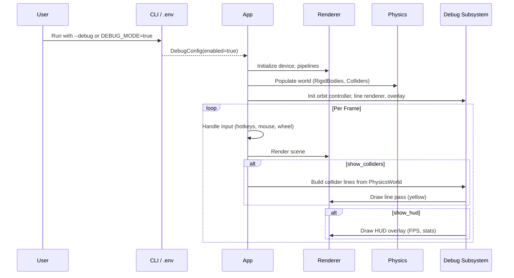

# Rust Engine Debug Mode PRD

## Overview

- **Context & Goals**

  - Introduce a unified debug mode for the Rust engine to accelerate iteration and diagnostics.
  - Support enabling via environment variable (`DEBUG_MODE`) and CLI flag (`--debug`).
  - When enabled, provide an orbital camera for free navigation and visual debugging of physics colliders.
  - Add a lightweight on‑screen debug HUD (FPS, frame time, stats) to aid performance tuning.

- **Current Pain Points**
  - No runtime switch to enable developer features without changing code.
  - Single active camera with no free‑flight/orbit option during runtime.
  - Physics state is opaque; no collider visualization to verify setups.
  - No built‑in FPS or perf overlay for quick feedback.

## Proposed Solution

- **High‑level Summary**

  - Add a `DebugConfig` that reads `.env` (`DEBUG_MODE`) and a CLI `--debug` bool, with CLI taking precedence.
  - Initialize an optional debug subsystem when enabled: orbital camera controller, collider gizmos, and a text HUD.
  - Render collider outlines as yellow line segments after the main pass; keep work isolated in a dedicated debug render path.
  - Display a compact top‑left HUD with FPS, frame time, counts of bodies/colliders; toggle via hotkeys.
  - Maintain the main camera from the scene; allow runtime switching to a debug orbit camera when desired.
  - Optional extras: world axes and ground grid toggles for spatial context.

- **Architecture & Directory Structure**

```
rust/engine/
├── Cargo.toml
├── src/
│   ├── main.rs                  # add --debug flag; load .env
│   ├── app.rs                   # own DebugState; route inputs; render debug
│   ├── render/
│   │   ├── scene_renderer.rs
│   │   ├── pipeline.rs
│   │   └── camera.rs            # existing camera; used by orbit controller
│   ├── debug/                   # NEW
│   │   ├── mod.rs               # re-exports & lifecycle
│   │   ├── config.rs            # DebugConfig (env + cli), toggles
│   │   ├── camera_orbit.rs      # Orbit controller for a Camera
│   │   ├── lines.rs             # Line renderer (wgpu pipeline, vertex fmt)
│   │   ├── colliders.rs         # Build line lists from Rapier colliders
│   │   ├── overlay.rs           # HUD text rendering (fps, stats)
│   │   └── profiler.rs          # GPU profiler wrapper (wgpu-profiler)
│   └── util/
│       └── time.rs
└── crates/
    └── physics/                 # leverage existing PhysicsWorld API
```

## Implementation Plan

- **Phase 1: Config & Flags (0.5 day)**

  1. Add `--debug` to Clap `Args` in `src/main.rs`.
  2. Load `.env` at startup via `dotenvy::dotenv().ok()`; read `DEBUG_MODE` env.
  3. Implement `DebugConfig` merging CLI over env; expose `is_enabled()`.
  4. If enabled, set log filter to `debug` (unless overridden by user) and pass config into `App`.
  5. remember adding .env to gitignore (add a .env.example with defaults). Warn on logs if .env is not present - tell to cp from example file

- **Phase 2: Debug Subsystem Skeleton (0.5 day)**

  1. Create `src/debug/{mod,config}.rs` with state and toggles.
  2. Add `DebugState` to `App`: stores `enabled`, `show_hud`, `show_colliders`, `use_debug_camera`.
  3. Register hotkeys: F1 toggle HUD, F2 toggle colliders, F3 toggle debug camera, F4 toggle GPU profiler. add visual small indication somehow on the screen about these

- **Phase 3: Orbit Camera Controller (0.75 day)**

Remember its a debug only camera. Not available on the final build

1. Implement `camera_orbit.rs` that updates a `Camera` using mouse (rotate, pan) and wheel (zoom).
2. Wire winit input events in `App::input()` to the orbit controller when `use_debug_camera`.
3. Maintain a dedicated `debug_camera` initialized from main camera position/target.

- **Phase 4: Collider Gizmos (1.0 day)**

  1. Implement `lines.rs` line renderer pipeline (wgpu): static pipeline, dynamic vertex buffer, depth test on.
  2. In `colliders.rs`, iterate `PhysicsWorld.entity_to_colliders` and generate yellow outlines for shapes:
     - Box/cuboid: 12 edges from extents; transform by body pose.
     - Sphere/ball: 3 great‑circle rings approximation.
     - Capsule/cylinder: circle rings + verticals; simple low‑poly approximation.
     - Convex: hull edges if accessible; fallback to AABB.
     - Mesh: fallback to AABB at first iteration.
  3. Render after opaque/transparent passes, reusing camera matrices.

- **Phase 5: Debug HUD Overlay (0.75 day)**

  1. Add `overlay.rs` with a small text system using `glyphon` (preferred) or `wgpu_glyph`.
  2. Show top‑left lines: FPS, frame ms, rigid bodies, colliders, draw calls (if available).
  3. Respect `show_hud` toggle; keep font atlas persistent; minimal allocation per frame.

- **Phase 5.5: GPU Profiler Integration (0.5 day)**

  1. Add `wgpu-profiler` dependency to `Cargo.toml`.
  2. Create `src/debug/profiler.rs` wrapping `GpuProfiler` lifecycle.
  3. Integrate profiler scopes in `scene_renderer.rs`: wrap geometry pass, transparent pass, and debug passes.
  4. Add GPU timing metrics to debug HUD: "GPU: geometry 2.3ms, transparent 0.8ms, debug 0.1ms".
  5. Expose toggle (F4) to show/hide GPU profiler stats on HUD.

- **Phase 6: Polish & Docs (0.5 day)**
  1. Update README/docs with usage examples and hotkeys (including F4 for GPU profiler).
  2. Add tests for config parsing and collider line builders (unit level).

## File and Directory Structures

```markdown
/root-directory/
├── rust/engine/src/main.rs
├── rust/engine/src/app.rs
├── rust/engine/src/render/camera.rs
├── rust/engine/src/debug/
│ ├── mod.rs
│ ├── config.rs
│ ├── camera_orbit.rs
│ ├── lines.rs
│ ├── overlay.rs
│ └── profiler.rs
└── docs/PRDs/rust-debug-mode-prd.md
```

## Technical Details

- **Config and Flags**

```rust
// rust/engine/src/debug/config.rs
use std::env;

#[derive(Debug, Clone, Copy)]
pub struct DebugConfig {
    pub enabled: bool,
}

impl DebugConfig {
    pub fn from_env_and_cli(cli_debug: bool) -> Self {
        let env_debug = match env::var("DEBUG_MODE") {
            Ok(val) => matches!(val.as_str(), "1" | "true" | "TRUE" | "yes" | "on"),
            Err(_) => false,
        };
        Self { enabled: cli_debug || env_debug }
    }
}
```

```rust
// rust/engine/src/main.rs (additions)
use clap::Parser;

#[derive(Parser, Debug)]
struct Args {
    #[arg(short, long, default_value = "Default")]
    scene: String,
    #[arg(long, default_value_t = 1280)]
    width: u32,
    #[arg(long, default_value_t = 720)]
    height: u32,
    #[arg(long, default_value_t = false)]
    debug: bool, // NEW: --debug flag
}

fn main() -> anyhow::Result<()> {
    // Load .env early; ignore if missing
    let _ = dotenvy::dotenv();

    env_logger::Builder::from_env(
        env_logger::Env::default().default_filter_or("info"),
    )
    .init();

    let args = Args::parse();
    let debug_config = debug::config::DebugConfig::from_env_and_cli(args.debug);
    // pass debug_config into app
    // ...
    Ok(())
}
```

- **Orbit Camera Controller**

```rust
// rust/engine/src/debug/camera_orbit.rs
use glam::{Vec2, Vec3};
use crate::render::camera::Camera;

pub struct OrbitController {
    pub enabled: bool,
    pub orbit_sensitivity: f32,
    pub pan_sensitivity: f32,
    pub zoom_sensitivity: f32,
    pub target: Vec3,
    pub yaw: f32,
    pub pitch: f32,
    pub distance: f32,
}

impl OrbitController {
    pub fn new_from_camera(camera: &Camera) -> Self { /* init from camera */ unimplemented!() }
    pub fn handle_mouse_delta(&mut self, delta: Vec2, right_button: bool, middle_button: bool) {}
    pub fn handle_scroll(&mut self, delta: f32) {}
    pub fn update_camera(&self, camera: &mut Camera) {}
}
```

- **Collider Gizmos and Line Renderer**

```rust
// rust/engine/src/debug/lines.rs
use glam::Vec3;

#[repr(C)]
pub struct LineVertex { pub position: [f32; 3], pub color: [f32; 3] }

pub struct LineBatch { pub vertices: Vec<LineVertex> }

impl LineBatch { pub fn clear(&mut self) { self.vertices.clear(); } }

pub struct LineRenderer { /* wgpu state */ }

impl LineRenderer {
    pub fn new(device: &wgpu::Device, config: &wgpu::SurfaceConfiguration) -> Self { unimplemented!() }
    pub fn upload(&mut self, device: &wgpu::Device, batch: &LineBatch) {}
    pub fn draw(&self, pass: &mut wgpu::RenderPass<'_>) {}
}
```

```rust
// rust/engine/src/debug/colliders.rs
use glam::{Mat4, Vec3};
use vibe_physics::PhysicsWorld;
use super::lines::{LineBatch, LineVertex};

pub fn append_collider_lines(world: &PhysicsWorld, batch: &mut LineBatch) {
    let color = [1.0, 1.0, 0.0]; // yellow
    // Iterate entity_to_colliders and push edges for supported shapes
    // Fallback: draw AABB for unknown/mesh collider types
    let _ = (world, color, batch); // use parameters; implement shape extraction
}
```

- **HUD Overlay (glyphon)**

```rust
// rust/engine/src/debug/overlay.rs
pub struct DebugOverlay { /* font system, buffer, cache */ }

impl DebugOverlay {
    pub fn new(device: &wgpu::Device, queue: &wgpu::Queue, config: &wgpu::SurfaceConfiguration) -> Self { unimplemented!() }
    pub fn draw(&mut self, encoder: &mut wgpu::CommandEncoder, view: &wgpu::TextureView, lines: &[String]) {}
}
```

- **GPU Profiler Wrapper**

```rust
// rust/engine/src/debug/profiler.rs
use wgpu_profiler::{GpuProfiler, GpuProfilerSettings};
use std::collections::HashMap;

pub struct DebugProfiler {
    profiler: GpuProfiler,
    enabled: bool,
}

impl DebugProfiler {
    pub fn new(device: &wgpu::Device) -> Self {
        let profiler = GpuProfiler::new(GpuProfilerSettings::default())
            .expect("Failed to create GPU profiler");
        Self { profiler, enabled: false }
    }

    pub fn toggle(&mut self) {
        self.enabled = !self.enabled;
    }

    pub fn begin_scope(&mut self, label: &str, encoder: &mut wgpu::CommandEncoder, device: &wgpu::Device) {
        if self.enabled {
            self.profiler.begin_scope(label, encoder, device);
        }
    }

    pub fn end_scope(&mut self, encoder: &mut wgpu::CommandEncoder) {
        if self.enabled {
            self.profiler.end_scope(encoder);
        }
    }

    pub fn resolve_queries(&mut self, encoder: &mut wgpu::CommandEncoder) {
        if self.enabled {
            self.profiler.resolve_queries(encoder);
        }
    }

    pub fn end_frame(&mut self) -> Option<Vec<wgpu_profiler::GpuTimerScopeResult>> {
        if self.enabled {
            self.profiler.end_frame()
        } else {
            None
        }
    }

    /// Get formatted timing strings for HUD display
    pub fn format_timings(&self) -> Vec<String> {
        if !self.enabled {
            return vec![];
        }

        // Process last frame's results
        let mut lines = vec!["GPU Timings:".to_string()];
        // ... format timing results from profiler
        lines
    }
}
```

- **Scene Renderer Integration**

```rust
// rust/engine/src/render/scene_renderer.rs (additions to render())
pub fn render(
    &mut self,
    encoder: &mut wgpu::CommandEncoder,
    view: &wgpu::TextureView,
    camera: &Camera,
    queue: &wgpu::Queue,
    device: &wgpu::Device,
    profiler: Option<&mut DebugProfiler>,
) {
    // Update camera and lights...

    if let Some(profiler) = profiler {
        profiler.begin_scope("geometry_pass", encoder, device);
    }

    // Create render pass and draw geometry...
    {
        let mut render_pass = encoder.begin_render_pass(...);
        // ... render opaque entities
    }

    if let Some(profiler) = profiler {
        profiler.end_scope(encoder);
        profiler.begin_scope("transparent_pass", encoder, device);
    }

    // Render transparent entities...
    {
        let mut render_pass = encoder.begin_render_pass(...);
        // ... render transparent entities
    }

    if let Some(profiler) = profiler {
        profiler.end_scope(encoder);
    }
}
```

- **App Integration**

```rust
// rust/engine/src/app.rs (sketch)
struct DebugState {
    enabled: bool,
    show_hud: bool,
    show_colliders: bool,
    use_debug_camera: bool,
    show_gpu_profiler: bool,
    profiler: Option<DebugProfiler>,
}

impl App {
    fn input(&mut self, event: &winit::event::WindowEvent) -> bool {
        // Handle hotkeys: F1 (HUD), F2 (colliders), F3 (camera), F4 (GPU profiler)
        // Handle mouse input for orbit camera
        false
    }
    fn render(&mut self) -> Result<(), wgpu::SurfaceError> {
        let mut encoder = ...;

        // 1) render scene with profiler scopes
        self.scene_renderer.render(&mut encoder, view, camera, queue, device, self.debug_state.profiler.as_mut());

        // 2) if debug && colliders: build line batch -> draw with line renderer
        if self.debug_state.show_colliders {
            // ... draw collider gizmos
        }

        // 3) resolve GPU profiler queries
        if let Some(profiler) = &mut self.debug_state.profiler {
            profiler.resolve_queries(&mut encoder);
        }

        // 4) if debug && hud: overlay.draw with FPS + GPU timings
        if self.debug_state.show_hud {
            let mut lines = vec![
                format!("FPS: {}", fps),
                format!("Frame: {:.2}ms", frame_ms),
            ];

            // Add GPU profiler stats if enabled
            if self.debug_state.show_gpu_profiler {
                if let Some(profiler) = &self.debug_state.profiler {
                    lines.extend(profiler.format_timings());
                }
            }

            overlay.draw(&mut encoder, view, &lines);
        }

        // 5) Submit encoder and advance profiler frame
        queue.submit([encoder.finish()]);
        if let Some(profiler) = &mut self.debug_state.profiler {
            profiler.end_frame();
        }

        Ok(())
    }
}
```

## Usage Examples

- **Enable via .env**

```bash
# .env
DEBUG_MODE=true
```

```bash
# run with scene
./target/debug/vibe-engine --scene rust/game/scenes/MaterialParityDemo.json
```

- **Enable via CLI**

```bash
./target/debug/vibe-engine --scene MaterialParityDemo --debug
```

- **Runtime toggles (when debug enabled)**

- F1: Toggle HUD overlay
- F2: Toggle collider gizmos
- F3: Switch between main camera and orbit camera
- F4: Toggle GPU profiler stats on HUD

## Testing Strategy

- **Unit Tests**

  - `DebugConfig::from_env_and_cli` combinations: env only, cli only, both.
  - Orbit math: yaw/pitch clamping; distance limits; camera update matrix correctness (smoke).
  - Collider line generation: box edges at identity; sphere ring vertex counts; AABB fallback path.

- **Integration Tests**
  - Launch with `--debug` and validate that debug is enabled and HUD reports plausible FPS.
  - Load a scene with physics; verify non‑zero collider counts; ensure line batch non‑empty when enabled.
  - Window resize maintains correct aspect for both cameras and keeps overlay positioned.

## Edge Cases

| Edge Case                              | Remediation                                                      |
| -------------------------------------- | ---------------------------------------------------------------- |
| `.env` missing                         | Treat as disabled; no crash.                                     |
| `DEBUG_MODE` malformed (e.g., `maybe`) | Parse returns false; log a warning once.                         |
| Release builds performance             | Keep debug disabled by default; rendering path is gated by flag. |
| No physics entities                    | Gizmo pass does nothing; HUD still shows FPS.                    |
| Mouse not captured / no focus          | Orbit input requires window focus; ignore deltas otherwise.      |
| Extremely large scenes                 | Line batches capped and/or updated on cadence to limit overhead. |
| Mesh colliders                         | Fallback to AABB until mesh‑edge extraction is implemented.      |

## Sequence Diagram



## Risks & Mitigations

| Risk                                   | Mitigation                                                                 |
| -------------------------------------- | -------------------------------------------------------------------------- |
| Text rendering API churn in `wgpu`     | Use `glyphon`, maintained for modern wgpu; hide behind thin wrapper.       |
| Collider extraction complexity         | Start with core shapes + AABB fallback; iterate later.                     |
| Input conflicts with existing controls | Only enable orbit when `use_debug_camera`; provide clear hotkeys.          |
| Performance impact of lines/HUD        | Keep batches small; reuse buffers; conditionally render only when toggled. |

## Timeline

- Phase 1–2: 1.0 day
- Phase 3: 0.75 day
- Phase 4: 1.0 day
- Phase 5: 0.75 day
- Phase 5.5: 0.5 day (GPU profiler)
- Phase 6: 0.5 day
- **Total**: ~4.5 days

## Acceptance Criteria

- Running with `.env` `DEBUG_MODE=true` or `--debug` enables debug features.
- F1 toggles a top‑left HUD showing FPS and frame time.
- F2 toggles yellow collider outlines for supported shapes; no crash without physics.
- F3 switches between scene main camera and an orbit‑controlled camera.
- F4 toggles GPU profiler stats on HUD (geometry pass, transparent pass timings in milliseconds).
- GPU profiler shows accurate timings for render passes (validated against known workloads).
- No debug rendering occurs when debug is disabled; no measurable perf regression.
- Docs updated with usage and hotkeys (including F4).

## Conclusion

This plan adds a robust, low‑overhead debug mode that is easy to enable in any environment, improves iteration speed with an orbit camera, clarifies physics state via collider gizmos, and provides immediate performance insight with a HUD. It is modular, gated by a single config, and minimizes coupling with existing render and physics systems.

## Assumptions & Dependencies

- `dotenvy` for `.env` loading (or equivalent) in `rust/engine` binary.
- `glyphon` (or `wgpu_glyph` as fallback) for text rendering overlay.
- `wgpu-profiler` v0.16+ for GPU timing measurements (compatible with wgpu 0.19).
- Existing `PhysicsWorld` and Rapier 3D are available for collider access.
- Winit is the window/input backend; mouse events and scroll deltas are accessible.
- No multi‑camera simultaneous rendering required at this phase; we toggle active camera.
- GPU supports timestamp queries (required for wgpu-profiler; gracefully degrades if not available).
