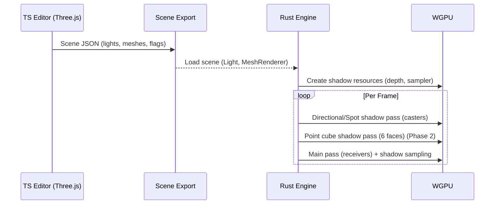

# Rust Lighting and Shadows Feature Parity PRD

## Overview

- **Context & Goals**

  - Achieve feature parity with Three.js lighting and shadows in the Rust engine so scenes authored in the TS editor render equivalently in Rust/WGPU.
  - Support the same light types and core parameters: directional, point, spot, ambient; shadow toggles and quality knobs.
  - Respect `castShadows`/`receiveShadows` at the mesh level, and `castShadow`, `shadowMapSize`, `shadowBias`, `shadowRadius` at the light level.
  - Align renderer defaults: ACES tone mapping, sRGB output, physically-correct light attenuation toggle.

- **Current Pain Points**
  - Rust engine lights affect shading but shadows are not implemented; mesh flags are ignored for shadowing.
  - No shadow map resources, light-space matrices, or WGSL shadow sampling; no spot/directional shadow cameras.
  - Environment/IBL parity is partial in TS and absent in Rust; intensities and falloffs may diverge.
  - No test harness to visually validate parity against Three.js.

## Proposed Solution

- **High‑level Summary**

  - Implement forward shadow mapping in Rust for directional and spot lights with PCF soft filtering; add cube-map shadows for point lights (Phase 2).
  - Introduce shadow resources (depth textures, samplers), light-space matrix generation, and per-light shadow passes executed before the main pass.
  - Update WGSL to sample shadow maps with bias and radius controls to emulate Three.js `PCFSoftShadowMap` and `shadow.radius`.
  - Respect mesh-level `castShadows`/`receiveShadows` and light-level toggles/knobs; expose `physically_correct_lights` and tone-mapping alignment.
  - Provide an environment lighting hook (Phase 3) to support basic IBL parity where used in TS.

- **Architecture & Directory Structure**

```text
rust/engine/
└── src/
    ├── render/
    │   ├── scene_renderer.rs                # integrate shadow passes & bindings
    │   ├── pipeline.rs                      # add shadow bind layouts, buffers
    │   ├── shader.wgsl                      # add shadow sampling helpers
    │   └── shadows/                         # NEW: shadow system
    │       ├── mod.rs                       # re-exports, init
    │       ├── resources.rs                 # ShadowResources, per-light maps
    │       ├── directional.rs               # render directional shadow pass
    │       ├── spot.rs                      # render spot shadow pass
    │       └── point.rs                     # render point cube shadow pass (phase 2)
    └── ecs/
        └── components/
            ├── light.rs                     # already includes shadow knobs
            └── mesh_renderer.rs             # has castShadows/receiveShadows
```

## Implementation Plan

1. Phase 1: Shadow Foundations (0.75 day)

   1. Add `ShadowResources` holding depth textures, compare samplers, per-light matrices.
   2. Extend pipeline with shadow bind group layouts and buffers.
   3. Wire renderer config for `physically_correct_lights` and keep ACES + sRGB.

2. Phase 2: Directional + Spot Shadows (1.5 days)

   1. Implement directional light shadow pass with orthographic shadow camera.
   2. Implement spot light shadow pass with perspective shadow camera.
   3. Support `shadow_map_size`, `shadow_bias`, `shadow_radius`.
   4. Update WGSL: depth compare sampling + 3x3 PCF kernel approximating Three.js softness.

3. Phase 3: Point Light Cube Shadows (1.25 days)

   1. Create 6-face depth cube map per shadowed point light.
   2. Render six passes per point caster set; sample cube map in WGSL with compare.
   3. Respect `range` for cube shadow camera far planes.

4. Phase 4: Mesh Flags and Caster/Receiver Sets (0.5 day)

   1. Build caster sets from entities with `castShadows=true`.
   2. In main pass, conditionally sample shadow maps only for `receiveShadows=true`.

5. Phase 5: Parity Knobs & Environment (0.75 day)

   1. Implement `physically_correct_lights` attenuation toggle to match Three.js behavior.
   2. Add basic IBL parity hook (environment intensity term), gated; full HDR/PMREM later.

6. Phase 6: Tests, Harness & Docs (0.75 day)
   1. Add integration tests and a side-by-side visual harness scene.
   2. Document knobs, defaults, and guidance for parity.

## File and Directory Structures

```text
/root-directory/
├── rust/engine/src/render/shadows/
│   ├── mod.rs
│   ├── resources.rs
│   ├── directional.rs
│   ├── spot.rs
│   └── point.rs
├── rust/engine/src/render/pipeline.rs
├── rust/engine/src/render/scene_renderer.rs
├── rust/engine/src/render/shader.wgsl
└── docs/PRDs/rust-lighting-and-shadows-feature-parity.md
```

## Technical Details

- Shadow resources (Rust; snake_case)

```rust
// rust/engine/src/render/shadows/resources.rs
use wgpu::TextureView;

pub struct Shadow_resources {
    pub directional_map: Option<TextureView>,
    pub spot_map: Option<TextureView>,
    pub point_cube_map: Option<TextureView>,
    pub depth_format: wgpu::TextureFormat,
    pub compare_sampler: wgpu::Sampler,
}

impl Shadow_resources {
    pub fn new(device: &wgpu::Device, depth_format: wgpu::TextureFormat) -> Self { /* ... */ unimplemented!() }
}
```

- Shadow module surface

```rust
// rust/engine/src/render/shadows/mod.rs
pub mod resources;
pub mod directional;
pub mod spot;
pub mod point;

use crate::render::pipeline::Light_shadow_uniform;

pub fn init_shadows(device: &wgpu::Device, config: &wgpu::SurfaceConfiguration) { /* ... */ }
```

- Pipeline uniform extensions

```rust
// rust/engine/src/render/pipeline.rs (additions)
#[repr(C)]
#[derive(Copy, Clone, bytemuck::Pod, bytemuck::Zeroable)]
pub struct Light_shadow_uniform {
    pub dir_light_vp: [[f32; 4]; 4],
    pub spot_light_vp: [[f32; 4]; 4],
    pub point_light_shadow_far: f32,
    pub shadow_bias: f32,
    pub shadow_radius: f32,
    pub _pad: f32,
}

impl Light_shadow_uniform { pub fn new() -> Self { /* ... */ unimplemented!() } }
```

- Shadow sampling helpers (WGSL)

```wgsl
// rust/engine/src/render/shader.wgsl (helpers)
fn sample_shadow_pcf(
  shadow_tex: texture_depth_2d,
  shadow_samp: sampler_comparison,
  uv: vec2<f32>,
  depth_ref: f32,
  texel_size: vec2<f32>,
  radius: f32,
) -> f32 {
  var sum: f32 = 0.0;
  let taps: array<vec2<i32>, 9> = array<vec2<i32>, 9>(
    vec2<i32>(-1, -1), vec2<i32>(0, -1), vec2<i32>(1, -1),
    vec2<i32>(-1,  0), vec2<i32>(0,  0), vec2<i32>(1,  0),
    vec2<i32>(-1,  1), vec2<i32>(0,  1), vec2<i32>(1,  1)
  );
  for (var i = 0u; i < 9u; i = i + 1u) {
    let o = vec2<f32>(f32(taps[i].x), f32(taps[i].y)) * texel_size * radius;
    sum += textureSampleCompare(shadow_tex, shadow_samp, uv + o, depth_ref);
  }
  return sum / 9.0;
}
```

- Scene renderer integration

```rust
// rust/engine/src/render/scene_renderer.rs (sketch)
pub fn render(&mut self, encoder: &mut wgpu::CommandEncoder, view: &wgpu::TextureView, camera: &Camera, queue: &wgpu::Queue, device: &wgpu::Device) {
    // 1) Build caster sets from entities (castShadows=true)
    // 2) Render directional/spot (and point cube) shadow passes into depth textures
    // 3) Update light + shadow uniforms (VP matrices, bias, radius)
    // 4) Main pass draws receivers and samples shadow maps in WGSL
}
```

- Physically-correct lights toggle

```rust
pub struct Lighting_config { pub physically_correct_lights: bool }
```

## Usage Examples

- Three.js/TS authoring parity

```tsx
// Directional with shadows in TS/editor (already supported)
<DirectionalLight
  intensity={1.2}
  castShadow
  shadowMapSize={2048}
  shadowBias={-0.0002}
  shadowRadius={2}
/>
```

- Rust engine config (CLI/env)

```bash
RUST_PHYSICALLY_CORRECT_LIGHTS=true ./vibe-engine --scene scenes/MaterialParityDemo.json
```

- Mesh flags respected

```tsx
<MeshRenderer meshId="cube" castShadows receiveShadows />
```

## Testing Strategy

- **Unit Tests**

  - Light-space matrix generation (directional ortho, spot perspective) vs. golden values.
  - PCF kernel behavior and bias handling smoke tests.
  - Caster/receiver filtering respects component flags.

- **Integration Tests**
  - Parity scene renders with expected average luminance and shadow coverage compared to Three.js (tolerance bands).
  - Changing `shadowMapSize`, `shadowBias`, `shadowRadius` affects output within expected ranges.
  - Point light cube shadows render silhouettes correctly in all six directions.

## Edge Cases

| Edge Case                          | Remediation                                               |
| ---------------------------------- | --------------------------------------------------------- |
| Extremely large `shadowMapSize`    | Clamp to GPU limits; warn and downscale.                  |
| Shadow acne/self-shadowing         | Provide bias + normal-offset; document guidance.          |
| Peter-panning from excessive bias  | Recommend smaller bias; use PCF radius to soften.         |
| Too small shadow frusta            | Auto-fit heuristics; expose debug visualizers later.      |
| Many shadowed lights               | Cap active shadowed lights; LRU or priority-based.        |
| Low-end GPUs lack compare sampling | Fallback to manual PCF in shader; validate feature flags. |

## Sequence Diagram



## Risks & Mitigations

| Risk                                    | Mitigation                                                           |
| --------------------------------------- | -------------------------------------------------------------------- |
| Performance overhead from extra passes  | Batch casters, atlas maps, tune map sizes, cull by bounds.           |
| Visual mismatch vs. Three.js            | Mirror defaults (ACES, sRGB, PCF radius), add test harness and tune. |
| Backend differences in compare sampling | Feature-detect; provide fallback PCF implementation.                 |
| Complexity of point light cubes         | Stage in Phase 2; start with single shadowed point light cap.        |

## Timeline

- Phase 1: 0.75 day
- Phase 2: 1.5 days
- Phase 3: 1.25 days
- Phase 4: 0.5 day
- Phase 5: 0.75 day
- Phase 6: 0.75 day
- **Total**: ~5.5 days

## Acceptance Criteria

- Directional and spot shadows render in Rust with PCF softness similar to Three.js default (visual diff within defined tolerance).
- Point light shadows render from cube maps (Phase 2), matching Three.js falloff and coverage.
- Mesh `castShadows`/`receiveShadows` honored; light `castShadow`, `shadowMapSize`, `shadowBias`, `shadowRadius` honored.
- ACES tone mapping and sRGB output match Three.js defaults; physically-correct attenuation toggle available.
- No crashes on unsupported hardware; graceful degradation with warnings.

## Conclusion

This plan brings the Rust engine to parity with Three.js lighting and shadowing used in the TS editor: same light types, flags, and quality controls, with PCF soft shadows and optional point cubes. It aligns renderer defaults and creates a foundation for IBL parity and further quality improvements.

## Assumptions & Dependencies

- WGPU 0.19+ with depth comparison samplers available; fallback PCF if not.
- Existing `Light` and `MeshRenderer` scene export fields remain stable.
- Renderer defaults: ACES tone mapping, sRGB output; optional physically-correct attenuation.
- Future environment HDR/PMREM support is staged and not required for MVP parity.
