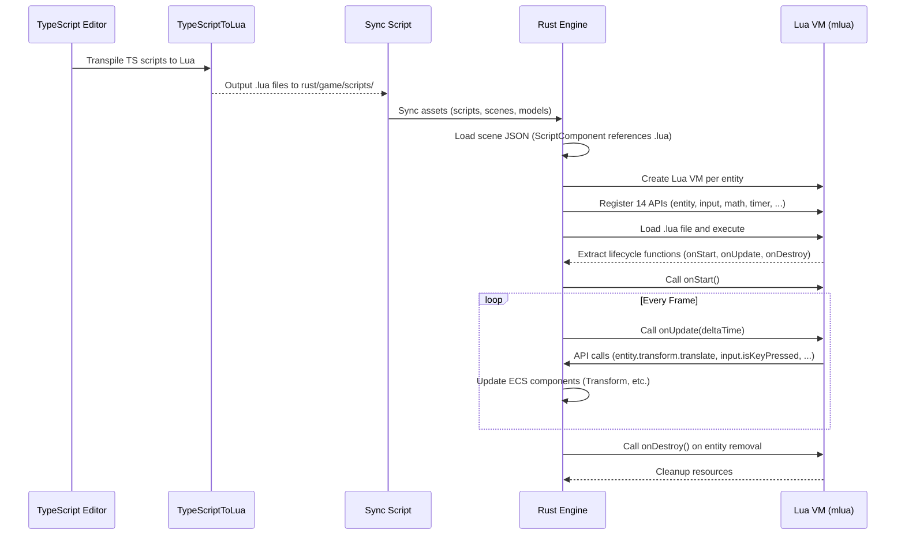

# Rust Scripting System via Lua Integration PRD

## Overview

### Context & Goals

- The TypeScript editor has a mature scripting system with 14 APIs, full JavaScript support via `DirectScriptExecutor`, and comprehensive lifecycle management (onStart, onUpdate, onDestroy, onEnable, onDisable).
- The Rust engine currently has no scripting capability, preventing runtime gameplay logic, entity behaviors, and interactive content in native builds.
- Embedding Lua via `mlua` brings hot-reloadable scripting to Rust while maintaining near-native performance (~10-50x faster than TypeScript, only ~10-50x slower than pure Rust for API calls).
- Successful delivery unlocks rapid iteration in Rust builds, enables modding capabilities, and provides a path for TS-to-Lua transpilation via TypeScriptToLua.

### Current Pain Points

- **No Runtime Logic**: Rust engine can only render static scenes; all gameplay logic lives in TypeScript.
- **Iteration Speed**: Every code change requires full Rust recompilation (30-60 seconds), killing rapid gameplay prototyping.
- **TS-Rust Disparity**: Scripts authored in TypeScript cannot run in Rust builds, fragmenting development workflow.
- **No Hot-Reload**: Changing entity behavior requires stopping, recompiling, and restarting the engine.
- **Missing 14 APIs**: No equivalent to TypeScript's entity, input, physics, audio, timer, events, query, prefab, or gameObject APIs.

## Proposed Solution

### High‑level Summary

- Create `vibe-scripting` workspace crate wrapping `mlua` (Lua 5.4) with lifecycle management, API registration, and entity script contexts.
- Implement 14 Rust-side script APIs (entity, transform, input, math, timer, events, audio, query, prefab, entities, gameObject, physics_events, controller, three) matching TypeScript API surface.
- Integrate TypeScriptToLua toolchain to transpile existing TS scripts to Lua automatically during build, maintaining developer experience.
- Add `ScriptSystem` to Rust engine that loads `.lua` files, creates per-entity Lua VMs, executes lifecycle methods every frame, and synchronizes transforms back to ECS.
- Provide hot-reload via file watching: detect `.lua` changes, recompile script in-place, call onDestroy/onStart to reset state.

### Architecture & Directory Structure

```text
rust/
├── engine/
│   ├── Cargo.toml                                    # Add vibe-scripting dependency
│   ├── crates/
│   │   ├── scripting/                                 # NEW: Lua scripting crate
│   │   │   ├── Cargo.toml                             # mlua = { version = "0.11", features = ["lua54", "send", "serialize"] }
│   │   │   └── src/
│   │   │       ├── lib.rs                             # Re-exports + integration
│   │   │       ├── lua_runtime.rs                     # LuaScriptRuntime, LuaScript structs
│   │   │       ├── script_component.rs                # ScriptComponent definition
│   │   │       ├── script_system.rs                   # ScriptSystem (loads, updates, hot-reloads)
│   │   │       ├── apis/
│   │   │       │   ├── mod.rs
│   │   │       │   ├── entity_api.rs                  # entity.* (id, name, transform, components)
│   │   │       │   ├── input_api.rs                   # input.* (keyboard, mouse, actions)
│   │   │       │   ├── math_api.rs                    # math.* (lerp, clamp, distance, etc.)
│   │   │       │   ├── timer_api.rs                   # timer.* (setTimeout, setInterval, waitFrames)
│   │   │       │   ├── events_api.rs                  # events.* (on, off, emit)
│   │   │       │   ├── audio_api.rs                   # audio.* (play, stop, 3D positioning)
│   │   │       │   ├── query_api.rs                   # query.* (findByTag, raycast)
│   │   │       │   ├── prefab_api.rs                  # prefab.* (spawn, destroy)
│   │   │       │   ├── entities_api.rs                # entities.* (fromRef, get, findByName)
│   │   │       │   ├── gameobject_api.rs              # gameObject.* (createEntity, createPrimitive, clone)
│   │   │       │   ├── physics_events_api.rs          # entity.physicsEvents.* (onCollision, onTrigger)
│   │   │       │   ├── controller_api.rs              # entity.controller.* (isGrounded, move, jump)
│   │   │       │   └── three_api.rs                   # three.* (material, geometry, animate, setVisible)
│   │   │       └── hot_reload.rs                      # File watcher + reload logic
│   │   ├── scene/
│   │   ├── ecs-bridge/
│   │   ├── scene-graph/
│   │   ├── physics/
│   │   └── assets/
│   └── src/
│       ├── app_threed.rs                              # Integrate ScriptSystem.update()
│       └── systems/
│           └── mod.rs                                 # Export script system
└── game/
    ├── scripts/                                       # NEW: Lua script files
    │   ├── player_controller.lua                      # Example: Transpiled from TS
    │   ├── enemy_ai.lua
    │   └── pickup.lua
    └── scenes/
        └── testphysics.json                           # References scripts via ScriptComponent

package.json:
scripts:
  "transpile:lua": "tstl -p tsconfig.tstl.json"        # TypeScriptToLua
  "transpile:lua:watch": "tstl -p tsconfig.tstl.json --watch"
  "rust:engine": "yarn transpile:lua && yarn rust:sync-assets && cd rust/engine && cargo run --"

tsconfig.tstl.json:                                    # NEW: TypeScript to Lua config
{
  "compilerOptions": { ... },
  "tstl": {
    "luaTarget": "5.4",
    "sourceMapTraceback": true
  }
}
```

## Implementation Plan

### Phase 1: Crate Setup & Lua Runtime (1 day)

1. Create `rust/engine/crates/scripting` with mlua dependency.
2. Implement `LuaScriptRuntime` wrapping `mlua::Lua` with lifecycle function extraction and execution hooks.
3. Implement `LuaScript` struct storing lifecycle `RegistryKey`s (on_start, on_update, on_destroy, on_enable, on_disable) to avoid invalid lifetimes.
4. Add `load_script(path: &Path) -> Result<LuaScript>` to execute script and store lifecycle functions in the registry, returning `RegistryKey`s.
5. Write unit tests for script loading, function extraction, and basic execution.

### Phase 2: Transform API Only (KISS) (0.5 day)

**Rationale**: Following KISS principle, start with minimal viable API to prove the architecture works before expanding.

1. **entity API** (0.5 day):
   - `entity.id` (read-only number)
   - `entity.name` (read-only string)
   - `entity.transform` table with:
     - Getters: `entity.transform.position`, `entity.transform.rotation`, `entity.transform.scale` (return Lua arrays)
     - Setters: `entity.transform.setPosition(x, y, z)`, `entity.transform.setRotation(x, y, z)`, `entity.transform.setScale(x, y, z)`
     - Delta methods: `entity.transform.translate(x, y, z)`, `entity.transform.rotate(x, y, z)`
   - Write updates directly to ECS Transform component (no mutation buffer initially)
   - **Critical**: Use `vibe_ecs_bridge::transform_utils` for all rotation conversions (degrees ↔ radians)

**Deferred APIs** (implement in future phases after Transform API validation):

- input, math, timer, events, audio, query, prefab, entities, gameObject, physics_events, controller, three

### Phase 3: ScriptComponent & ECS Integration (1 day)

1. Define `ScriptComponent` struct in `vibe-ecs-bridge`:

   ```rust
   pub struct ScriptComponent {
       pub script_path: Option<String>,
       pub parameters: serde_json::Value,
       pub enabled: bool,
   }
   ```

2. Register ScriptComponent decoder in component registry.

3. Add ScriptComponent to test scenes (e.g., `testphysics.json`):
   ```json
   {
     "id": 42,
     "name": "Player",
     "components": {
       "Script": {
         "scriptPath": "player_controller.lua",
         "parameters": { "speed": 5.0 },
         "enabled": true
       }
     }
   }
   ```

### Phase 4: ScriptSystem Implementation (Simplified) (1 day)

1. Implement `ScriptSystem` in `vibe-scripting`:

   - `initialize(scene: &Scene) -> Result<()>` - Load all entity scripts
   - `update(delta_time: f32) -> Result<()>` - Call onUpdate for all scripts
   - `destroy_script(entity_id: u32) -> Result<()>` - Call onDestroy, cleanup
   - Maintain `HashMap<EntityId, (LuaScriptRuntime, LuaScript)>` for script instances

2. Wire into engine main loop in `app_threed.rs` (before render call):

   ```rust
   pub struct AppThreeD {
       script_system: ScriptSystem,
       // ... existing fields
   }

   impl AppThreeD {
       fn update(&mut self) {
           self.timer.tick();
           let delta_time = self.timer.delta_seconds();

           // Run scripts BEFORE rendering
           let _ = self.script_system.update(delta_time);

           // Existing physics update...
           // Existing renderer sync...
       }
   }
   ```

3. Ensure scripts run BEFORE rendering so transform updates are visible.

### Phase 5: Validation & Iteration (0.5 day)

**KISS Focus**: Validate transform API works correctly before expanding.

1. Create multiple test scripts exercising transform operations:

   - Rotation test (spinning cube)
   - Translation test (moving sphere)
   - Scale test (pulsing object)
   - Complex transform (orbital motion)

2. Verify transform updates visible in rendering without lag.

3. Profile performance: measure Lua→Rust API call overhead.

4. Document lessons learned and API ergonomics feedback.

**Deferred to Phase 5.5+**: Additional APIs (input, math, timer, etc.) only after transform API is proven stable.

### Phase 6: TypeScriptToLua Integration (1 day)

1. Install TypeScriptToLua: `yarn add -D typescript-to-lua`

2. Create `tsconfig.tstl.json`:

   ```json
   {
     "extends": "./tsconfig.json",
     "compilerOptions": {
       "rootDir": "./src/game/scripts",
       "outDir": "./rust/game/scripts"
     },
     "tstl": {
       "luaTarget": "5.4",
       "luaLibImport": "inline",
       "noImplicitSelf": true
     }
   }
   ```

3. Add build scripts to `package.json`:

   ```json
   {
     "transpile:lua": "tstl -p tsconfig.tstl.json",
     "transpile:lua:watch": "tstl -p tsconfig.tstl.json --watch",
     "rust:engine": "yarn transpile:lua && yarn rust:sync-assets && ..."
   }
   ```

4. Create Lua type definitions matching Rust APIs in `src/game/scripts/lua-runtime.d.ts`.

5. Test transpilation with one existing script (e.g., `entity-7.script.ts` → `entity-7.script.lua`).

### Phase 7: Hot-Reload System (1 day)

1. Implement file watcher in `hot_reload.rs` using `notify` crate:

   ```rust
   pub struct ScriptHotReloader {
       watcher: RecommendedWatcher,
       changed_scripts: Arc<Mutex<Vec<PathBuf>>>,
   }
   ```

2. On script file change:

   - Call `script.onDestroy()` to cleanup old state
   - Reload script file from disk
   - Recompile Lua script
   - Call `script.onStart()` to reinitialize
   - Call `script.onEnable()` if component was enabled

3. Add `--hot-reload` CLI flag to engine, disable in release builds.

### Phase 8: Testing & Documentation (1 day)

1. **Unit Tests** (0.5 day):

   - Lua runtime creation and script loading
   - API registration and function calling
   - Lifecycle method execution order
   - Error handling (invalid Lua, missing functions)
   - Hot-reload script replacement

2. **Integration Tests** (0.25 day):

   - Load scene with ScriptComponent
   - Execute onStart, onUpdate sequence
   - Transform modifications visible in rendering
   - Cross-script communication via events

3. **Documentation** (0.25 day):
   - `rust/engine/crates/scripting/CLAUDE.md` - Architecture and usage
   - Example scripts in `rust/game/scripts/examples/`
   - Migration guide: TypeScript → Lua for developers

## File and Directory Structures

```text
rust/engine/crates/scripting/
├── Cargo.toml
└── src/
    ├── lib.rs
    ├── lua_runtime.rs
    ├── script_component.rs
    ├── script_system.rs
    ├── hot_reload.rs
    └── apis/
        ├── mod.rs
        ├── entity_api.rs
        ├── input_api.rs
        ├── math_api.rs
        ├── timer_api.rs
        ├── events_api.rs
        ├── audio_api.rs
        ├── query_api.rs
        ├── prefab_api.rs
        ├── entities_api.rs
        ├── gameobject_api.rs
        ├── physics_events_api.rs
        ├── controller_api.rs
        └── three_api.rs

rust/game/scripts/
├── player_controller.lua
├── enemy_ai.lua
├── pickup.lua
└── examples/
    ├── transform_demo.lua
    └── physics_demo.lua
```

## Technical Details

### Lua Runtime (snake_case, Rust)

```rust
// rust/engine/crates/scripting/src/lua_runtime.rs
use mlua::prelude::*;
use anyhow::{Context, Result};
use std::path::Path;

pub struct LuaScriptRuntime {
    lua: Lua,
}

impl LuaScriptRuntime {
    pub fn new() -> Result<Self> {
        let lua = Lua::new();
        Ok(Self { lua })
    }

    pub fn load_script(&self, path: &Path) -> Result<LuaScript> {
        let script_content = std::fs::read_to_string(path)
            .with_context(|| format!("Failed to read Lua script: {}", path.display()))?;

        // Execute script to define functions
        self.lua
            .load(&script_content)
            .set_name(path.to_string_lossy())
            .exec()
            .context("Failed to load Lua script")?;

        // Extract lifecycle functions and store in registry to extend lifetime
        let globals = self.lua.globals();
        let on_start = globals
            .get::<_, Option<LuaFunction>>("onStart")?
            .map(|f| self.lua.create_registry_value(f))
            .transpose()?;
        let on_update = globals
            .get::<_, Option<LuaFunction>>("onUpdate")?
            .map(|f| self.lua.create_registry_value(f))
            .transpose()?;
        let on_destroy = globals
            .get::<_, Option<LuaFunction>>("onDestroy")?
            .map(|f| self.lua.create_registry_value(f))
            .transpose()?;
        let on_enable = globals
            .get::<_, Option<LuaFunction>>("onEnable")?
            .map(|f| self.lua.create_registry_value(f))
            .transpose()?;
        let on_disable = globals
            .get::<_, Option<LuaFunction>>("onDisable")?
            .map(|f| self.lua.create_registry_value(f))
            .transpose()?;

        Ok(LuaScript {
            on_start,
            on_update,
            on_destroy,
            on_enable,
            on_disable,
        })
    }

    pub fn lua(&self) -> &Lua {
        &self.lua
    }
}

pub struct LuaScript {
    on_start: Option<RegistryKey>,
    on_update: Option<RegistryKey>,
    on_destroy: Option<RegistryKey>,
    on_enable: Option<RegistryKey>,
    on_disable: Option<RegistryKey>,
}

impl LuaScript {
    pub fn call_on_start(&self, lua: &Lua) -> Result<()> {
        if let Some(ref key) = self.on_start {
            let func: LuaFunction = lua.registry_value(key)?;
            func.call::<_, ()>(()).context("Error in onStart()")?;
        }
        Ok(())
    }

    pub fn call_on_update(&self, lua: &Lua, delta_time: f32) -> Result<()> {
        if let Some(ref key) = self.on_update {
            let func: LuaFunction = lua.registry_value(key)?;
            func.call::<_, ()>(delta_time).context("Error in onUpdate()")?;
        }
        Ok(())
    }

    pub fn call_on_destroy(&self, lua: &Lua) -> Result<()> {
        if let Some(ref key) = self.on_destroy {
            let func: LuaFunction = lua.registry_value(key)?;
            func.call::<_, ()>(()).context("Error in onDestroy()")?;
        }
        Ok(())
    }
}
```

### Entity API Registration (snake_case, Rust)

```rust
// rust/engine/crates/scripting/src/apis/entity_api.rs
use mlua::prelude::*;
use glam::Vec3;

pub fn register_entity_api(lua: &Lua, entity_id: u32) -> LuaResult<()> {
    let entity_table = lua.create_table()?;

    // entity.id
    entity_table.set("id", entity_id)?;

    // entity.name
    entity_table.set("name", "Entity")?; // Would fetch from ECS

    // entity.transform table
    let transform_table = lua.create_table()?;

    // entity.transform.position (read-only array)
    transform_table.set("position", vec![0.0, 0.0, 0.0])?;

    // entity.transform.translate(x, y, z)
    transform_table.set(
        "translate",
        lua.create_function(move |_, (x, y, z): (f32, f32, f32)| {
            log::debug!("Lua called translate({}, {}, {})", x, y, z);
            // In real implementation: update ECS Transform component
            // transform_component.position += Vec3::new(x, y, z);
            Ok(())
        })?,
    )?;

    // entity.transform.setPosition(x, y, z)
    transform_table.set(
        "setPosition",
        lua.create_function(move |_, (x, y, z): (f32, f32, f32)| {
            log::debug!("Lua called setPosition({}, {}, {})", x, y, z);
            // transform_component.position = Vec3::new(x, y, z);
            Ok(())
        })?,
    )?;

    entity_table.set("transform", transform_table)?;

    // Set as global 'entity'
    lua.globals().set("entity", entity_table)?;

    Ok(())
}
```

### ScriptSystem Integration (snake_case, Rust)

```rust
// rust/engine/crates/scripting/src/script_system.rs
use vibe_scene::Scene;
use anyhow::{Context, Result};
use std::collections::HashMap;
use std::path::PathBuf;

pub struct ScriptSystem {
    scripts: HashMap<u32, (LuaScriptRuntime, LuaScript)>,
    scripts_base_path: PathBuf,
}

impl ScriptSystem {
    pub fn new(scripts_base_path: PathBuf) -> Self {
        Self {
            scripts: HashMap::new(),
            scripts_base_path,
        }
    }

    pub fn initialize(&mut self, scene: &Scene) -> Result<()> {
        for entity in &scene.entities {
            if let Some(script_comp) = entity.get_component::<ScriptComponent>("Script") {
                if let Some(script_path) = &script_comp.script_path {
                    if let Some(eid) = entity.entity_id() {
                        self.load_entity_script(eid.as_u64() as u32, script_path)?;
                    }
                }
            }
        }
        Ok(())
    }

    fn load_entity_script(&mut self, entity_id: u32, script_path: &str) -> Result<()> {
        log::info!("Loading Lua script for entity {}: {}", entity_id, script_path);

        // Create Lua VM
        let runtime = LuaScriptRuntime::new()
            .context("Failed to create Lua runtime")?;

        // Register APIs (Phase 1: transform only)
        register_entity_api(runtime.lua(), entity_id)?;
        // Future: register_input_api, register_math_api, etc.

        // Load the .lua file
        let full_path = self.scripts_base_path.join(script_path);
        let script = runtime.load_script(&full_path)
            .with_context(|| format!("Failed to load script: {}", script_path))?;

        // Call onStart()
        script.call_on_start(runtime.lua())
            .context("Error in script onStart()")?;

        // Store for later updates
        self.scripts.insert(entity_id, (runtime, script));

        Ok(())
    }

    pub fn update(&mut self, delta_time: f32) -> Result<()> {
        for (entity_id, (runtime, script)) in &self.scripts {
            if let Err(e) = script.call_on_update(runtime.lua(), delta_time) {
                log::error!("Script error for entity {}: {}", entity_id, e);
            }
        }
        Ok(())
    }

    pub fn destroy_script(&mut self, entity_id: u32) -> Result<()> {
        if let Some((runtime, script)) = self.scripts.remove(&entity_id) {
            script.call_on_destroy(runtime.lua())?;
        }
        Ok(())
    }
}
```

## Usage Examples

### TypeScript Script (Original)

```typescript
// src/game/scripts/player_controller.ts
let moveSpeed = (parameters.speed as number) || 5.0;

function onStart(): void {
  console.log('Player controller started for entity', entity.id);
  three.material.setColor('#00ff00');
}

function onUpdate(deltaTime: number): void {
  // Phase 1 MVP: Simple rotation demo (no input API yet)
  const rotationSpeed = 1.0; // radians per second
  const currentRot = entity.transform.rotation;
  entity.transform.rotate(0, rotationSpeed * deltaTime, 0);
}
```

### Transpiled Lua (Automatic via TSTL)

```lua
-- rust/game/scripts/player_controller.lua (generated)
local moveSpeed = parameters.speed or 5.0

function onStart()
    print("Player controller started for entity", entity.id)
    three.material:setColor("#00ff00")
end

function onUpdate(deltaTime)
    -- Phase 1 MVP: Simple rotation demo (no input API yet)
    local rotationSpeed = 1.0 -- radians per second
    local currentRot = entity.transform.rotation
    entity.transform:rotate(0, rotationSpeed * deltaTime, 0)
end
```

### Scene JSON (References Script)

```json
{
  "metadata": { "name": "Test Scene" },
  "entities": [
    {
      "id": 42,
      "persistentId": "player-1",
      "name": "Player",
      "components": {
        "Transform": {
          "position": [0, 1, 0],
          "rotation": [0, 0, 0],
          "scale": [1, 1, 1]
        },
        "Script": {
          "scriptPath": "player_controller.lua",
          "parameters": { "speed": 5.0 },
          "enabled": true
        }
      }
    }
  ]
}
```

### Rust Engine Execution

```bash
# Terminal 1: Watch TypeScript scripts and auto-transpile
yarn transpile:lua:watch

# Terminal 2: Run Rust engine with hot-reload
cargo run --bin vibe-engine -- --scene testphysics --hot-reload
```

## Testing Strategy

### Unit Tests

Comprehensive unit tests for all core components:

```rust
// rust/engine/crates/scripting/src/lua_runtime.rs
#[cfg(test)]
mod tests {
    use super::*;
    use std::path::PathBuf;

    #[test]
    fn test_lua_runtime_creation() {
        let runtime = LuaScriptRuntime::new();
        assert!(runtime.is_ok());
    }

    #[test]
    fn test_load_script_with_lifecycle() {
        let runtime = LuaScriptRuntime::new().unwrap();

        // Create test script
        let script_content = r#"
            function onStart()
                print("Started!")
            end

            function onUpdate(deltaTime)
                print("Update:", deltaTime)
            end
        "#;

        // Load and verify lifecycle functions exist
        lua.load(script_content).exec().unwrap();
        let script = runtime.load_script(...).unwrap();
        assert!(script.on_start.is_some());
        assert!(script.on_update.is_some());
    }

    #[test]
    fn test_call_lifecycle_methods() {
        // ... create runtime and load script
        script.call_on_start().unwrap();
        script.call_on_update(0.016).unwrap();
        script.call_on_destroy().unwrap();
        // No panics = success
    }

    #[test]
    fn test_entity_api_registration() {
        let runtime = LuaScriptRuntime::new().unwrap();
        register_entity_api(runtime.lua(), 42).unwrap();

        // Verify entity global exists
        let result: u32 = runtime.lua().globals()
            .get::<_, LuaTable>("entity").unwrap()
            .get("id").unwrap();
        assert_eq!(result, 42);
    }
}
```

### Integration Tests

Full workflow tests with scene loading:

```rust
// rust/engine/crates/scripting/src/script_system.rs
#[cfg(test)]
mod integration_tests {
    use super::*;

    #[test]
    fn test_script_system_lifecycle() {
        // Load test scene with ScriptComponent
        let scene = load_test_scene("testphysics");
        let mut script_system = ScriptSystem::new(PathBuf::from("rust/game/scripts"));

        // Initialize (should call onStart)
        script_system.initialize(&scene).unwrap();

        // Update several frames (should call onUpdate)
        for _ in 0..10 {
            script_system.update(0.016).unwrap();
        }

        // Destroy (should call onDestroy)
        script_system.destroy_script(42).unwrap();
        // No panics = success
    }

    #[test]
    fn test_hot_reload() {
        let mut script_system = ScriptSystem::new(...);
        // Load initial script
        script_system.load_entity_script(42, "test.lua").unwrap();

        // Modify script file
        std::fs::write("rust/game/scripts/test.lua", "function onStart() print('CHANGED!') end").unwrap();

        // Trigger reload
        script_system.reload_script(42).unwrap();

        // Verify new script is loaded (check logs or state)
    }
}
```

## Edge Cases

| Edge Case                                 | Remediation                                                                                                                         |
| ----------------------------------------- | ----------------------------------------------------------------------------------------------------------------------------------- |
| Lua script has syntax error               | Catch during `load_script()`, log error with line number, skip entity, set `hasErrors` flag in component                            |
| Lua script infinite loop in onUpdate      | Enforce instruction/time budgets via mlua hooks (`set_hook` / `set_global_hook` with `every_nth_instruction`); abort frame on limit |
| Lua script missing lifecycle function     | Allow optional functions, log warning if neither onStart nor onUpdate defined                                                       |
| TypeScript feature not supported in Lua   | Document TSTL limitations (no classes with private fields, no async/await, no destructuring with renaming)                          |
| Script modifies transform but not visible | Ensure ScriptSystem.update() runs BEFORE rendering, apply transforms to SceneGraph immediately                                      |
| Hot-reload mid-frame                      | Queue reloads for next frame boundary to avoid mid-update corruption                                                                |
| Script throws error in onDestroy          | Catch and log, continue cleanup to avoid leaking resources                                                                          |
| Too many scripts (>1000 entities)         | Profile and optimize; consider script pooling or entity chunking in later phases                                                    |
| Lua memory leak from closures             | Implement script lifecycle reset; clear globals between reloads; add memory monitoring                                              |

## Sequence Diagram



## Risks & Mitigations

| Risk                                          | Mitigation                                                                                                                                 |
| --------------------------------------------- | ------------------------------------------------------------------------------------------------------------------------------------------ |
| Performance overhead from Lua API calls       | Profile early; Lua→Rust calls are ~100-500ns (acceptable); batch operations where possible; cache frequently accessed data in Lua          |
| TypeScriptToLua transpilation bugs            | Start with simple scripts; validate transpiled output manually; add integration tests; provide manual Lua fallback for complex features    |
| Hot-reload script corruption                  | Only reload at frame boundaries; call onDestroy before reload; validate Lua syntax before replacing script; add rollback on error          |
| API surface drift (TS vs Rust)                | Maintain API parity matrix; generate Lua type definitions from Rust code (future); automated tests comparing TS and Lua behavior           |
| Developer confusion (TS vs Lua)               | Comprehensive documentation; example scripts in both languages; migration guide; auto-transpilation hides Lua from most developers         |
| Lua memory leaks                              | Implement script lifecycle reset; clear globals between reloads; add memory monitoring via mlua stats; document best practices             |
| No sandbox (infinite loops, excessive memory) | Enable sandbox mode when Luau feature available; enforce instruction limits via hooks; consider memory budgeting via monitored allocations |

## Timeline

### Total: ~6 days (KISS MVP)

- **Phase 1**: Crate Setup & Lua Runtime (1 day)
- **Phase 2**: Transform API Only (0.5 day)
- **Phase 3**: ScriptComponent & ECS Integration (1 day)
- **Phase 4**: ScriptSystem Implementation (1 day)
- **Phase 5**: Validation & Iteration (0.5 day)
- **Phase 6**: TypeScriptToLua Integration (1 day)
- **Phase 7**: Hot-Reload System (1 day)
- **Phase 8**: Testing & Documentation (1 day)

**Breakdown:**

- Days 1-3: Foundation (Lua runtime, transform API, ECS integration)
- Days 4-5: Core system (ScriptSystem, validation, TSTL integration)
- Days 6: Polish (hot-reload, tests, docs)

**Future Phases** (after MVP validation):

- **Phase 5.5**: Input API (0.5 day)
- **Phase 5.6**: Math API (0.25 day)
- **Phase 5.7**: Timer API (0.5 day)
- **Phase 5.8**: Events API (0.25 day)
- **Phase 5.9**: Remaining 9 APIs (2-3 days)

## Acceptance Criteria (MVP - Transform API Only)

- [ ] Rust engine loads scenes with `ScriptComponent` and executes Lua scripts without errors.
- [ ] **Transform API** (`entity.transform.*`) is functional with full parity to TypeScript:
  - Getters: position, rotation, scale
  - Setters: setPosition, setRotation, setScale
  - Delta methods: translate, rotate
  - **Critical**: Rotation conversions use `vibe_ecs_bridge::transform_utils` (degrees ↔ radians handled correctly)
- [ ] Lifecycle methods (onStart, onUpdate, onDestroy) execute in correct order and timing, using `RegistryKey`-backed functions.
- [ ] TypeScriptToLua transpiles simple TS scripts to Lua automatically during `yarn rust:engine` build.
- [ ] Transform updates from Lua scripts are visible in rendering without perceptible lag (<16ms per frame for 100 scripted entities).
- [ ] Hot-reload detects `.lua` file changes and reloads scripts without restarting engine (dev builds only).
- [ ] At least 3 example scripts demonstrating transform operations:
  - Spinning cube (rotation)
  - Moving sphere (translation)
  - Pulsing object (scale)
- [ ] Comprehensive test suite covering:
  - Unit tests: script loading, transform API registration, lifecycle execution
  - Integration tests: scene loading, multi-script coordination, transform synchronization
  - Rotation conversion tests: verify degrees→radians handled correctly
  - Hook-based timeout tests: ensure scripts abort when exceeding instruction budgets
- [ ] Documentation includes:
  - Architecture guide for `vibe-scripting` crate
  - Transform API reference
  - TypeScript→Lua migration guide
  - Troubleshooting section
- [ ] Performance: 100 scripted entities (each rotating) run at 60 FPS on dev hardware (AMD Ryzen / NVIDIA RTX equivalent).

**Future Phases** (deferred until transform API validated):

- [ ] Input, math, timer, events, audio APIs
- [ ] Remaining 9 APIs (query, prefab, entities, gameObject, etc.)

## Conclusion

This plan establishes the foundation for Rust engine scripting by embedding Lua via mlua with a **KISS MVP approach**: start with transform API only to prove the architecture, then expand incrementally. The 6-day implementation delivers hot-reloadable scripts, TypeScriptToLua integration for automatic transpilation, and lifecycle management (onStart, onUpdate, onDestroy). The modular workspace crate architecture (`vibe-scripting`) ensures clean separation, comprehensive testing validates correctness (especially critical rotation conversions via `transform_utils`), and performance targets (100 entities @ 60 FPS) are achievable. After MVP validation, expanding to the full 14-API surface (input, math, timer, events, audio, etc.) becomes straightforward. This foundation also supports future enhancements: sandboxing for infinite loop protection, native Rust scripts for performance-critical paths, and potential visual scripting systems.

## Assumptions & Dependencies

- **mlua crate** (v0.11+) with Lua 5.4 support remains stable and actively maintained.
- **TypeScriptToLua** handles ~80% of TypeScript features automatically; remaining 20% requires manual Lua or simpler TS patterns.
- **Input system** exists or will be implemented in Rust engine to wire `input.*` API (currently stubbed).
- **Audio system** exists or will be implemented in Rust engine to wire `audio.*` API (currently stubbed).
- **Scene Graph** supports transform updates from scripts before rendering (already implemented).
- **ECS Component Registry** supports querying and modifying components from Rust code (already implemented via `vibe-ecs-bridge`).
- **File watcher** for hot-reload uses `notify` crate, cross-platform support (Linux, macOS, Windows).
- **Development workflow** assumes developers primarily write TypeScript and rely on TSTL transpilation; direct Lua authoring is optional.
- **Performance target** assumes desktop hardware (Ryzen 5/7, RTX 3060+); mobile/web targets require profiling and optimization in later phases.
