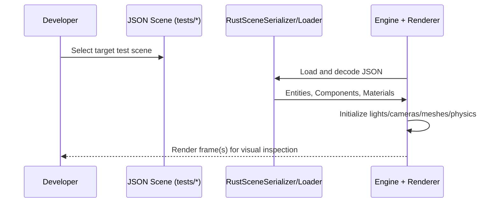

# Rust Engine Visual Test Scenes PRD

## Overview

- **Context & Goals**:
  - Create a suite of focused test scenes to visually validate each implemented feature listed in `rust/engine/INTEGRATION_AUDIT.md`.
  - Mirror the JSON schema of `rust/game/scenes/testphysics.json` for consistency and low friction.
  - Ensure scenes are versioned and easy to run, enabling fast manual visual checks and future automated smoke tests.
- **Current Pain Points**:
  - Hard to visually confirm feature parity end-to-end with one large mixed scene.
  - Missing curated scenes for lighting, shadows, materials, camera, GLTF, and physics edge cases.
  - Some features are parsed but need clear visual validation paths (e.g., tone mapping presets, skybox params, penumbra).

## Proposed Solution

- **High‑level Summary**:

  - Introduce a dedicated directory of bite‑sized JSON scenes, each targeting a single feature area (lighting, shadows, materials, camera, GLTF, physics, hierarchy, skybox, multi‑camera).
  - Use `testphysics.json` as a structural template for entity/component layout, metadata, and materials.
  - Name scenes predictably (e.g., `testlighting.json`, `testshadows.json`, `testmaterials.json`) and document expected visuals.
  - Keep assets minimal and self‑contained; include required small textures and GLTF under existing assets conventions.
  - Ensure scenes are tracked by Git (not ignored) and placed under `rust/game/scenes/tests`.

- **Architecture & Directory Structure**:

```
rust/
  game/
    scenes/
      testphysics.json
      tests/
        testlighting.json
        testshadows.json
        testmaterials.json
        testcamera.json
        testskybox.json
        testmulticamera.json
        testhierarchy.json
        testgltf.json
        testrigidbody.json
        testcolliders.json
        testmaterials-textures.json
        testprefabs.json
```

- Scenes must reside in `rust/game/scenes/tests` and must not be gitignored. Add a negative rule if necessary (see Implementation Plan).

## Implementation Plan

- **Phase 1: Setup (0.5 day)**

  1. Create `rust/game/scenes/tests/` directory.
  2. Verify repository ignore rules; if any glob ignores scene JSONs, add exception:
     - In root `.gitignore`, add `!rust/game/scenes/tests/` and `!rust/game/scenes/tests/*.json`.
  3. Add `README.md` in `rust/game/scenes/tests/` documenting naming and run instructions.

- **Phase 2: Core Render Features (1.0 day)**

  1. `testlighting.json`: directional/ambient/point/spot lights with colors, intensities, attenuation (range/decay), angles.
  2. `testshadows.json`: shadow casters/receivers, directional vs spot, bias, PCF radius, map sizes; toggle `castShadow`.
  3. `testmaterials.json`: solid colors (metalness/roughness variety), emissive color+intensity.
  4. `testmaterials-textures.json`: albedo, normal (with `normalScale`), metallic/roughness, emissive, occlusion; include missing texture fallback.

- **Phase 3: Camera & Skybox (0.75 day)**

  1. `testcamera.json`: perspective vs orthographic, fov/near/far, depth ordering hints, background color, follow target + smoothing.
  2. `testmulticamera.json`: two cameras with distinct `viewportRect` settings (split screen), verify scissor clears.
  3. `testskybox.json`: skyboxTexture, intensity, blur, scale, rotation; note that repeat/offset are parsed and mapped as supported.

- **Phase 4: Assets & GLTF (0.5 day)**

  1. `testgltf.json`: simple GLB via `modelPath`, verifies mesh conversion and material application.
  2. Document asset placement under `assets/` and relative path usage.

- **Phase 5: Physics & Colliders (0.75 day)**

  1. `testrigidbody.json`: fixed/kinematic/dynamic bodies, gravityScale, canSleep, mass.
  2. `testcolliders.json`: box/sphere/capsule; center offsets; triggers vs solid, material friction/restitution.

- **Phase 6: Hierarchy & Prefabs (0.5 day)**

  1. `testhierarchy.json`: parent/child transforms, rotation/scale propagation, world transform correctness.
  2. `testprefabs.json`: prefab structure present (parsed) to verify non-crashing behavior; mark as observational (feature pending).

- **Phase 7: Documentation & Acceptance (0.5 day)**
  1. Write per‑scene “Expected Visual Outcome” notes.
  2. Cross‑link each scene to relevant section of `rust/engine/INTEGRATION_AUDIT.md`.
  3. Capture known limitations (e.g., UV transform not supported) inline.

## File and Directory Structures

```
/rust/game/scenes/tests/
├── README.md
├── testlighting.json
├── testshadows.json
├── testmaterials.json
├── testmaterials-textures.json
├── testcamera.json
├── testskybox.json
├── testmulticamera.json
├── testhierarchy.json
├── testgltf.json
├── testrigidbody.json
└── testcolliders.json
```

## Technical Details

- **Scene JSON skeleton** (follows `testphysics.json` schema):

```json
{
  "metadata": { "name": "testlighting", "version": 1, "timestamp": "<auto>" },
  "entities": [
    {
      "id": 0,
      "name": "Main Camera",
      "components": {
        "PersistentId": { "id": "<uuid>" },
        "Transform": { "position": [0, 1, -10], "rotation": [0, 0, 0], "scale": [1, 1, 1] },
        "Camera": {
          "fov": 40,
          "near": 0.1,
          "far": 100,
          "projectionType": "perspective",
          "isMain": true,
          "viewportRect": { "x": 0, "y": 0, "width": 1, "height": 1 }
        }
      }
    }
  ],
  "materials": [
    {
      "id": "default",
      "name": "Default",
      "shader": "standard",
      "materialType": "solid",
      "color": "#cccccc",
      "metalness": 0,
      "roughness": 0.7
    }
  ]
}
```

- **Naming**: use predictable lower‑case names like `testlighting.json`, `testshadows.json`. Rust code continues to use snake_case identifiers internally.
- **Assets**: Prefer small textures (`512` or `1024`) and a tiny GLB (e.g., Suzanne/box). Place under existing `assets/` layout; refer with absolute or project‑relative paths as per current scenes.

## Usage Examples

- **Load single‑feature scene**: run the engine with `rust/game/scenes/tests/testlighting.json` to visually inspect light types and parameters.
- **Compare shadows**: open `testshadows.json`, tweak `shadowBias` and `shadowRadius`, confirm PCF softness and acne mitigation.
- **Validate textures**: open `testmaterials-textures.json`, verify albedo/normal/emissive/occlusion effects and `normalScale` response.

## Testing Strategy

- **Unit Tests**:
  - JSON parsing for new scenes (schema conformity with `decoders.rs`).
  - Material and texture fields presence/absence handling.
- **Integration Tests**:
  - Engine loads each test scene without panic; logs show component instantiation.
  - Confirm follow camera applies `followOffset` and smoothing.
  - GLTF path loads (feature gated) or shows explicit, user‑friendly error.
- **Manual Visual Checks** (primary goal):
  - Lighting parameters visibly affect the scene as expected.
  - Shadows render with tunable softness and bias.
  - Materials/Textures appear as intended; emissive contributes additively.
  - Multi‑camera viewports render correctly (no bleed; scissor clears honored).
  - Skybox intensity/blur/rotation visibly update the background.
  - Physics bodies behave per type; triggers generate contacts (no physical response).

## Edge Cases

| Edge Case                         | Remediation                                                             |
| --------------------------------- | ----------------------------------------------------------------------- |
| Missing texture path              | Log warning; material falls back to solid color as per material system. |
| Unsupported UV transform          | Document as limitation; do not block render; warn once.                 |
| GLTF feature disabled             | Graceful fallback with feature flag note and clear error.               |
| Zero/negative collider dimensions | Clamp or reject; ensure engine logs clearly.                            |
| Disabled components               | Entities skipped per `enabled=false`; scene still loads.                |
| No shadow receivers               | Verify scene still renders; document expectation.                       |

## Sequence Diagram



## Risks & Mitigations

| Risk                          | Mitigation                                                                    |
| ----------------------------- | ----------------------------------------------------------------------------- |
| Asset bloat from textures/GLB | Use tiny assets; reuse textures across scenes.                                |
| Scene drift vs audit          | Cross‑link scenes to `INTEGRATION_AUDIT.md`; add Expected Visual sections.    |
| Git ignore hides tests        | Add explicit `!rust/game/scenes/tests/` and `!*.json` exception where needed. |
| Feature regressions unnoticed | Keep scenes stable; use them as manual smoke tests for PRs.                   |

## Timeline

- Phase 1: 0.5 day
- Phase 2: 1.0 day
- Phase 3: 0.75 day
- Phase 4: 0.5 day
- Phase 5: 0.75 day
- Phase 6: 0.5 day
- Phase 7: 0.5 day
- **Total**: ~4.5 days

## Acceptance Criteria

- `rust/game/scenes/tests` exists and is not gitignored; contains the listed scenes.
- Each scene loads without errors and produces the documented expected visuals.
- Scenes cover the features claimed as implemented in `rust/engine/INTEGRATION_AUDIT.md` (lighting, shadows, materials, textures, camera, skybox, GLTF, physics, hierarchy, multi‑camera).
- README in `tests/` explains how to run and what to look for per scene.

## Conclusion

A curated, versioned set of small, focused scenes will make it straightforward to visually validate feature parity, catch regressions, and communicate implementation status. These scenes become living artifacts for manual QA and future automated checks.

## Assumptions & Dependencies

- Engine JSON schema matches `testphysics.json` and `decoders.rs`.
- Texture system, GLTF loading, lighting/shadow features implemented as per `rust/engine/INTEGRATION_AUDIT.md`.
- Small example assets are available or can be added under existing `assets/` conventions.

> References: See `rust/engine/INTEGRATION_AUDIT.md` and `rust/game/scenes/testphysics.json` for schema/feature details.
