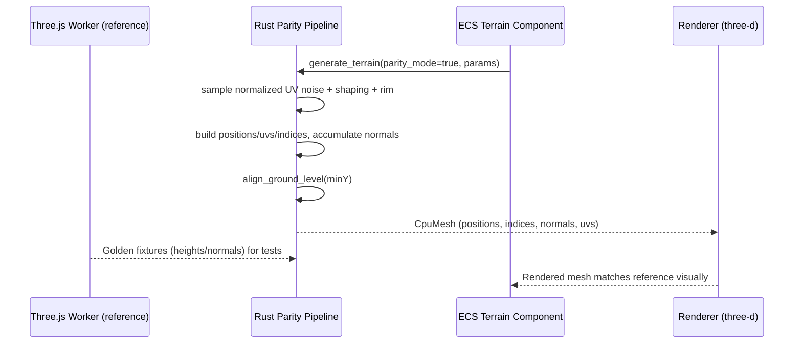

# Rust Terrain Visual Parity with Three.js PRD

## 1. Overview

- **Context & Goals**

  - Achieve visual parity between Rust `three-d` terrain and the current Three.js terrain used in the editor/runtime.
  - Standardize height generation, normals, UVs, and index winding to eliminate visible discrepancies.
  - Ensure identical parameterization (seed, frequency, octaves, persistence, lacunarity, heightScale) produces visually matching output across stacks.
  - Establish automated parity checks and visual test scenes to prevent regressions.

- **Current Pain Points**
  - Rust terrain appears “broken” relative to Three.js: height shaping differs, baseline offset is inconsistent, and results do not match Three.js output.
  - Noise domain mismatch: Rust samples noise in world units with range [-1, 1]; Three.js samples in normalized grid space with range [0, 1] and applies shaping.
  - Missing shaping passes in Rust: large-scale undulation and “rim mountains” effect used by Three.js worker are not implemented.
  - Baseline alignment: Three.js raises geometry so minY aligns to ground; Rust does not, causing negative dips and inconsistent transforms.

## 2. Proposed Solution

- **High‑level Summary**

  - Unify noise domain and shaping: sample in normalized UV space ([0,1]) and replicate Three.js post-shaping (pow(·, 1.2), large-scale mix, rim effect).
  - Add ground-level alignment pass (subtract `min_y`) to match Three.js baseline behavior.
  - Verify UV layout, index winding, and smooth normals match Three.js generation.
  - Introduce a “parity_mode” toggle to lock Rust outputs to Three.js algorithm for validation; keep current path as optional “classic_mode.”
  - Add golden tests and visual test scenes; wire parity checks in CI to guard behavior.

- **Architecture & Directory Structure**

```text
rust/
└── engine/
    └── src/
        └── renderer/
            ├── terrain_generator.rs            # Add parity_mode path + min_y align
            ├── terrain/
            │   ├── noise.rs                    # Normalized [0,1] noise + shaping (Three.js parity)
            │   ├── normals.rs                  # Triangle-accumulated smooth normals
            │   └── utils.rs                    # Ground alignment, index helpers, UV helpers
            └── material_manager.rs
docs/
└── PRDs/
    └── rust/
        └── terrain-visual-parity-gap-closure-prd.md
```

## 3. Implementation Plan

### Phase 1: Baseline & Audit (0.5 day)

1. Capture reference outputs from Three.js worker for representative configs:
   - Small: size [100,100], segments [32,32]
   - Medium: [100,100], [129,129]
   - Large: [100,100], [257,257]
2. Log vertex positions Y, normals, and indices; store as golden fixtures (binary + JSON metadata).
3. Confirm current Rust differences: height domain, minY alignment, shaping passes.

### Phase 2: Noise Domain & Shaping (0.75 day)

1. Switch Rust noise sampling to normalized UV space \(u=x/sx, v=z/sz\).
2. Implement parity noise pipeline:
   - Value noise in [0,1]
   - Shaping via pow(val, 1.2)
   - Large-scale undulation mix (frequency × 0.25, 2 octaves, 0.6 persistence, 2.0 lacunarity, seed+17)
   - Rim/valley effect
3. Multiply by `height_scale` post-shaping to match Three.js.

### Phase 3: Ground Alignment & Indices/Normals (0.5 day)

1. Track `min_y` while generating vertices; subtract from all Y to align baseline.
2. Validate index winding order and triangle topology match Three.js (CCW orientation).
3. Recompute smooth normals via triangle accumulation; verify parity within tolerance.

### Phase 4: Parity Mode Toggle & ECS Integration (0.5 day)

1. Add `parity_mode: bool` on Rust side (default ON for test scenes).
2. Map existing `Terrain` ECS component to set `parity_mode` (configurable for A/B testing).
3. Preserve an optional `classic_mode` for legacy debugging (OFF by default).

### Phase 5: Tests & Visual Scenes (0.75 day)

1. Add golden comparison tests for heights and normals (abs diff ≤ 1e-4).
2. Create/extend visual test scenes in `rust/game/scenes/tests/` mirroring editor Three.js views.
3. Add snapshot diff renderer that overlays height heatmaps for quick visual QA (optional).

### Phase 6: CI Parity Gates & Docs (0.5 day)

1. Wire parity tests in CI (run small+medium configs).
2. Update `docs/audits/VISUAL_PARITY_REPORT.md` with parity checklist and results.
3. Cross-link performance baselines and parity PRD in terrain docs.

## 4. File and Directory Structures

```text
/rust/engine/src/renderer/terrain/
├── noise.rs
├── normals.rs
└── utils.rs

/rust/engine/src/renderer/terrain_generator.rs    # Updated to call parity noise + ground align

/rust/game/scenes/tests/
├── test_terrain_small.json
├── test_terrain_medium.json
└── test_terrain_large.json
```

## 5. Technical Details

```rust
// rust/engine/src/renderer/terrain/noise.rs
pub struct NoiseParams {
    pub seed: u32,
    pub frequency: f32,
    pub octaves: u8,
    pub persistence: f32,
    pub lacunarity: f32,
}

pub fn value_noise_01(u: f32, v: f32, params: &NoiseParams) -> f32 {
    // Hash-based value noise in [0,1], sampled in normalized space
    // Details mirror editor worker: smoothstep interpolation and bilinear blend
    0.0
}

pub fn terrain_height_parity(u: f32, v: f32, height_scale: f32, params: &NoiseParams) -> f32 {
    // 1) Base multi-octave noise in [0,1]
    // 2) Shaping pow(val, 1.2)
    // 3) Large-scale undulation mix
    // 4) Rim/valley effect
    // 5) Scale by height_scale
    0.0
}
```

```rust
// rust/engine/src/renderer/terrain/utils.rs
pub fn align_ground_level(ys: &mut [f32]) -> f32 {
    let mut min_y = f32::INFINITY;
    for y in ys.iter() { if *y < min_y { min_y = *y; } }
    if min_y.is_finite() && min_y != 0.0 {
        for y in ys.iter_mut() { *y -= min_y; }
    }
    min_y
}
```

```rust
// rust/engine/src/renderer/terrain_generator.rs (excerpt)
pub struct TerrainParityConfig {
    pub parity_mode: bool,
}
```

```ts
// Three.js reference (for parity): worker snippet structure
type TerrainData = {
  size: [number, number];
  segments: [number, number];
  heightScale: number;
  noiseEnabled: boolean;
  noiseSeed: number;
  noiseFrequency: number;
  noiseOctaves: number;
  noisePersistence: number;
  noiseLacunarity: number;
};
```

## 6. Usage Examples

```rust
// Rust: enabling parity mode from ECS decode path
let parity_cfg = TerrainParityConfig { parity_mode: true };
let heights = generate_heights_parity(&terrain, &parity_cfg); // normalized-space sampling
```

```ts
// Editor/Three.js: unchanged reference generation (baseline)
await terrainWorker.generateTerrain({
  size: [100, 100],
  segments: [129, 129],
  heightScale: 10,
  noiseEnabled: true,
  noiseSeed: 1337,
  noiseFrequency: 0.2,
  noiseOctaves: 4,
  noisePersistence: 0.5,
  noiseLacunarity: 2.0,
});
```

```bash
# Run parity tests (CI/local)
yarn test rust:terrain-parity
```

## 7. Testing Strategy

- **Unit Tests**

  - Noise parity: `terrain_height_parity(u,v)` ≈ Three.js worker result within ε ≤ 1e-4.
  - Normals parity: triangle-accumulated and normalized normals match reference within ε.
  - Indices/winding: topology identical; CCW orientation confirmed by backface culling test.
  - Ground alignment: minY subtraction produces baseline Y=0 for same inputs.

- **Integration Tests**
  - Scene snapshots: small/medium/large terrain JSON render without visual artifacts.
  - Binary golden compare: serialized Y arrays match reference fixtures within tolerance.
  - Performance sanity: parity mode generation time within budget for test sizes.

## 8. Edge Cases

| Edge Case                              | Remediation                                                        |
| -------------------------------------- | ------------------------------------------------------------------ |
| Frequency units mismatch (world vs UV) | Standardize on normalized UV sampling in parity_mode.              |
| Off‑by‑one at borders (segments-1)     | Mirror index generation pattern from Three.js (two tris per quad). |
| Degenerate triangles at edges          | Clamp indices; ensure loops end at `sz-1`, `sx-1` per reference.   |
| Negative heights below ground          | Align baseline by subtracting minY (match Three.js behavior).      |
| Float precision drift                  | Use tolerance in tests (ε ≤ 1e-4); prefer f32 consistently.        |
| Seed handling differences              | Reuse identical hash constants/mix for parity; document any drift. |

## 9. Sequence Diagram



## 10. Risks & Mitigations

| Risk                                        | Mitigation                                                                 |
| ------------------------------------------- | -------------------------------------------------------------------------- |
| Minor numeric drift vs JS (Math vs f32)     | Use tolerances; match algorithms and constants; validate with goldens.     |
| Performance overhead in parity mode         | Restrict parity tests to representative sizes; optimize after correctness. |
| Maintenance complexity (two modes)          | Keep parity_mode as a flag; default ON for validation, OFF if not needed.  |
| Different default culling/backface settings | Confirm CCW orientation; adjust material/cull state if required.           |

## 11. Timeline

- Total: ~3.5 days
  - Phase 1: 0.5 day
  - Phase 2: 0.75 day
  - Phase 3: 0.5 day
  - Phase 4: 0.5 day
  - Phase 5: 0.75 day
  - Phase 6: 0.5 day

## 12. Acceptance Criteria

- With identical config, Rust parity mode terrain:
  - Height arrays match Three.js reference within ε ≤ 1e-4 (median across grid).
  - Normals match within ε ≤ 1e-4 (vector component-wise).
  - UVs and index topology identical; no backface inversion; no cracks/holes.
  - Baseline alignment: `minY` shift yields Y≥0 everywhere (matches reference).
  - Visual QA on small/medium/large scenes shows indistinguishable output by inspection.
- CI parity tests pass on at least small and medium configurations.
- `docs/audits/VISUAL_PARITY_REPORT.md` updated with PASS checklist for terrain.

## 13. Conclusion

This plan closes the visual gap by aligning the Rust terrain pipeline with the Three.js reference at the algorithmic level: normalized-space noise sampling, identical shaping, baseline alignment, and matching indices/normals. The parity mode and tests make regressions unlikely and provide a clear path to verified correctness before further performance work.

## 14. Assumptions & Dependencies

- Same parameter semantics across stacks (seed, frequency, octaves, persistence, lacunarity, heightScale).
- `three-d` rendering retains standard CCW face culling and PBR defaults.
- Existing terrain ECS component (`Terrain`) remains the config source; additional flag `parity_mode` is allowed.
- Related docs:
  - `docs/guides/terrain-system.md`
  - `docs/PRDs/performance/terrain-performance-baselines.md`
  - `docs/audits/VISUAL_PARITY_REPORT.md`
  - `docs/PRDs/rust/rust-visual-test-scenes-prd.md`
