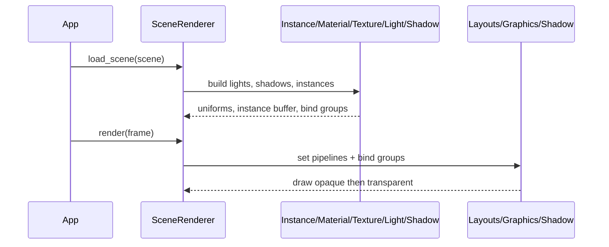

# Scene Renderer & Pipeline Refactoring PRD

## Overview

- **Context & Goals**

  - Refactor `rust/engine/src/render/scene_renderer.rs` and `rust/engine/src/render/pipeline.rs` to align with SRP, DRY, KISS.
  - Improve maintainability and testability without changing runtime behavior.
  - Extract cohesive modules (materials, textures, lights, shadows, instances, draw sorting) and reduce coupling.
  - Keep feature parity (directional/spot/point lights, ACES + exposure, alpha modes, shadow pass and main pass).

- **Current Pain Points**
  - `SceneRenderer` is monolithic (entity extraction, GLTF fallback, material overrides, texture binding, light accumulation, shadow uniforms, draw sorting, pass orchestration).
  - `RenderPipeline` mixes resource layouts creation with three pipelines (opaque, transparent, shadow) and bind-group wiring, making changes risky.
  - Repeated logic for texture availability flags and bind-group creation results in duplicated, error-prone code.
  - Hard to unit test due to side effects and large functions.

## Proposed Solution

- **High‑level Summary**

  - Extract small focused services owned by `SceneRenderer` via composition: `InstanceBuilder`, `MaterialBinder`, `TextureBinder`, `ShadowBinder`, `DrawSorter`, `LightBuilder`.
  - Split `RenderPipeline` concerns: `PipelineLayouts` (layouts + buffers), `GraphicsPipelines` (opaque, transparent), `ShadowPipeline` (depth-only), `BindGroupFactory`.
  - Introduce immutable structs for per-frame build artifacts (instances, textures, materials, alpha modes) to simplify rendering loop.
  - Centralize texture-flag derivation to ensure DRY between CPU-side `MaterialUniform` and GPU-side checks.
  - Maintain current public API; refactoring is internal.

- **Architecture & Directory Structure**

```
rust/engine/src/render/
├── scene_renderer/
│   ├── mod.rs                 # facade: public API preserved
│   ├── instances.rs           # InstanceRaw building, instance buffer mgmt
│   ├── materials.rs           # MaterialUniform building, overrides, flags
│   ├── textures.rs            # Texture view selection, defaults, bind groups
│   ├── lights.rs              # LightUniform building from scene
│   ├── shadows.rs             # ShadowUniform calc + bind group selection
│   ├── sorting.rs             # Opaque/transparent bucketing and sorting
│   └── gltf_loader.rs         # (cfg feature) GLTF asset ingestion helpers
├── pipeline/
│   ├── mod.rs                 # re-exports, high-level constructor
│   ├── layouts.rs             # bind group layouts + uniform buffers
│   ├── graphics.rs            # opaque/transparent pipelines
│   ├── shadow.rs              # shadow-only pipeline + uniform-only layout
│   └── bind_groups.rs         # factories for material/texture/shadow bind groups
├── material_uniform.rs        # unchanged public API
├── depth_texture.rs           # unchanged
└── shader.wgsl                # unchanged
```

## Implementation Plan

- **Phase 1: Scaffolding (0.5 day)**

  1. Create new submodules and move non-behavioral code (types, pure builders).
  2. Add `mod` files with re-exports to keep current import surfaces stable.

- **Phase 2: Extract Render Data Builders (1.0 day)**

  1. `instances.rs`: extract `InstanceRaw` population + instance buffer creation.
  2. `materials.rs`: encapsulate `MaterialUniform` derivation, inline overrides, texture flags.
  3. `textures.rs`: choose 6 texture views per entity + default fallbacks + group creation.
  4. `lights.rs`: compute `LightUniform` from scene entities.

- **Phase 3: Shadows and Sorting (0.5 day)**

  1. `shadows.rs`: compute scene bounds and light VP; update `ShadowUniform`.
  2. `sorting.rs`: split opaque vs transparent, distance-sorting for transparent draws.

- **Phase 4: Pipeline Refactor (1.0 day)**

  1. `layouts.rs`: extract camera/light/shadow/material/texture layouts and buffers.
  2. `graphics.rs`: build opaque/transparent pipelines consuming layouts.
  3. `shadow.rs`: build shadow-only pipeline with uniform-only group 3.
  4. `bind_groups.rs`: centralize creation of bind groups.

- **Phase 5: Integrate and Preserve API (0.5 day)**

  1. Rewire `SceneRenderer::new`, `load_scene`, and `render` to use extracted services.
  2. Maintain names and signatures for public functions to avoid regressions.

- **Phase 6: Tests and Parity Validation (0.5 day)**
  1. Unit tests for flags/alpha mode, sorting stability, shadow VP updates.
  2. Golden scene parity runbook for visual equivalence.

## File and Directory Structures

```markdown
/rust/engine/src/render/scene_renderer/
├── mod.rs
├── instances.rs
├── materials.rs
├── textures.rs
├── lights.rs
├── shadows.rs
├── sorting.rs
└── gltf_loader.rs

/rust/engine/src/render/pipeline/
├── mod.rs
├── layouts.rs
├── graphics.rs
├── shadow.rs
└── bind_groups.rs
```

## Technical Details

- `scene_renderer/instances.rs`

```rust
pub struct InstanceBuilder;
impl InstanceBuilder {
    pub fn build_instances(
        entities: &[RenderableEntity],
        material_cache: &MaterialCache,
    ) -> Vec<InstanceRaw> { /* pure */ }
    pub fn create_buffer(device: &wgpu::Device, instances: &[InstanceRaw]) -> wgpu::Buffer { /* io */ }
}
```

- `scene_renderer/materials.rs`

```rust
pub struct MaterialBuilder;
impl MaterialBuilder {
    pub fn from_entity(
        entity: &RenderableEntity,
        materials: &MaterialCache,
    ) -> MaterialUniform { /* pure */ }
    pub fn apply_inline_override(/* override data */) -> MaterialUniform { /* pure */ }
}
```

- `scene_renderer/textures.rs`

```rust
pub struct TextureBinder;
impl TextureBinder {
    pub struct TextureSet { /* 6 views + flags */ }
    pub fn pick(
        entity: &RenderableEntity,
        materials: &MaterialCache,
        textures: &TextureCache,
    ) -> TextureSet { /* pure */ }
}
```

- `scene_renderer/lights.rs`

```rust
pub struct LightBuilder;
impl LightBuilder {
    pub fn from_scene(scene: &SceneData) -> LightUniform { /* pure */ }
}
```

- `scene_renderer/shadows.rs`

```rust
pub struct ShadowBinder;
impl ShadowBinder {
    pub fn compute_scene_bounds(entities: &[RenderableEntity]) -> (Vec3, f32);
    pub fn update_directional(/* dir, center, radius, bias, radius */) -> ShadowUniform;
}
```

- `scene_renderer/sorting.rs`

```rust
pub enum AlphaCategory { Opaque, Transparent }
pub struct DrawSorter;
impl DrawSorter {
    pub fn bucket_and_sort(
        alpha_modes: &[u32],
        entities: &[RenderableEntity],
        camera_pos: Vec3,
    ) -> (Vec<usize>, Vec<usize>) { /* pure */ }
}
```

- `pipeline/layouts.rs`

```rust
pub struct PipelineLayouts { /* layouts + uniform buffers */ }
impl PipelineLayouts {
    pub fn new(device: &wgpu::Device, config: &wgpu::SurfaceConfiguration) -> Self;
}
```

- `pipeline/graphics.rs`

```rust
pub struct GraphicsPipelines { pub opaque: wgpu::RenderPipeline, pub transparent: wgpu::RenderPipeline }
impl GraphicsPipelines { pub fn new(device: &wgpu::Device, layouts: &PipelineLayouts) -> Self }
```

- `pipeline/shadow.rs`

```rust
pub struct ShadowPipeline { pub pipeline: wgpu::RenderPipeline }
impl ShadowPipeline { pub fn new(device: &wgpu::Device, layouts: &PipelineLayouts) -> Self }
```

- `pipeline/bind_groups.rs`

```rust
pub struct BindGroupFactory;
impl BindGroupFactory {
    pub fn material(/* layout, buffer */) -> wgpu::BindGroup;
    pub fn textures(/* layout, 6 views, sampler */) -> wgpu::BindGroup;
    pub fn shadow(/* layout, uniform, view, sampler */) -> wgpu::BindGroup;
    pub fn shadow_uniform_only(/* layout, uniform */) -> wgpu::BindGroup;
}
```

## Usage Examples

```rust
// Scene setup
let light_uniform = LightBuilder::from_scene(&scene);
let (center, radius) = ShadowBinder::compute_scene_bounds(&entities);
let shadow_uniform = ShadowBinder::update_directional(dir, center, radius, bias, pcf_radius);

// Per-frame build
let instances = InstanceBuilder::build_instances(&entities, &material_cache);
let instance_buffer = InstanceBuilder::create_buffer(device, &instances);
let tex = TextureBinder::pick(&entity, &material_cache, &texture_cache);
let mat = MaterialBuilder::from_entity(&entity, &material_cache);
```

## Testing Strategy

- **Unit Tests**

  - Texture flags derivation for all combinations (albedo/normal/metallic/roughness/emissive/occlusion).
  - Alpha mode resolution (opaque/mask/blend) and inline `transparent` override mapping.
  - Sorting correctness (opaque vs transparent; back-to-front order for transparent).
  - Shadow uniform updates reflect light VP and bias/radius switches.
  - Light building from mixed scene light components.

- **Integration Tests**
  - Render a known scene and assert instance counts, bind-group counts, and no panics.
  - Visual parity runbook: capture before/after screenshots for test scenes (opaque, transparent, masked, shadows).

## Edge Cases

| Edge Case                                | Remediation                                                           |
| ---------------------------------------- | --------------------------------------------------------------------- |
| Missing textures referenced by materials | Fall back to default white/black/gray/normal; clear flags accordingly |
| GLTF feature disabled                    | Log and gracefully fall back to primitive meshes                      |
| No lights present                        | Default ambient/directional values from `LightUniform::new()`         |
| Zero entities                            | Instance buffer omitted; passes still compile                         |
| Alpha mask cutoff extremes               | Discard behavior validated; clamp and defaults                        |

## Sequence Diagram



## Risks & Mitigations

| Risk                                | Mitigation                                                           |
| ----------------------------------- | -------------------------------------------------------------------- |
| Behavior drift (visual regressions) | Keep WGSL and uniforms untouched; add golden scene comparisons       |
| API churn affects call sites        | Preserve public API; refactor internally with same signatures        |
| Performance regressions             | Keep allocations stable; reuse vectors and bind groups per frame     |
| Over-abstraction                    | Keep modules small and pure; avoid trait overuse; measure LOC shrink |

## Timeline

- Phase 1: 0.5 day
- Phase 2: 1.0 day
- Phase 3: 0.5 day
- Phase 4: 1.0 day
- Phase 5: 0.5 day
- Phase 6: 0.5 day
- **Total: ~4.0 days**

## Acceptance Criteria

- No API changes in `SceneRenderer` or `RenderPipeline` public signatures.
- Visual parity on reference scenes (opaque, transparent, shadowed) with no new warnings.
- Unit tests added for flags, alpha, sorting, shadow uniforms, and lights.
- Code size and cognitive complexity reduced in both files; concerns separated per SRP.

## Conclusion

This refactor decomposes rendering responsibilities into small modules while preserving behavior. It improves maintainability, isolation for testing, and paves the way for future features (spot shadows, MSAA, instancing optimizations) without touching the shader.

## Assumptions & Dependencies

- Using existing caches: `MeshCache`, `MaterialCache`, `TextureCache`.
- Shader entry points and bind group indices remain unchanged.
- GLTF loading remains guarded behind `gltf-support` feature.
- Tooling: Yarn/TS unaffected; no changes to web bindings.
- Rust style: snake_case for new identifiers; named exports preserved in TS where applicable.
