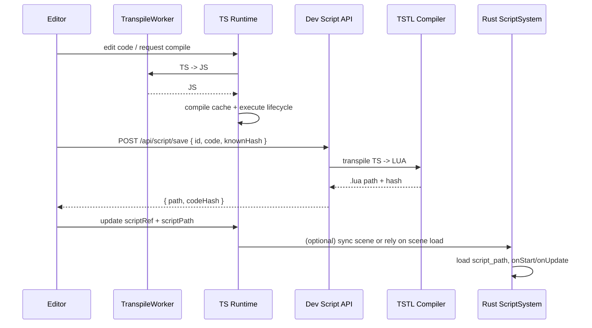

# Script System Refactoring PRD

## 1. Overview

### Context & Goals

- Unify and harden the end-to-end scripting pipeline from TypeScript (editor/runtime) to the Rust engine (Lua) with predictable performance and clear contracts.
- Reduce main-thread work in the editor/runtime by moving transpilation/compile hotspots off the UI thread and batching expensive work.
- Formalize an external script workflow with hash-based syncing and reliable TypeScriptToLua (TSTL) transpilation that feeds the Rust runtime via `scriptPath`.
- Add observability: runtime metrics, error surfaces, and guardrails for safe hot-reload.

### Current Pain Points

- Transpiling TypeScript and compiling scripts on the main thread can cause stutters during editing and play.
- Script compilation may be redundantly triggered; JSON parameter parsing and per-entity setup occur on hot paths.
- External script lifecycle (hashes, `scriptPath`) is inconsistently enforced; error feedback loops are limited.
- No unified bridge/plan for web preview to drive Rust (optional WASM bridge not yet wired).

## 2. Proposed Solution

### High-level Summary

- Workerize TS transpilation and isolate heavy steps from the UI thread.
- Introduce a `ScriptCompiler` facade: caching by `scriptRef.codeHash`, batched compile scheduling per frame, and parameter cache.
- Formalize external script save flow: compute hash → persist `.ts` → TSTL transpile → update `scriptRef.codeHash` and `scriptPath` (points to `.lua`).
- Add performance instrumentation (compile vs execute, per-entity timing) and error reporting surfaced to the editor.
- Optional: wire a minimal WASM bridge for web-to-Rust live preview using `vibe-wasm-bridge` if/when needed.

### Architecture & Directory Structure

```
/src/core/lib/scripting/
  adapters/
    scheduler.ts                    # frame-budgeted timers (existing)
    ScriptBridge.ts                 # optional: Rust/WASM live bridge adapter (new)
  instrumentation/
    perf.ts                         # marks/metrics helpers (new)
  worker/
    transpile.worker.ts             # TS transpile in Web Worker (new)
  ScriptCompiler.ts                 # compile facade over DirectScriptExecutor (new)
  TranspileService.ts               # worker wrapper (new)

/src/editor/components/panels/InspectorPanel/Script/
  ScriptEditor.tsx                  # uncontrolled Monaco (perf-tuned)
  ScriptCodeModal.tsx               # external sync + save + autosave

/rust/engine/crates/scripting/src/
  apis/
    input_api.rs                    # key stubs (new)
    timer_api.rs                    # timer stubs (new)
  lua_runtime.rs                    # intact
  script_system.rs                  # enforce script_path + lifecycle

/rust/engine/crates/wasm-bridge/   # optional live bridge (existing)
```

## 3. Implementation Plan

1. Phase 1: Baseline & Instrumentation (0.5 day)

- Add perf marks around compile vs execute; expose `getScriptSystemStats()` plus compile stats.
- Surface metrics in status bar (avg exec ms, pending compiles).

2. Phase 2: ScriptCompiler facade (0.75 day)

- Create `ScriptCompiler` to wrap `DirectScriptExecutor`, providing:
  1. cache by `scriptId` + `codeHash`,
  2. parameter parse caching until `parametersHash` changes,
  3. compile scheduling (N per frame).
- Replace direct calls in `ScriptSystem` with facade.

3. Phase 3: Workerized transpile (1.0 day)

- Implement `TranspileService` using `transpile.worker.ts`.
- Swap `ts.transpileModule` calls to worker path (fall back on main thread if worker unavailable).

4. Phase 4: External script pipeline + TSTL (1.0 day)

- Extend dev save flow to perform TSTL transpile after saving `.ts` and write `.lua`, then update `scriptRef.codeHash` & `scriptPath`.
- Handle conflicts (hash mismatch), with overwrite or reload options.
- Ensure Rust `ScriptSystem` loads `script_path` reliably.

5. Phase 5: Rust scripting APIs hardening (0.75 day)

- Add `input_api.rs`, `timer_api.rs` stubs in Rust; keep them minimal but ready to expand.
- Improve error messages and lifecycle logging (onStart/update/destroy failures).

6. Phase 6 (Optional): WASM live bridge (1.0 day)

- Expose minimal `WasmLiveBridge` calls (`loadScene`, `applyDiff`) for web preview.
- Provide TS adapter `ScriptBridge` to toggle between local TS executor vs Rust WASM.

7. Phase 7: Docs, acceptance tests, rollout (0.5 day)

- Write docs, acceptance criteria verification, and rollout checklist.

## 4. File and Directory Structures

```
/src/core/lib/scripting/
├── ScriptCompiler.ts
├── TranspileService.ts
├── worker/
│   └── transpile.worker.ts
├── adapters/
│   └── ScriptBridge.ts
└── instrumentation/
    └── perf.ts
```

```
/rust/engine/crates/scripting/src/apis/
├── input_api.rs
└── timer_api.rs
```

## 5. Technical Details

### TypeScript: ScriptCompiler facade

```ts
// src/core/lib/scripting/ScriptCompiler.ts
export interface CompileRequest {
  scriptId: string;
  code: string;
  codeHash?: string; // optional; if provided, enables strong cache
}

export interface CompileResult {
  ok: boolean;
  error?: string;
  compileMs: number;
}

export interface ExecuteOptions {
  entityId: number;
  maxExecutionTimeMs?: number;
  parameters?: Record<string, unknown>;
  deltaTimeSec?: number;
}

export interface IScriptCompiler {
  compile(req: CompileRequest): Promise<CompileResult>;
  execute(
    scriptId: string,
    lifecycle: 'onStart' | 'onUpdate' | 'onDestroy' | 'onEnable' | 'onDisable',
    opts: ExecuteOptions,
  ): { ok: boolean; execMs: number; error?: string };
  invalidate(scriptId: string): void;
}

export const createScriptCompiler = (): IScriptCompiler => {
  // wrap DirectScriptExecutor; use TranspileService for TS→JS in worker
  // implement cache keyed by scriptId + codeHash
  // implement parameter parsing cache by parametersHash (external input)
  return {
    async compile(req) {
      /* ... */ return { ok: true, compileMs: 0 };
    },
    execute(scriptId, lifecycle, opts) {
      /* ... */ return { ok: true, execMs: 0 };
    },
    invalidate(scriptId) {
      /* ... */
    },
  };
};
```

### TypeScript: TranspileService (Worker wrapper)

```ts
// src/core/lib/scripting/TranspileService.ts
export interface TranspileInput {
  code: string;
}
export interface TranspileOutput {
  code: string;
} // JS output

export class TranspileService {
  private worker: Worker | null = null;

  async init(): Promise<void> {
    /* lazy-start worker */
  }

  async transpile(input: TranspileInput): Promise<TranspileOutput> {
    // postMessage -> await response; fallback to ts.transpileModule on failure
    return { code: input.code };
  }
}
```

### TypeScript: transpile.worker.ts

```ts
// src/core/lib/scripting/worker/transpile.worker.ts
self.onmessage = async (evt: MessageEvent) => {
  const { code } = evt.data as { code: string };
  // use TypeScript compiler in worker context
  // post JS output back
  (self as unknown as Worker).postMessage({ code });
};
```

### TypeScript: perf instrumentation

```ts
// src/core/lib/scripting/instrumentation/perf.ts
export const perfMark = (name: string) => performance.mark(name);
export const perfMeasure = (name: string, start: string, end: string) => {
  performance.measure(name, start, end);
  const entries = performance.getEntriesByName(name);
  return entries[entries.length - 1]?.duration ?? 0;
};
```

### Rust: input_api.rs (stubs)

```rust
// rust/engine/crates/scripting/src/apis/input_api.rs
use mlua::prelude::*;

pub fn register_input_api(lua: &Lua) -> LuaResult<()> {
    let globals = lua.globals();
    let input = lua.create_table()?;
    input.set("isKeyDown", lua.create_function(|_, _key: String| Ok(false))?)?;
    globals.set("input", input)?;
    Ok(())
}
```

### Rust: timer_api.rs (stubs)

```rust
// rust/engine/crates/scripting/src/apis/timer_api.rs
use mlua::prelude::*;

pub fn register_timer_api(_lua: &Lua) -> LuaResult<()> {
    // placeholder; timers handled by host engine
    Ok(())
}
```

## 6. Usage Examples

### Example 1: Compiling & executing in TS runtime

```ts
const compiler = createScriptCompiler();
await compiler.compile({ scriptId: 'entity_42', code: scriptSource, codeHash });
compiler.execute('entity_42', 'onStart', { entityId: 42 });
```

### Example 2: Transpiling in worker via service

```ts
const svc = new TranspileService();
await svc.init();
const { code: js } = await svc.transpile({ code: tsSource });
```

### Example 3: External save pipeline (editor side)

```ts
// 1) compute hash, POST /api/script/save { id, code, knownHash }
// 2) server runs TSTL -> writes id.lua -> returns { path, hash }
// 3) editor updates scriptRef { codeHash, path } and scriptPath -> triggers Rust load
```

## 7. Testing Strategy

### Unit Tests

- TranspileService: worker happy path and fallback to main-thread transpile.
- ScriptCompiler: cache hits by `codeHash`; parameter cache invalidation; compile budget per frame.
- Perf metrics: ensure measures recorded and exposed.

### Integration Tests

- Editor save flow: hash conflict, overwrite, reload from file.
- TS ScriptSystem running with workerized transpile (smoke test across lifecycle).
- Rust `ScriptSystem` loads `.lua` from `script_path` and executes lifecycle functions, including parameters mapping.
- Optional: WASM bridge round-trip `loadScene` + `applyDiff` from web.

## 8. Edge Cases

| Edge Case                         | Remediation                                                               |
| --------------------------------- | ------------------------------------------------------------------------- |
| Missing `scriptPath` on Rust side | Skip script and log warn; acceptance tests enforce presence when enabled. |
| Hash mismatch on save             | Present overwrite vs reload choice; never silently clobber.               |
| Worker not available              | Fallback to main-thread transpile; log once.                              |
| Long-running `onUpdate`           | Enforce `maxExecutionTimeMs`; warn and throttle.                          |
| Parameters invalid JSON           | Use last known good or `{}`; surface error to UI.                         |

## 9. Sequence Diagram



## 10. Risks & Mitigations

| Risk                           | Mitigation                                                                   |
| ------------------------------ | ---------------------------------------------------------------------------- |
| Worker initialization race     | Lazy-init and retry with exponential backoff; fallback path.                 |
| TSTL differences vs JS runtime | Keep parity tests; document known differences; prefer shared APIs.           |
| Increased complexity           | Encapsulate via `ScriptCompiler` and `TranspileService`; clear boundaries.   |
| Perf regressions               | Perf marks and thresholds; status bar surfacing; CI performance smoke tests. |

## 11. Timeline

- Total: ~4.5–5.5 days (+1.0 day optional WASM)
- Phase breakdown:
  - P1 Baseline & instrumentation: 0.5d
  - P2 ScriptCompiler facade: 0.75d
  - P3 Workerized transpile: 1.0d
  - P4 External pipeline + TSTL: 1.0d
  - P5 Rust API hardening: 0.75d
  - P6 Optional WASM bridge: 1.0d
  - P7 Docs & rollout: 0.5d

## 12. Acceptance Criteria

- TS runtime compiles via worker by default; fallback supported; no UI jank on typical edits.
- `ScriptCompiler` caches by `codeHash`, schedules compiles, and caches parsed parameters until changed.
- Saving external scripts produces `.lua`, updates `scriptRef.codeHash` and `scriptPath`, and Rust loads it.
- Perf metrics visible in the editor; average execution time and pending compiles reported.
- Hash conflicts and save errors are gracefully handled in the UI.
- Unit and integration tests pass; basic parity tests (TS vs Lua lifecycle) green.

## 13. Conclusion

This refactor stabilizes and accelerates the scripting workflow by isolating heavy work, enforcing a robust external pipeline to Lua, and adding observability. It positions the project for both smooth in-browser editing and reliable Rust runtime execution, with an optional path to live WASM integration.

## 14. Assumptions & Dependencies

- TypeScriptToLua available in dev toolchain; Node environment can run transpile on save.
- `mlua` and current Rust runtime remain; Lua standard libs used are sufficient.
- Monaco editor is available; worker scripts can be bundled by the build system.
- Optional WASM depends on `vibe-wasm-bridge` and `wasm-bindgen` availability.
