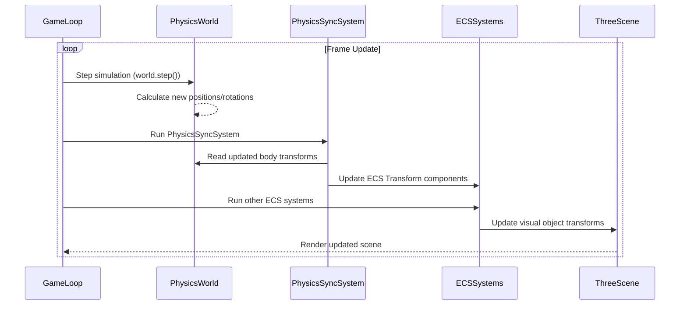

# Physics Integration (Rapier)

This document details the integration of the Rapier physics engine within the Vibe Coder 3D core framework.

## Overview

- **Dependencies:** Integration relies on `rapier3d-compat` and `@react-three/rapier`.
- **Setup:** The Rapier physics world is initialized and managed within the main React Three Fiber render loop, handled through `@react-three/rapier`'s `<Physics>` component.
- **Synchronization:** Physics simulation runs independently and needs synchronization with the Three.js scene graph and ECS system.

## Core Components

The engine provides multiple physics components for different use cases:

### Primary Physics Components

- **`<PhysicsBody>`:** Enhanced physics body component in `src/core/components/physics/PhysicsBody.tsx` with comprehensive API:

  - Automatic ECS integration with entity creation
  - Support for all Rapier body types (dynamic, kinematic, fixed)
  - Material property configuration (friction, restitution, density)
  - Imperative handle for external control
  - Debug and metadata support

- **`<PhysicsObject>`:** Base component in `src/core/components/physics/PhysicsObject.tsx` for simple physics integration:
  - Wraps `@react-three/rapier`'s `RigidBody`
  - Automatic ECS entity creation and registration
  - Basic collision handling

### Specialized Physics Components

- **`<PhysicsTrigger>`:** Non-solid trigger zones in `src/core/components/physics/PhysicsTrigger.tsx`:

  - Creates sensor colliders for detection zones
  - Integrates with ECS system for entity tracking
  - Supports enter/exit event callbacks

- **`<PhysicsBall>`:** Specialized ball physics in `src/core/components/physics/PhysicsBall.tsx`:

  - Optimized for spherical objects
  - Configurable physics properties (mass, restitution, damping)
  - Built-in visual representation

- **`<PhysicsJoint>`:** Joint system in `src/core/components/physics/PhysicsJoint.tsx`:
  - Supports revolute, fixed, and spherical joints
  - Connects multiple physics bodies
  - Configurable joint parameters

### Factory and Utility Components

- **`<PhysicsObjectFactory>`:** Factory component for creating common physics objects
- **`<TaggablePhysicsObject>`:** Physics objects with tagging system for state management
- **`<PhysicsSystem>`:** System component that initializes physics integration

## ECS Integration

### Physics-ECS Synchronization

- **PhysicsBodyRef Component:** Defined in `src/core/systems/PhysicsSyncSystem.ts`, stores references to physics bodies:

  ```typescript
  export const PhysicsBodyRef = defineComponent({
    bodyId: Types.ui32, // Store an ID for body lookup
    isActive: Types.ui8, // Flag for active simulation
    priority: Types.ui8, // Update priority
  });
  ```

- **Registration System:** Physics bodies are registered with the ECS using:

  - `registerPhysicsBody(entityId, rigidBody)`: Links physics body to ECS entity
  - `unregisterPhysicsBody(entityId)`: Removes physics-ECS link

- **PhysicsSyncSystem:** Synchronizes transforms between physics bodies and ECS entities:
  - Queries entities with both Transform and PhysicsBodyRef components
  - Updates ECS Transform data from physics body positions/rotations
  - Handles bidirectional synchronization when needed

## Physics Hooks and Utilities

### Core Physics Hook

- **`usePhysics()`:** Comprehensive physics utilities in `src/core/lib/physics.ts`:
  - Access to Rapier world and API
  - Raycasting utilities (`raycast`, `raycastAll`)
  - Shape creation helpers (`createShape`)
  - Material application (`applyMaterial`)
  - Body manipulation utilities (forces, impulses, velocities)

### Event Handling

- **`useCollisionEvents()`:** Collision event management in `src/core/hooks/useCollisionEvents.ts`:
  - Subscribe to collision enter/exit events
  - Sensor event handling
  - Entity-based event filtering

### Physics System Integration

- **`usePhysicsSystem()`:** System-level physics integration
- **`PhysicsWorld`:** Wrapper component providing physics context and lighting

## Usage Patterns

### Basic Physics Object

```typescript
// Simple physics-enabled object
<PhysicsBody bodyType="dynamic" position={[0, 5, 0]}>
  <mesh>
    <boxGeometry />
    <meshStandardMaterial />
  </mesh>
</PhysicsBody>
```

### Advanced Physics Configuration

```typescript
// Advanced physics body with custom properties
<PhysicsBody
  bodyType="dynamic"
  material={{ friction: 0.8, restitution: 0.6 }}
  mass={2.5}
  autoRegister={true}
  debug={true}
>
  <mesh>
    <sphereGeometry />
    <meshStandardMaterial />
  </mesh>
</PhysicsBody>
```

### Trigger Zones

```typescript
// Non-solid trigger for detection
<PhysicsTrigger
  position={[0, 0, 0]}
  size={[2, 2, 2]}
  onEnter={(entityId) => console.log('Entity entered:', entityId)}
  onExit={(entityId) => console.log('Entity exited:', entityId)}
/>
```

## Editor Integration

- **`EditorPhysicsIntegration`:** Component in `src/editor/components/physics/` that manages physics in editor context:
  - Handles play/pause state for physics simulation
  - Creates physics bodies for entities with RigidBody components
  - Manages physics body lifecycle in editor mode

## Debugging

- **Visual Debugger:** Integration with `@react-three/rapier`'s `<Debug />` component for visualizing colliders and physics interactions
- **Performance Monitoring:** Physics body tracking and performance metrics
- **State Inspection:** Access to physics body properties and simulation state

## Synchronization Loop

The physics world runs its simulation steps, and the results are synchronized with both the visual representation and the ECS system:



## Performance Considerations

- **Body Management:** Efficient registration/unregistration of physics bodies
- **Update Prioritization:** Priority-based updates for performance-critical objects
- **Collision Optimization:** Efficient collision detection and event handling
- **Memory Management:** Proper cleanup of physics resources and ECS entities
