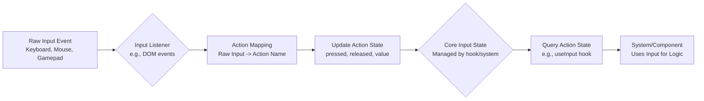

# Input Handling

This document details the core input handling system.

## Overview

- **Goal:** Provide a unified way to handle keyboard, mouse, gamepad, and potentially touch inputs.
- **Implementation:** Likely implemented as a core hook (`src/core/hooks/useInput.ts`) or a dedicated system/context.

## Features

- **Action Mapping:** Describe how raw inputs (e.g., 'W' key, 'Spacebar', Gamepad 'A' button) are mapped to abstract actions (e.g., 'moveForward', 'jump', 'interact').
- **Input State:** Explain how the state of actions (pressed, released, held) is tracked.
- **Context Sensitivity:** Discuss if/how input mappings might change based on game state (e.g., in UI vs. in game).

## Usage

- **Accessing Actions:** Show how components or systems can query the state of specific actions using the core hook or system.
- **Configuration:** Explain how action mappings are configured (e.g., JSON file, in-code setup).

## Supported Devices

- List the planned input devices (Keyboard, Mouse, Gamepad).

## Input Processing Flow

The flow from raw hardware input to usable action state typically involves these steps:

