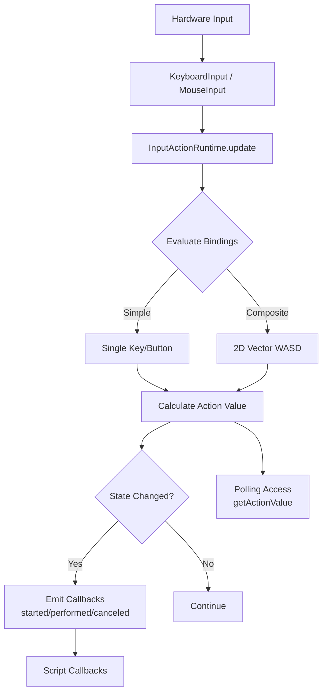

# Input Handling System

This document details the Unity-like input handling system implementation.

## Overview

Vibe Coder 3D features a **Unity-inspired Input Actions system** that provides:

- **Action-based input mapping** - Map logical actions to physical inputs
- **Multiple bindings** - Support multiple input methods per action (e.g., WASD + Arrow keys)
- **Composite bindings** - Combine multiple keys into vectors (e.g., WASD → Vector2)
- **Event-driven callbacks** - Subscribe to action state changes
- **Polling support** - Query action values each frame
- **Persistent configuration** - Save/load input configurations via Zustand
- **Visual editor** - Unity-like 3-column UI for configuration

## Architecture

### Core Components

1. **InputManager** (`src/core/lib/input/InputManager.ts`)

   - Singleton managing all input subsystems
   - Coordinates keyboard, mouse, and action runtime
   - Provides both legacy (direct) and new (action-based) APIs

2. **InputActionRuntime** (`src/core/lib/input/InputActionRuntime.ts`)

   - Evaluates bindings in real-time
   - Manages action callbacks (started/performed/canceled)
   - Normalizes composite bindings

3. **Input Store** (`src/editor/store/inputStore.ts`)

   - Zustand store for persistent input configuration
   - CRUD operations for assets, action maps, and actions
   - Default configuration with Gameplay and UI action maps

4. **Input Settings Modal** (`src/editor/components/shared/InputSettingsModal.tsx`)
   - Unity-like 3-column layout
   - Visual configuration of actions and bindings
   - Accessible via Settings → Input menu

### Type System

All input types are defined with Zod schemas in `src/core/lib/input/inputTypes.ts`:

- **ActionType**: Button, Value, PassThrough
- **ControlType**: Button, Axis, Vector2, Vector3
- **DeviceType**: Keyboard, Mouse, Gamepad
- **CompositeType**: 1DAxis, 2DVector, 3DVector

## Usage

### In Scripts (Recommended)

Scripts have full access to the Input Actions system via the `input` API:

```typescript
// onStart lifecycle
onStart() {
  // Event-based input (recommended for buttons)
  input.onAction("Gameplay", "Fire", (phase, value) => {
    if (phase === "started") {
      console.log("Fire button pressed!");
    }
  });
}

// onUpdate lifecycle
onUpdate(deltaTime) {
  // Polling-based input (recommended for movement)
  const moveInput = input.getActionValue("Gameplay", "Move");

  if (Array.isArray(moveInput)) {
    const [x, y] = moveInput;
    const speed = 5;
    entity.position = [
      entity.position[0] + x * speed * deltaTime,
      entity.position[1],
      entity.position[2] + y * speed * deltaTime
    ];
  }

  // Boolean check
  if (input.isActionActive("Gameplay", "Jump")) {
    console.log("Jump is active!");
  }
}
```

### In TypeScript Components

```typescript
import { InputManager } from '@core/lib/input/InputManager';

const inputManager = InputManager.getInstance();

// Polling
const moveValue = inputManager.getActionValue('Gameplay', 'Move') as [number, number];

// Event-driven
inputManager.onAction('Gameplay', 'Jump', (context) => {
  if (context.phase === 'started') {
    // Jump logic
  }
});
```

### Legacy Direct Input (Still Supported)

```typescript
// Direct keyboard/mouse access
if (input.isKeyDown('w')) {
  /* ... */
}
if (input.isMouseButtonPressed(0)) {
  /* ... */
}
```

## Configuration

### Default Actions

The system ships with pre-configured action maps:

**Gameplay Map:**

- **Move** (Vector2): WASD / Arrow Keys
- **Jump** (Button): Space
- **Fire** (Button): Mouse Left / F
- **Look** (Vector2): Mouse Delta

**UI Map:**

- **Navigate** (Vector2): Arrow Keys
- **Submit** (Button): Enter / Space
- **Cancel** (Button): Escape

### Customizing Actions

1. Open **Settings → Input** from the menu bar
2. Select an action map in the left column
3. Select an action in the middle column
4. View/edit bindings in the right properties panel

## Input Processing Flow



## Supported Devices

- ✅ **Keyboard** - Fully supported
- ✅ **Mouse** - Buttons, delta, scroll
- ⏳ **Gamepad** - Stubbed for future implementation
- ⏳ **Touch** - Planned

## API Reference

### InputManager Methods

| Method                             | Description                |
| ---------------------------------- | -------------------------- |
| `loadInputActionsAsset(asset)`     | Load input configuration   |
| `enableActionMap(name)`            | Enable an action map       |
| `disableActionMap(name)`           | Disable an action map      |
| `getActionValue(map, action)`      | Poll action value          |
| `isActionActiveNew(map, action)`   | Check if action is active  |
| `onAction(map, action, callback)`  | Subscribe to action events |
| `offAction(map, action, callback)` | Unsubscribe from events    |

### Script Input API

See `src/game/scripts/script-api.d.ts` for full type definitions.

## Performance Considerations

- **Frame Budget**: Runtime updates run each frame with minimal overhead
- **Normalization**: Diagonal movement (WASD) is automatically normalized
- **Event Cleanup**: Always unsubscribe from action callbacks in `onDestroy`
- **Polling vs Events**: Use polling for continuous input (movement), events for discrete actions (buttons)

## Testing

Tests are located in:

- `src/core/lib/input/__tests__/InputActionRuntime.test.ts`
- `src/editor/store/__tests__/inputStore.test.ts`

Run tests with: `yarn test`

## Future Enhancements

- [ ] Gamepad support with dead zones
- [ ] Touch input for mobile
- [ ] Input rebinding UI
- [ ] Input recording/playback for testing
- [ ] Sensitivity curves for analog inputs
- [ ] Multiple action maps active simultaneously
- [ ] Context-sensitive input (different actions per game state)
