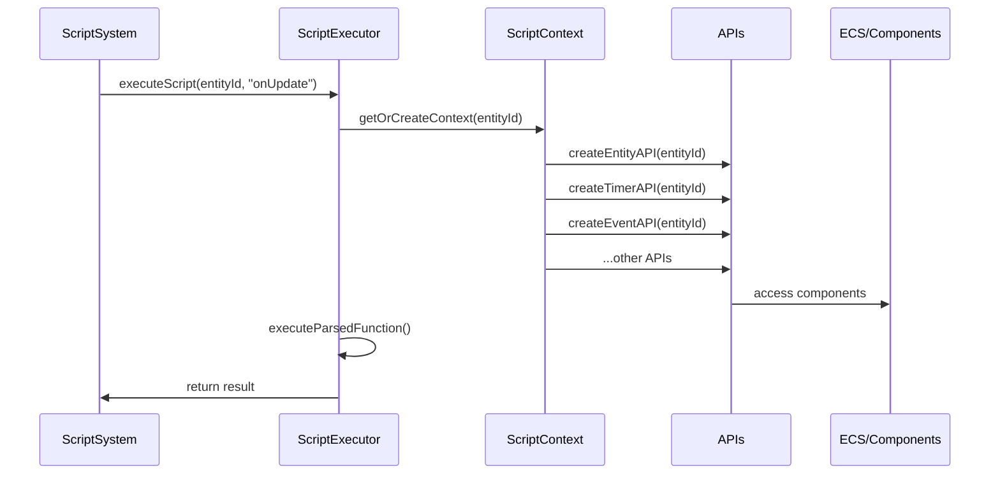

# Script System Architecture

**Status**: Implemented
**Version**: 2.0
**Last Updated**: 2025-09-30

## Overview

The Script System provides a TypeScript-based scripting API that allows entities to run custom gameplay code with secure, sandboxed access to engine features. Scripts can manipulate entities, respond to events, play audio, schedule timers, query the scene, and more.

## Key Features

- **TypeScript-only** scripting with full type definitions
- **Sandboxed execution** with controlled API access
- **11 Global APIs** for common gameplay needs
- **Frame-budgeted timers** to prevent blocking
- **Event-driven architecture** for inter-entity communication
- **Entity references** for cross-entity operations
- **Auto-generated type declarations** for IDE support
- **External script files** with hot-reload support

## Architecture

### Components

```
src/core/lib/scripting/
├── ScriptAPI.ts              # Interface definitions (source of truth)
├── ScriptExecutor.ts         # Script execution engine
├── ScriptResolver.ts         # External script loading
├── ThreeJSEntityRegistry.ts  # Three.js object mapping
├── apis/
│   ├── EventAPI.ts          # Event bus access
│   ├── AudioAPI.ts          # Sound playback
│   ├── TimerAPI.ts          # Scheduled callbacks
│   ├── QueryAPI.ts          # Scene queries
│   ├── PrefabAPI.ts         # Entity spawning
│   └── EntitiesAPI.ts       # Entity references
└── adapters/
    └── scheduler.ts         # Frame-budgeted timer scheduler

src/core/systems/
└── ScriptSystem.ts          # ECS system for script execution

src/game/scripts/
└── script-api.d.ts          # Auto-generated type declarations
```

### Data Flow



## Global Script APIs

Scripts have access to 11 global APIs that provide controlled access to engine features:

### 1. Entity API (`entity`)

Access to the current entity's properties and components.

```typescript
// Properties
entity.id          // Entity ID
entity.name        // Entity name
entity.transform   // Transform API

// Component access
entity.getComponent<T>(type: string): T | null
entity.setComponent<T>(type: string, data: Partial<T>): boolean
entity.hasComponent(type: string): boolean
entity.removeComponent(type: string): boolean

// Hierarchy
entity.getParent(): IEntityScriptAPI | null
entity.getChildren(): IEntityScriptAPI[]
entity.findChild(name: string): IEntityScriptAPI | null

// Lifecycle
entity.destroy(): void
entity.setActive(active: boolean): void
entity.isActive(): boolean
```

### 2. Transform API (`entity.transform`)

Transform operations for position, rotation, and scale.

```typescript
// Properties (read/write)
entity.transform.position; // [x, y, z]
entity.transform.rotation; // [x, y, z] (euler angles)
entity.transform.scale; // [x, y, z]

// Methods
entity.transform.setPosition(x, y, z);
entity.transform.setRotation(x, y, z);
entity.transform.setScale(x, y, z);
entity.transform.translate(x, y, z); // Add to position
entity.transform.rotate(x, y, z); // Add to rotation
entity.transform.lookAt([x, y, z]);
entity.transform.forward(); // Get forward vector
entity.transform.right(); // Get right vector
entity.transform.up(); // Get up vector
```

### 3. Three.js API (`three`)

Safe access to Three.js objects and materials.

```typescript
// Objects
three.object3D; // THREE.Object3D
three.mesh; // THREE.Mesh
three.group; // THREE.Group
three.scene; // THREE.Scene
three.parent; // Parent object
three.children; // Child objects

// Material operations
three.material.get();
three.material.setColor('#ff0000');
three.material.setOpacity(0.5);
three.material.setMetalness(0.8);
three.material.setRoughness(0.2);

// Geometry operations
three.geometry.get();
three.geometry.scale(2, 2, 2);
three.geometry.rotateX(Math.PI / 2);

// Animation (returns Promises)
await three.animate.position([0, 5, 0], 1000); // 1 second
await three.animate.rotation([0, Math.PI, 0], 500);
await three.animate.scale([2, 2, 2], 300);

// Utilities
three.raycast([0, 1, 0], [0, -1, 0]); // Returns intersections
three.lookAt([x, y, z]);
three.worldPosition(); // Get world position
three.worldRotation(); // Get world rotation
three.setVisible(true);
three.isVisible();
```

### 4. Math API (`math`)

Mathematical utilities and constants.

```typescript
// Constants
math.PI;
math.E;

// Basic functions
math.abs(x);
math.sin(x), math.cos(x), math.tan(x);
math.floor(x), math.ceil(x), math.round(x);
math.min(...values), math.max(...values);
math.pow(x, y), math.sqrt(x);
math.random();

// Game utilities
math.lerp(a, b, t); // Linear interpolation
math.clamp(value, min, max); // Clamp value
math.distance(x1, y1, z1, x2, y2, z2); // 3D distance
math.degToRad(degrees);
math.radToDeg(radians);
```

### 5. Input API (`input`)

Keyboard, mouse, and gamepad input.

```typescript
// Keyboard
input.isKeyPressed('w'); // Is key currently held down
input.isKeyDown('space'); // Was key just pressed this frame
input.isKeyUp('shift'); // Was key just released this frame

// Mouse
input.mousePosition(); // [x, y] viewport coords
input.isMouseButtonPressed(0); // 0=left, 1=middle, 2=right
input.isMouseButtonDown(0);
input.isMouseButtonUp(0);

// Gamepad
input.getGamepadAxis(0, 0); // Gamepad 0, axis 0
input.isGamepadButtonPressed(0, 0); // Gamepad 0, button 0
```

### 6. Time API (`time`)

Frame timing information.

```typescript
time.time; // Total time since start (seconds)
time.deltaTime; // Time since last frame (seconds)
time.frameCount; // Total frames rendered
```

### 7. Console API (`console`)

Sandboxed logging for debugging.

```typescript
console.log('Hello', value);
console.warn('Warning message');
console.error('Error message');
console.info('Info message');
```

### 8. Event API (`events`)

Event bus for inter-entity communication.

```typescript
// Subscribe to events
const unsubscribe = events.on('game:start', (payload) => {
  console.log('Game started!', payload);
});

// Emit events
events.emit('player:scored', { points: 100, combo: 5 });

// Unsubscribe
events.off('game:start', handler);
// or use the returned function
unsubscribe();
```

### 9. Audio API (`audio`)

Sound playback and positional audio.

```typescript
// Play sound
const soundId = audio.play('/sounds/jump.wav', {
  volume: 0.8,
  loop: false,
});

// Stop sound
audio.stop(soundId);
// or stop by URL
audio.stop('/sounds/jump.wav');

// Positional audio (optional)
audio.attachToEntity?.(true); // Follow entity position
```

### 10. Timer API (`timer`)

Frame-budgeted scheduled callbacks.

```typescript
// Timeout (runs once)
const timeoutId = timer.setTimeout(() => {
  console.log('Delayed execution');
}, 1000); // 1000ms = 1 second

// Clear timeout
timer.clearTimeout(timeoutId);

// Interval (repeats)
const intervalId = timer.setInterval(() => {
  console.log('Repeating');
}, 500);

// Clear interval
timer.clearInterval(intervalId);

// Wait for next frame
await timer.nextTick();

// Wait for multiple frames
await timer.waitFrames(60); // Wait 60 frames (~1 second at 60fps)
```

### 11. Query API (`query`)

Scene and entity queries.

```typescript
// Find entities by tag
const enemies = query.findByTag('enemy'); // Returns entity IDs

// Raycast
const hit = query.raycastFirst(
  [0, 5, 0], // origin
  [0, -1, 0], // direction
);

const allHits = query.raycastAll([0, 5, 0], [0, -1, 0]);
```

### 12. Prefab API (`prefab`)

Entity instantiation and management.

```typescript
// Spawn entity from prefab
const entityId = prefab.spawn('enemy-1', {
  position: [10, 0, 5],
  rotation: [0, Math.PI, 0],
});

// Destroy entity
prefab.destroy(entityId);
// or destroy current entity
prefab.destroy();

// Toggle entity active state
prefab.setActive(entityId, false); // Disable entity
```

### 13. Entities API (`entities`)

Cross-entity operations and references.

```typescript
// Get entity by ID
const target = entities.get(targetEntityId);
if (target) {
  target.transform.setPosition(0, 5, 0);
}

// Resolve entity reference
const ref = parameters.targetEntity as IEntityRef;
const entity = entities.fromRef(ref);

// Check existence
if (entities.exists(entityId)) {
  // Entity is valid
}

// Find by name (stub)
const players = entities.findByName('Player');

// Find by tag (stub)
const enemies = entities.findByTag('enemy');
```

## Script Lifecycle

Scripts implement lifecycle methods that are automatically called by the Script System:

```typescript
// Called once when entity is created or script is added
function onStart(): void {
  console.log('Script started!');

  // Initialize state
  three.material.setColor('#00ff00');
}

// Called every frame when in play mode
function onUpdate(deltaTime: number): void {
  // deltaTime is in seconds
  entity.transform.rotate(0, deltaTime * 0.5, 0);

  // Input handling
  if (input.isKeyPressed('w')) {
    entity.transform.translate(0, 0, -deltaTime * 5);
  }
}

// Called when script or entity is destroyed
function onDestroy(): void {
  console.log('Cleaning up...');
  // Cleanup resources
}

// Called when component is enabled
function onEnable(): void {
  console.log('Script enabled');
}

// Called when component is disabled
function onDisable(): void {
  console.log('Script disabled');
}
```

## Script Parameters

Scripts can declare parameters that are configurable from the editor:

```typescript
// Access parameters
const speed = (parameters.speed as number) || 5.0;
const targetEntity = parameters.target as IEntityRef;
const color = (parameters.color as string) || '#ff0000';

function onUpdate(deltaTime: number): void {
  // Use parameters
  const moveDistance = speed * deltaTime;
  entity.transform.translate(0, 0, -moveDistance);
}
```

Parameters are set in the Script component inspector panel.

## Common Patterns

### Rotating an Object

```typescript
function onUpdate(deltaTime: number): void {
  // Rotate on Y axis
  entity.transform.rotate(0, deltaTime * math.PI, 0);
}
```

### Moving with Input

```typescript
const speed = 5.0;

function onUpdate(deltaTime: number): void {
  const moveSpeed = speed * deltaTime;

  if (input.isKeyPressed('w')) {
    entity.transform.translate(0, 0, -moveSpeed);
  }
  if (input.isKeyPressed('s')) {
    entity.transform.translate(0, 0, moveSpeed);
  }
  if (input.isKeyPressed('a')) {
    entity.transform.translate(-moveSpeed, 0, 0);
  }
  if (input.isKeyPressed('d')) {
    entity.transform.translate(moveSpeed, 0, 0);
  }
}
```

### Pulsing Scale Animation

```typescript
async function onStart(): void {
  // Animate to larger scale
  await three.animate.scale([1.5, 1.5, 1.5], 500);

  // Animate back to normal
  await three.animate.scale([1, 1, 1], 500);
}
```

### Event Communication

```typescript
// Emitter script (on player)
function onUpdate(deltaTime: number): void {
  if (input.isKeyDown('space')) {
    events.emit('player:jumped', {
      entityId: entity.id,
      height: entity.transform.position[1],
    });
  }
}

// Listener script (on UI or other entity)
function onStart(): void {
  events.on('player:jumped', (payload: any) => {
    console.log('Player jumped!', payload);
    audio.play('/sounds/jump.wav');
  });
}
```

### Delayed Execution

```typescript
function onStart(): void {
  // Wait 2 seconds then execute
  timer.setTimeout(() => {
    three.material.setColor('#ff0000');
    console.log('Color changed after delay');
  }, 2000);
}
```

### Repeating Timer

```typescript
let counter = 0;

function onStart(): void {
  // Execute every second
  timer.setInterval(() => {
    counter++;
    console.log('Counter:', counter);

    // Stop after 10 iterations
    if (counter >= 10) {
      timer.clearInterval(intervalId);
    }
  }, 1000);
}
```

### Raycasting for Ground Detection

```typescript
function onUpdate(deltaTime: number): void {
  const position = entity.transform.position;
  const origin: [number, number, number] = [position[0], position[1], position[2]];
  const direction: [number, number, number] = [0, -1, 0];

  const hit = query.raycastFirst(origin, direction);

  if (hit && (hit as any).distance < 1.0) {
    console.log('On ground');
  } else {
    console.log('In air');
  }
}
```

### Cross-Entity Interaction

```typescript
// Get target entity from parameters
const targetRef = parameters.targetEntity as IEntityRef;

function onUpdate(deltaTime: number): void {
  const target = entities.fromRef(targetRef);

  if (!target) return;

  // Calculate distance to target
  const myPos = entity.transform.position;
  const targetPos = target.transform.position;

  const distance = math.distance(
    myPos[0],
    myPos[1],
    myPos[2],
    targetPos[0],
    targetPos[1],
    targetPos[2],
  );

  // Move towards target if far away
  if (distance > 2.0) {
    entity.transform.lookAt(targetPos);
    entity.transform.translate(0, 0, -deltaTime * 3);
  }
}
```

### Waiting for Frames

```typescript
async function onStart(): void {
  console.log('Starting sequence...');

  // Change color to red
  three.material.setColor('#ff0000');

  // Wait 60 frames (~1 second at 60fps)
  await timer.waitFrames(60);

  // Change color to green
  three.material.setColor('#00ff00');

  // Wait 60 more frames
  await timer.waitFrames(60);

  // Change color to blue
  three.material.setColor('#0000ff');
}
```

## Performance Considerations

### Frame Budget

The timer scheduler has a frame budget of 5ms per frame. If too many timers need to execute in a single frame, they will be deferred to the next frame to prevent blocking.

### Script Execution Time

Each script has a `maxExecutionTime` setting (default 16ms) that warns if exceeded. Keep scripts lightweight:

- Avoid heavy computations in `onUpdate`
- Use timers for operations that don't need every-frame updates
- Cache expensive calculations
- Use `nextTick()` to spread work across frames

### Memory Management

- Event listeners are automatically cleaned up when entities are destroyed
- Timers are automatically cleared when entities are destroyed
- Avoid creating closures that capture large objects
- Clear intervals when no longer needed

## Security & Sandboxing

Scripts run in a sandboxed environment with:

- **No direct eval or Function constructor access**
- **Whitelist-based Three.js access** - only safe properties exposed
- **No filesystem or network access** - must use provided APIs
- **Component-level isolation** - scripts can't directly access other entities' internals
- **Controlled API surface** - all capabilities go through vetted APIs

## External Scripts

Scripts can be stored as external `.ts` files in `src/game/scripts/`:

```typescript
// src/game/scripts/player-controller.ts
/// <reference path="./script-api.d.ts" />

const speed = 10.0;

function onStart(): void {
  console.log('Player controller initialized');
  three.material.setColor('#00ffff');
}

function onUpdate(deltaTime: number): void {
  const moveSpeed = speed * deltaTime;

  if (input.isKeyPressed('w')) {
    entity.transform.translate(0, 0, -moveSpeed);
  }
  if (input.isKeyPressed('s')) {
    entity.transform.translate(0, 0, moveSpeed);
  }
}
```

External scripts:

- Automatically sync with the editor
- Support hot-reload during development
- Get full TypeScript IntelliSense in VS Code
- Can be version controlled independently

## Type Definitions

Type definitions are auto-generated in `src/game/scripts/script-api.d.ts`. This file provides:

- Full TypeScript types for all APIs
- JSDoc documentation
- IDE autocomplete support
- Compile-time type checking

Include the reference at the top of your scripts:

```typescript
/// <reference path="./script-api.d.ts" />
```

## System Integration

The Script System integrates with:

- **ECS**: Reads Script components, updates entity state
- **Event System**: Scripts can emit/listen to global events
- **Audio System**: Scripts can trigger sounds (stub - integration pending)
- **Input System**: Scripts can read keyboard/mouse/gamepad state (mock - integration pending)
- **Transform System**: Scripts manipulate entity transforms via ComponentManager

## Future Enhancements

Planned improvements:

1. **Full Audio Integration**: Connect AudioAPI to SoundManager/Howler
2. **Prefab System**: Implement actual entity spawning from prefabs
3. **Tag System**: Complete tag-based entity queries
4. **Real Input System**: Replace mock input with actual InputManager
5. **Script Debugging**: Breakpoints and step-through debugging
6. **Performance Profiler**: Per-script execution metrics
7. **Script Templates**: Common script patterns as starting templates
8. **Visual Scripting**: Node-based scripting option

## References

- [Script API Source](../../src/core/lib/scripting/ScriptAPI.ts)
- [Script Executor](../../src/core/lib/scripting/ScriptExecutor.ts)
- [Script System](../../src/core/systems/ScriptSystem.ts)
- [Type Definitions](../../src/game/scripts/script-api.d.ts)
- [Event System](./2-7-event-system.md)
- [Input System](./2-11-input-system.md) (mock)
- [Audio System](./2-12-audio-system.md) (stub)
