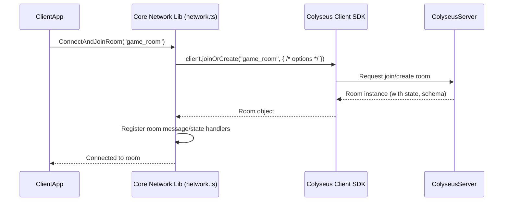
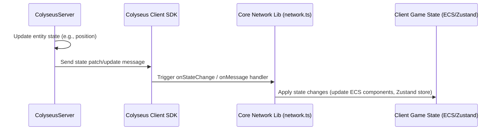

# Networking (Colyseus - Phase 4)

This document outlines the planned integration with Colyseus for multiplayer features.

## Overview

- **Framework:** Colyseus (Server + Client JS SDK).
- **Goal:** Enable basic real-time multiplayer functionality.
- **Core Integration:** `src/core/lib/network.ts` will likely handle client-side connection management.

## Architecture

- **Server:** Detail the planned Colyseus server setup (Rooms, State Synchronization).
- **Client:** Explain how the client connects to rooms and receives/sends data.
- **State Synchronization:** Describe the strategy for synchronizing entity state (positions, rotations, game-specific data) between server and clients. Potentially leveraging Colyseus Schema or custom mechanisms.

## Core Features

- **Connection Management:** Handling connection, disconnection, room joining/leaving.
- **Entity Spawning/Despawning:** Synchronizing the creation and destruction of networked entities.
- **Basic State Sync:** Initial focus on synchronizing essential entity transforms.

## Usage

- **Networked Components:** How ECS components or React components will interact with the networking layer.
- **Sending Messages:** Examples of sending client->server messages or RPCs.
- **Handling Server Updates:** How the client applies state updates received from the server.

## Connection Flow Example

## State Synchronization Example (Server -> Client)

