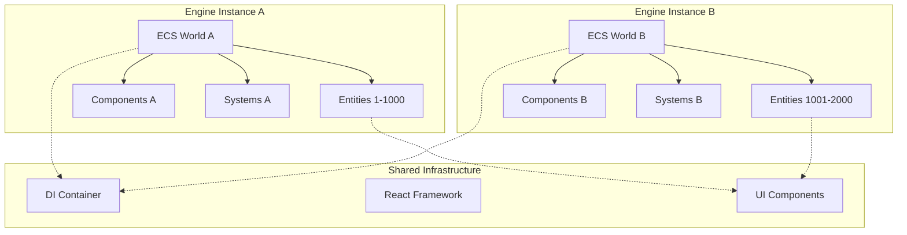

# Multi-Instance ECS Architecture

## Overview

This document describes the multi-instance Entity Component System (ECS) architecture that enables running multiple isolated game engines simultaneously. This capability unlocks new use cases like multi-scene editing, parallel simulation, and advanced testing scenarios.

## Core Concepts

### Instance Isolation

Each engine instance operates in complete isolation:

```typescript
interface IEngineInstance {
  world: ECSWorld;           // Isolated BitECS world
  entityManager: EntityManager;     // Separate entity lifecycle
  componentManager: ComponentManager; // Independent component storage
  container: Container;      // Scoped dependency injection
  dispose: () => void;       // Cleanup mechanism
}
```

**Isolation Guarantees:**
- **Entity ID Space**: Each instance has separate entity ID allocation
- **Component Storage**: Components are stored in instance-specific arrays
- **System Execution**: Systems operate only on their instance's entities
- **Memory Space**: No shared mutable state between instances

### World Separation



## Use Cases

### Multi-Scene Editing

```tsx
function MultiSceneEditor() {
  return (
    <div className="editor-layout">
      <div className="scene-tabs">
        <EngineProvider key="scene-a">
          <SceneEditor name="Main Scene" />
        </EngineProvider>

        <EngineProvider key="scene-b">
          <SceneEditor name="UI Scene" />
        </EngineProvider>
      </div>
    </div>
  );
}
```

**Benefits:**
- Edit multiple scenes simultaneously
- Copy/paste entities between scenes
- Compare different scene configurations
- Parallel asset loading and processing

### Preview Windows

```tsx
function EditorWithPreview() {
  const [sceneData, setSceneData] = useState(null);

  return (
    <div className="layout-split">
      <EngineProvider>
        <MainEditor onSceneChange={setSceneData} />
      </EngineProvider>

      <EngineProvider>
        <PreviewWindow sceneData={sceneData} />
      </EngineProvider>
    </div>
  );
}
```

**Features:**
- Real-time preview of changes
- Different camera angles/settings
- Performance comparison views
- A/B testing capabilities

### Parallel Simulation

```tsx
function SimulationComparison() {
  const scenarios = ['scenario-a', 'scenario-b', 'scenario-c'];

  return (
    <div className="simulation-grid">
      {scenarios.map(scenario => (
        <EngineProvider key={scenario}>
          <SimulationRunner
            scenario={scenario}
            timeScale={1.0}
            autoRun={true}
          />
        </EngineProvider>
      ))}
    </div>
  );
}
```

**Applications:**
- Algorithm comparison
- Parameter optimization
- Stress testing
- Batch processing

## Technical Implementation

### Entity ID Management

Each instance maintains separate entity ID spaces:

```typescript
class EntityManager {
  private entityIdCounter: number = 0;
  private instanceId: string;

  constructor(instanceId: string) {
    this.instanceId = instanceId;
    // Entity IDs are scoped to instance
    this.entityIdCounter = 0;
  }

  createEntity(name: string): IEntity {
    const id = this.entityIdCounter++;
    // ID is unique within this instance only
    return { id, name, instanceId: this.instanceId };
  }
}
```

### Component Storage Isolation

Components are stored in instance-specific structures:

```typescript
class ComponentManager {
  private components: Map<ComponentType, ComponentStore>;
  private world: IWorld; // Instance-specific BitECS world

  constructor(world: IWorld) {
    this.world = world;
    this.components = new Map();
  }

  addComponent<T>(entityId: EntityId, type: ComponentType, data: T) {
    // Component added only to this instance's world
    addComponent(this.world, getComponentSchema(type), entityId);
    this.setComponentData(entityId, type, data);
  }
}
```

### System Execution Context

Systems operate only within their instance context:

```typescript
class RenderSystem {
  private world: IWorld;
  private entityManager: EntityManager;

  constructor(world: IWorld, entityManager: EntityManager) {
    this.world = world;
    this.entityManager = entityManager;
  }

  update(deltaTime: number) {
    // Query only entities from this instance's world
    const renderableEntities = query(this.world, [Transform, MeshRenderer]);

    renderableEntities.forEach(entityId => {
      // Process only entities belonging to this instance
      this.renderEntity(entityId);
    });
  }
}
```

## Performance Considerations

### Memory Usage

Per-instance memory overhead:

```typescript
interface MemoryProfile {
  baseOverhead: '~50KB';      // Container + managers
  entityStorage: '~1KB/1000'; // Entity metadata
  componentStorage: '~5KB/1000'; // Component data
  systemOverhead: '~20KB';     // System instances
  totalPerInstance: '~75KB + entities';
}
```

### CPU Performance

Execution characteristics:

| Operation | Single Instance | Multiple Instances | Notes |
|-----------|----------------|-------------------|-------|
| Entity Creation | 100μs | 100μs per instance | Linear scaling |
| Component Queries | 50μs | 50μs per instance | No cross-instance overhead |
| System Updates | 1ms | 1ms per instance | Parallel execution possible |
| Rendering | 16ms | 16ms total | Shared GPU resources |

### Optimization Strategies

#### Shared Resources

```typescript
// Share expensive resources across instances
class SharedResourceManager {
  private static textureCache = new Map<string, Texture>();
  private static meshCache = new Map<string, Mesh>();

  static getTexture(path: string): Texture {
    if (!this.textureCache.has(path)) {
      this.textureCache.set(path, loadTexture(path));
    }
    return this.textureCache.get(path)!;
  }
}
```

#### Selective Updates

```typescript
class InstanceManager {
  private instances: Map<string, IEngineInstance> = new Map();
  private activeInstances: Set<string> = new Set();

  setInstanceActive(instanceId: string, active: boolean) {
    if (active) {
      this.activeInstances.add(instanceId);
    } else {
      this.activeInstances.delete(instanceId);
    }
  }

  updateAll(deltaTime: number) {
    // Only update active instances
    for (const instanceId of this.activeInstances) {
      const instance = this.instances.get(instanceId);
      instance?.update(deltaTime);
    }
  }
}
```

#### Batch Operations

```typescript
class BatchEntityCreator {
  createEntitiesAcrossInstances(
    instances: IEngineInstance[],
    entityData: IEntityData[]
  ) {
    // Batch create entities to minimize overhead
    instances.forEach((instance, i) => {
      const batch = entityData.slice(i * 100, (i + 1) * 100);
      instance.entityManager.createEntitiesBatch(batch);
    });
  }
}
```

## Data Synchronization

### Cross-Instance Communication

While instances are isolated, controlled communication is possible:

```typescript
interface IInstanceMessage {
  source: string;
  target: string;
  type: 'entity-copy' | 'scene-sync' | 'asset-shared';
  payload: unknown;
}

class InstanceMessageBus {
  private listeners: Map<string, MessageHandler[]> = new Map();

  sendMessage(message: IInstanceMessage) {
    const handlers = this.listeners.get(message.target) || [];
    handlers.forEach(handler => handler(message));
  }

  subscribe(instanceId: string, handler: MessageHandler) {
    const handlers = this.listeners.get(instanceId) || [];
    handlers.push(handler);
    this.listeners.set(instanceId, handlers);
  }
}
```

### Entity Transfer

```typescript
class EntityTransferService {
  copyEntityBetweenInstances(
    sourceInstance: IEngineInstance,
    targetInstance: IEngineInstance,
    entityId: EntityId
  ): EntityId {
    // Serialize entity from source
    const entityData = this.serializeEntity(sourceInstance, entityId);

    // Create entity in target
    const newEntityId = targetInstance.entityManager.createEntity(entityData.name);

    // Copy components
    entityData.components.forEach(component => {
      targetInstance.componentManager.addComponent(
        newEntityId,
        component.type,
        component.data
      );
    });

    return newEntityId;
  }

  private serializeEntity(instance: IEngineInstance, entityId: EntityId) {
    const entity = instance.entityManager.getEntity(entityId);
    const components = instance.componentManager.getComponentsForEntity(entityId);

    return {
      name: entity.name,
      components: components.map(c => ({
        type: c.type,
        data: structuredClone(c.data) // Deep copy
      }))
    };
  }
}
```

## Testing Architecture

### Isolated Test Environments

```typescript
describe('Multi-Instance Tests', () => {
  let instanceA: IEngineInstance;
  let instanceB: IEngineInstance;

  beforeEach(() => {
    instanceA = createEngineInstance();
    instanceB = createEngineInstance();
  });

  afterEach(() => {
    instanceA.dispose();
    instanceB.dispose();
  });

  it('should maintain entity isolation', () => {
    const entityA = instanceA.entityManager.createEntity('Entity A');
    const entityB = instanceB.entityManager.createEntity('Entity B');

    expect(instanceA.entityManager.getEntityCount()).toBe(1);
    expect(instanceB.entityManager.getEntityCount()).toBe(1);

    // Entities should not exist in other instances
    expect(instanceA.entityManager.getEntity(entityB.id)).toBeUndefined();
    expect(instanceB.entityManager.getEntity(entityA.id)).toBeUndefined();
  });

  it('should support parallel execution', async () => {
    const promises = [
      simulateGameLoop(instanceA, 1000), // 1 second simulation
      simulateGameLoop(instanceB, 1000)
    ];

    const results = await Promise.all(promises);

    expect(results[0]).not.toEqual(results[1]); // Different outcomes
    expect(results[0].frameCount).toBeGreaterThan(0);
    expect(results[1].frameCount).toBeGreaterThan(0);
  });
});
```

### Performance Testing

```typescript
describe('Performance Tests', () => {
  it('should scale linearly with instance count', () => {
    const instances = Array.from({ length: 10 }, () => createEngineInstance());

    const startTime = performance.now();

    // Create 100 entities in each instance
    instances.forEach(instance => {
      for (let i = 0; i < 100; i++) {
        instance.entityManager.createEntity(`Entity ${i}`);
      }
    });

    const endTime = performance.now();
    const executionTime = endTime - startTime;

    expect(executionTime).toBeLessThan(100); // Should complete in <100ms

    instances.forEach(instance => instance.dispose());
  });

  it('should maintain performance under load', () => {
    const instance = createEngineInstance();

    // Create large number of entities
    for (let i = 0; i < 10000; i++) {
      const entity = instance.entityManager.createEntity(`Entity ${i}`);
      instance.componentManager.addComponent(entity.id, 'Transform', {
        position: [Math.random(), Math.random(), Math.random()],
        rotation: [0, 0, 0],
        scale: [1, 1, 1]
      });
    }

    const startTime = performance.now();

    // Query all entities with Transform
    const entities = instance.componentManager.getEntitiesWithComponent('Transform');

    const endTime = performance.now();

    expect(entities.length).toBe(10000);
    expect(endTime - startTime).toBeLessThan(10); // Query should be fast

    instance.dispose();
  });
});
```

## Best Practices

### Instance Lifecycle Management

```typescript
class InstancePool {
  private available: IEngineInstance[] = [];
  private active: Map<string, IEngineInstance> = new Map();

  acquire(id: string): IEngineInstance {
    let instance = this.available.pop();
    if (!instance) {
      instance = createEngineInstance();
    }

    this.active.set(id, instance);
    return instance;
  }

  release(id: string) {
    const instance = this.active.get(id);
    if (instance) {
      instance.reset(); // Clear but don't dispose
      this.available.push(instance);
      this.active.delete(id);
    }
  }

  dispose() {
    [...this.available, ...this.active.values()].forEach(instance => {
      instance.dispose();
    });
    this.available = [];
    this.active.clear();
  }
}
```

### Resource Management

```typescript
class ResourceTracker {
  private instanceResources: Map<string, ResourceUsage> = new Map();

  trackInstance(instanceId: string, instance: IEngineInstance) {
    this.instanceResources.set(instanceId, {
      entityCount: 0,
      componentCount: 0,
      memoryUsage: 0,
      lastUpdate: Date.now()
    });

    // Monitor resource usage
    const monitor = setInterval(() => {
      this.updateResourceUsage(instanceId, instance);
    }, 1000);

    return () => clearInterval(monitor);
  }

  private updateResourceUsage(instanceId: string, instance: IEngineInstance) {
    const usage = this.instanceResources.get(instanceId);
    if (usage) {
      usage.entityCount = instance.entityManager.getEntityCount();
      usage.componentCount = instance.componentManager.getComponentCount();
      usage.memoryUsage = this.estimateMemoryUsage(instance);
      usage.lastUpdate = Date.now();
    }
  }
}
```

### Error Isolation

```typescript
class InstanceErrorBoundary {
  private errorHandlers: Map<string, ErrorHandler> = new Map();

  wrapInstance(instanceId: string, instance: IEngineInstance): IEngineInstance {
    return new Proxy(instance, {
      get(target, prop) {
        const value = target[prop as keyof IEngineInstance];

        if (typeof value === 'function') {
          return (...args: unknown[]) => {
            try {
              return value.apply(target, args);
            } catch (error) {
              this.handleInstanceError(instanceId, error);
              throw error;
            }
          };
        }

        return value;
      }
    });
  }

  private handleInstanceError(instanceId: string, error: Error) {
    const handler = this.errorHandlers.get(instanceId);
    if (handler) {
      handler(error);
    } else {
      console.error(`Unhandled error in instance ${instanceId}:`, error);
    }
  }
}
```

This multi-instance architecture provides a robust foundation for complex applications requiring multiple isolated ECS environments while maintaining performance and reliability.