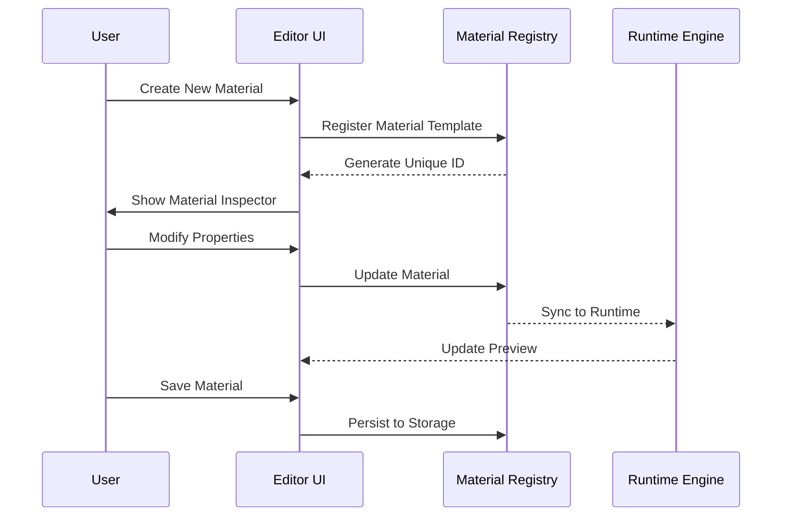
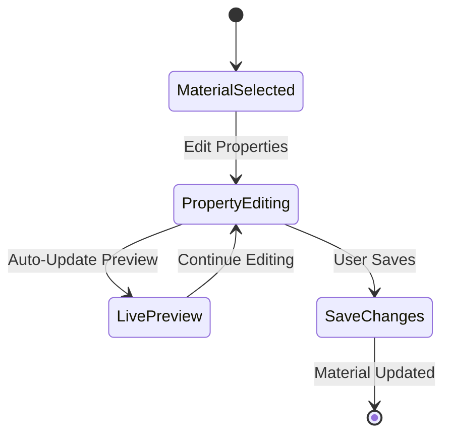

# Materials System Architecture

## Overview

The Materials System provides a comprehensive, type-safe material management architecture for the Vibe Coder 3D engine. It supports both runtime material creation/modification and editor-based material authoring with full serialization support.

## Core Components

### 1. Material Registry (`MaterialRegistry.ts`)

The central hub for material management:

```typescript
interface IMaterialRegistry {
  register(material: IMaterial): string;
  get(id: string): IMaterial | undefined;
  getAll(): Map<string, IMaterial>;
  update(id: string, updates: Partial<IMaterial>): void;
  remove(id: string): boolean;
  clone(id: string, newName?: string): string;
}
```

**Key Features:**

- **Type Safety**: Full TypeScript support with Zod schemas
- **Serialization**: Materials serialize to/from JSON with full fidelity
- **Validation**: Runtime validation of material properties
- **Performance**: Efficient lookups and caching
- **Editor Integration**: Seamless editor/runtime synchronization

### 2. Material Types (`Material.types.ts`)

Comprehensive type system defining material structure:

```typescript
interface IMaterial {
  id: string;
  name: string;
  type: 'standard' | 'phong' | 'lambert' | 'basic' | 'physical';
  properties: IMaterialProperties;
  textures: IMaterialTextures;
  metadata: IMaterialMetadata;
}

interface IMaterialProperties {
  color?: string | number;
  metalness?: number;
  roughness?: number;
  emissive?: string | number;
  emissiveIntensity?: number;
  transparent?: boolean;
  opacity?: number;
  // ... additional properties
}
```

### 3. Material Converter (`MaterialConverter.ts`)

Handles conversion between different material representations:

```typescript
interface IMaterialConverter {
  fromThreeJS(material: THREE.Material): IMaterial;
  toThreeJS(material: IMaterial): THREE.Material;
  fromJSON(data: unknown): IMaterial;
  toJSON(material: IMaterial): unknown;
  validate(material: IMaterial): ValidationResult;
}
```

## Editor Integration

### Materials Panel (`src/editor/components/panels/MaterialsPanel/`)

Provides a complete material authoring interface:

```typescript
interface IMaterialsPanelProps {
  selectedMaterialId?: string;
  onMaterialSelect?: (id: string) => void;
  onMaterialCreate?: (material: IMaterial) => void;
  onMaterialUpdate?: (id: string, updates: Partial<IMaterial>) => void;
}
```

**Features:**

- **Material Browser**: Grid/list view of all materials
- **Property Inspector**: Real-time editing of material properties
- **Preview System**: Live preview of material changes
- **Template System**: Pre-configured material templates
- **Texture Management**: Drag-and-drop texture assignment
- **Export/Import**: Material library management

### Material Inspector (`src/editor/components/materials/MaterialInspector.tsx`)

Advanced material editing interface:

```typescript
interface IMaterialInspectorProps {
  material: IMaterial;
  onChange: (updates: Partial<IMaterial>) => void;
  preview?: boolean;
  advanced?: boolean;
}
```

**Advanced Features:**

- **Shader Graph**: Visual shader node editing (planned)
- **Procedural Materials**: Noise, gradient, and pattern generation
- **Animation Support**: Time-based material properties
- **Layer System**: Complex material layering
- **Real-time Preview**: WYSIWYG editing experience

## Runtime Integration

### Material Hooks

```typescript
// Core material access hook
export function useMaterial(id: string): IMaterial | undefined;

// Material creation and management
export function useMaterialManager(): {
  create: (template?: IMaterial) => string;
  update: (id: string, updates: Partial<IMaterial>) => void;
  remove: (id: string) => void;
  clone: (id: string) => string;
};

// Material serialization
export function useMaterialSerialization(): {
  exportMaterial: (id: string) => string;
  importMaterial: (json: string) => string;
  exportLibrary: () => string;
  importLibrary: (json: string) => void;
};
```

### React Integration

```typescript
// Declarative material usage in React components
<MaterialProvider materialId="my-material">
  <mesh>
    <boxGeometry />
    <MaterialRenderer /> {/* Automatically applies material */}
  </mesh>
</MaterialProvider>

// Hook-based material application
const MyComponent = () => {
  const material = useMaterial('my-material');
  return (
    <mesh material={material?.threeMaterial}>
      <boxGeometry />
    </mesh>
  );
};
```

## Serialization System

### Material Serialization (`MaterialSerializer.ts`)

Full-featured serialization with versioning:

```typescript
interface IMaterialSerialization {
  serialize(material: IMaterial): ISerializedMaterial;
  deserialize(data: ISerializedMaterial): IMaterial;
  migrate(fromVersion: string, toVersion: string): ISerializedMaterial;
  validate(data: unknown): ValidationResult;
}
```

**Serialization Features:**

- **Version Management**: Automatic migration between versions
- **Texture References**: Proper handling of texture dependencies
- **Optimization**: Compression and delta serialization
- **Validation**: Schema validation with detailed error reporting
- **Streaming**: Support for large material libraries

## Performance Optimizations

### Material Pooling

```typescript
// Efficient material reuse
class MaterialPool {
  private static pool = new Map<string, THREE.Material[]>();

  static get(material: IMaterial): THREE.Material {
    const key = this.getMaterialKey(material);
    const pooled = this.pool.get(key)?.pop();
    return pooled || this.createMaterial(material);
  }

  static release(material: THREE.Material): void {
    // Return to pool for reuse
  }
}
```

### Instancing Support

```typescript
// GPU instancing for performance
interface IMaterialInstancing {
  createInstances(count: number): InstancedMaterial;
  updateInstance(index: number, properties: Partial<IMaterialProperties>): void;
  optimizeForInstancing(material: IMaterial): IMaterial;
}
```

## Editor Workflow

### Material Creation Flow



### Material Editing Workflow



## Integration with Other Systems

### ECS Integration

```typescript
// Material component for entities
export const MaterialComponent = defineComponent({
  materialId: Types.ui32, // Reference to material registry
  materialHash: Types.ui32, // For fast lookups
  instanceId: Types.ui32, // For instanced materials
});
```

### Asset Pipeline Integration

```typescript
// Material references in asset manifest
interface IMaterialAsset {
  type: 'material';
  id: string;
  source: 'editor' | 'imported' | 'procedural';
  dependencies: string[]; // Texture/shader dependencies
  metadata: {
    author: string;
    tags: string[];
    usage: 'character' | 'environment' | 'ui';
  };
}
```

## Advanced Features

### Procedural Material Generation

```typescript
interface IProceduralMaterial {
  generateNoise(config: INoiseConfig): IMaterial;
  generateGradient(config: IGradientConfig): IMaterial;
  generatePattern(config: IPatternConfig): IMaterial;
  combine(materials: IMaterial[], operation: 'mix' | 'add' | 'multiply'): IMaterial;
}
```

### Material Animation System

```typescript
interface IMaterialAnimation {
  animate(material: IMaterial, time: number): IMaterial;
  createKeyframe(material: IMaterial, time: number, properties: Partial<IMaterialProperties>): void;
  play(materialId: string, animationId: string): void;
  pause(materialId: string, animationId: string): void;
}
```

## Testing Architecture

```typescript
describe('Materials System', () => {
  describe('MaterialRegistry', () => {
    it('should register and retrieve materials', () => {
      const registry = new MaterialRegistry();
      const material = createTestMaterial();
      const id = registry.register(material);
      expect(registry.get(id)).toEqual(material);
    });

    it('should handle serialization round-trips', () => {
      const material = createComplexMaterial();
      const serialized = MaterialSerializer.serialize(material);
      const deserialized = MaterialSerializer.deserialize(serialized);
      expect(deserialized).toEqual(material);
    });
  });
});
```

## Future Enhancements

### Planned Features

1. **Visual Shader Graph**: Node-based shader creation
2. **Material Libraries**: Community-contributed material packs
3. **Real-time Collaboration**: Multi-user material editing
4. **AI-Powered Materials**: Generate materials from descriptions
5. **Material Market**: Asset store integration
6. **Performance Profiling**: Material performance analysis tools

### Extension Points

```typescript
interface IMaterialExtension {
  name: string;
  version: string;
  materialTypes: string[];
  editorComponents: React.ComponentType[];
  runtimeHooks: Function[];
  serializationHandlers: SerializationHandler[];
}
```

## Performance Characteristics

### Memory Usage

- **Material Registry**: ~50KB base + 1KB per material
- **Serialization Cache**: Configurable size with LRU eviction
- **Preview Textures**: Shared texture atlas for efficiency

### Runtime Performance

- **Material Access**: O(1) hash-based lookups
- **Property Updates**: O(log n) tree-based updates
- **Serialization**: ~2ms for complex materials
- **Preview Updates**: <16ms for real-time editing

This materials system provides a solid foundation for advanced material authoring while maintaining performance and type safety throughout the editor and runtime environments.
