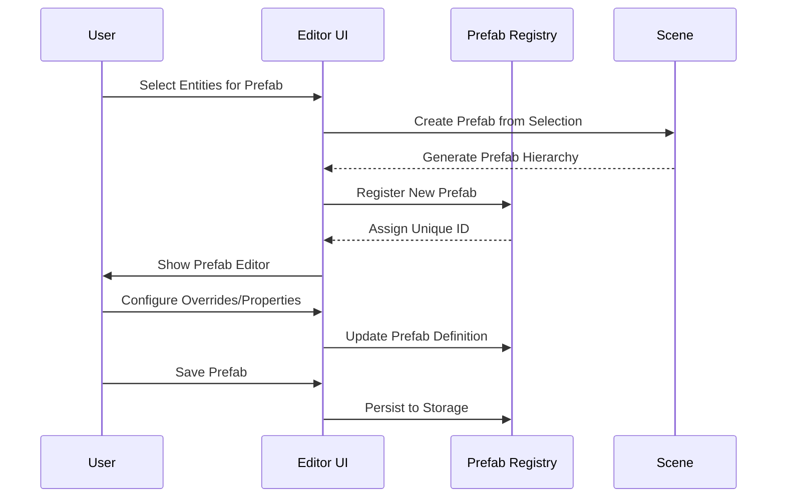
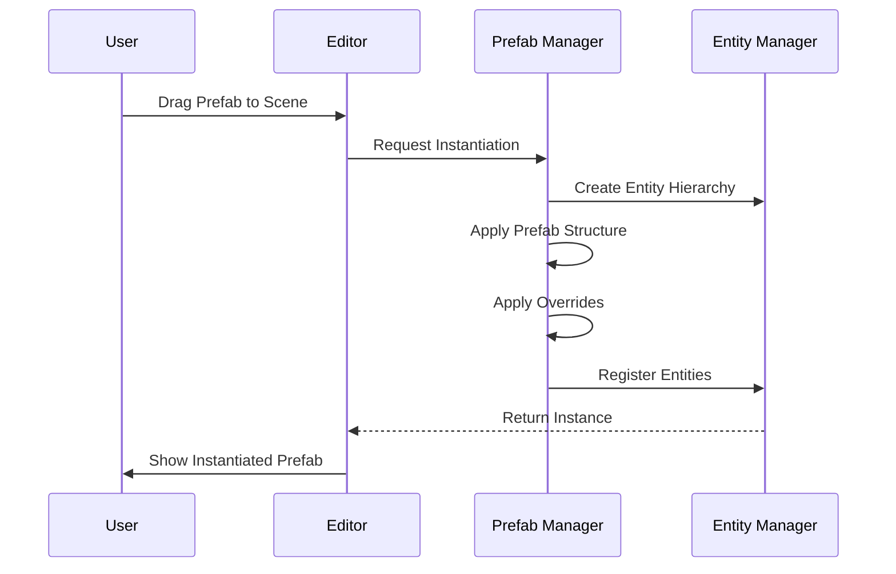

# Prefabs System Architecture

## Overview

The Prefabs System provides a Unity-like prefab architecture for reusable, configurable game object templates. It supports nested prefabs, overrides, instantiation, and full serialization for both editor and runtime use.

## Core Components

### 1. Prefab Registry (`PrefabRegistry.ts`)

Central management system for all prefabs:

```typescript
interface IPrefabRegistry {
  register(prefab: IPrefab): string;
  get(id: string): IPrefab | undefined;
  getAll(): Map<string, IPrefab>;
  update(id: string, updates: Partial<IPrefab>): void;
  remove(id: string): boolean;
  clone(id: string, newName?: string): string;
  findByTag(tag: string): IPrefab[];
  findByComponent(componentType: string): IPrefab[];
}
```

**Key Features:**

- **Hierarchical Storage**: Tree-based organization with categories
- **Search & Filtering**: Multi-criteria prefab discovery
- **Dependency Tracking**: Automatic dependency resolution
- **Version Management**: Prefab versioning and migration
- **Performance**: Efficient lookup and caching

### 2. Prefab Types (`Prefab.types.ts`)

Comprehensive type system for prefab definitions:

```typescript
interface IPrefab {
  id: string;
  name: string;
  version: string;
  rootEntity: IEntity;
  overrides: IPrefabOverride[];
  metadata: IPrefabMetadata;
  dependencies: IPrefabDependency[];
}

interface IPrefabOverride {
  targetPath: string; // Entity path within prefab hierarchy
  propertyPath: string; // Property path to override
  value: unknown;
  type: 'property' | 'component' | 'entity';
}

interface IPrefabMetadata {
  author: string;
  description: string;
  tags: string[];
  category: string;
  thumbnail?: string;
  usage: 'character' | 'environment' | 'ui' | 'effect';
}
```

### 3. Prefab Manager (`PrefabManager.ts`)

Core management and instantiation logic:

```typescript
interface IPrefabManager {
  instantiate(prefabId: string, position?: Vector3, rotation?: Vector3): IEntity;
  instantiateWithOverrides(
    prefabId: string,
    overrides: IPrefabOverride[],
    parent?: IEntity,
  ): IEntity;
  createVariant(basePrefabId: string, overrides: IPrefabOverride[]): string;
  updatePrefabInstance(instanceId: string, updates: Partial<IEntity>): void;
  destroyPrefabInstance(instanceId: string): void;
  getPrefabInstance(prefabId: string, instanceId: string): IEntity | undefined;
}
```

## Editor Integration

### Prefabs Panel (`src/editor/components/panels/PrefabsPanel/`)

Complete prefab authoring and management interface:

```typescript
interface IPrefabsPanelProps {
  selectedPrefabId?: string;
  onPrefabSelect?: (id: string) => void;
  onPrefabCreate?: (prefab: IPrefab) => void;
  onPrefabUpdate?: (id: string, updates: Partial<IPrefab>) => void;
}
```

**Features:**

- **Prefab Browser**: Grid/list view with thumbnails and metadata
- **Hierarchy View**: Visual representation of prefab structure
- **Override Editor**: Property and component override management
- **Instantiation Tools**: Drag-and-drop instantiation with gizmos
- **Variant Creation**: Create variants from existing prefabs
- **Batch Operations**: Bulk prefab management tools

### Prefab Inspector (`src/editor/components/prefabs/PrefabInspector.tsx`)

Advanced prefab editing interface:

```typescript
interface IPrefabInspectorProps {
  prefab: IPrefab;
  onChange: (updates: Partial<IPrefab>) => void;
  mode: 'edit' | 'overrides' | 'instances';
}
```

**Advanced Features:**

- **Nested Editing**: Edit nested prefab hierarchies
- **Override Visualization**: Visual diff between base and variants
- **Instance Management**: Track and modify all instances
- **Dependency Graph**: Visual dependency relationships
- **Performance Monitoring**: Instance count and memory usage

## Runtime Integration

### Prefab Hooks

```typescript
// Core prefab access and management
export function usePrefab(prefabId: string): IPrefab | undefined;

export function usePrefabManager(): {
  instantiate: (prefabId: string, options?: IInstantiationOptions) => IEntity;
  createVariant: (baseId: string, overrides: IPrefabOverride[]) => string;
  updateInstance: (instanceId: string, updates: Partial<IEntity>) => void;
  destroyInstance: (instanceId: string) => void;
  getInstances: (prefabId: string) => IEntity[];
};

// Prefab serialization
export function usePrefabSerialization(): {
  exportPrefab: (id: string) => string;
  importPrefab: (json: string) => string;
  exportLibrary: () => string;
  importLibrary: (json: string) => void;
};
```

### React Integration

```typescript
// Declarative prefab instantiation
<PrefabInstance
  prefabId="player-character"
  position={[0, 0, 0]}
  overrides={[
    { targetPath: "Transform.position", value: [1, 2, 3] }
  ]}
/>

// Hook-based instantiation
const MyComponent = () => {
  const { instantiate } = usePrefabManager();
  const playerEntity = instantiate('player-character', {
    position: [0, 0, 0],
    overrides: [
      { targetPath: "MeshRenderer.materialId", value: "custom-material" }
    ]
  });

  return <EntityRenderer entity={playerEntity} />;
};
```

## Serialization System

### Prefab Serialization (`PrefabSerializer.ts`)

Advanced serialization with dependency management:

```typescript
interface IPrefabSerialization {
  serialize(prefab: IPrefab): ISerializedPrefab;
  deserialize(data: ISerializedPrefab, dependencies?: Map<string, unknown>): IPrefab;
  serializeWithDependencies(prefab: IPrefab): ISerializedPrefabLibrary;
  deserializeLibrary(data: ISerializedPrefabLibrary): Map<string, IPrefab>;
  validate(data: unknown): ValidationResult;
}
```

**Serialization Features:**

- **Dependency Resolution**: Automatic resolution of nested dependencies
- **Circular Reference Detection**: Prevents serialization loops
- **Incremental Updates**: Delta serialization for efficiency
- **Version Migration**: Automatic format upgrades
- **Compression**: Optimized storage format

## Prefab Override System

### Override Types

```typescript
type PrefabOverride =
  | IPropertyOverride
  | IComponentOverride
  | IEntityOverride
  | INestedPrefabOverride;

interface IPropertyOverride {
  type: 'property';
  targetPath: string; // e.g., "Transform.position.y"
  value: unknown;
  operation?: 'set' | 'add' | 'multiply';
}

interface IComponentOverride {
  type: 'component';
  targetPath: string; // e.g., "MeshRenderer"
  componentType: string;
  properties: Record<string, unknown>;
  enabled?: boolean;
}
```

### Override Application

```typescript
class PrefabOverrideApplier {
  static applyOverrides(prefab: IPrefab, overrides: PrefabOverride[]): IEntity {
    const instance = this.clonePrefabHierarchy(prefab.rootEntity);

    for (const override of overrides) {
      switch (override.type) {
        case 'property':
          this.applyPropertyOverride(instance, override);
          break;
        case 'component':
          this.applyComponentOverride(instance, override);
          break;
        case 'entity':
          this.applyEntityOverride(instance, override);
          break;
      }
    }

    return instance;
  }
}
```

## Performance Optimizations

### Prefab Pooling

```typescript
// Efficient prefab instance reuse
class PrefabPool {
  private static pools = new Map<string, IEntity[]>();

  static acquire(prefabId: string): IEntity | null {
    const pool = this.pools.get(prefabId);
    return pool?.pop() || null;
  }

  static release(prefabId: string, instance: IEntity): void {
    let pool = this.pools.get(prefabId);
    if (!pool) {
      pool = [];
      this.pools.set(prefabId, pool);
    }
    pool.push(instance);
  }

  static prewarm(prefabId: string, count: number): void {
    const instances = [];
    for (let i = 0; i < count; i++) {
      instances.push(this.createInstance(prefabId));
    }
    this.pools.set(prefabId, instances);
  }
}
```

### Instance Management

```typescript
class PrefabInstanceManager {
  private instances = new Map<string, Set<IEntity>>();
  private reverseLookup = new WeakMap<IEntity, string>();

  registerInstance(prefabId: string, instance: IEntity): void {
    if (!this.instances.has(prefabId)) {
      this.instances.set(prefabId, new Set());
    }
    this.instances.get(prefabId)!.add(instance);
    this.reverseLookup.set(instance, prefabId);
  }

  unregisterInstance(instance: IEntity): string | undefined {
    const prefabId = this.reverseLookup.get(instance);
    if (prefabId) {
      this.instances.get(prefabId)?.delete(instance);
      this.reverseLookup.delete(instance);
    }
    return prefabId;
  }

  getInstances(prefabId: string): IEntity[] {
    return Array.from(this.instances.get(prefabId) || []);
  }

  getPrefabId(instance: IEntity): string | undefined {
    return this.reverseLookup.get(instance);
  }
}
```

## Editor Workflow

### Prefab Creation Flow



### Prefab Instantiation Flow



## Integration with Other Systems

### ECS Integration

```typescript
// Prefab component for tracking instances
export const PrefabInstance = defineComponent({
  prefabId: Types.ui32, // Reference to original prefab
  instanceId: Types.ui32, // Unique instance identifier
  overridesHash: Types.ui32, // Hash of applied overrides
  isDirty: Types.ui8, // Flag for pending updates
});
```

### Asset Pipeline Integration

```typescript
// Prefab references in asset manifest
interface IPrefabAsset {
  type: 'prefab';
  id: string;
  source: 'editor' | 'imported' | 'procedural';
  dependencies: string[]; // Nested prefab dependencies
  metadata: {
    complexity: number; // Entity count for performance estimation
    category: string;
    tags: string[];
  };
}
```

## Advanced Features

### Nested Prefabs

```typescript
interface INestedPrefabSupport {
  createNestedPrefab(basePrefabId: string, nestedPrefabId: string, attachPoint: string): string;
  resolveNestedOverrides(prefabId: string, overrides: PrefabOverride[]): ResolvedOverrides[];
  flattenNestedPrefab(prefabId: string): IPrefab; // Convert to single-level prefab
  updateNestedInstance(instanceId: string, updates: PrefabUpdate[]): void;
}
```

### Prefab Variants

```typescript
interface IPrefabVariants {
  createVariant(basePrefabId: string, overrides: PrefabOverride[]): string;
  getVariantChain(prefabId: string): string[]; // Get inheritance chain
  mergeVariants(variantIds: string[]): string; // Combine multiple variants
  diffVariants(prefabAId: string, prefabBId: string): PrefabOverride[];
}
```

### Procedural Prefabs

```typescript
interface IProceduralPrefabs {
  generateFromTemplate(templateId: string, parameters: Record<string, unknown>): string;
  generateFromRules(rules: IPrefabGenerationRule[]): string;
  mutatePrefab(prefabId: string, mutations: IPrefabMutation[]): string;
}
```

## Testing Architecture

```typescript
describe('Prefabs System', () => {
  describe('PrefabRegistry', () => {
    it('should register and retrieve prefabs', () => {
      const registry = new PrefabRegistry();
      const prefab = createTestPrefab();
      const id = registry.register(prefab);
      expect(registry.get(id)).toEqual(prefab);
    });

    it('should handle nested prefab dependencies', () => {
      const parentPrefab = createNestedPrefab();
      const childPrefab = createChildPrefab();

      const registry = new PrefabRegistry();
      registry.register(childPrefab);
      registry.register(parentPrefab);

      const resolved = registry.resolveDependencies(parentPrefab.id);
      expect(resolved.size).toBe(2);
    });
  });

  describe('PrefabInstantiation', () => {
    it('should instantiate prefabs correctly', () => {
      const manager = new PrefabManager();
      const prefab = createTestPrefab();
      const instance = manager.instantiate(prefab.id);

      expect(instance).toBeDefined();
      expect(manager.getPrefabId(instance)).toBe(prefab.id);
    });

    it('should apply overrides during instantiation', () => {
      const manager = new PrefabManager();
      const overrides = [{ type: 'property', targetPath: 'Transform.position.y', value: 10 }];

      const instance = manager.instantiateWithOverrides(prefab.id, overrides);
      expect(instance.transform.position.y).toBe(10);
    });
  });
});
```

## Future Enhancements

### Planned Features

1. **Prefab Inheritance**: Visual inheritance trees with override propagation
2. **Smart Overrides**: AI-assisted override suggestions
3. **Prefab Libraries**: Community prefab sharing and marketplace
4. **Procedural Generation**: Rule-based prefab creation
5. **Performance Analytics**: Prefab performance profiling
6. **Collaborative Editing**: Multi-user prefab editing

### Extension Points

```typescript
interface IPrefabExtension {
  name: string;
  version: string;
  prefabTypes: string[];
  instantiationHandlers: InstantiationHandler[];
  serializationHandlers: SerializationHandler[];
  editorComponents: React.ComponentType[];
}
```

## Performance Characteristics

### Memory Usage

- **Prefab Registry**: ~100KB base + 5KB per prefab + 1KB per instance
- **Instance Tracking**: WeakMap-based tracking with automatic cleanup
- **Serialization Cache**: Configurable LRU cache for frequently accessed prefabs

### Runtime Performance

- **Instantiation**: ~2ms for simple prefabs, ~10ms for complex nested prefabs
- **Override Application**: ~1ms per 100 overrides
- **Dependency Resolution**: O(log n) tree traversal for nested prefabs
- **Memory Management**: Automatic pooling reduces GC pressure

This prefabs system provides a robust foundation for reusable game object templates while maintaining performance and flexibility for complex game development workflows.
