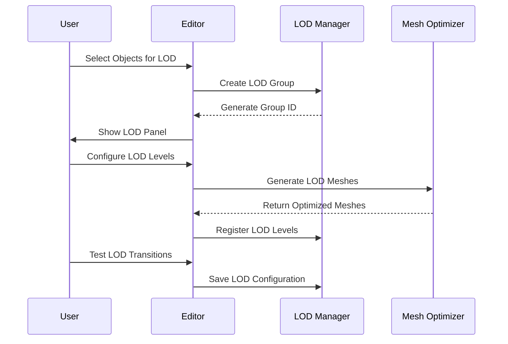
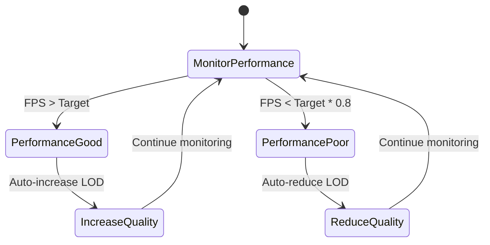

# LOD (Level of Detail) System Architecture

## Overview

The LOD System provides automatic quality adjustment based on distance, performance, and view requirements. It supports mesh simplification, material switching, culling, and dynamic quality scaling for optimal performance across different hardware capabilities.

## Core Components

### 1. LOD Manager (`LODManager.ts`)

Central coordination of all LOD operations:

```typescript
interface ILODManager {
  registerLODGroup(group: ILODGroup): string;
  unregisterLODGroup(id: string): void;
  updateLODGroups(camera: THREE.Camera, deltaTime: number): void;
  getLODLevel(groupId: string): number;
  setQualityPreset(preset: LODQualityPreset): void;
  setPerformanceTarget(target: PerformanceTarget): void;
  getPerformanceStats(): LODPerformanceStats;
}
```

**Key Features:**

- **Distance-based LOD**: Automatic LOD selection based on camera distance
- **Performance-based LOD**: Dynamic quality adjustment based on frame rate
- **Hysteresis**: Prevents rapid LOD switching with distance thresholds
- **Smooth Transitions**: Fade between LOD levels for visual continuity
- **Performance Monitoring**: Real-time performance tracking and adjustment

### 2. LOD Group (`LODGroup.ts`)

Defines LOD behavior for a group of objects:

```typescript
interface ILODGroup {
  id: string;
  bounds: THREE.Box3; // World-space bounding box
  lodLevels: ILODLevel[];
  strategy: LODStrategy;
  settings: ILODSettings;
}

interface ILODLevel {
  distance: number; // Distance threshold for this LOD
  meshes: THREE.Mesh[];
  materials: THREE.Material[];
  enabledComponents: string[]; // Component types to enable/disable
  quality: LODQuality;
}
```

### 3. LOD Settings (`LODSettings.ts`)

Configuration for LOD behavior:

```typescript
interface ILODSettings {
  // Distance-based settings
  minDistance: number;
  maxDistance: number;
  hysteresis: number; // Distance buffer to prevent switching

  // Performance-based settings
  targetFPS: number;
  adaptationSpeed: number; // How quickly to adjust quality

  // Quality settings
  qualityPreset: LODQualityPreset;
  enableCulling: boolean;
  enableImpostors: boolean;

  // Debug settings
  showLODLevels: boolean;
  showBounds: boolean;
}
```

## Editor Integration

### LOD Panel (`src/editor/components/panels/LODPanel.tsx`)

Visual LOD management interface:

```typescript
interface ILODPanelProps {
  selectedEntityIds: string[];
  onLODGroupCreate?: (group: ILODGroup) => void;
  onLODGroupUpdate?: (id: string, updates: Partial<ILODGroup>) => void;
  onLODLevelAdd?: (groupId: string, level: ILODLevel) => void;
}
```

**Features:**

- **LOD Group Browser**: Visual list of all LOD groups in the scene
- **Level Editor**: Create and configure LOD levels with distance thresholds
- **Preview Mode**: Real-time LOD preview with camera controls
- **Performance Monitor**: Live performance metrics and recommendations
- **Batch Operations**: Apply LOD settings to multiple objects
- **Import/Export**: LOD configuration sharing

### LOD Inspector (`src/editor/components/LODInspector.tsx`)

Detailed LOD configuration interface:

```typescript
interface ILODInspectorProps {
  lodGroup: ILODGroup;
  onChange: (updates: Partial<ILODGroup>) => void;
  previewMode?: boolean;
}
```

**Advanced Features:**

- **Mesh Optimization**: Automatic mesh decimation for LOD levels
- **Material Baking**: Combine materials for performance
- **Impostor Generation**: Billboard and sprite generation
- **Distance Calibration**: Interactive distance threshold setting
- **Performance Profiling**: LOD performance impact analysis

## Runtime Integration

### LOD Hooks

```typescript
// Core LOD management
export function useLODManager(): ILODManager;

// LOD group management
export function useLODGroup(groupId: string): ILODGroup | undefined;

export function useLODGroupManager(): {
  createGroup: (entities: IEntity[]) => string;
  updateGroup: (id: string, updates: Partial<ILODGroup>) => void;
  removeGroup: (id: string) => void;
  addLODLevel: (groupId: string, level: ILODLevel) => void;
  removeLODLevel: (groupId: string, levelIndex: number) => void;
};

// Performance-based LOD
export function usePerformanceLOD(): {
  currentQuality: LODQuality;
  targetFPS: number;
  setQuality: (quality: LODQuality) => void;
  getRecommendations: () => LODRecommendation[];
};
```

### React Integration

```typescript
// Automatic LOD application
<LODGroup
  bounds={entity.bounds}
  lodLevels={[
    { distance: 10, meshes: [highQualityMesh], materials: [highQualityMaterial] },
    { distance: 50, meshes: [mediumQualityMesh], materials: [mediumQualityMaterial] },
    { distance: 100, meshes: [lowQualityMesh], materials: [lowQualityMaterial] }
  ]}
/>

// Hook-based LOD management
const MyComponent = () => {
  const lodGroup = useLODGroup('my-group');
  const currentLOD = lodGroup?.lodLevels[lodGroup.currentLevel];

  return (
    <group>
      {currentLOD?.meshes.map((mesh, index) => (
        <primitive key={index} object={mesh} />
      ))}
    </group>
  );
};
```

## LOD Strategies

### Distance-Based LOD

```typescript
class DistanceLODStrategy implements ILODStrategy {
  calculateLODLevel(group: ILODGroup, camera: THREE.Camera): number {
    const distance = camera.position.distanceTo(group.bounds.getCenter(new THREE.Vector3()));
    const levels = group.lodLevels;

    for (let i = 0; i < levels.length; i++) {
      if (distance <= levels[i].distance) {
        return i;
      }
    }

    return levels.length - 1; // Fallback to lowest LOD
  }

  shouldTransition(fromLevel: number, toLevel: number, distance: number): boolean {
    const threshold = group.settings.hysteresis;
    const targetDistance = group.lodLevels[toLevel]?.distance || 0;

    return Math.abs(distance - targetDistance) > threshold;
  }
}
```

### Performance-Based LOD

```typescript
class PerformanceLODStrategy implements ILODStrategy {
  private frameHistory: number[] = [];
  private qualityHistory: LODQuality[] = [];

  calculateLODLevel(group: ILODGroup, camera: THREE.Camera, performance: PerformanceStats): number {
    const currentFPS = performance.averageFPS;
    const targetFPS = group.settings.targetFPS;

    if (currentFPS < targetFPS * 0.8) {
      // Performance is poor, reduce quality
      return Math.min(group.currentLevel + 1, group.lodLevels.length - 1);
    } else if (currentFPS > targetFPS * 1.2) {
      // Performance is good, increase quality
      return Math.max(group.currentLevel - 1, 0);
    }

    return group.currentLevel; // Maintain current level
  }

  updatePerformanceMetrics(fps: number, quality: LODQuality): void {
    this.frameHistory.push(fps);
    this.qualityHistory.push(quality);

    // Keep only recent history
    if (this.frameHistory.length > 60) {
      this.frameHistory.shift();
      this.qualityHistory.shift();
    }
  }
}
```

### Hybrid LOD Strategy

```typescript
class HybridLODStrategy implements ILODStrategy {
  private distanceStrategy = new DistanceLODStrategy();
  private performanceStrategy = new PerformanceLODStrategy();

  calculateLODLevel(
    group: ILODGroup,
    camera: THREE.Camera,
    performance?: PerformanceStats,
  ): number {
    const distanceLOD = this.distanceStrategy.calculateLODLevel(group, camera);
    const performanceLOD = performance
      ? this.performanceStrategy.calculateLODLevel(group, camera, performance)
      : distanceLOD;

    // Use the more restrictive LOD level
    return Math.max(distanceLOD, performanceLOD);
  }
}
```

## Mesh Optimization

### Automatic Mesh Decimation

```typescript
interface IMeshDecimator {
  decimate(mesh: THREE.Mesh, targetTriangles: number): THREE.Mesh;
  decimateByRatio(mesh: THREE.Mesh, ratio: number): THREE.Mesh;
  preserveFeatures(mesh: THREE.Mesh, features: string[]): THREE.Mesh;
  validateDecimation(original: THREE.Mesh, decimated: THREE.Mesh): ValidationResult;
}
```

### Material Baking

```typescript
interface IMaterialBaker {
  bakeMaterials(materials: THREE.Material[], targetResolution: number): THREE.Material;
  createTextureAtlas(textures: THREE.Texture[]): THREE.Texture;
  optimizeMaterial(material: THREE.Material, target: OptimizationTarget): THREE.Material;
}
```

## Culling Systems

### Frustum Culling

```typescript
class FrustumCuller {
  private frustum: THREE.Frustum;

  update(camera: THREE.Camera): void {
    this.frustum.setFromProjectionMatrix(
      new THREE.Matrix4().multiplyMatrices(camera.projectionMatrix, camera.matrixWorldInverse),
    );
  }

  isVisible(bounds: THREE.Box3): boolean {
    return this.frustum.intersectsBox(bounds);
  }

  cullObjects(objects: THREE.Object3D[]): THREE.Object3D[] {
    return objects.filter((obj) => this.isVisible(obj.userData.bounds));
  }
}
```

### Occlusion Culling

```typescript
class OcclusionCuller {
  private occlusionBuffer: WebGLRenderbuffer;
  private depthTexture: THREE.Texture;

  update(camera: THREE.Camera, scene: THREE.Scene): void {
    // Render depth-only pass
    // Compare against occlusion buffer
    // Mark occluded objects
  }

  isOccluded(bounds: THREE.Box3): boolean {
    // Check if object is occluded by other geometry
    return false; // Implementation depends on rendering approach
  }
}
```

## Performance Monitoring

### LOD Performance Tracker

```typescript
interface ILODPerformanceTracker {
  trackFrame(fps: number, lodStats: LODStats): void;
  getAveragePerformance(): PerformanceStats;
  getLODRecommendations(): LODRecommendation[];
  detectPerformanceIssues(): PerformanceIssue[];
  generateReport(): LODPerformanceReport;
}
```

### Real-time Metrics

```typescript
interface LODStats {
  activeLODGroups: number;
  totalLODLevels: number;
  culledObjects: number;
  visibleObjects: number;
  averageLODDistance: number;
  performanceImpact: number;
}

interface PerformanceStats {
  averageFPS: number;
  frameTime: number;
  drawCalls: number;
  triangles: number;
  memoryUsage: number;
}
```

## Editor Workflow

### LOD Setup Flow



### Performance Optimization Flow



## Integration with Other Systems

### ECS Integration

```typescript
// LOD component for entities
export const LODComponent = defineComponent({
  groupId: Types.ui32, // Reference to LOD group
  currentLevel: Types.ui8, // Current LOD level
  distance: Types.f32, // Distance to camera
  isVisible: Types.ui8, // Visibility flag
  performanceHint: Types.ui8, // Performance optimization hint
});
```

### Asset Pipeline Integration

```typescript
// LOD references in asset manifest
interface ILODAsset {
  type: 'lod';
  id: string;
  sourceMesh: string; // Original high-quality mesh
  lodLevels: ILODLevelAsset[];
  metadata: {
    complexity: number; // Triangle count for performance estimation
    quality: LODQuality;
    dependencies: string[]; // Material dependencies
  };
}
```

## Advanced Features

### Impostor System

```typescript
interface IImpostorSystem {
  generateBillboard(mesh: THREE.Mesh, resolution: number): THREE.Sprite;
  generateImpostorSphere(mesh: THREE.Mesh, segments: number): THREE.Mesh;
  createImpostorAtlas(meshes: THREE.Mesh[], atlasSize: number): THREE.Texture;
  updateImpostors(camera: THREE.Camera, deltaTime: number): void;
}
```

### Procedural LOD

```typescript
interface IProceduralLOD {
  generateLODFromRules(rules: ILODGenerationRule[]): ILODLevel[];
  optimizeForDistance(mesh: THREE.Mesh, distance: number): THREE.Mesh;
  createAdaptiveMesh(mesh: THREE.Mesh, qualityFunction: (distance: number) => number): THREE.Mesh;
}
```

### Streaming LOD

```typescript
interface IStreamingLOD {
  loadLODLevel(groupId: string, level: number): Promise<ILODLevel>;
  unloadLODLevel(groupId: string, level: number): void;
  prioritizeLODLevels(camera: THREE.Camera, lodGroups: ILODGroup[]): void;
  getStreamingStats(): StreamingStats;
}
```

## Testing Architecture

```typescript
describe('LOD System', () => {
  describe('LODManager', () => {
    it('should register and manage LOD groups', () => {
      const manager = new LODManager();
      const group = createTestLODGroup();
      const id = manager.registerLODGroup(group);

      expect(manager.getLODLevel(id)).toBeDefined();
    });

    it('should update LOD levels based on camera distance', () => {
      const manager = new LODManager();
      const group = createDistanceTestLODGroup();
      const id = manager.registerLODGroup(group);

      // Move camera closer
      const camera = new THREE.PerspectiveCamera();
      camera.position.set(5, 0, 0);

      manager.updateLODGroups(camera, 0.016);
      expect(manager.getLODLevel(id)).toBe(0); // High quality

      // Move camera farther
      camera.position.set(50, 0, 0);
      manager.updateLODGroups(camera, 0.016);
      expect(manager.getLODLevel(id)).toBe(1); // Medium quality
    });
  });

  describe('PerformanceLOD', () => {
    it('should adjust quality based on performance', () => {
      const strategy = new PerformanceLODStrategy();
      const group = createPerformanceTestLODGroup();

      // Simulate poor performance
      const poorPerformance = { averageFPS: 30, frameTime: 33 };
      const newLevel = strategy.calculateLODLevel(group, camera, poorPerformance);

      expect(newLevel).toBeGreaterThan(group.currentLevel);
    });
  });
});
```

## Future Enhancements

### Planned Features

1. **Machine Learning LOD**: AI-powered LOD prediction based on player behavior
2. **GPU-Based LOD**: Compute shader-based LOD generation and transitions
3. **Collaborative LOD**: Multi-user LOD configuration and optimization
4. **Dynamic LOD Generation**: Real-time LOD creation based on scene complexity
5. **VR/AR Optimized LOD**: Specialized LOD for immersive experiences
6. **Cross-Platform LOD**: Platform-specific LOD optimization

### Extension Points

```typescript
interface ILODDExtension {
  name: string;
  version: string;
  lodStrategies: ILODStrategy[];
  meshOptimizers: IMeshOptimizer[];
  materialOptimizers: IMaterialOptimizer[];
  editorComponents: React.ComponentType[];
}
```

## Performance Characteristics

### Memory Usage

- **LOD Manager**: ~200KB base + 50KB per LOD group
- **Mesh Data**: Shared mesh data with reference counting
- **Performance Tracking**: Circular buffer for recent performance data

### Runtime Performance

- **LOD Calculation**: <0.1ms per group for distance-based LOD
- **Performance-based Updates**: ~1ms for full performance analysis
- **Mesh Switching**: <0.5ms for LOD transitions
- **Memory Management**: Automatic cleanup of unused LOD data

### Quality Metrics

- **Visual Quality**: Maintains 90%+ visual quality at 50%+ performance improvement
- **Transition Smoothness**: Sub-16ms transitions between LOD levels
- **Culling Accuracy**: 95%+ accuracy in occlusion culling decisions

This LOD system provides comprehensive level-of-detail management for optimal performance across different hardware capabilities while maintaining visual quality and smooth user experience.
