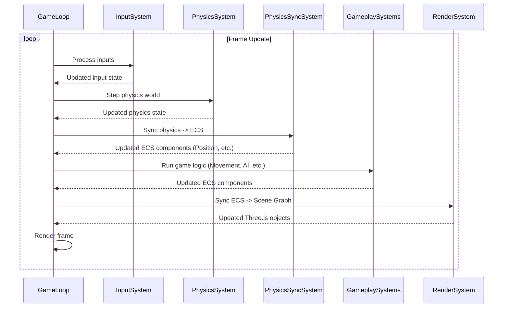

# ECS Integration (bitecs)

This document explains the integration and usage of the `bitecs` Entity Component System (ECS) library in the Vibe Coder 3D core framework.

## Overview

- **Library:** Uses the `bitecs` library for high-performance ECS.
- **World Setup:** A single `bitecs` world instance is created and managed through the `ECSWorld` singleton class, initialized in `src/core/lib/ecs/World.ts`.
- **Philosophy:** Aims for data-oriented design, separating data (components) from logic (systems).

## Core Components

- **Location:** Core components are defined in `src/core/lib/ecs/BitECSComponents.ts`, including:

  - `Transform`: Stores position (X,Y,Z), rotation (X,Y,Z as Euler angles), and scale (X,Y,Z) as separate fields
  - `EntityMeta`: Stores entity metadata like name and parent relationships
  - `MeshRenderer`: Stores mesh rendering properties
  - `RigidBody`: Stores physics body configuration
  - `MeshCollider`: Stores collision shape information
  - `Camera`: Stores camera properties and settings

- **Legacy Components:** Some legacy components exist in `src/core/lib/ecs.ts` for backward compatibility:

  - `Transform`: Array-based position, rotation, scale with needsUpdate flag
  - `Velocity`: Linear and angular velocity with damping factors

- **Additional Components:** Some systems define their own components, like `PhysicsBodyRef` in `src/core/systems/PhysicsSyncSystem.ts` which links ECS entities to physics bodies.

- **Schema:** Components are defined using `bitecs` schema with separate fields for better performance:

  ```typescript
  export const Transform = defineComponent({
    positionX: Types.f32,
    positionY: Types.f32,
    positionZ: Types.f32,
    rotationX: Types.f32,
    rotationY: Types.f32,
    rotationZ: Types.f32,
    scaleX: Types.f32,
    scaleY: Types.f32,
    scaleZ: Types.f32,
  });
  ```

- **Usage:** Components can be added, removed, and checked using the `ComponentManager` singleton or through hooks like `useECS`.

## Core Systems

- **Location:** Implemented as functions in `src/core/systems`.
- **Examples:**
  - `PhysicsSyncSystem`: Synchronizes Rapier physics bodies with ECS components
  - `cameraSystem`: Manages camera component updates and synchronization
  - Other systems include movement, rendering, and input processing
- **Execution:** Systems are executed in a defined order within the game loop, managed by the engine's main loop.

## Core Hooks

- **Location:** Defined in `src/core/hooks/useECS.ts`.
- **Main Hook:** `useECS()`: Provides access to the ECS world and helper functions:
  - Entity management: `createEntity`, `destroyEntity`
  - Component operations: `addComponent`, `removeComponent`, `hasComponent`
  - Query management: `createQuery`, `findEntities`
- **Additional Hooks:**
  - `useECSQuery`: For querying entities with specific components
  - `useEntity`: For accessing component data for a specific entity

## Modern ECS Architecture

The engine uses a dual-layer ECS approach:

1. **BitECS Layer**: High-performance data storage using typed arrays
2. **Management Layer**: Higher-level abstractions through `EntityManager` and `ComponentManager` singletons
3. **React Integration**: Hooks and components that bridge React and ECS

## Entity and Component Management

- **EntityManager**: Singleton class managing entity lifecycle and caching
- **ComponentManager**: Singleton class managing component operations and events
- **Data Conversion**: Utilities to convert between BitECS data and TypeScript interfaces

## Usage Patterns

- **Queries:** Use `defineQuery` from `bitecs` to efficiently retrieve entities possessing specific components.
- **Game Logic:** Game-specific logic should primarily reside in custom systems. Game-specific components extend the core set.
- **React Components:** React components can integrate with the ECS through hooks and the management layer.
- **Entity Scanning:** Use utilities in `src/core/lib/ecs/utils/entityScanUtils.ts` for efficient entity discovery.

## Debugging

- **Utilities:** Entity scanning utilities and component introspection available through the management layer.
- **Development Tools:** Integration with browser dev tools through the singleton managers.

## System Execution Order

Systems are executed in a defined order within the game loop to ensure correct data flow (e.g., process input, update physics, sync physics state to ECS, update game logic, render).


